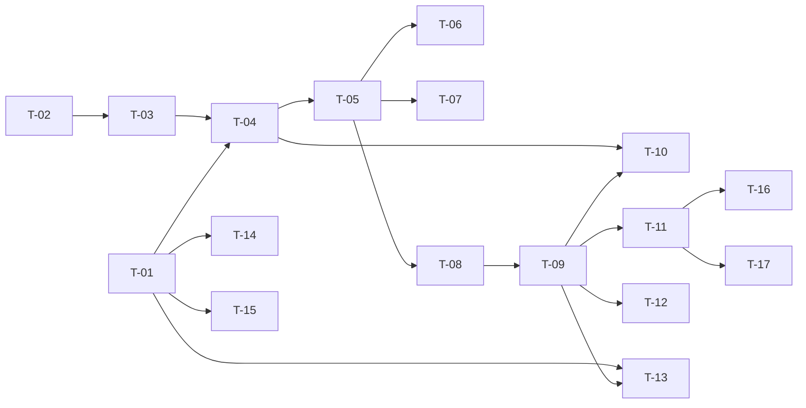

# TASKS — `RF-SP-020` Registrar país

| Campo | Valor |
|---|---|
| Requerimiento | `RF-SP-020` |
| Especificación | [`spec.md`](spec.md) |
| Plan | [`plan.md`](plan.md) |
| `plan.md` aprobado el | 21-08-2026 |
| Estado | **Aprobadas** |
| Issue | Pendiente de crear |
| Rama | `feature/registrar-pais` |
| Aprobadas por | Responsable técnico el 24-08-2026 |
| Enmendadas | 28-08-2026 — tres tareas nuevas por el paso a ISO 3166-1 alfa-3: `T-18`, `T-19` y `T-20` |

!!! info "Qué va en este documento"

    **En qué pasos, en qué orden y cómo se verifica cada uno.**

    **Prueba de pertenencia:** si no puede marcarse como hecho, no es una tarea.

    **Es la fuente de verdad de las tareas.** El Issue de GitHub coordina y enlaza aquí; no la sustituye ni la duplica. Si las dos listas discrepan, manda este archivo.

    No se escribe hasta que `plan.md` esté aprobado, y ninguna tarea se ejecuta hasta que este documento lo esté (Art. I.6).

---

## 1. Tareas

`RN-SP-009` no admite edición ni borrado: **el alta es casi toda la defensa que hay**, y por eso las tareas se ordenan alrededor de un solo orden que no puede alterarse —normalizar antes de comprobar la unicidad, y garantizarla con el índice y no con el `SELECT`—. `T-02` es el único sitio donde vive esa normalización, y `T-01` la única garantía real.

| # | Tarea | Depende de | Verificación | Estado |
|---|---|---|---|---|
| `T-01` | Migración `V16__create_countries.sql`: tabla `countries` con `name` declarado `COLLATE "es-x-icu"`, `uq_countries_code`, el índice único funcional `uq_countries_name` sobre `f_unaccent(lower(name))`, `ck_countries_code_format` y `ck_countries_name_not_blank`. **Sin `deleted_at`** y **con `updated_at`** | — | `mvn flyway:info` la lista aplicada; pruebas de integración: `'1A'`, `'c'` y `'CO '` se rechazan; un nombre de un solo espacio también; `updated_at` arranca igual a `created_at`; y un `ORDER BY name` **sin `COLLATE`** devuelve Panamá, Paraguay, Perú | Hecha |
| `T-02` | `domain/CountryCode`: objeto de valor que **normaliza a mayúsculas, recorta y valida el formato de tres letras, en ese orden y en un solo sitio** | — | Prueba unitaria sin Spring: `"col"`, `" COL"` y `"COL"` producen el mismo valor; `"CO"`, `"COLO"`, `"C1X"`, `"---"` y la cadena vacía se rechazan | Hecha |
| `T-03` | `domain`: agregado `Country`, que **nace siempre activo** y cuyo constructor no recibe el estado, y el puerto `CountryRepository` con `save`, `existsCode` y `existsName` | `T-02` | Prueba unitaria: no existe forma de construir un `Country` inactivo | Hecha |
| `T-04` | `infrastructure`: `CountryEntity`, `CountryJpaMapper` y `JpaCountryRepository`, que traduce la violación de índice único distinguiendo **por nombre de restricción** cuál de los dos se violó | `T-01`, `T-03` | Prueba de integración: `uq_countries_code` y `uq_countries_name` producen excepciones distinguibles, y ninguna se decide por el texto del mensaje del driver | Hecha |
| `T-05` | `application`: `RegisterCountryCommand`, `RegisterCountryService` con `@Transactional` y el orden de verificación de `plan.md` §4 —formato, **normalización**, unicidad—, y el puerto `CountryChangeAuditor` | `T-04` | Pruebas con dobles: la unicidad se comprueba **después** de normalizar; la comprobación previa existe para redactar el mensaje, no para garantizar nada | Hecha |
| `T-06` | Auditoría del alta: una fila en `audit_change_log` con `action = 'CREATE'` y `changes` conteniendo el código **ya normalizado** y el nombre recortado, en la misma transacción que el `INSERT` | `T-05` | Prueba de integración: un alta enviada como `"co"` deja `"CO"` en el evento; si el alta se revierte, el evento también | Hecha |
| `T-07` | Auditoría del rechazo: `audit_error_log` con `error_code = 'EX-001'`, `error_type = 'BUSINESS_RULE'` y `severity = 'MEDIA'`; los `400` de formato no se auditan | `T-05` | Prueba de integración: el `409` deja su fila; un `400` no deja ninguna, y `ck_audit_error_log_status` lo impediría igualmente | Hecha |
| `T-08` | `api/RegisterCountryRequest` con Bean Validation (`VAL-001` a `VAL-003`) y rechazo de propiedades desconocidas, y `CountryResponse` con `code` normalizado e `isActive` | `T-05` | Prueba de API: un cuerpo con `isActive` devuelve `400` por campo desconocido, no se ignora; las validaciones se devuelven **todas juntas** en `errors` | Hecha |
| `T-09` | `api/CountryController`: `POST /api/v1/countries` con el permiso `countries:create` y respuesta `201` **sin cabecera `Location`** | `T-08` | Prueba de API: el alta devuelve `201` con el país en el cuerpo y el código ya normalizado, y la respuesta **no** trae `Location`: apuntaría a una ruta que devuelve `404` | Hecha |
| `T-10` | Mensajes del `409`: dicen **cuál** de los dos está duplicado, y en el caso del nombre incluyen **el nombre ya registrado** | `T-04`, `T-09` | Prueba de API: registrado `"Panamá"`, un alta de `"Panama"` devuelve `409` citando `"Panamá"`. Sin ese dato el error es incomprensible, porque la unicidad va sobre la forma normalizada | Hecha |
| `T-11` | Pruebas de los criterios de aceptación de `spec.md` §12 | `T-09` | La suite cubre `CA-SP-134` a `CA-SP-139` y `CA-SP-171`. **`CA-SP-137` afirma `404` sobre `/api/v1/countries/{id}`** —ruta no mapeada— y `405` sobre la colección, que sí lo está | Hecha |
| `T-12` | Pruebas de concurrencia: dos altas simultáneas del mismo código, y dos del mismo nombre | `T-09` | Una devuelve `201` y la otra `409` con `EX-001`, **nunca `500`**; en el caso del nombre el mensaje señala el nombre y no el código | Hecha |
| `T-13` | Pruebas del resto de casos límite de `spec.md` §13 y de `plan.md` §11: código en minúsculas, nombre con espacios sobrantes, nombre solo con espacios, acentos y caracteres no latinos, nombre en el límite de 100, e `INSERT` directo con código inválido | `T-01`, `T-09` | `"co"` se registra como `"CO"` y un alta posterior con `"CO"` devuelve `409`: es lo que verifica que se normaliza **antes** de comprobar. Los caracteres no latinos se persisten **sin transformación** | En curso |
| `T-14` | Prueba documental del índice normalizado: con `"Panamá"` y `"Panama"` insertados antes de crearlo, `CREATE UNIQUE INDEX` falla | `T-01` | Documenta por qué la decisión no era aplazable: después del primer país registrado, declararlo obliga a migrar datos | Hecha |
| `T-15` | Enmendar `requirements/sp.md` y `modelo-datos.md`: §10.6 gana `updated_at`; §10.7 gana `uq_countries_name` —sobre la forma normalizada—, `ck_countries_code_format` y `ck_countries_name_not_blank`; `modelo-datos.md` §2 deja de afirmar que los tres catálogos carecen de `updated_at` | `T-01` | Documento y esquema declaran las mismas restricciones (Art. XII.3). La afirmación sigue valiendo para `memberships` | Hecha |
| `T-16` | Documentación OpenAPI del endpoint: cuerpo, respuesta `201` **sin `Location`** y los estados `400`, `401`, `403`, `409` y `500` | `T-11` | El contrato publicado coincide con el comportamiento real (Art. VIII.6) | Hecha |
| `T-17` | Actualizar la matriz de trazabilidad de `docs/requirements.md` | `T-11` | La fila de `RF-SP-020` refleja el estado y enlaza esta tripleta | Hecha |
| `T-18` | Migración `V42__widen_country_code_to_alpha3.sql`: retira el `CHECK`, ensancha `code` a `char(3)`, **traduce los códigos ya registrados** con una tabla de equivalencias explícita, **levanta excepción nombrando los que no sabe traducir** y vuelve a declarar el `CHECK` sobre `^[A-Z]{3}$` | `T-01` | Sobre una base con `CO` registrado, queda `COL` y no `'CO '`; sobre una con `ZW`, la migración **falla nombrando `ZW`** y Flyway revierte también la traducción, porque PostgreSQL ejecuta la migración entera en una transacción; `'CO '`, `'c1x'` y `'COLO'` siguen rechazados. `V16` **no se toca**: está aplicada y Flyway valida por suma de comprobación | Hecha |
| `T-19` | `CountryCode`, `Country` y `RegisterCountryRequest` pasan a tres letras: el patrón, el `length` de la columna y los tres mensajes de `VAL-002` | `T-18` | `"col"`, `" COL"` y `"COL"` producen el mismo valor; `"CO"`, `"COLO"` y `"C1X"` devuelven `400` con `VAL-002`; `ddl-auto: validate` **arranca**, que es lo que comprueba que la entidad y el esquema dicen lo mismo | Hecha |
| `T-20` | Contrato y documentación: `openapi.json` y `openapi.yaml` regenerados, `requirements/sp.md` §10.6 y §10.8, `modelo-datos.md` §2 y el diagrama de `flujos-por-caso.md` | `T-19` | El contrato publicado dice **alfa-3** y coincide con el comportamiento real (Art. VIII.6); ningún documento sigue afirmando dos letras | Hecha |

**Estados:** `Pendiente` · `En curso` · `Hecha` · `Bloqueada`.

!!! note "Enmiendas y tarea abierta al ejecutar — 24-08-2026"

    **`T-04` no produce `CountryEntity` ni `CountryJpaMapper`.** `architecture.md` §5.1 —reescrita el 22-08-2026— sitúa el modelo persistente en `domain/models`, de modo que `Country` es a la vez agregado y entidad y no hay dos representaciones que unir. Misma resolución que en `RF-SP-001` y `RF-SP-016`. Las capas `application` / `infrastructure` / `api` que este plan nombra se leen como `application` / `domain.repository` / `interfaces`.

    **El código se mapea con el tipo JDBC `CHAR` de forma explícita.** PostgreSQL llama `bpchar` a `char(2)`, y sin declararlo Hibernate espera `varchar(2)` y `ddl-auto: validate` impide arrancar.

    **`T-15` no requirió cambios:** las enmiendas de `requirements/sp.md` §10.6 y de `modelo-datos.md` ya se habían aplicado al aprobarse este `plan.md` el 21-08-2026. Se verificó antes de darla por hecha.

    **`T-12` queda `Pendiente`: no hay prueba de concurrencia real.** Los dos índices únicos garantizan el empate y el adaptador traduce su violación por nombre de restricción, pero **ninguna prueba lanza dos altas simultáneas**: eso exige dos transacciones a la vez, que no se montan con `MockMvc`. La traducción sí está ejercitada por la vía secuencial.

!!! note "El código pasa a tres letras — 28-08-2026"

    Por decisión del responsable del proyecto, el código de un país deja de ser ISO 3166-1 **alfa-2** y pasa a **alfa-3**: `COL` donde antes iba `CO`. `spec.md` §6.1, `EX-002`, `VAL-002` y `CA-SP-135` quedan enmendados (Art. I.7), y `T-18` a `T-20` recogen el trabajo.

    **Lo que no es evidente y por eso se escribe aquí: ensanchar la columna no traduce nada.** `ALTER COLUMN code TYPE char(3)` convierte `CO` en `'CO '` —`char` rellena con espacios—, no en `COL`. Esa fila pasa el `NOT NULL` y pasa `uq_countries_code`; lo único que la caza es el `CHECK` nuevo, y su mensaje habla de una restricción violada, no del país que hay que resolver. De ahí el orden de `V42`: ensanchar, traducir, comprobar con un mensaje propio, y solo entonces volver a poner el `CHECK`.

    **La tabla de equivalencias no adivina, y eso es deliberado.** Lleva América —el mercado de la plataforma— y los mercados que ya se documentan; no lleva la lista ISO completa. Una equivalencia escrita de memoria y equivocada no da error: da un país mal codificado, y `RN-SP-009` no admite corregirlo. Lo que no está en la lista detiene la migración diciendo su código, que es una decisión humana barata comparada con el dato incorregible.

    **En una base vacía —el caso normal— la traducción no toca nada:** `V16` no siembra el catálogo y los países se dan de alta por la API (`spec.md` §14, pregunta 2).

## 2. Orden de ejecución

`T-02` es dominio puro y puede completarse el primer día. `T-15` no depende del endpoint.

## 3. Cobertura de los criterios de aceptación

| Criterio | Tarea que lo cubre |
|---|---|
| `CA-SP-134` | `T-01`, `T-05`, `T-09`, `T-11` |
| `CA-SP-135` | `T-02`, `T-08`, `T-11` |
| `CA-SP-136` | `T-01`, `T-04`, `T-10`, `T-11` |
| `CA-SP-137` | `T-11` |
| `CA-SP-138` | `T-06`, `T-11` |
| `CA-SP-139` | `T-09`, `T-11` |
| `CA-SP-171` | `T-03`, `T-08`, `T-11` |

`RN-SP-009` no tiene tarea que la implemente: se cumple porque no existe endpoint de edición ni de borrado, y lo que la hace verificable es `T-11`, que afirma **`404`** sobre `/{id}` —ruta sin manejador— y `405` sobre la colección. Los casos límite de `spec.md` §13 los cubren `T-12` y `T-13`.

## 4. Bloqueos

| # | Bloqueo | Desde | Responsable | Estado |
|---|---|---|---|---|
| 1 | `T-01` depende de `f_unaccent`, creada en `V1` por `RF-SP-010`. Es la primera vez que esa función sostiene una **restricción de integridad** y no solo una búsqueda: un `REINDEX` omitido tras tocar el diccionario `unaccent` podría dejar entrar un duplicado permanente | 21-08-2026 | Responsable técnico | Abierto |
| 2 | Obligación sobre el primer módulo que referencie a `countries` (`plan.md` §8): clave foránea `ON DELETE RESTRICT`, y **filtrar por `is_active` al ofrecer el catálogo, nunca al resolver un dato ya guardado**. Hoy ninguna tabla lo referencia | 21-08-2026 | Responsable técnico | Abierto |
| 3 | `RF-SP-021` crea `ix_countries_busqueda` y decide el filtro por defecto sobre `is_active`; `RF-SP-022` añade el único `PATCH` que este recurso admitirá. Ambos cuelgan de `CountryController` y reutilizan `CountryResponse` | 21-08-2026 | Responsable técnico | Abierto |

## 5. Definición de terminado

El requerimiento no está terminado hasta cumplir **todas** las condiciones de la constitución §16:

- [ ] Todas las tareas en estado `Hecha`.
- [ ] Todos los criterios de aceptación con prueba automatizada en verde.
- [ ] `mvn verify` en verde en local.
- [ ] Toda escritura emite su evento de auditoría, en la transacción que corresponde.
- [ ] Los endpoints nuevos declaran su permiso.
- [ ] El contrato OpenAPI coincide con el comportamiento real.
- [ ] Documentación afectada actualizada en el mismo Pull Request.
- [ ] Matriz de trazabilidad actualizada.
- [ ] Pull Request aprobado por alguien distinto del autor e integrado.
