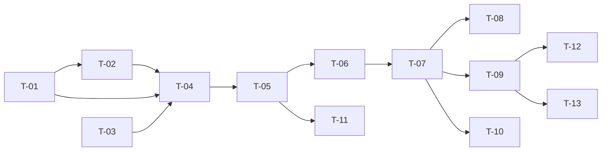

# TASKS — `RF-SP-021` Consultar países

| Campo | Valor |
|---|---|
| Requerimiento | `RF-SP-021` |
| Especificación | [`spec.md`](spec.md) |
| Plan | [`plan.md`](plan.md) |
| `plan.md` aprobado el | 21-08-2026 |
| Estado | **Aprobadas** |
| Issue | Pendiente de crear |
| Rama | `feature/consultar-paises` |
| Aprobadas por | Responsable técnico el 24-08-2026 |

!!! info "Qué va en este documento"

    **En qué pasos, en qué orden y cómo se verifica cada uno.**

    **Prueba de pertenencia:** si no puede marcarse como hecho, no es una tarea.

    **Es la fuente de verdad de las tareas.** El Issue de GitHub coordina y enlaza aquí; no la sustituye ni la duplica. Si las dos listas discrepan, manda este archivo.

    No se escribe hasta que `plan.md` esté aprobado, y ninguna tarea se ejecuta hasta que este documento lo esté (Art. I.6).

---

## 1. Tareas

El mismo molde de `RF-SP-010` y `RF-SP-017`: una sentencia, colección entera en `content`, sin paginar y sin `domain`. Lo propio son dos cosas y ambas tienen tarea: el índice de trigramas que este catálogo sí merece —porque crece por API sin techo declarado— y **el orden alfabético del español**, que no se consigue poniendo `ORDER BY name` y que este requerimiento resuelve en el esquema.

**`T-01` no es una migración de este requerimiento**: es una corrección sobre `V16__create_countries.sql`, de `RF-SP-020`, y debe integrarse con ella. Añadir una intercalación a una columna en uso obliga a reescribir la tabla y a reindexar lo que dependa de ella.

| # | Tarea | Depende de | Verificación | Estado |
|---|---|---|---|---|
| `T-01` | En `V16__create_countries.sql`: declarar `name varchar(100) COLLATE "es-x-icu" NOT NULL` | — | Prueba de integración: con «Panamá», «Perú» y «Paraguay» insertados, un `ORDER BY name` **sin `COLLATE`** devuelve Panamá, Paraguay, Perú. **Antes del primer despliegue** | Hecha |
| `T-02` | Migración `V17__create_country_search_index.sql`: `ix_countries_busqueda`, GIN de trigramas multicolumna sobre `f_unaccent(lower(code))` y `f_unaccent(lower(name))`, **no parcial** | `T-01` | `mvn flyway:info` la lista aplicada; el índice se crea sin error | Hecha |
| `T-03` | `application`: `ListCountriesQuery` con el término recortado y el indicador de inactivos, el modelo de lectura `CountryItem` y el puerto `CountryQueryRepository` | — | Prueba unitaria: un término vacío o solo con espacios equivale a ausente | Hecha |
| `T-04` | `infrastructure/JpaCountryQueryRepository`: proyección con `cb.construct`, predicados **añadidos solo cuando su criterio está presente** —nunca neutralizados con guardas— y `ORDER BY name, id` corriente | `T-01`, `T-02`, `T-03` | Prueba de integración: **una** sentencia con y sin búsqueda; el plan de ejecución sin filtros no arrastra el predicado de búsqueda | Hecha |
| `T-05` | Búsqueda: escape de `\`, `%` y `_`, parámetro enlazado y normalización con `f_unaccent` sobre `code` y `name`, **sin `coalesce`** porque ambas columnas son `NOT NULL` | `T-04` | Pruebas de integración: `panama`, `PANAMÁ` y `Panamà` encuentran «Panamá»; `search=co` encuentra «Colombia» por su código; un término con `%` no devuelve el catálogo entero | Hecha |
| `T-06` | `application/ListCountriesService` con `@Transactional(readOnly = true)` | `T-05` | Prueba de integración: una sola instantánea, y la transacción de solo lectura impide escribir desde este camino | Hecha |
| `T-07` | `api`: `ListCountriesRequest` con **dos** campos y `CountryController` gana `GET /api/v1/countries` con el permiso `countries:read`, envolviendo la colección en `content` y **sin** usar `PageResponse`, reutilizando `CountryResponse` de `RF-SP-020` | `T-06` | Prueba de API: `?page=2&size=5` devuelve el catálogo completo; `includeInactive=quizas` devuelve `400`; `isActive` viene en cada elemento también cuando todos valen `true` | Hecha |
| `T-08` | Prueba del **orden alfabético del español**: con «Panamá», «Perú», «Paraguay», «España» y «Estonia» registrados, el orden devuelto sigue la intercalación del español y no la de bytes | `T-07` | Panamá antes que Paraguay y este antes que Perú. Con la intercalación `C` sería Paraguay, Perú, Panamá. **Exige PostgreSQL real**, y falla si una migración futura recrea la columna perdiendo su intercalación | Hecha |
| `T-09` | Pruebas de los criterios de aceptación de `spec.md` §12 | `T-07` | La suite cubre `CA-SP-140` a `CA-SP-143` y `CA-SP-172`; el catálogo vacío devuelve `200` con `content` vacío, que es el estado real al arrancar y **no** un error | Hecha |
| `T-10` | Pruebas del resto de casos límite de `spec.md` §13 y de `plan.md` §11: búsqueda vacía, país inactivo ya referenciado, orden estable, presencia de `isActive`, número de sentencias y coherencia con el alta | `T-07` | Un país desactivado desaparece del listado por defecto **y sigue existiendo en la tabla** con su identificador intacto; el elemento del listado es campo por campo idéntico al que devolvió `RF-SP-020` | En curso |
| `T-11` | Prueba del uso efectivo del índice: con doscientos países sembrados en la prueba, el `EXPLAIN` de una búsqueda muestra el recorrido de `ix_countries_busqueda` | `T-05` | La prueba **siembra volumen a propósito**: con pocas filas el planificador prefiere el recorrido secuencial, y eso no es un fallo del índice | Pendiente |
| `T-12` | Documentación OpenAPI del endpoint: los dos parámetros, la respuesta `200` con `content` y los estados `400`, `401`, `403` y `500` | `T-09` | El contrato publicado coincide con el comportamiento real (Art. VIII.6), y documenta que `includeInactive` **añade** en lugar de sustituir | Hecha |
| `T-13` | Actualizar la matriz de trazabilidad de `docs/requirements.md` | `T-09` | La fila de `RF-SP-021` refleja el estado y enlaza esta tripleta | Hecha |

**Estados:** `Pendiente` · `En curso` · `Hecha` · `Bloqueada`.

!!! note "Tarea abierta al ejecutar — 24-08-2026"

    **`T-11` queda `Pendiente`: no se comprueba el uso efectivo del índice.** `ix_countries_busqueda` existe y una prueba verifica que está declarado como GIN de trigramas sobre la forma normalizada, pero **no se ha comprobado con `EXPLAIN` que el planificador lo use** sembrando doscientos países. Conviene recordar lo que el propio plan advierte: con pocas decenas de filas el planificador preferirá el recorrido secuencial, y eso **no** sería un defecto — el índice existe para cuando el catálogo se pueble de verdad. La prueba, cuando se escriba, tiene que sembrar lo suficiente para que la comparación signifique algo.

    **`T-10` queda `En curso`:** cubiertos los casos límite alcanzables por API —búsqueda vacía, sin coincidencias, comodín, independencia entre búsqueda y estado—, falta el resto.

## 2. Orden de ejecución

`T-01` es la primera y la más urgente: pertenece a la migración de `RF-SP-020` y solo es gratis mientras esa migración no se haya aplicado.

## 3. Cobertura de los criterios de aceptación

| Criterio | Tarea que lo cubre |
|---|---|
| `CA-SP-140` | `T-01`, `T-04`, `T-07`, `T-09` |
| `CA-SP-141` | `T-02`, `T-05`, `T-09` |
| `CA-SP-142` | `T-04`, `T-09` |
| `CA-SP-143` | `T-07`, `T-09` |
| `CA-SP-172` | `T-04`, `T-07`, `T-09` |

El orden alfabético que `CA-SP-140` exige tiene además tarea propia, `T-08`, porque es lo único de este requerimiento que puede fallar **sin error**: un `ORDER BY name` sobre una columna sin intercalación devuelve un orden equivocado y nadie se entera. Los casos límite de `spec.md` §13 los cubren `T-08`, `T-10` y `T-11`.

## 4. Bloqueos

| # | Bloqueo | Desde | Responsable | Estado |
|---|---|---|---|---|
| 1 | `T-01` toca `V16__create_countries.sql`, de `RF-SP-020`. Debe integrarse con esa migración: añadir una intercalación a una columna en uso obliga a reescribir la tabla y a reindexar lo que dependa de ella | 21-08-2026 | Responsable técnico | Abierto |
| 2 | `es-x-icu` exige un PostgreSQL compilado con ICU. La línea vigente es la 17 y la imagen es `postgres:17-alpine`, que lo incluye; **debe comprobarse antes del primer despliegue** en cualquier PostgreSQL administrado, junto con la comprobación de `CREATE EXTENSION` que `RF-SP-010` ya exige | 21-08-2026 | Responsable técnico | Abierto |
| 3 | `T-02` y `T-05` dependen de `f_unaccent` (`V1`, `RF-SP-010`). Es su **quinto** consumidor: tocar el diccionario `unaccent` obliga a `REINDEX` también de `ix_countries_busqueda` y de `uq_countries_name` | 21-08-2026 | Responsable técnico | Abierto |
| 4 | Obligación sobre `RF-SP-024` y siguientes (`plan.md` §8): al referenciar un país se guarda el `id`, no el código, y al **resolver** un país ya guardado no se filtra por `is_active` —solo al **ofrecer** opciones—, porque un país inactivo sigue resolviéndose para quien ya lo tenía | 21-08-2026 | Responsable técnico | Abierto |

## 5. Definición de terminado

El requerimiento no está terminado hasta cumplir **todas** las condiciones de la constitución §16:

- [ ] Todas las tareas en estado `Hecha`.
- [ ] Todos los criterios de aceptación con prueba automatizada en verde.
- [ ] `mvn verify` en verde en local.
- [ ] Toda escritura emite su evento de auditoría, en la transacción que corresponde.
- [ ] Los endpoints nuevos declaran su permiso.
- [ ] El contrato OpenAPI coincide con el comportamiento real.
- [ ] Documentación afectada actualizada en el mismo Pull Request.
- [ ] Matriz de trazabilidad actualizada.
- [ ] Pull Request aprobado por alguien distinto del autor e integrado.
