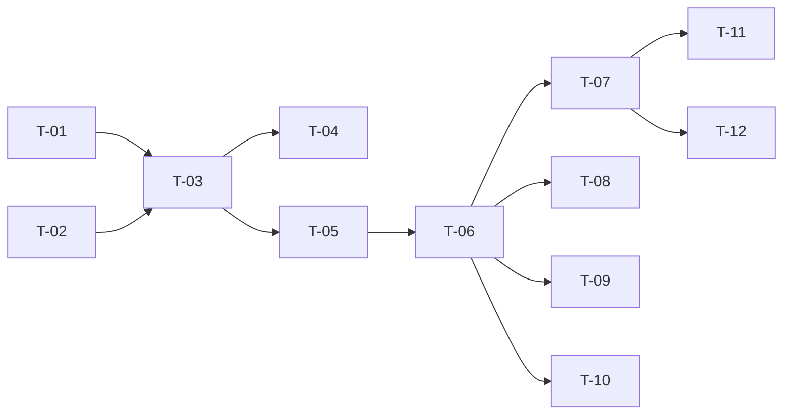

# TASKS — `RF-SP-022` Cambiar el estado de un país

| Campo | Valor |
|---|---|
| Requerimiento | `RF-SP-022` |
| Especificación | [`spec.md`](spec.md) |
| Plan | [`plan.md`](plan.md) |
| `plan.md` aprobado el | 21-08-2026 |
| Estado | **Aprobadas** |
| Issue | Pendiente de crear |
| Rama | `feature/cambiar-estado-pais` |
| Aprobadas por | Responsable técnico el 24-08-2026 |

!!! info "Qué va en este documento"

    **En qué pasos, en qué orden y cómo se verifica cada uno.**

    **Prueba de pertenencia:** si no puede marcarse como hecho, no es una tarea.

    **Es la fuente de verdad de las tareas.** El Issue de GitHub coordina y enlaza aquí; no la sustituye ni la duplica. Si las dos listas discrepan, manda este archivo.

    No se escribe hasta que `plan.md` esté aprobado, y ninguna tarea se ejecuta hasta que este documento lo esté (Art. I.6).

---

## 1. Tareas

Sin migración: escribe un booleano. La lista es corta y su peso está repartido en tres sitios que no son el `UPDATE`: `T-01` es donde vive la idempotencia que `CA-SP-182` exige, `T-02` es el bloqueo sin el cual la auditoría registra dos eventos para un solo cambio, y `T-05` es el rechazo de campos desconocidos que hace verificables `CA-SP-180` y `CA-SP-338` —dos criterios que, sin él, pasarían sin comprobar nada—.

| # | Tarea | Depende de | Verificación | Estado |
|---|---|---|---|---|
| `T-01` | `domain/Country` gana `activate()` y `deactivate()`, que aplican el estado y **devuelven si hubo cambio efectivo** | — | Prueba unitaria sin Spring: aplicar el estado que ya tenía devuelve «sin cambio»; el contrario devuelve «cambiado» y deja el agregado en el estado pedido | Hecha |
| `T-02` | `domain/CountryRepository` gana `findByIdForUpdate(UUID)`, e `infrastructure/JpaCountryRepository` lo implementa con `SELECT … FOR UPDATE` | — | Prueba de integración: una segunda transacción que pide la misma fila espera; el listado de `RF-SP-021` **no** se bloquea mientras tanto | Hecha |
| `T-03` | `application`: `ChangeCountryStatusCommand` y `ChangeCountryStatusService` con `@Transactional`, el orden de verificación de `plan.md` §4, y reutilizando `CountryChangeAuditor` de `RF-SP-020` | `T-01`, `T-02` | Pruebas con dobles: sin cambio efectivo **no se invoca el auditor**; el país se carga siempre por el método que bloquea | Hecha |
| `T-04` | Auditoría: una fila en `audit_change_log` con `action = 'UPDATE'` y `changes` conteniendo **solo** `is_active` con su antes y su después, en la misma transacción que el `UPDATE`; y **ninguna** fila cuando no hubo cambio | `T-03` | Prueba de integración: un cambio efectivo deja una fila; repetir la petición no deja ninguna y **`updated_at` tampoco cambia** | Hecha |
| `T-05` | `api/ChangeCountryStatusRequest`: un único campo booleano `isActive`, obligatorio, con rechazo de propiedades desconocidas | `T-03` | Prueba de API: un cuerpo con `reason`, con `code` o con `name` devuelve `400` por campo desconocido, **no se ignora**; ausente, nulo y no booleano devuelven `400` con `VAL-001` | Hecha |
| `T-06` | `api/CountryController`: añade `PATCH /api/v1/countries/{id}/status` con el permiso `countries:update`, devolviendo `200` con `CountryResponse` | `T-05` | Prueba de API: `200` con `isActive` actualizado; `404` con `EX-001` para un identificador inexistente; `403` sin el permiso | Hecha |
| `T-07` | Pruebas de los criterios de aceptación de `spec.md` §12 | `T-06` | La suite cubre `CA-SP-178` a `CA-SP-184` y `CA-SP-338`. `CA-SP-179` se verifica **sobre el endpoint de `RF-SP-021`**, no sobre este | Hecha |
| `T-08` | Prueba **concurrente** de dos desactivaciones simultáneas del mismo país, con dos transacciones reales | `T-06` | Ambas devuelven `200`, la fila queda inactiva y existe **exactamente un** evento en `audit_change_log`. Sin el bloqueo de `T-02` habría dos, y el segundo describiría una transición que no ocurrió | Hecha |
| `T-09` | Pruebas del resto de casos límite de `spec.md` §13 y de `plan.md` §11: reactivar un país desactivado hace tiempo, país inexistente, identificador malformado, todos los países inactivos, y que el `404` **no** llegue a `audit_error_log` | `T-06` | `1-1-1-1-1` devuelve `400` y no `404`; tras un `404` no hay fila nueva en `audit_error_log`, y `ck_audit_error_log_status` la rechazaría también por `INSERT` directo | En curso |
| `T-10` | Prueba de que el subrecurso no abre la edición: `PATCH` y `PUT` sobre `/api/v1/countries/{id}` siguen devolviendo `404` tras existir este endpoint | `T-06` | Es lo que impide que `/status` se convierta en la excusa para añadir después un `PATCH /{id}`. Complementa `CA-SP-137` de `RF-SP-020` | Hecha |
| `T-11` | Documentación OpenAPI del endpoint: cuerpo, respuesta `200` y los estados `400`, `401`, `403`, `404` y `500` | `T-07` | El contrato publicado coincide con el comportamiento real (Art. VIII.6), y documenta que la operación es idempotente y **no** admite motivo | Hecha |
| `T-12` | Actualizar la matriz de trazabilidad de `docs/requirements.md` | `T-07` | La fila de `RF-SP-022` refleja el estado y enlaza esta tripleta | Hecha |

**Estados:** `Pendiente` · `En curso` · `Hecha` · `Bloqueada`.

!!! note "Enmiendas y tarea abierta al ejecutar — 24-08-2026"

    **`T-01` expone `changeStatus(boolean, ahora)` y no `activate()` / `deactivate()`.** Recibe el estado destino, igual que el cuerpo de la petición, y **devuelve si hubo cambio**. Eso es lo que hace `FA-001` implementable sin que quien llama compare antes y después, que es donde se cuela el evento fantasma que `CA-SP-182` prohíbe. Misma forma que en `RF-SP-023`.

    **`T-03` no crea un `ChangeCountryStatusCommand`.** La entrada del caso de uso son un identificador y un booleano; un registro de dos campos para transportarlos no aporta nada y no oculta ningún tipo de HTTP.

    **`T-08` queda `Pendiente`: sin prueba concurrente** de dos desactivaciones simultáneas del mismo país. El bloqueo de fila está implementado y **sin verificar**.

    **`T-10` sí está cubierta**, y con la precisión que el plan exige: `PATCH`, `PUT` y `DELETE` sobre un país concreto devuelven `404` —esa ruta no está mapeada para ningún método—, mientras que sobre la colección devuelven `405`. La distinción es la diferencia entre «este recurso no admite ese método» y «esa ruta no existe».

## 2. Orden de ejecución

`T-01` es dominio puro y puede completarse el primer día.

## 3. Cobertura de los criterios de aceptación

| Criterio | Tarea que lo cubre |
|---|---|
| `CA-SP-178` | `T-01`, `T-06`, `T-07` |
| `CA-SP-179` | `T-06`, `T-07` |
| `CA-SP-180` | `T-05`, `T-07` |
| `CA-SP-181` | `T-07` |
| `CA-SP-182` | `T-01`, `T-04`, `T-07` |
| `CA-SP-183` | `T-04`, `T-07` |
| `CA-SP-184` | `T-06`, `T-07` |
| `CA-SP-338` | `T-05`, `T-07` |

`CA-SP-183` se verifica en los **dos** sentidos: que el evento está en `audit_change_log` y que **no** está en `audit_security_log`. Es la asimetría deliberada con `RF-SP-007`, y lo que la hace comprobable es afirmar la ausencia. Los casos límite de `spec.md` §13 los cubren `T-08` y `T-09`.

## 4. Bloqueos

| # | Bloqueo | Desde | Responsable | Estado |
|---|---|---|---|---|
| 1 | Todo depende de `V16__create_countries.sql` y de `CountryController` (`RF-SP-020`), y `T-07` necesita además el listado de `RF-SP-021` para verificar `CA-SP-179` | 21-08-2026 | Responsable técnico | Abierto |
| 2 | `T-08` necesita infraestructura de prueba concurrente con dos transacciones reales sobre Testcontainers, la misma que piden `RF-SP-008`, `RF-SP-009` y `RF-SP-016` | 21-08-2026 | Responsable técnico | Abierto |
| 3 | Obligación sobre el primer módulo que referencie países (`plan.md` §8): se filtra por `is_active` al **ofrecer** el catálogo, nunca al **resolver** un dato ya guardado. Este requerimiento la vuelve real, porque hasta ahora ningún país podía estar inactivo | 21-08-2026 | Responsable técnico | Abierto |
| 4 | El conteo de datos que referencian a un país queda fuera, con su condición de disparo: se replantea cuando exista la primera clave foránea entrante a `countries` (`spec.md` §14, pregunta 3) | 21-08-2026 | Responsable técnico | Abierto |

## 5. Definición de terminado

El requerimiento no está terminado hasta cumplir **todas** las condiciones de la constitución §16:

- [ ] Todas las tareas en estado `Hecha`.
- [ ] Todos los criterios de aceptación con prueba automatizada en verde.
- [ ] `mvn verify` en verde en local.
- [ ] Toda escritura emite su evento de auditoría, en la transacción que corresponde.
- [ ] Los endpoints nuevos declaran su permiso.
- [ ] El contrato OpenAPI coincide con el comportamiento real.
- [ ] Documentación afectada actualizada en el mismo Pull Request.
- [ ] Matriz de trazabilidad actualizada.
- [ ] Pull Request aprobado por alguien distinto del autor e integrado.
