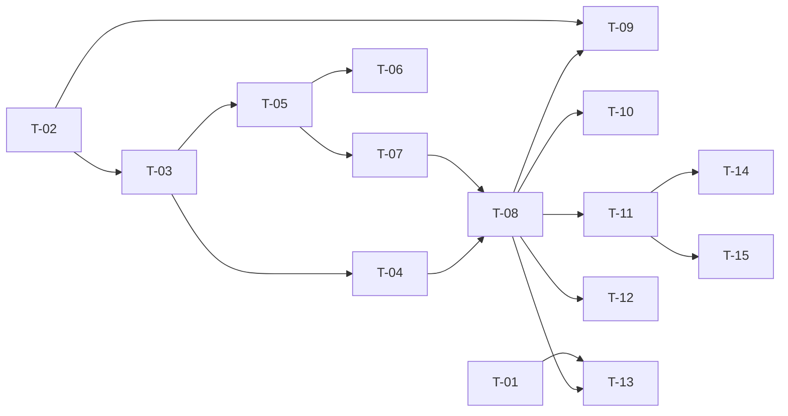

# TASKS — `RF-SP-023` Cambiar el estado de una moneda

| Campo | Valor |
|---|---|
| Requerimiento | `RF-SP-023` |
| Especificación | [`spec.md`](spec.md) |
| Plan | [`plan.md`](plan.md) |
| `plan.md` aprobado el | 21-08-2026 |
| Estado | **En revisión** |
| Issue | Pendiente de crear |
| Rama | `feature/cambiar-estado-moneda` |
| Aprobadas por | Pendiente |

!!! info "Qué va en este documento"

    **En qué pasos, en qué orden y cómo se verifica cada uno.**

    **Prueba de pertenencia:** si no puede marcarse como hecho, no es una tarea.

    **Es la fuente de verdad de las tareas.** El Issue de GitHub coordina y enlaza aquí; no la sustituye ni la duplica. Si las dos listas discrepan, manda este archivo.

    No se escribe hasta que `plan.md` esté aprobado, y ninguna tarea se ejecuta hasta que este documento lo esté (Art. I.6).

---

## 1. Tareas

Sin migración propia, y con la forma heredada de `RF-SP-022`. Lo propio es una sola regla —la moneda por defecto no se desactiva— que se implementa **dos veces a propósito**: en `domain` para que el mensaje sea comprensible y la regla probable sin base de datos (`T-02`), y en el esquema, donde ya está desde `RF-SP-019`, para que la garantía no dependa de que alguien la escriba. `T-09` prueba que ambas funcionan por separado.

`T-01` no pertenece a este requerimiento pero lo condiciona: es la reserva de `currencies:update` en la siembra de roles de sistema, sin la cual el actor que la especificación declara no es el único que puede ejecutar la operación.

**Todas las pruebas siembran una segunda moneda.** Con una sola, que además es la de defecto, ninguna operación de este requerimiento aplica (`spec.md` §13). El catálogo de producción no cambia.

| # | Tarea | Depende de | Verificación | Estado |
|---|---|---|---|---|
| `T-01` | En `V7__seed_system_roles.sql` (`RF-SP-001`): `ADMIN` deja de recibir `currencies:update`, además de `audit:read-security`. Y enmendar `security.md` §4.1 y §4.4 para que la obligación de asociar todo permiso sembrado a `SUPERADMIN` y `ADMIN` lleve **su lista de excepciones** | — | Prueba de integración: tras `V7`, el conjunto de `ADMIN` no contiene ninguno de los dos permisos y el de `SUPERADMIN` contiene el catálogo completo. **Antes del primer despliegue** | Pendiente |
| `T-02` | `domain`: agregado `Currency` con `activate()`, `deactivate()` y `RN-SP-010`, y la excepción `DefaultCurrencyDeactivation`, que lleva el código de la moneda | — | Pruebas unitarias **sin Spring ni base de datos**: desactivar la moneda por defecto lanza la excepción; aplicar el estado que ya tenía devuelve «sin cambio»; activar nunca falla por regla | Pendiente |
| `T-03` | `domain/CurrencyRepository` —puerto **nuevo y distinto** de `CurrencyQueryRepository`— con `findByIdForUpdate(UUID)` y `save`, e `infrastructure`: `CurrencyJpaMapper` y `JpaCurrencyRepository` con `SELECT … FOR UPDATE` | `T-02` | Prueba de integración: la carga bloquea la fila; el puerto de consulta de `RF-SP-019` sigue sin declarar ninguna escritura | Pendiente |
| `T-04` | `JpaCurrencyRepository` traduce la violación de `ck_currencies_default_active` **por nombre de restricción**, nunca por el texto del mensaje del driver | `T-03` | Prueba de integración: la violación produce la excepción de negocio y el `409`, **nunca un `500`** | Pendiente |
| `T-05` | `application`: `ChangeCurrencyStatusCommand`, `ChangeCurrencyStatusService` con `@Transactional` y el orden de verificación de `plan.md` §4, y el puerto `CurrencyChangeAuditor` | `T-03` | Pruebas con dobles: `EX-001` se evalúa después de cargar y antes de aplicar; sin cambio efectivo no se invoca el auditor | Pendiente |
| `T-06` | Auditoría: una fila en `audit_change_log` con `action = 'UPDATE'` y `changes` conteniendo **solo** `is_active`, en la misma transacción; **ninguna** cuando no hubo cambio; y el rechazo por `EX-001` en `audit_error_log` con `error_code = 'RN-SP-010'` y `severity = 'MEDIA'` | `T-05` | Prueba de integración: el `409` deja su fila; el `404` y los `400` no dejan ninguna | Pendiente |
| `T-07` | `api/ChangeCurrencyStatusRequest`: un único campo booleano `isActive`, obligatorio, con rechazo de propiedades desconocidas | `T-05` | Prueba de API: un cuerpo con `reason`, `decimalPlaces`, `symbol`, `name` o `isDefault` devuelve `400` por campo desconocido. Es lo que hace verificables `CA-SP-188` y `CA-SP-340` | Pendiente |
| `T-08` | `api/CurrencyController`: añade `PATCH /api/v1/currencies/{id}/status` con el permiso `currencies:update`, devolviendo `200` con `CurrencyResponse`; el `409` cita `RN-SP-010`, **nombra la moneda y explica la consecuencia** | `T-04`, `T-07` | Prueba de API: el mensaje del `409` dice que los importes quedarían sin referencia válida y que cambiar la moneda por defecto es una migración, no una operación de API | Pendiente |
| `T-09` | Prueba de que la regla está garantizada **por los dos caminos**: el dominio la rechaza sin base de datos, y `ck_currencies_default_active` rechaza el `UPDATE` por sentencia directa | `T-02`, `T-08` | Forzando el camino que salta la verificación de dominio, la violación se traduce igualmente a `409` con `RN-SP-010` | Pendiente |
| `T-10` | Actualizar `CA-SP-131` de `RF-SP-019`: `/api/v1/currencies/{id}/status` pasa de devolver `404` a devolver `405` para los métodos distintos de `PATCH`; `/{id}` a secas sigue en `404` | `T-08` | La prueba de aquel requerimiento queda en verde en el **mismo** Pull Request. Sin esta tarea, integrar este endpoint la rompe | Pendiente |
| `T-11` | Pruebas de los criterios de aceptación de `spec.md` §12 | `T-08` | La suite cubre `CA-SP-185` a `CA-SP-191`, `CA-SP-339` y `CA-SP-340`. `CA-SP-187` se verifica **sobre el endpoint de `RF-SP-019`** | Pendiente |
| `T-12` | Prueba **concurrente** de dos desactivaciones simultáneas de la misma moneda, con dos transacciones reales | `T-08` | Ambas devuelven `200`, la fila queda inactiva y existe **exactamente un** evento en `audit_change_log` | Pendiente |
| `T-13` | Pruebas del resto de casos límite de `spec.md` §13 y de `plan.md` §11: un `ADMIN` intenta la operación, catálogo con una sola moneda, reactivar, activar la moneda por defecto, moneda inexistente, identificador malformado, y que el `404` no llegue a `audit_error_log` | `T-01`, `T-08` | Un `ADMIN` recibe `403` con `AUTH-002` y queda el evento de denegación: es la mitad observable de la reserva de `T-01` | Pendiente |
| `T-14` | Documentación OpenAPI del endpoint: cuerpo, respuesta `200` y los estados `400`, `401`, `403`, `404`, `409` y `500` | `T-11` | El contrato publicado coincide con el comportamiento real (Art. VIII.6), y documenta que la operación es idempotente, no admite motivo y no puede aplicarse a la moneda por defecto | Pendiente |
| `T-15` | Actualizar la matriz de trazabilidad de `docs/requirements.md` | `T-11` | La fila de `RF-SP-023` refleja el estado y enlaza esta tripleta | Pendiente |

**Estados:** `Pendiente` · `En curso` · `Hecha` · `Bloqueada`.

## 2. Orden de ejecución

`T-01` es independiente y urgente: mientras `V7` no esté aplicada, corregirla cuesta una edición; después es una migración de datos sobre roles ya sembrados.

## 3. Cobertura de los criterios de aceptación

| Criterio | Tarea que lo cubre |
|---|---|
| `CA-SP-185` | `T-02`, `T-08`, `T-11` |
| `CA-SP-186` | `T-02`, `T-04`, `T-08`, `T-09`, `T-11` |
| `CA-SP-187` | `T-08`, `T-11` |
| `CA-SP-188` | `T-07`, `T-11` |
| `CA-SP-189` | `T-11` |
| `CA-SP-190` | `T-02`, `T-06`, `T-11` |
| `CA-SP-191` | `T-01`, `T-08`, `T-11` |
| `CA-SP-339` | `T-06`, `T-11` |
| `CA-SP-340` | `T-07`, `T-11` |

`CA-SP-339` se verifica en los **dos** sentidos, igual que su gemelo `CA-SP-183`: que el evento está en `audit_change_log` y que **no** está en `audit_security_log`. `CA-SP-186` es el único criterio del bloque cubierto por dos mecanismos independientes —dominio y esquema—, y `T-09` comprueba que ninguno de los dos sostiene solo la apariencia del otro. Los casos límite de `spec.md` §13 los cubren `T-12` y `T-13`.

## 4. Bloqueos

| # | Bloqueo | Desde | Responsable | Estado |
|---|---|---|---|---|
| 1 | `T-01` toca `V7__seed_system_roles.sql`, de `RF-SP-001`, y `security.md` §4.1 y §4.4, que se enmiendan en el `T-12` de `RF-SP-010`. **Sin la enmienda documental, la próxima migración que siembre permisos devolverá `currencies:update` a `ADMIN` siguiendo la regla al pie de la letra**, y el síntoma no sería visible | 21-08-2026 | Responsable técnico | Abierto |
| 2 | Todo depende de `V14`, `V15` y `CurrencyController` (`RF-SP-019`), y `T-11` necesita además su listado para verificar `CA-SP-187` | 21-08-2026 | Responsable técnico | Abierto |
| 3 | `T-10` corrige una prueba de `RF-SP-019` que este requerimiento rompe al integrarse. Debe ir en el **mismo** Pull Request | 21-08-2026 | Responsable técnico | Abierto |
| 4 | El requerimiento queda **inerte en producción** hasta que se siembre una segunda moneda: con una sola, que es la de defecto, ninguna operación aplica (`spec.md` §13). No bloquea la implementación ni las pruebas, que siembran la suya | 21-08-2026 | Responsable técnico | Abierto |
| 5 | Obligación sobre los módulos financieros futuros (`plan.md` §8): el redondeo usa el `decimal_places` de la moneda del importe, nunca una constante, y **no se filtra por `is_active` al resolver un importe guardado** —solo al ofrecer monedas en una operación nueva— | 21-08-2026 | Responsable técnico | Abierto |

## 5. Definición de terminado

El requerimiento no está terminado hasta cumplir **todas** las condiciones de la constitución §16:

- [ ] Todas las tareas en estado `Hecha`.
- [ ] Todos los criterios de aceptación con prueba automatizada en verde.
- [ ] `mvn verify` en verde en local.
- [ ] Toda escritura emite su evento de auditoría, en la transacción que corresponde.
- [ ] Los endpoints nuevos declaran su permiso.
- [ ] El contrato OpenAPI coincide con el comportamiento real.
- [ ] Documentación afectada actualizada en el mismo Pull Request.
- [ ] Matriz de trazabilidad actualizada.
- [ ] Pull Request aprobado por alguien distinto del autor e integrado.
