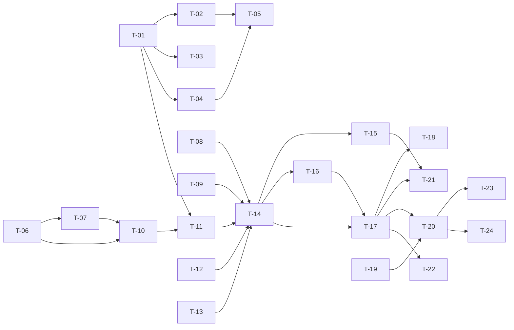

# TASKS — `RF-SP-024` Registrar usuario

| Campo | Valor |
|---|---|
| Requerimiento | `RF-SP-024` |
| Especificación | [`spec.md`](spec.md) |
| Plan | [`plan.md`](plan.md) |
| `plan.md` aprobado el | 22-08-2026 |
| Estado | **Aprobadas** |
| Issue | Pendiente de crear |
| Rama | `feature/registrar-usuario` |
| Aprobadas por | Responsable técnico el 24-08-2026 |

!!! info "Qué va en este documento"

    **En qué pasos, en qué orden y cómo se verifica cada uno.**

    **Prueba de pertenencia:** si no puede marcarse como hecho, no es una tarea.

    **Es la fuente de verdad de las tareas.** El Issue de GitHub coordina y enlaza aquí; no la sustituye ni la duplica. Si las dos listas discrepan, manda este archivo.

    No se escribe hasta que `plan.md` esté aprobado, y ninguna tarea se ejecuta hasta que este documento lo esté (Art. I.6).

---

## 1. Tareas

Es el requerimiento más grande del módulo y conviene decir por qué antes de leer la lista: **crea el sujeto**. Cinco migraciones, cuatro tablas nuevas, la primera credencial del sistema y la extracción de `RN-SEG-010` a un componente que otros dos requerimientos comparten. Nada de eso puede repartirse (`plan.md` §1).

Tres tareas no parecen de aquí y lo son:

- **`T-01` incorpora `deleted_at` a `users`**, que `plan.md` §2 dejaba a `RF-SP-029`. Se corrige al escribir estas tareas (Art. I.7) y el motivo está en el propio plan de `RF-SP-029` §2: `architecture.md` §6.4 declara `deleted_at` columna obligatoria de toda tabla de negocio, y **diez requerimientos la leen antes de que `RF-SP-029` la escriba** —entre ellos `RF-SP-003` y `RF-SP-009`, que se implementan antes y cuyos planes ya la daban por existente—. Lo que sigue siendo de `RF-SP-029` es **escribirla**.
- **`T-08` toca `RF-SP-005`.** La resolución 5 de `spec.md` §14 exige que `RN-SEG-010` viva en un solo sitio; hoy vive dentro de `Role.grantPermissions`. Sacarla es parte de este requerimiento, no una refactorización aparte.
- **`T-19` verifica `V4`.** El evento `USER_CREATED` que `T-17` emite solo existe en `ck_audit_security_log_event_type` desde la ampliación de `RF-SP-014` §2. Si esa ampliación no llegó a `V4`, el alta funcionaría y **fallaría su auditoría de seguridad dentro de la transacción `REQUIRES_NEW`**, con un síntoma que no apunta al alta.

**Las enmiendas documentales del plan ya están aplicadas**: `requirements/sp.md` v1.16.0 (§10.10, §10.11, §10.12 y las quince restricciones de §10.8) y `security.md` v0.19.0 (§3.2, §8.1 y §9). No hay tarea para ellas; sí la hay para lo que aún no está escrito en código.

| # | Tarea | Depende de | Verificación | Estado |
|---|---|---|---|---|
| `T-01` | `V18__create_users.sql`: la tabla con sus diez columnas **más `deleted_at`**, `uq_users_username` sobre `lower(username)` **total**, `uq_users_email`, y los cinco `CHECK` de `plan.md` §2.1 | — | `mvn flyway:info` la lista aplicada. Prueba de integración: los dos índices únicos **no** llevan cláusula `WHERE`, y `users` no tiene `failed_attempts`, `locked_until` ni `last_login_at` | Hecha |
| `T-02` | `V19__create_user_roles.sql`: clave primaria compuesta y las dos claves foráneas `ON DELETE RESTRICT`. **Sin `updated_at` y sin `ix_user_roles_role_id`**, que declara `RF-SP-030` | `T-01` | Prueba de integración: `DELETE` directo sobre `users` con asignaciones es rechazado por `fk_user_roles_user` | Hecha |
| `T-03` | `V20__create_user_memberships.sql`: `user_id` como **clave primaria** —que es `RN-SP-014` declarada en el esquema—, las dos claves foráneas y `ck_user_memberships_periodo` | `T-01` | Prueba de integración: un segundo `INSERT` para el mismo usuario es rechazado por `pk_user_memberships`, sin que ningún código lo verifique | Hecha |
| `T-04` | `V21__create_user_supervisors.sql`: clave sustituta, las dos claves foráneas a `users`, `uq_user_supervisors_vigente` **parcial**, `ck_user_supervisors_no_self` y `ck_user_supervisors_periodo` | `T-01` | Prueba de integración: dos asignaciones vigentes para el mismo subordinado son rechazadas; dos tramos cerrados del mismo par se admiten | Hecha |
| `T-05` | `V22__seed_superadmin.sql`: identificador **fijo y escrito**, correo y hash por marcador de posición de Flyway, `must_change_password = true`, y el `INSERT … SELECT` del rol `SUPERADMIN` que **falla si ese rol no existe** | `T-02`, `T-04` | Prueba de integración: tras `V22` existe `superadmin` con el rol raíz y `users:create` entre sus permisos efectivos. **Sin marcador de posición, la migración falla y la aplicación no arranca** | Hecha |
| `T-06` | `domain`: objetos de valor `Username` —recorta, valida el alfabeto y **rechaza la arroba**—, `Email` —recorta y pasa a minúsculas al construirse— y `PersonName` | — | Pruebas unitarias **sin Spring ni base de datos**: `juan@x.com` como nombre de usuario lanza; `" Juan.Perez@X.CO "` se construye como `juan.perez@x.co`; un nombre de un solo espacio se rechaza | Hecha |
| `T-07` | `domain`: `PasswordPolicy` con las tres reglas de `security.md` §3.2 —longitud, lista de comunes y **contenido del nombre de usuario o de la parte local del correo, sin distinguir mayúsculas**— devolviendo **qué** regla incumple; y `PasswordHash`, cuyo `toString()` devuelve una máscara | `T-06` | Pruebas unitarias: `jperez2026` se rechaza para `jperez` y `JPerez!` también; la respuesta identifica la regla incumplida y **no reproduce la contraseña** | Hecha |
| `T-08` | `domain/security/PrivilegeContainment`: `RN-SEG-010` **extraída a un único componente**, y `Role.grantPermissions` (`RF-SP-005`) pasa a delegarla en lugar de contenerla. `RN-SEG-003` se queda donde está | — | Pruebas unitarias sin Spring. Las pruebas de `RF-SP-005` siguen en verde **sin modificarse**: es lo que demuestra que no hubo cambio de comportamiento | **Hecha** — extraída el 24-08-2026 al implementar `RF-SP-030`, con regla de ArchUnit que impide la segunda copia |
| `T-09` | `domain/CommercialStructure`: `RN-SP-019` y `RN-SP-020` —si el conjunto de roles exige superior, si es la cúspide, y si el superior propuesto porta el rol padre inmediato del rol vendedor de mayor rango— | — | Pruebas unitarias sin Spring ni base de datos (Art. VI.3), incluido el rol vendedor cuyo padre **no** es vendedor, que es la cúspide | **Hecha** — extraída el 24-08-2026 al implementar `RF-SP-030`, que además le añadió la comparación de rango |
| `T-10` | `domain`: agregado `User`, que **nace `ACTIVO` y marcado para cambio de contraseña** —el constructor no recibe ninguna de las dos cosas— y el puerto `UserRepository` | `T-06`, `T-07` | Prueba unitaria: no existe forma de construir un `User` con otro estado ni con la marca en `false` | Hecha |
| `T-11` | `infrastructure`: `UserEntity`, `UserRoleEntity`, `UserMembershipEntity`, `UserSupervisorEntity`, `UserJpaMapper` y `JpaUserRepository`, que **traduce la violación de índice único distinguiendo cuál de los dos se violó, por nombre de restricción** | `T-01` a `T-04`, `T-10` | Prueba de integración: nombre de usuario duplicado y correo duplicado producen dos excepciones distintas, y **ninguna llega como `500`** | Hecha |
| `T-12` | `infrastructure/Argon2PasswordHasher` sobre `Argon2PasswordEncoder`, con `m`, `t` y `p` en configuración (`m = 19456 KiB`, `t = 2`, `p = 1`) y BouncyCastle declarado como dependencia | — | Prueba de integración: la credencial se verifica correctamente y el hash almacenado **no es el texto plano ni un digest reversible** | Hecha |
| `T-13` | `infrastructure/ResourceCommonPasswordCatalog`: lista de contraseñas comunes leída del empaquetado, en memoria y una sola vez | — | Prueba unitaria: la lista se carga una vez y la consulta es de tiempo constante | Pendiente |
| `T-14` | `application`: `RegisterUserCommand` y `RegisterUserService` con `@Transactional` y **el orden de verificación de `plan.md` §4**, con la política de contraseña antes de la unicidad | `T-08` a `T-11` | Pruebas con dobles: una petición con contraseña débil y correo ya registrado devuelve **el error de la contraseña**, no el del correo. Es lo que impide deducir por el orden del error si el correo estaba libre | Hecha |
| `T-15` | `application`: `RoleCatalog` gana la lectura de los roles a conceder **con bloqueo compartido y en orden ascendente de identificador**, y el superior se lee igual; `AuthenticatedActor` aporta los permisos efectivos **leídos de la base de datos**, nunca de la caché | `T-14` | Prueba de integración: la traza muestra `SELECT … FOR SHARE` sobre `roles` ordenado por `id`. Prueba con la caché precargada con un permiso que el actor acaba de perder: el alta **se rechaza** | En curso |
| `T-16` | Auditoría: `UserChangeAuditor` emite `audit_change_log` con `action = 'CREATE'` **en la misma transacción**, y `UserSecurityAuditor` emite `USER_CREATED` con `severity = 'ALTA'` y `target_user_id`, **enganchado al commit**. Un solo evento de seguridad, no dos | `T-14` | Prueba de integración: forzando el fallo tras el `INSERT`, **no queda ninguna de las dos filas**; y no existe fila de `USER_ROLES_ASSIGNED` aunque el alta conceda roles | Hecha |
| `T-17` | `api`: `RegisterUserRequest` con Bean Validation y **rechazo de propiedades desconocidas**, `UserResponse`, y `UserController` con `POST /api/v1/users`, permiso `users:create`, `201` y cabecera `Location` | `T-14`, `T-16` | Prueba de API: un cuerpo con `status` o `mustChangePassword` devuelve `400` y **no se ignora**; la respuesta no contiene `password` ni ningún campo derivado | Hecha |
| `T-18` | Rechazos con detalle: los cuerpos de `409` enumeran **qué** elemento incumple —cuál identidad, qué roles, qué rol debería portar el superior—, y el de `EX-001` **no distingue** si el conflicto es con un usuario vigente o eliminado | `T-17` | Prueba de API: el `409` de un nombre de usuario tomado por un eliminado tiene **el mismo cuerpo** que el de uno vigente | Hecha |
| `T-19` | Verificar que `V4__create_audit_logs.sql` (`RF-SP-001`) incluye `USER_CREATED` en `ck_audit_security_log_event_type`, conforme a la ampliación de `RF-SP-014` §2. **Antes del primer despliegue** | — | Prueba de integración: la restricción acepta `USER_CREATED`. Sin ella, el alta correcta falla en su transacción de auditoría, con un síntoma que no apunta al alta | Hecha |
| `T-20` | Pruebas de los criterios de aceptación de `spec.md` §12 | `T-17`, `T-19` | La suite cubre `CA-SP-192` a `CA-SP-202`, `CA-SP-341`, `CA-SP-342`, `CA-SP-372`, `CA-SP-373` y `CA-SP-395` a `CA-SP-398` | Hecha |
| `T-21` | Pruebas **concurrentes**, con transacciones reales: dos altas con la misma identidad; alta con un rol que se desactiva a la vez; alta con un superior que se desactiva a la vez; y dos altas que conceden los mismos dos roles | `T-15`, `T-17` | Una `201` y una `409`, **nunca `500`**; jamás queda un usuario con un rol inactivo ni a cargo de una cuenta sin acceso; **no se produce interbloqueo** | **Hecha** — 26-08-2026, en `UserConcurrencyIT`. **Su verificación se corrige**: ver §4.bis |
| `T-22` | Pruebas de los casos límite de `spec.md` §13 y de `plan.md` §11: caja del correo y del nombre de usuario, `INSERT` directo sin normalizar, contraseña con espacios, vendedor y consumidor a la vez, límites de longitud, y ausencia de las columnas no creadas | `T-17` | `" Juan.Perez@X.CO "` queda como `juan.perez@x.co`; `JPerez` se conserva tal cual y `jperez` devuelve `409`; la contraseña con espacios autentica con el mismo literal | En curso |
| `T-23` | Documentación OpenAPI del endpoint: cuerpo, `201` con `Location`, y los estados `400`, `401`, `403`, `409`, `422` y `500` | `T-20` | El contrato publicado coincide con el comportamiento real (Art. VIII.6), y documenta que la respuesta **nunca** devuelve la credencial | Hecha |
| `T-24` | Actualizar la matriz de trazabilidad de `docs/requirements.md` | `T-20` | La fila de `RF-SP-024` refleja el estado y enlaza esta tripleta | Hecha |

**Estados:** `Pendiente` · `En curso` · `Hecha` · `Bloqueada`.

!!! warning "Enmiendas y tareas abiertas al ejecutar — 24-08-2026"

    **`T-07` y `T-12` viven en `shared/security`, no en el módulo.** La política de contraseña y el cifrado los comparten **cuatro** requerimientos —`RF-SP-024`, `RF-SP-037`, `RF-SP-038` y `RF-SP-040`—, y `security.md` §3.2 exige que los cuatro verifiquen exactamente lo mismo. Cuatro copias divergen a la primera corrección que alguien aplique en una sola.

    **`T-11` no produce entidades separadas.** `architecture.md` §5.1 sitúa el modelo persistente en `domain/models`, de modo que `User` es a la vez agregado y entidad. `user_memberships` y `user_supervisors` se escriben con sentencia nativa desde el adaptador y **no se modelan**: son de `RF-SP-032` y `RF-SP-041`, y el alta solo necesita escribir una fila en su misma transacción.

    | Tarea | Estado | Por qué |
    |---|---|---|
    | `T-08` | `En curso` | `RN-SEG-010` está implementada y probada, pero **no extraída** a un componente único: hoy vive en `RegisterUserService` y en `Role.create`. La extracción es la tarea, y es lo que `RF-SP-030` necesitará para no escribir una tercera copia |
    | `T-09` | `En curso` | `RN-SP-019` y `RN-SP-020` están implementadas y probadas —incluido que el superior debe portar el rol **padre inmediato** y no un ancestro—, pero dentro del caso de uso y no en un objeto de dominio propio |
    | `T-13` | `Pendiente` | La lista de contraseñas comunes está **incorporada en el código y es mínima**. Cubre las que aparecen en cualquier volcado y deja el gancho puesto; una lista de verdad tiene millones de entradas y vive en un recurso. Sustituirla no cambia ninguna firma |
    | `T-15` | `En curso` | Los roles se leen **sin bloqueo**. Hoy no hace falta —el alta no depende de que el rol no cambie entre la lectura y la escritura—, pero la tarea lo pide y conviene decidirlo con `RF-SP-030` delante |
    | `T-21` | `Pendiente` | Sin pruebas concurrentes. El arnés existe (`ConcurrencyHarness`) y los índices únicos **totales** garantizan el empate; lo que falta es ejercitarlo |

    **Hueco declarado en `RN-SP-019`:** si una persona portara dos roles vendedores en ramas distintas —ninguno ancestro del otro— habría dos candidatos a «rol de mayor rango» y las reglas no dicen cuál manda. Se toma el primero por código para que el resultado sea determinista. El catálogo aprobado es una cadena lineal, de modo que hoy el caso no puede darse; si alguna vez se ramifica, hay que decidirlo.

## 2. Orden de ejecución

Las cinco migraciones y los objetos de valor de `domain` no se estorban: `T-01` a `T-05` y `T-06` a `T-09` pueden avanzar en paralelo. El cuello es `T-14`, que necesita las cuatro piezas de dominio y el adaptador.

`T-08` es independiente y conviene hacerla pronto: mientras `RN-SEG-010` siga dentro de `Role.grantPermissions`, `T-14` tendría que llamarla desde allí y la duplicación que la resolución 5 prohíbe volvería por la puerta de atrás.

## 3. Cobertura de los criterios de aceptación

| Criterio | Tarea que lo cubre |
|---|---|
| `CA-SP-192` | `T-01`, `T-17`, `T-20` |
| `CA-SP-341` | `T-01`, `T-06`, `T-20` |
| `CA-SP-342` | `T-10`, `T-17`, `T-20` |
| `CA-SP-193` | `T-11`, `T-18`, `T-20` |
| `CA-SP-194` | `T-01`, `T-18`, `T-20` |
| `CA-SP-195` | `T-07`, `T-17`, `T-20` |
| `CA-SP-196` | `T-07`, `T-16`, `T-17`, `T-20` |
| `CA-SP-197` | `T-14`, `T-20` |
| `CA-SP-198` | `T-15`, `T-20` |
| `CA-SP-199` | `T-08`, `T-18`, `T-20` |
| `CA-SP-200` | `T-16`, `T-19`, `T-20` |
| `CA-SP-201` | `T-11`, `T-21` |
| `CA-SP-372` | `T-09`, `T-14`, `T-20` |
| `CA-SP-373` | `T-03`, `T-16`, `T-20` |
| `CA-SP-395` | `T-09`, `T-14`, `T-20` |
| `CA-SP-396` | `T-09`, `T-15`, `T-20` |
| `CA-SP-397` | `T-04`, `T-16`, `T-20` |
| `CA-SP-398` | `T-09`, `T-20` |
| `CA-SP-202` | `T-17`, `T-20` |

`CA-SP-196` es el único criterio que se verifica **buscando el literal enviado**: en la respuesta, en `audit_change_log`, en `audit_security_log`, en `audit_error_log` y en `request_log`. Cualquier otra forma de probarlo comprueba la ausencia de un campo con nombre conocido, y el riesgo real es la credencial que aparece donde nadie la puso a propósito.

`CA-SP-201`, `CA-SP-373` y `CA-SP-397` son los tres criterios que exigen **transacciones reales**: dos compitiendo en el primero, una que se revierte a mitad en los otros dos.

## 4. Bloqueos

| # | Bloqueo | Desde | Responsable | Estado |
|---|---|---|---|---|
| 1 | `T-08` modifica `Role.grantPermissions`, de `RF-SP-005`, ya aprobado. El cambio no altera comportamiento —la misma regla, en otro sitio— y sus pruebas deben quedar en verde **sin tocarse** | 22-08-2026 | Responsable técnico | Abierto |
| 2 | `T-05` depende de `V7__seed_system_roles.sql` (`RF-SP-001`): sin el rol `SUPERADMIN`, el `INSERT … SELECT` no inserta fila y el superadministrador quedaría sin permisos. La migración debe **fallar**, no continuar en silencio | 22-08-2026 | Responsable técnico | Abierto |
| 3 | El despliegue debe declarar los marcadores de posición de la credencial inicial (`spring.flyway.placeholders.*`). **Sin ellos la aplicación no arranca**, y eso es el comportamiento buscado; debe estar escrito en el procedimiento de despliegue o el primer intento fallará sin que nadie entienda por qué | 22-08-2026 | Responsable del proyecto | Abierto |
| 4 | `T-01` incorpora `deleted_at`, que `plan.md` §2 asignaba a `RF-SP-029`. Es una **corrección del plan** (Art. I.7) motivada por `architecture.md` §6.4 y por la dependencia que `RF-SP-003` §2 ya declaraba. `RF-SP-029` conserva su escritura | 22-08-2026 | Responsable técnico | Abierto |
| 5 | Obligación declarada sobre `RF-SP-034` (`plan.md` §8): el inicio de sesión compara el nombre de usuario **sin distinguir mayúsculas** y el correo por igualdad directa. Si se implementa por igualdad exacta, quien se registró como `JPerez` no entrará escribiendo `jperez` | 22-08-2026 | Responsable técnico | Abierto |
| 6 | Obligación sobre **todo módulo futuro**: quien referencie `users(id)` declara su clave foránea `ON DELETE RESTRICT`. Un `SET NULL` dejaría auditoría sin sujeto | 22-08-2026 | Responsable técnico | Abierto |

## 4.bis La verificación de `T-21` se corrige — 26-08-2026

`T-21` exige que «jamás queda un usuario con un rol inactivo», y **eso no es un invariante de este sistema**. `RF-SP-007` desactiva un rol sin preguntar por sus portadores, de modo que en cuanto alguien desactiva `CONTABILIDAD` todos los que lo llevan pasan a portar un rol inactivo. `RN-SEG-002` existe precisamente para decir qué significa ese estado: **el rol sigue asignado y no concede nada**.

Exigirlo aquí sería exigir que no ocurra algo que el requerimiento de al lado produce a diario, y la prueba solo pasaría por casualidad — cuando el alta ganase la carrera.

**Lo que la prueba fija en su lugar**, que es lo que la carrera sí puede romper:

- **El alta es atómica**: o nació con su rol, o no nació. Nunca una persona a medio escribir, que `RN-SP-023` prohíbe.
- **Si se rechazó, fue con `422`** —el rol ya estaba inactivo— y no con otra cosa.
- **Ningún `500` y ningún interbloqueo**, que es lo que la tarea pide y sí es exigible.

Las otras dos afirmaciones de `T-21` se conservan tal cual y sí se comprueban: la identidad duplicada produce una `201` y una `409`, y nadie queda a cargo de una cuenta sin acceso.

## 4.ter `user_memberships` pasa a ser un historial — enmienda del 05-09-2026

Decisión del responsable del proyecto: **conceder una membresía es una fila nueva** — se cierra la que había y se crea otra (`requirements/sp.md` v1.35.0, `RN-SP-014` reescrita). La migración se declara en `plan.md` §2.3.bis. Las tareas siguen la numeración del documento y arrancan en `T-25`: `T-22` a `T-24` ya estaban tomadas por §1 y **es de este requerimiento porque la tabla lo es**, aunque quienes cambian de comportamiento sean `RF-SP-032`, `RF-SP-033` y `RF-SP-029`.

**Estados:** `Pendiente` · `En curso` · `Hecha` · `Bloqueada`.

| ID | Tarea | Depende de | Verificación | Estado |
|---|---|---|---|---|
| `T-25` | **`V56`**: `id` y `closed_at`, la clave primaria a `id`, y las restricciones `uq_user_memberships_abierta`, `ex_user_memberships_sin_solape` y `ck_user_memberships_cierre`; `ix_user_memberships_membership_id` pasa a parcial | — | Un segundo `INSERT` abierto para el mismo usuario lo rechaza `uq_user_memberships_abierta`; dos periodos solapados los rechaza el `EXCLUDE`. **Sin que ningún código lo verifique** | **Hecha** — 05-09-2026 |
| `T-26` | El relleno de `id` construye **UUID v7 desde `started_at`** dentro de la propia migración | `T-25` | Los identificadores de las filas existentes quedan **ordenados por fecha de concesión**, y ninguno es un v4 | **Hecha** — 05-09-2026 |
| `T-27` | `findMembership` filtra por `closed_at IS NULL`, y `UserMembership` **no gana** `closedAt` | `T-25` | Integración: quien tiene historial devuelve **la abierta** y solo esa. **`UserMembership` se queda como está a propósito**: describe siempre la fila abierta porque la consulta ya lo garantiza, y un campo que siempre vale nulo no documenta nada — «abierta» lo decide el `WHERE`, «vigente» lo sigue decidiendo `isCurrentAt` | **Hecha** — 05-09-2026 |
| `T-28` | `UserRepository`: `assignMembership` pasa a **cerrar e insertar** cuando cambia la membresía y a **actualizar** cuando solo cambia la fecha; `removeMembership` pasa a `closeMembership` | `T-27` | Integración: asignar dos veces deja **dos** filas, una cerrada y otra abierta; asignar la misma con otra fecha deja **una** | **Hecha** — 05-09-2026 |
| `T-29` | Los dos `LEFT JOIN` de `JpaUserQueryRepository` se acotan con `um.closed_at IS NULL`, y el filtro por membresía también | `T-28` | **La prueba que importa**: una persona con tres membresías en su historial aparece **una sola vez** en el listado, y `totalElements` no la cuenta tres veces | **Hecha** — 05-09-2026 |
| `T-30` | `RevokeUserMembershipService`, `RevokeUserRolesService` y `DeleteUserService` cierran en lugar de borrar | `T-28` | Tras retirar, la fila **sigue estando** con `closed_at` poblado y `ends_at` intacto; el detalle de la persona dice que no tiene membresía | **Hecha** — 05-09-2026 |
| `T-31` | La semilla de desarrollo escribe `id` en sus filas de `user_memberships` | `T-25` | `DevelopmentSeedIT` en verde | **Hecha** — 05-09-2026 |
| `T-32` | Prueba de concurrencia: dos asignaciones simultáneas a la misma persona | `T-28` | Ninguna devuelve `500` y **no quedan dos filas abiertas**. Lo serializa el bloqueo que la operación ya toma, no un `ON CONFLICT` — que era lo que lo absorbía y ha dejado de existir | **Hecha** — 05-09-2026 |

**Lo que esta enmienda NO hace, y conviene que no se dé por hecho:**

- **No expone el historial por ninguna API.** `RF-SP-026` sigue devolviendo la membresía abierta y nada más. Consultar el historial de niveles de una persona es un requerimiento que no existe, y esta enmienda solo hace que **el dato esté** para cuando exista.
- **No decide qué pasa con los días pagados y no usados.** Cerrar una membresía de treinta días el día doce deja constancia de los dieciocho perdidos y **no los devuelve, ni los prorratea, ni los suma** a la nueva. Está declarado en `requirements/mv.md` §5.4 y sigue sin resolverse.
- **No cambia el evento de auditoría de `RF-SP-033`.** Para quien lee la auditoría, el hecho sigue siendo que a esa persona le retiraron su membresía; que la fila sobreviva cerrada es un detalle de cómo se guarda.

## 4.quater Toda persona tiene membresía — segunda enmienda del 05-09-2026

El mismo día y sobre la anterior. `RN-SP-018` pasa de «todo consumidor» a **«todo usuario»**, y quien no recibe membresía al registrarse arranca en la de código `BECA`. `RN-SP-013` y `RN-SP-015` quedan **retiradas**. La migración es `V57` y se declara en `plan.md` §2.3.ter.

**Estados:** `Pendiente` · `En curso` · `Hecha` · `Bloqueada`.

| ID | Tarea | Depende de | Verificación | Estado |
|---|---|---|---|---|
| `T-33` | **`V57`**: una fila `BECA` para toda persona sin membresía abierta, **eliminadas incluidas** | `T-25` | Tras migrar, `SELECT count(*) FROM users u WHERE NOT EXISTS (…abierta…)` es **cero**. El superadministrador de `V22` queda con `BECA` | **Hecha** — 05-09-2026 |
| `T-34` | `MembershipCatalog` gana la resolución del suelo **por código**, y falla ruidosamente si no existe | `T-33` | Prueba de integración: devuelve la sembrada por `V46`. **No se resuelve por `parent_membership_id IS NULL`** — `RN-SP-007` deja registrar una por debajo y eso movería el nivel de arranque sin que nadie lo pidiera | **Hecha** — 05-09-2026 |
| `T-35` | `RF-SP-024`: `membershipId` pasa a **opcional**; sin él, `BECA`. Se retiran las dos comprobaciones de `RN-SP-018` | `T-34` | Registrar un funcionario **sin** `membershipId` devuelve `201` y la persona tiene `BECA`. Registrar un consumidor sin él **ya no es `409`** | **Hecha** — 05-09-2026 |
| `T-36` | `RF-SP-030`: **deja de admitir membresía**; `membershipId` y `membershipEndsAt` salen de `AssignRolesRequest` y del contrato | `T-35` | La lógica que queda **no puede** escribir en `user_memberships`. Un campo que solo puede producir un `422` es peor que ningún campo | **Hecha** — 05-09-2026 |
| `T-37` | `RF-SP-031`: **se retira la cascada** de `RN-SP-015` | `T-35` | Retirar el último rol consumidor deja los roles como corresponde y **no toca** la membresía: quien tenía `ORO` sigue con `ORO` | **Hecha** — 05-09-2026 |
| `T-38` | `RF-SP-032`: se retira `EX-001` (`RN-SP-013`) | `T-35` | Asignar `VIP` a un **funcionario** devuelve `200`, no `409` | **Hecha** — 05-09-2026 |
| `T-39` | `RF-SP-033`: pasa a **devolver al suelo** — cierra y abre una `BECA`, responde `200` con cuerpo y pierde su precondición de no ser consumidor | `T-34` | Tras la operación la persona tiene `BECA` **abierta**, y la anterior queda cerrada con su `ends_at` intacto | **Hecha** — 05-09-2026 |
| `T-40` | La semilla de desarrollo concede `BECA` a quien no tenga otra | `T-33` | `DevelopmentSeedIT` comprueba que **ninguna** persona de la semilla se queda sin nivel | **Hecha** — 05-09-2026 |
| `T-41` | Prueba del invariante, de punta a punta | `T-39` | **La que importa**: tras registrar, asignar roles, retirar roles y devolver al suelo, **en ningún momento** hay una persona viva sin membresía abierta | **Hecha** — 05-09-2026 |

**Lo que esta enmienda NO hace:**

- **No declara el invariante en el motor**, y no por descuido: es una comprobación entre `users` y `user_memberships` que ningún `CHECK` alcanza (`plan.md` §2.3.ter).
- **No baja de nivel a quien deja de ser consumidor.** Conserva lo que tenía, incluido lo comprado. Es lo que sustituye a la cascada retirada, y es una decisión, no una omisión.
- **No toca `RN-SP-019`**, el par equivalente del superior comercial. Vendedor ⟺ superior sigue tal cual: solo se soltó la atadura entre consumidor y nivel.

## 4.quinquies Todo usuario pertenece a un país — enmienda del 07-09-2026

Decisión del responsable del proyecto: **toda persona declara un país**, obligatorio para todos y no solo para los clientes (`requirements/sp.md` v1.38.0, `RN-SP-034`). La migración se declara en `plan.md` §2.6.

**Las tareas son de este requerimiento porque la columna lo es**, aunque cambien de comportamiento otros cinco: `RF-SP-025`, `RF-SP-026`, `RF-SP-027`, `RF-SP-039` y `RF-SP-045`. Es el mismo reparto que §4.ter hizo con `user_memberships`. La numeración sigue la del documento y arranca en `T-42`.

**Estados:** `Pendiente` · `En curso` · `Hecha` · `Bloqueada`.

| ID | Tarea | Depende de | Verificación | Estado |
|---|---|---|---|---|
| `T-42` | **`V64__usuario_con_pais.sql`**: los cuatro pasos de `plan.md` §2.6 —siembra de Colombia con UUID v7 literal, columna nulable, relleno, y solo entonces `NOT NULL` + `fk_users_country` + `ix_users_country_id`—, **en una sola migración** | — | `mvn flyway:info` la lista aplicada. Prueba de integración: tras `V64` **ninguna** fila de `users` tiene `country_id` nulo, el superadministrador de `V22` incluido; y un `INSERT` directo con `country_id` nulo es rechazado por el motor | **Hecha** — 08-09-2026 |
| `T-43` | Verificar que **`V64` sigue libre** justo antes de escribir `T-42`. Ya pasó una vez: esta migración se planificó como `V62` y las tripletas de tasas de cambio se llevaron `V62` y `V63` el mismo día | — | `ls src/main/resources/db/migration/` no contiene ningún `V64`, y ninguna tripleta aprobada lo nombra. Si lo estuviera, esta migración pasa al siguiente libre y se corrige `plan.md` §2.6 | **Hecha** — 08-09-2026. Y sirvió: la comprobación equivalente sobre `V62` es la que destapó que las tasas de cambio se lo habían llevado |
| `T-44` | `domain`: el agregado `User` recibe el país en `create` y **no lo puede dejar nulo**; gana `changeCountry`, que devuelve si hubo cambio real —mismo contrato que `rename` y `changeEmail`— para que `RF-SP-027` no audite lo que no cambió | `T-42` | Prueba unitaria **sin Spring**: no existe forma de construir un `User` sin país; `changeCountry` con el mismo país devuelve `false` y no mueve `updatedAt` | **Hecha** — 08-09-2026 |
| `T-45` | `application`: puerto `AssignableCountry`, que responde **existe** y **está activo** por separado, y su adaptador de infraestructura leyendo con **bloqueo compartido** | `T-42` | Integración: un país inexistente y uno inactivo producen **dos** respuestas distintas, y la traza muestra `SELECT … FOR SHARE` sobre `countries` | **Hecha** — 08-09-2026 |
| `T-46` | `RF-SP-024`: `countryId` obligatorio en el DTO, verificación en el orden de `plan.md` §4 —paso 5.bis—, y `country` **resuelto** en la respuesta | `T-44`, `T-45` | Prueba de API: sin `countryId` es `400`/`VAL-014`; con uno inexistente es `422`; con uno inactivo es `409`/`RN-SP-034`; y la `201` trae `country` con `id`, `code` y `name` (`CA-SP-572` a `CA-SP-574`) | **Hecha** — 08-09-2026, en `RegisterUserIT` |
| `T-47` | `RF-SP-045`: el registro por enlace exige país **por código ISO alfa-3**, no por identificador, y **sin ampliar lo que el formulario público revela**: país inexistente e inactivo comparten respuesta | `T-46` | Prueba de API: el alta pública sin país es `400`; con `col` en minúsculas **funciona**; y un país inexistente y uno inactivo devuelven **el mismo cuerpo** (`CA-SP-582`, `CA-SP-583`) | **Bloqueada** — ver el bloqueo 6 de [`../045-registro-de-clientes-por-enlace/tasks.md`](../045-registro-de-clientes-por-enlace/tasks.md) §4 |
| `T-48` | `RF-SP-026`, `RF-SP-039` y `RF-SP-025`: el país entra en el detalle, en el perfil propio y en cada fila del listado, **resuelto y no como identificador** | `T-46` | Prueba de API sobre los tres: ninguno devuelve `countryId` suelto, los tres devuelven el objeto (`CA-SP-577`, `CA-SP-581`) | **Hecha** — 08-09-2026, en `UserQueryIT` y `OwnCredentialsIT` |
| `T-49` | `RF-SP-025`: filtro `countryId`, apoyado en `ix_users_country_id`, componible con los filtros que ya existen | `T-48` | Integración: el filtro devuelve solo esas personas y **se combina** con el de rol y el de membresía; el plan de ejecución usa el índice y no recorre la tabla (`CA-SP-575`, `CA-SP-576`) | **Hecha a medias** — 08-09-2026. El filtro y la combinación están probados en `UserQueryIT`; **la prueba de `EXPLAIN` no**, igual que `RF-SP-025` `T-14`, que lleva pendiente desde el 24-08-2026 |
| `T-50` | `RF-SP-027`: `countryId` **patchable**, con nulo explícito **rechazado** —la columna es `NOT NULL`, igual que los otros tres campos del `PATCH`—, su verificación de país activo y su evento de auditoría | `T-45`, `T-48` | Prueba de API: `{"countryId": null}` es `400` y no `500`; cambiar el país deja **un** evento en `audit_change_log` con el valor anterior y el nuevo; reenviar el mismo país **no** emite evento (`CA-SP-578` a `CA-SP-580`) | **Hecha** — 08-09-2026, en `UserLifecycleIT`, con una prueba más que no estaba pedida: el cambio de país **no** deja evento de seguridad |
| `T-51` | La semilla de desarrollo declara el país de cada persona que crea | `T-42` | `DevelopmentSeedIT` en verde, y **ninguna** persona de la semilla queda con el país de relleno por descuido: se declaran explícitamente | **Hecha** — 08-09-2026 |
| `T-52` | El contrato OpenAPI publicado se regenera con `country`, `countryId` y los dos códigos de error nuevos | `T-46` a `T-50` | `OpenApiContractIT` en verde. El contrato publicado **no** puede decir que `countryId` es opcional | **Hecha** — 08-09-2026 |

!!! warning "Lo que la implementación destapó y las tareas no habían previsto (08-09-2026)"

    **`fk_users_country` rompió las pruebas del catálogo de países**, y romperlas era lo correcto.
    `CountriesIT`, `CountryConcurrencyIT` y `CountrySearchIndexIT` abrían cada caso con un `DELETE
    FROM countries` apoyado en que el catálogo nacía vacío. Ya no nace vacío y la fila de Colombia
    la referencia el superadministrador, de modo que ese borrado ahora lo rechaza el motor.

    Se corrige borrando **solo lo que ninguna persona referencia**, y las tres clases quedan
    contando con Colombia dentro: ninguna puede usar ya `COL` como país de prueba —sería un
    duplicado— y **toda aserción sobre el tamaño o el orden del catálogo la incluye**. Donde se
    usaba `COL` ahora va `URY`.

    **No es un daño colateral, es la regla funcionando**: `RN-SP-034` dice que el catálogo no puede
    quedar vacío mientras exista un usuario, y esas pruebas describían un estado que el sistema ya
    no puede alcanzar.

    **Y veintiocho ficheros de prueba insertaban personas con `SQL` directo** sin país. Todos
    fallaban por `NOT NULL`, que es exactamente lo que la columna existe para hacer.

**Lo que esta enmienda NO hace:**

- **No declara «el país tiene que estar activo» en el motor**, y no por descuido: la clave foránea compuesta que lo expresaría haría fallar `RF-SP-022` sobre cualquier país con usuarios (`requirements/sp.md` §5.1). La comprobación es de entrada y vive en el caso de uso.
- **No toca `RF-SP-044`.** El titular no cambia su propio país; solo lo corrige un administrador por `RF-SP-027`. Es deliberado: el país decide qué medios de pago se le ofrecen (`RN-MV-019`), y cambiárselo uno mismo sería cambiarse de mercado.
- **No desasigna a nadie cuando su país se desactiva.** Quien lo tenía lo conserva, y a partir de ahí pueden convivir personas en un país que ya no se ofrece en el alta. Es lo que `RF-SP-022` prometía desde el principio; lo único nuevo es que ahora hay a quién afectar.
- **No añade el documento de identidad ni el teléfono**, que `spec.md` §14 resolución 3 dejó fuera junto al país. Siguen fuera: nadie los ha pedido.

## 4.sexies Identidad documental y datos de contacto — enmienda del 08-09-2026

Decisión del responsable del proyecto: **toda persona se identifica con un documento y declara sus datos de contacto** (`requirements/sp.md` v1.41.0, `RN-SP-035` a `RN-SP-037`). Las migraciones se declaran en `plan.md` §2.7 y en [`../051-consultar-tipos-de-documento/plan.md`](../051-consultar-tipos-de-documento/plan.md) §2.

**Las tareas son de este requerimiento porque las columnas lo son**, aunque cambien de comportamiento otros cinco. Mismo reparto que §4.ter y §4.quinquies. La numeración sigue la del documento y arranca en `T-53`.

**Estados:** `Pendiente` · `En curso` · `Hecha` · `Bloqueada`.

| ID | Tarea | Depende de | Verificación | Estado |
|---|---|---|---|---|
| `T-53` | **`V71__usuario_con_documento_y_contacto.sql`**: las seis columnas **nulables**, `fk_users_document_type`, los cuatro `CHECK` y `uq_users_document` parcial sobre el no nulo (`plan.md` §2.7) | `RF-SP-051 · T-01` | Integración: dos personas con el mismo par tipo+número son rechazadas **aunque una esté eliminada**; un tipo sin número y un número sin tipo los rechaza `ck_users_document_pair`; el superadministrador de `V22` sigue existiendo **con los seis campos nulos** | Pendiente |
| `T-54` | `domain`: el agregado `User` recibe documento y contacto en `create` y gana `changeDocument` y `changeContact`, los dos con el contrato de `rename` —devuelven si hubo cambio real— | `T-53` | Prueba unitaria **sin Spring**: `changeDocument` con el mismo par devuelve `false` y no mueve `updatedAt`; **no existe forma de dejar el tipo sin el número** | Pendiente |
| `T-55` | `application`: puerto `AssignableDocumentType` y su adaptador, con **bloqueo compartido**, distinguiendo «no existe» de «está inactivo» | `T-53` | Integración: los dos casos producen respuestas distintas, y la traza muestra `SELECT … FOR SHARE` sobre `document_types` | Pendiente |
| `T-56` | `RF-SP-024`: los siete campos en el DTO —dos obligatorios de documento, teléfono obligatorio, tres de dirección opcionales—, la verificación en el orden de `plan.md` §4 —paso 5.ter— y `document` y `contact` **agrupados** en la respuesta | `T-54`, `T-55` | Prueba de API: sin documento o sin teléfono es `400`; tipo inexistente `422`; tipo inactivo `409`; par repetido `409` **incluso contra una persona eliminada** (`CA-SP-590` a `CA-SP-592`) | Pendiente |
| `T-57` | `RF-SP-026` y `RF-SP-039`: el documento y el contacto entran en el detalle y en el perfil propio, con el tipo **resuelto** y **`LEFT JOIN`** | `T-56` | **La prueba que importa**: una persona **sin** documento —de las anteriores a `V71`— **sigue apareciendo** en el detalle, con `document` en nulo. Con un `JOIN` interno desaparecería sin fallar (`CA-SP-593`, `CA-SP-597`) | Pendiente |
| `T-58` | `RF-SP-027`: los siete campos **patchables**, con las **dos familias** de nulo de `plan.md` §4 —rechazado en documento y teléfono, aceptado y vaciador en los tres de dirección— y su auditoría | `T-55`, `T-57` | Prueba de API: `{"phone":null}` es `400`; `{"addressLine2":null}` es `200` y **vacía**; `{"documentNumber":"…"}` sin tipo es `400`; el cambio de documento deja evento **de cambio y no de seguridad** (`CA-SP-594` a `CA-SP-596`) | Pendiente |
| `T-59` | `RF-SP-044`: el titular corrige **solo el contacto**. El documento y el país devuelven `400` por propiedad desconocida | `T-58` | Prueba de API: cambiar el teléfono **no exige contraseña actual**; enviar `documentTypeId` o `countryId` es `400` y **ninguno cambia** (`CA-SP-598`, `CA-SP-599`) | Pendiente |
| `T-60` | `RF-SP-045`: el registro público exige documento **por abreviación** y teléfono, con los tres casos de fallo **compartiendo respuesta** | `T-56` | Prueba de API: enviar `TI` se rechaza **igual** que una abreviación inventada, y el cuerpo no enumera el catálogo (`CA-SP-600`, `CA-SP-601`) | **Bloqueada** — ver el bloqueo 3 de [`../051-consultar-tipos-de-documento/tasks.md`](../051-consultar-tipos-de-documento/tasks.md) §4 |
| `T-61` | La semilla de desarrollo declara documento y teléfono de cada persona que crea | `T-53` | `DevelopmentSeedIT` en verde. **Cada persona con un número distinto**: repetirlos violaría `uq_users_document` y la semilla fallaría a medias | Pendiente |
| `T-62` | El contrato OpenAPI se regenera con los siete campos y los códigos de error nuevos | `T-56` a `T-59` | `OpenApiContractIT` en verde. El contrato **no** puede decir que el documento es opcional en el alta | Pendiente |

**Lo que esta enmienda NO hace:**

- **No declara las columnas `NOT NULL`**, aunque documento y teléfono sean obligatorios en la API. Inventarle un número de documento al superadministrador de `V22` sería escribir algo falso sobre la identidad de una persona — que es justo la diferencia con el país, cuyo relleno era neutro (`plan.md` §2.7). La condición para endurecerlo queda escrita: el día que ninguna fila lo tenga nulo.
- **No comprueba la edad en ningún sitio.** No hay `if` que escribir: el catálogo de `RF-SP-051` no ofrece documentos de menor, y `fk_users_document_type` hace el resto.
- **No añade la ciudad como catálogo.** Es texto libre; un catálogo de ciudades exigiría decidir su relación con el país y su unicidad, y ningún requerimiento lo respalda.
- **No toca el listado de `RF-SP-025`.** Ni publica el documento en cada fila ni permite buscar por él. Es la decisión más discutible de la enmienda y se toma a conciencia: buscar a alguien por su documento es una necesidad administrativa real y **nadie la ha pedido**, y publicarlo en un listado paginado lo expone mucho más que devolverlo en un detalle. La condición para abrirlo queda escrita.

## 5. Definición de terminado

El requerimiento no está terminado hasta cumplir **todas** las condiciones de la constitución §16:

- [ ] Todas las tareas en estado `Hecha`.
- [ ] Todos los criterios de aceptación con prueba automatizada en verde.
- [ ] `mvn verify` en verde en local.
- [ ] Toda escritura emite su evento de auditoría, en la transacción que corresponde.
- [ ] Los endpoints nuevos declaran su permiso.
- [ ] El contrato OpenAPI coincide con el comportamiento real.
- [ ] Documentación afectada actualizada en el mismo Pull Request.
- [ ] Matriz de trazabilidad actualizada.
- [ ] Pull Request aprobado por alguien distinto del autor e integrado.
