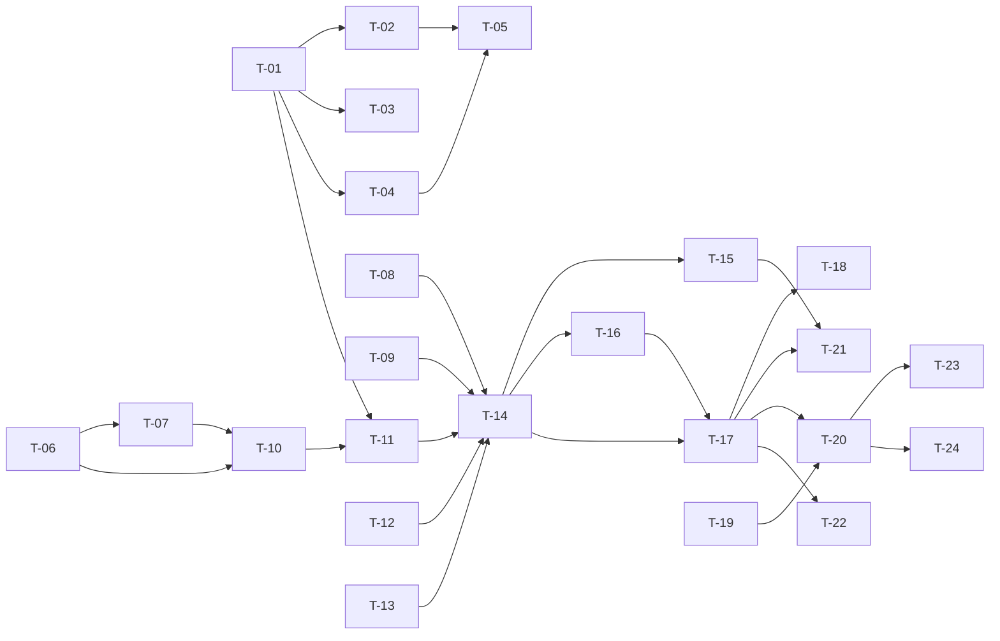

# TASKS — `RF-SP-024` Registrar usuario

| Campo | Valor |
|---|---|
| Requerimiento | `RF-SP-024` |
| Especificación | [`spec.md`](spec.md) |
| Plan | [`plan.md`](plan.md) |
| `plan.md` aprobado el | 22-08-2026 |
| Estado | **En revisión** |
| Issue | Pendiente de crear |
| Rama | `feature/registrar-usuario` |
| Aprobadas por | Pendiente |

!!! info "Qué va en este documento"

    **En qué pasos, en qué orden y cómo se verifica cada uno.**

    **Prueba de pertenencia:** si no puede marcarse como hecho, no es una tarea.

    **Es la fuente de verdad de las tareas.** El Issue de GitHub coordina y enlaza aquí; no la sustituye ni la duplica. Si las dos listas discrepan, manda este archivo.

    No se escribe hasta que `plan.md` esté aprobado, y ninguna tarea se ejecuta hasta que este documento lo esté (Art. I.6).

---

## 1. Tareas

Es el requerimiento más grande del módulo y conviene decir por qué antes de leer la lista: **crea el sujeto**. Cinco migraciones, cuatro tablas nuevas, la primera credencial del sistema y la extracción de `RN-SEG-010` a un componente que otros dos requerimientos comparten. Nada de eso puede repartirse (`plan.md` §1).

Tres tareas no parecen de aquí y lo son:

- **`T-01` incorpora `deleted_at` a `users`**, que `plan.md` §2 dejaba a `RF-SP-029`. Se corrige al escribir estas tareas (Art. I.7) y el motivo está en el propio plan de `RF-SP-029` §2: `architecture.md` §6.4 declara `deleted_at` columna obligatoria de toda tabla de negocio, y **diez requerimientos la leen antes de que `RF-SP-029` la escriba** —entre ellos `RF-SP-003` y `RF-SP-009`, que se implementan antes y cuyos planes ya la daban por existente—. Lo que sigue siendo de `RF-SP-029` es **escribirla**.
- **`T-08` toca `RF-SP-005`.** La resolución 5 de `spec.md` §14 exige que `RN-SEG-010` viva en un solo sitio; hoy vive dentro de `Role.grantPermissions`. Sacarla es parte de este requerimiento, no una refactorización aparte.
- **`T-19` verifica `V4`.** El evento `USER_CREATED` que `T-17` emite solo existe en `ck_audit_security_log_event_type` desde la ampliación de `RF-SP-014` §2. Si esa ampliación no llegó a `V4`, el alta funcionaría y **fallaría su auditoría de seguridad dentro de la transacción `REQUIRES_NEW`**, con un síntoma que no apunta al alta.

**Las enmiendas documentales del plan ya están aplicadas**: `requirements/sp.md` v1.16.0 (§10.10, §10.11, §10.12 y las quince restricciones de §10.8) y `security.md` v0.19.0 (§3.2, §8.1 y §9). No hay tarea para ellas; sí la hay para lo que aún no está escrito en código.

| # | Tarea | Depende de | Verificación | Estado |
|---|---|---|---|---|
| `T-01` | `V18__create_users.sql`: la tabla con sus diez columnas **más `deleted_at`**, `uq_users_username` sobre `lower(username)` **total**, `uq_users_email`, y los cinco `CHECK` de `plan.md` §2.1 | — | `mvn flyway:info` la lista aplicada. Prueba de integración: los dos índices únicos **no** llevan cláusula `WHERE`, y `users` no tiene `failed_attempts`, `locked_until` ni `last_login_at` | Pendiente |
| `T-02` | `V19__create_user_roles.sql`: clave primaria compuesta y las dos claves foráneas `ON DELETE RESTRICT`. **Sin `updated_at` y sin `ix_user_roles_role_id`**, que declara `RF-SP-030` | `T-01` | Prueba de integración: `DELETE` directo sobre `users` con asignaciones es rechazado por `fk_user_roles_user` | Pendiente |
| `T-03` | `V20__create_user_memberships.sql`: `user_id` como **clave primaria** —que es `RN-SP-014` declarada en el esquema—, las dos claves foráneas y `ck_user_memberships_periodo` | `T-01` | Prueba de integración: un segundo `INSERT` para el mismo usuario es rechazado por `pk_user_memberships`, sin que ningún código lo verifique | Pendiente |
| `T-04` | `V21__create_user_supervisors.sql`: clave sustituta, las dos claves foráneas a `users`, `uq_user_supervisors_vigente` **parcial**, `ck_user_supervisors_no_self` y `ck_user_supervisors_periodo` | `T-01` | Prueba de integración: dos asignaciones vigentes para el mismo subordinado son rechazadas; dos tramos cerrados del mismo par se admiten | Pendiente |
| `T-05` | `V22__seed_superadmin.sql`: identificador **fijo y escrito**, correo y hash por marcador de posición de Flyway, `must_change_password = true`, y el `INSERT … SELECT` del rol `SUPERADMIN` que **falla si ese rol no existe** | `T-02`, `T-04` | Prueba de integración: tras `V22` existe `superadmin` con el rol raíz y `users:create` entre sus permisos efectivos. **Sin marcador de posición, la migración falla y la aplicación no arranca** | Pendiente |
| `T-06` | `domain`: objetos de valor `Username` —recorta, valida el alfabeto y **rechaza la arroba**—, `Email` —recorta y pasa a minúsculas al construirse— y `PersonName` | — | Pruebas unitarias **sin Spring ni base de datos**: `juan@x.com` como nombre de usuario lanza; `" Juan.Perez@X.CO "` se construye como `juan.perez@x.co`; un nombre de un solo espacio se rechaza | Pendiente |
| `T-07` | `domain`: `PasswordPolicy` con las tres reglas de `security.md` §3.2 —longitud, lista de comunes y **contenido del nombre de usuario o de la parte local del correo, sin distinguir mayúsculas**— devolviendo **qué** regla incumple; y `PasswordHash`, cuyo `toString()` devuelve una máscara | `T-06` | Pruebas unitarias: `jperez2026` se rechaza para `jperez` y `JPerez!` también; la respuesta identifica la regla incumplida y **no reproduce la contraseña** | Pendiente |
| `T-08` | `domain/security/PrivilegeContainment`: `RN-SEG-010` **extraída a un único componente**, y `Role.grantPermissions` (`RF-SP-005`) pasa a delegarla en lugar de contenerla. `RN-SEG-003` se queda donde está | — | Pruebas unitarias sin Spring. Las pruebas de `RF-SP-005` siguen en verde **sin modificarse**: es lo que demuestra que no hubo cambio de comportamiento | Pendiente |
| `T-09` | `domain/CommercialStructure`: `RN-SP-019` y `RN-SP-020` —si el conjunto de roles exige superior, si es la cúspide, y si el superior propuesto porta el rol padre inmediato del rol vendedor de mayor rango— | — | Pruebas unitarias sin Spring ni base de datos (Art. VI.3), incluido el rol vendedor cuyo padre **no** es vendedor, que es la cúspide | Pendiente |
| `T-10` | `domain`: agregado `User`, que **nace `ACTIVO` y marcado para cambio de contraseña** —el constructor no recibe ninguna de las dos cosas— y el puerto `UserRepository` | `T-06`, `T-07` | Prueba unitaria: no existe forma de construir un `User` con otro estado ni con la marca en `false` | Pendiente |
| `T-11` | `infrastructure`: `UserEntity`, `UserRoleEntity`, `UserMembershipEntity`, `UserSupervisorEntity`, `UserJpaMapper` y `JpaUserRepository`, que **traduce la violación de índice único distinguiendo cuál de los dos se violó, por nombre de restricción** | `T-01` a `T-04`, `T-10` | Prueba de integración: nombre de usuario duplicado y correo duplicado producen dos excepciones distintas, y **ninguna llega como `500`** | Pendiente |
| `T-12` | `infrastructure/Argon2PasswordHasher` sobre `Argon2PasswordEncoder`, con `m`, `t` y `p` en configuración (`m = 19456 KiB`, `t = 2`, `p = 1`) y BouncyCastle declarado como dependencia | — | Prueba de integración: la credencial se verifica correctamente y el hash almacenado **no es el texto plano ni un digest reversible** | Pendiente |
| `T-13` | `infrastructure/ResourceCommonPasswordCatalog`: lista de contraseñas comunes leída del empaquetado, en memoria y una sola vez | — | Prueba unitaria: la lista se carga una vez y la consulta es de tiempo constante | Pendiente |
| `T-14` | `application`: `RegisterUserCommand` y `RegisterUserService` con `@Transactional` y **el orden de verificación de `plan.md` §4**, con la política de contraseña antes de la unicidad | `T-08` a `T-11` | Pruebas con dobles: una petición con contraseña débil y correo ya registrado devuelve **el error de la contraseña**, no el del correo. Es lo que impide deducir por el orden del error si el correo estaba libre | Pendiente |
| `T-15` | `application`: `RoleCatalog` gana la lectura de los roles a conceder **con bloqueo compartido y en orden ascendente de identificador**, y el superior se lee igual; `AuthenticatedActor` aporta los permisos efectivos **leídos de la base de datos**, nunca de la caché | `T-14` | Prueba de integración: la traza muestra `SELECT … FOR SHARE` sobre `roles` ordenado por `id`. Prueba con la caché precargada con un permiso que el actor acaba de perder: el alta **se rechaza** | Pendiente |
| `T-16` | Auditoría: `UserChangeAuditor` emite `audit_change_log` con `action = 'CREATE'` **en la misma transacción**, y `UserSecurityAuditor` emite `USER_CREATED` con `severity = 'ALTA'` y `target_user_id`, **enganchado al commit**. Un solo evento de seguridad, no dos | `T-14` | Prueba de integración: forzando el fallo tras el `INSERT`, **no queda ninguna de las dos filas**; y no existe fila de `USER_ROLES_ASSIGNED` aunque el alta conceda roles | Pendiente |
| `T-17` | `api`: `RegisterUserRequest` con Bean Validation y **rechazo de propiedades desconocidas**, `UserResponse`, y `UserController` con `POST /api/v1/users`, permiso `users:create`, `201` y cabecera `Location` | `T-14`, `T-16` | Prueba de API: un cuerpo con `status` o `mustChangePassword` devuelve `400` y **no se ignora**; la respuesta no contiene `password` ni ningún campo derivado | Pendiente |
| `T-18` | Rechazos con detalle: los cuerpos de `409` enumeran **qué** elemento incumple —cuál identidad, qué roles, qué rol debería portar el superior—, y el de `EX-001` **no distingue** si el conflicto es con un usuario vigente o eliminado | `T-17` | Prueba de API: el `409` de un nombre de usuario tomado por un eliminado tiene **el mismo cuerpo** que el de uno vigente | Pendiente |
| `T-19` | Verificar que `V4__create_audit_logs.sql` (`RF-SP-001`) incluye `USER_CREATED` en `ck_audit_security_log_event_type`, conforme a la ampliación de `RF-SP-014` §2. **Antes del primer despliegue** | — | Prueba de integración: la restricción acepta `USER_CREATED`. Sin ella, el alta correcta falla en su transacción de auditoría, con un síntoma que no apunta al alta | Pendiente |
| `T-20` | Pruebas de los criterios de aceptación de `spec.md` §12 | `T-17`, `T-19` | La suite cubre `CA-SP-192` a `CA-SP-202`, `CA-SP-341`, `CA-SP-342`, `CA-SP-372`, `CA-SP-373` y `CA-SP-395` a `CA-SP-398` | Pendiente |
| `T-21` | Pruebas **concurrentes**, con transacciones reales: dos altas con la misma identidad; alta con un rol que se desactiva a la vez; alta con un superior que se desactiva a la vez; y dos altas que conceden los mismos dos roles | `T-15`, `T-17` | Una `201` y una `409`, **nunca `500`**; jamás queda un usuario con un rol inactivo ni a cargo de una cuenta sin acceso; **no se produce interbloqueo** | Pendiente |
| `T-22` | Pruebas de los casos límite de `spec.md` §13 y de `plan.md` §11: caja del correo y del nombre de usuario, `INSERT` directo sin normalizar, contraseña con espacios, vendedor y consumidor a la vez, límites de longitud, y ausencia de las columnas no creadas | `T-17` | `" Juan.Perez@X.CO "` queda como `juan.perez@x.co`; `JPerez` se conserva tal cual y `jperez` devuelve `409`; la contraseña con espacios autentica con el mismo literal | Pendiente |
| `T-23` | Documentación OpenAPI del endpoint: cuerpo, `201` con `Location`, y los estados `400`, `401`, `403`, `409`, `422` y `500` | `T-20` | El contrato publicado coincide con el comportamiento real (Art. VIII.6), y documenta que la respuesta **nunca** devuelve la credencial | Pendiente |
| `T-24` | Actualizar la matriz de trazabilidad de `docs/requirements.md` | `T-20` | La fila de `RF-SP-024` refleja el estado y enlaza esta tripleta | Pendiente |

**Estados:** `Pendiente` · `En curso` · `Hecha` · `Bloqueada`.

## 2. Orden de ejecución

Las cinco migraciones y los objetos de valor de `domain` no se estorban: `T-01` a `T-05` y `T-06` a `T-09` pueden avanzar en paralelo. El cuello es `T-14`, que necesita las cuatro piezas de dominio y el adaptador.

`T-08` es independiente y conviene hacerla pronto: mientras `RN-SEG-010` siga dentro de `Role.grantPermissions`, `T-14` tendría que llamarla desde allí y la duplicación que la resolución 5 prohíbe volvería por la puerta de atrás.

## 3. Cobertura de los criterios de aceptación

| Criterio | Tarea que lo cubre |
|---|---|
| `CA-SP-192` | `T-01`, `T-17`, `T-20` |
| `CA-SP-341` | `T-01`, `T-06`, `T-20` |
| `CA-SP-342` | `T-10`, `T-17`, `T-20` |
| `CA-SP-193` | `T-11`, `T-18`, `T-20` |
| `CA-SP-194` | `T-01`, `T-18`, `T-20` |
| `CA-SP-195` | `T-07`, `T-17`, `T-20` |
| `CA-SP-196` | `T-07`, `T-16`, `T-17`, `T-20` |
| `CA-SP-197` | `T-14`, `T-20` |
| `CA-SP-198` | `T-15`, `T-20` |
| `CA-SP-199` | `T-08`, `T-18`, `T-20` |
| `CA-SP-200` | `T-16`, `T-19`, `T-20` |
| `CA-SP-201` | `T-11`, `T-21` |
| `CA-SP-372` | `T-09`, `T-14`, `T-20` |
| `CA-SP-373` | `T-03`, `T-16`, `T-20` |
| `CA-SP-395` | `T-09`, `T-14`, `T-20` |
| `CA-SP-396` | `T-09`, `T-15`, `T-20` |
| `CA-SP-397` | `T-04`, `T-16`, `T-20` |
| `CA-SP-398` | `T-09`, `T-20` |
| `CA-SP-202` | `T-17`, `T-20` |

`CA-SP-196` es el único criterio que se verifica **buscando el literal enviado**: en la respuesta, en `audit_change_log`, en `audit_security_log`, en `audit_error_log` y en `request_log`. Cualquier otra forma de probarlo comprueba la ausencia de un campo con nombre conocido, y el riesgo real es la credencial que aparece donde nadie la puso a propósito.

`CA-SP-201`, `CA-SP-373` y `CA-SP-397` son los tres criterios que exigen **transacciones reales**: dos compitiendo en el primero, una que se revierte a mitad en los otros dos.

## 4. Bloqueos

| # | Bloqueo | Desde | Responsable | Estado |
|---|---|---|---|---|
| 1 | `T-08` modifica `Role.grantPermissions`, de `RF-SP-005`, ya aprobado. El cambio no altera comportamiento —la misma regla, en otro sitio— y sus pruebas deben quedar en verde **sin tocarse** | 22-08-2026 | Responsable técnico | Abierto |
| 2 | `T-05` depende de `V7__seed_system_roles.sql` (`RF-SP-001`): sin el rol `SUPERADMIN`, el `INSERT … SELECT` no inserta fila y el superadministrador quedaría sin permisos. La migración debe **fallar**, no continuar en silencio | 22-08-2026 | Responsable técnico | Abierto |
| 3 | El despliegue debe declarar los marcadores de posición de la credencial inicial (`spring.flyway.placeholders.*`). **Sin ellos la aplicación no arranca**, y eso es el comportamiento buscado; debe estar escrito en el procedimiento de despliegue o el primer intento fallará sin que nadie entienda por qué | 22-08-2026 | Responsable del proyecto | Abierto |
| 4 | `T-01` incorpora `deleted_at`, que `plan.md` §2 asignaba a `RF-SP-029`. Es una **corrección del plan** (Art. I.7) motivada por `architecture.md` §6.4 y por la dependencia que `RF-SP-003` §2 ya declaraba. `RF-SP-029` conserva su escritura | 22-08-2026 | Responsable técnico | Abierto |
| 5 | Obligación declarada sobre `RF-SP-034` (`plan.md` §8): el inicio de sesión compara el nombre de usuario **sin distinguir mayúsculas** y el correo por igualdad directa. Si se implementa por igualdad exacta, quien se registró como `JPerez` no entrará escribiendo `jperez` | 22-08-2026 | Responsable técnico | Abierto |
| 6 | Obligación sobre **todo módulo futuro**: quien referencie `users(id)` declara su clave foránea `ON DELETE RESTRICT`. Un `SET NULL` dejaría auditoría sin sujeto | 22-08-2026 | Responsable técnico | Abierto |

## 5. Definición de terminado

El requerimiento no está terminado hasta cumplir **todas** las condiciones de la constitución §16:

- [ ] Todas las tareas en estado `Hecha`.
- [ ] Todos los criterios de aceptación con prueba automatizada en verde.
- [ ] `mvn verify` en verde en local.
- [ ] Toda escritura emite su evento de auditoría, en la transacción que corresponde.
- [ ] Los endpoints nuevos declaran su permiso.
- [ ] El contrato OpenAPI coincide con el comportamiento real.
- [ ] Documentación afectada actualizada en el mismo Pull Request.
- [ ] Matriz de trazabilidad actualizada.
- [ ] Pull Request aprobado por alguien distinto del autor e integrado.
