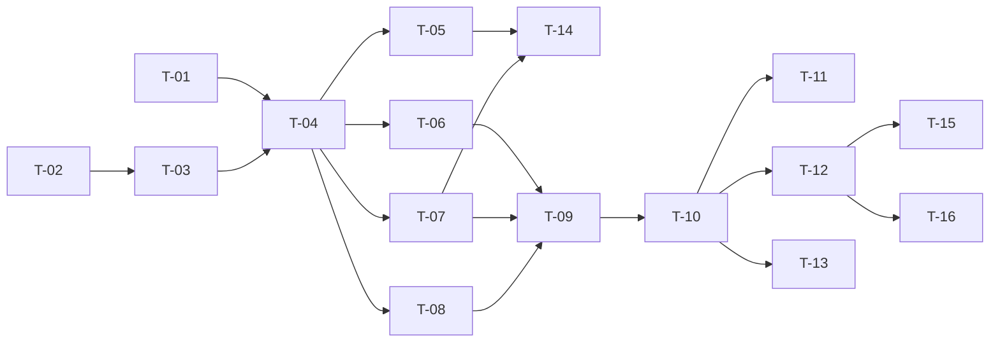

# TASKS — `RF-SP-025` Consultar usuarios

| Campo | Valor |
|---|---|
| Requerimiento | `RF-SP-025` |
| Especificación | [`spec.md`](spec.md) |
| Plan | [`plan.md`](plan.md) |
| `plan.md` aprobado el | 22-08-2026 |
| Estado | **Aprobadas** — 24-08-2026 |
| Issue | Pendiente de crear |
| Rama | `feature/consultas-de-usuario` |
| Aprobadas por | Responsable técnico, 24-08-2026 |

!!! info "Qué va en este documento"

    **En qué pasos, en qué orden y cómo se verifica cada uno.**

    **Prueba de pertenencia:** si no puede marcarse como hecho, no es una tarea.

    **Es la fuente de verdad de las tareas.** El Issue de GitHub coordina y enlaza aquí; no la sustituye ni la duplica. Si las dos listas discrepan, manda este archivo.

    No se escribe hasta que `plan.md` esté aprobado, y ninguna tarea se ejecuta hasta que este documento lo esté (Art. I.6).

---

## 1. Tareas

Una migración de dos índices y una consulta con tres sentencias. La forma la hereda entera de `RF-SP-002` —envoltura de página, lista blanca de ordenamiento, búsqueda por trigramas— y lo propio son tres cosas: **la colección por fila**, **la vigencia de la membresía** y **la búsqueda sobre el nombre completo**.

`T-06` es la tarea que decide si este requerimiento está bien implementado. Todo lo demás puede escribirse de varias formas correctas; los roles por fila solo tienen una que no degrade en `N+1`, y la única manera de fijarla es contar sentencias.

| # | Tarea | Depende de | Verificación | Estado |
|---|---|---|---|---|
| `T-01` | `V23__create_user_query_indexes.sql`: `ix_users_busqueda` GIN de trigramas sobre `f_unaccent(lower(username))`, `f_unaccent(lower(email))` y `f_unaccent(lower(first_name \|\| ' ' \|\| last_name))`, más `ix_user_memberships_membership_id` | — | `mvn flyway:info` la lista aplicada. Prueba de integración: el índice de búsqueda **no** lleva cláusula `WHERE` | **Hecha** |
| `T-02` | `application`: `ListUsersQuery`, `UserListItem`, `UserRoleItem` y `UserSortField` con la lista blanca de `plan.md` §4 | — | Prueba unitaria: `password_hash`, `mustChangePassword`, `roles`, `deletedAt` y `lastLoginAt` **no** se resuelven y producen el rechazo antes de construir consulta alguna | **Hecha** |
| `T-03` | `application/UserQueryRepository`: puerto de consulta con la página y el conteo, y la lectura de roles por conjunto de identificadores | `T-02` | Compila sin importar nada de `infrastructure` ni de `api`; el puerto **no** declara ninguna escritura | **Hecha** |
| `T-04` | `infrastructure/JpaUserQueryRepository`: proyección de la página con `LEFT JOIN` a la membresía, predicado por filtros **presentes**, y los dos filtros externos con `EXISTS` | `T-01`, `T-03` | Prueba de integración: una persona con tres roles, uno de ellos el filtrado, aparece **una vez** y cuenta **uno** en el total | **Hecha** |
| `T-05` | Búsqueda: recorte, escape de `\`, `%` y `_`, parámetro enlazado con `ESCAPE`, y normalización **en la base de datos** con `f_unaccent` | `T-04` | Prueba de integración con PostgreSQL real: `perez` encuentra a `Pérez` y `peres` **no**; un término con `%` no devuelve el padrón entero | **Hecha** |
| `T-06` | Adjuntar los roles de la página en **una sola sentencia** sobre los identificadores ya leídos, ordenados por `code`, y omitirla cuando la página viene vacía | `T-04` | Prueba de integración que **cuenta sentencias**: tres como máximo con veinte filas y las mismas tres con cien; dos cuando la página viene vacía | **Hecha** |
| `T-07` | Vigencia de la membresía: `current` calculado con `now()` de la base de datos, tanto en el filtro como en la fila devuelta | `T-04` | Prueba de integración: una membresía vencida se devuelve con `current: false` y su `endsAt`, y **no** la trae el filtro por esa membresía. Distinguible de `membership: null` | **Hecha** |
| `T-08` | Conteo con **la misma función de predicado** que los datos, omitido cuando la página no se llena y sin los `LEFT JOIN` de la membresía | `T-04` | Prueba de integración: el total coincide con las filas devueltas al recorrer todas las páginas, con y sin cada filtro | **Hecha** |
| `T-09` | `application/ListUsersService` con `@Transactional(readOnly = true)`, que arma la página y agrupa los roles por persona | `T-06`, `T-07`, `T-08` | Prueba con dobles: una página sin resultados no invoca la lectura de roles | **Hecha** |
| `T-10` | `api`: `ListUsersRequest` con Bean Validation, `UserListItemResponse`, `MembershipSummaryResponse`, y `GET /api/v1/users` en `UserController` con el permiso `users:read` | `T-09` | Prueba de API: `size = 101` devuelve `400` con `VAL-002` y **no** una página de cien | **Hecha** |
| `T-11` | Ausencia verificable de lo que el listado **no** devuelve: credencial, permisos efectivos y `lockedUntil` | `T-10` | Prueba de API que busca **el literal del hash almacenado** en la respuesta completa, y traza de sentencias sin ninguna consulta a `role_permissions` | **Hecha** |
| `T-12` | Pruebas de los criterios de aceptación de `spec.md` §12 | `T-10` | La suite cubre `CA-SP-203` a `CA-SP-211`, `CA-SP-343`, `CA-SP-344` y `CA-SP-345` | **En curso** |
| `T-13` | Pruebas de los casos límite de `spec.md` §13 y de `plan.md` §11: página fuera de rango, búsqueda vacía, nombre completo, rol inexistente, membresía vencida, ordenamiento arbitrario y desempate por `id` | `T-10` | `juan perez` encuentra a `Juan Pérez` y `perez juan` no; `sort=password_hash,asc` devuelve `400` y no llega a la base de datos | **En curso** |
| `T-14` | Pruebas de `EXPLAIN`: la búsqueda usa `ix_users_busqueda` y el filtro por membresía usa `ix_user_memberships_membership_id` | `T-05`, `T-07` | Sin ellas, el índice puede dejar de usarse por un cambio en el predicado **sin que ninguna prueba funcional lo note** | **Pendiente** |
| `T-15` | Documentación OpenAPI: los ocho parámetros, la envoltura de página y los estados `400`, `401`, `403` y `500` | `T-12` | El contrato publicado coincide con el comportamiento real (Art. VIII.6), y documenta que un filtro sin coincidencias devuelve `200` y no `404` | **Hecha** |
| `T-16` | Enmendar `requirements/sp.md` §10.8 con `ix_users_busqueda` e `ix_user_memberships_membership_id`, y actualizar la matriz de trazabilidad de `docs/requirements.md` | `T-12` | La fila de `RF-SP-025` refleja el estado y enlaza esta tripleta; §10.8 lista los dos índices nuevos | **En curso** |

**Estados:** `Pendiente` · `En curso` · `Hecha` · `Bloqueada`.

## 2. Orden de ejecución

`T-01` y `T-02` son independientes y pueden ir en paralelo. `T-05` a `T-08` también entre sí, una vez existe el adaptador.

## 3. Cobertura de los criterios de aceptación

| Criterio | Tarea que lo cubre |
|---|---|
| `CA-SP-203` | `T-08`, `T-10`, `T-12` |
| `CA-SP-204` | `T-04`, `T-12` |
| `CA-SP-205` | `T-04`, `T-07`, `T-12` |
| `CA-SP-206` | `T-01`, `T-05`, `T-12` |
| `CA-SP-207` | `T-10`, `T-12` |
| `CA-SP-208` | `T-02`, `T-11`, `T-12` |
| `CA-SP-209` | `T-11`, `T-12` |
| `CA-SP-343` | `T-06`, `T-12` |
| `CA-SP-344` | `T-05`, `T-12` |
| `CA-SP-345` | `T-11`, `T-12` |
| `CA-SP-210` | `T-10`, `T-12` |
| `CA-SP-211` | `T-10`, `T-12` |

`CA-SP-208` se verifica **buscando el literal del hash almacenado** en la respuesta completa, no comprobando que falte un campo con nombre conocido: el riesgo real es la credencial que aparece donde nadie la puso a propósito.

`CA-SP-343` es el criterio que obliga a `T-06`: la lista completa de roles por fila es lo que separa esta consulta de la de `RF-SP-002`, y también lo que la pone a un paso del `N+1`.

## 4. Bloqueos

| # | Bloqueo | Desde | Responsable | Estado |
|---|---|---|---|---|
| 1 | Depende de que `V18__create_users.sql` incluya **`deleted_at`**, corrección introducida en las `tasks.md` de `RF-SP-024` (Art. I.7). Sin esa columna, `CA-SP-204` no es implementable | 22-08-2026 | Responsable técnico | Abierto |
| 2 | El filtro por rol depende de `ix_user_roles_role_id`, que declara `RF-SP-030`. Sin él la consulta funciona y **recorre la tabla de asignaciones entera**; el síntoma es lentitud, no error | 22-08-2026 | Responsable técnico | Abierto |
| 3 | `T-01` es el tercer índice que depende de `f_unaccent` (`V1`, `RF-SP-010`). Cualquier cambio en el diccionario `unaccent` obliga a **reindexar los tres**: `roles`, `countries` y `users` | 22-08-2026 | Responsable técnico | Abierto |
| 4 | El conteo exacto sobre una tabla que crece sin límite tiene disparador de revisión declarado en `plan.md` §10: el p95 acercándose a los 500 ms de `RNF-PERF-001`. La salida es `totalIsExact = false`, no cambiar la paginación | 22-08-2026 | Responsable técnico | Abierto |
| 5 | Este endpoint es el **primero** que habrá que revisar cuando se resuelva **D-22**, y hoy no tiene ningún punto donde insertar el alcance por persona (`plan.md` §5) | 22-08-2026 | Responsable del proyecto | Abierto |

## 4.bis Desviaciones respecto del plan e implementación real

| # | Desviación | Motivo | Consecuencia |
|---|---|---|---|
| 1 | La migración es **`V29`** y no `V23` | `V26` a `V28` ya están aplicadas y Flyway rechaza un número inferior salvo con `outOfOrder`, que no se habilita | Misma decisión que `V28` declara: la reserva de números por requerimiento queda muerta y cada uno toma el siguiente libre |
| 2 | La paginación la resuelve `shared/pagination`, creado por `RF-SP-042`, y no un componente propio de este requerimiento | `architecture.md` §7.4 la declara uniforme para todo el sistema; escribirla aquí otra vez habría producido la segunda forma de paginar | Los códigos de error de la paginación son los de ese componente —`VAL-003` para página y tamaño— y no los `VAL-001`/`VAL-002` que la tabla de este plan enumera por separado. Un hecho, un código; queda declarado |
| 3 | `T-14` —las pruebas de `EXPLAIN`— queda **Pendiente** | Con las pocas filas de la suite, el planificador elige un recorrido secuencial aunque el índice exista | **Que la búsqueda use `ix_users_busqueda` no está demostrado.** Es el hueco que más importa de esta tripleta, porque `users` sí crece sin límite: el día que no lo use, el síntoma será lentitud y no un fallo. Mismo hueco que `RF-SP-021` · `T-11` |
| 4 | `T-12`, `T-13` y `T-16` quedan **En curso** | La suite cubre el ordenamiento, los filtros, la búsqueda con y sin comodines, los eliminados, la membresía vencida y la paginación; faltan casos límite menores y la enmienda de `requirements/sp.md` §10.8 con los dos índices nuevos | La enmienda del documento transversal está pendiente y declarada |

### Lo que sí quedó verificado

- **El orden por defecto es el apellido**, y la prueba lo distingue del nombre de usuario: con tres personas cuyos apellidos y nombres de usuario ordenan distinto, un criterio equivocado falla.
- **No se puede ordenar por ningún campo de la credencial.** Los tres —el resumen, la marca de cambio obligatorio y los intentos fallidos— se rechazan con `VAL-003`. Ordenar por la marca produce la lista de quien no ha cambiado su contraseña inicial.
- **El filtro por rol no multiplica filas**: con una persona que porta dos roles, el total sigue siendo uno. Con un `JOIN` en lugar de `EXISTS`, contaría asignaciones.
- **El comodín de `LIKE` se escapa**: buscar `%` no devuelve la lista entera.
- **Una membresía vencida no es lo mismo que no tener**: sigue viajando, con `current` en falso y su fecha; y el filtro por membresía **vigente** deja de encontrarla.
- **Ninguna fila lleva nada derivado de la credencial**, ni permisos efectivos, ni el bloqueo.
- Un filtro sin coincidencias y una página más allá de la última devuelven `200`, no un error.

## 5. Definición de terminado

El requerimiento no está terminado hasta cumplir **todas** las condiciones de la constitución §16:

- [ ] Todas las tareas en estado `Hecha`. — falta `T-14` (pruebas de `EXPLAIN`) y tres en curso.
- [ ] Todos los criterios de aceptación con prueba automatizada en verde. — falta demostrar el uso efectivo de los índices.
- [x] `mvn verify` en verde en local. — 99 unitarias y 351 de integración, 24-08-2026.
- [x] Toda escritura emite su evento de auditoría, en la transacción que corresponde. — no escribe: es una consulta.
- [x] Los endpoints nuevos declaran su permiso. — `users:read`.
- [x] El contrato OpenAPI coincide con el comportamiento real. — `OpenApiContractIT` fija los parámetros publicados y la **ausencia** de los derivados de la credencial.
- [ ] Documentación afectada actualizada en el mismo Pull Request. — falta enmendar `requirements/sp.md` §10.8 con los dos índices de `V29`.
- [x] Matriz de trazabilidad actualizada.
- [ ] Pull Request aprobado por alguien distinto del autor e integrado.
