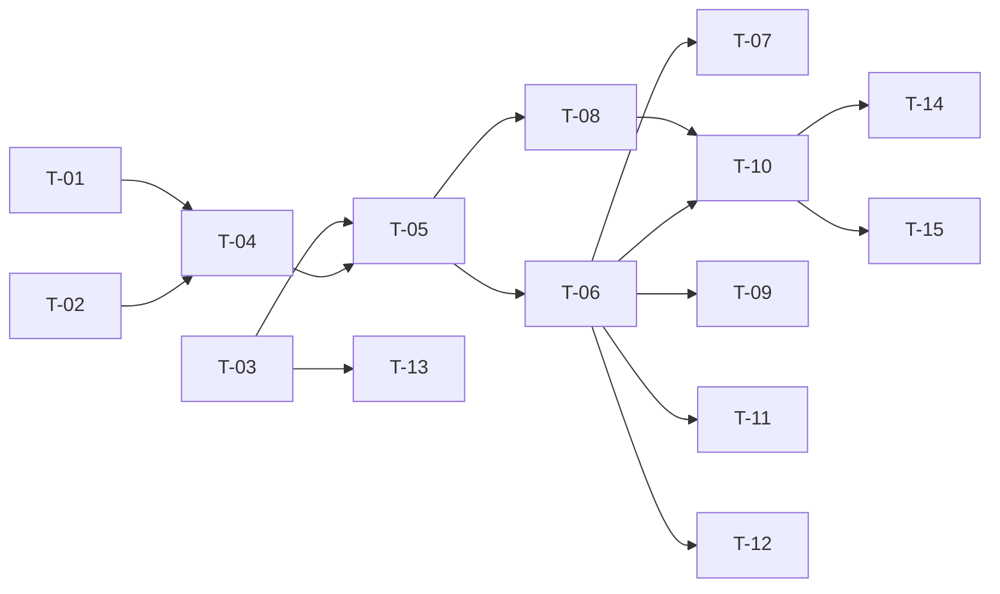

# TASKS — `RF-SP-026` Consultar detalle de un usuario

| Campo | Valor |
|---|---|
| Requerimiento | `RF-SP-026` |
| Especificación | [`spec.md`](spec.md) |
| Plan | [`plan.md`](plan.md) |
| `plan.md` aprobado el | 22-08-2026 |
| Estado | **Aprobadas** — 24-08-2026 |
| Issue | Pendiente de crear |
| Rama | `feature/consultas-de-usuario` |
| Aprobadas por | Responsable técnico, 24-08-2026 |

!!! info "Qué va en este documento"

    **En qué pasos, en qué orden y cómo se verifica cada uno.**

    **Prueba de pertenencia:** si no puede marcarse como hecho, no es una tarea.

    **Es la fuente de verdad de las tareas.** El Issue de GitHub coordina y enlaza aquí; no la sustituye ni la duplica. Si las dos listas discrepan, manda este archivo.

    No se escribe hasta que `plan.md` esté aprobado, y ninguna tarea se ejecuta hasta que este documento lo esté (Art. I.6).

---

## 1. Tareas

Sin migración: la lista entera es código de consulta. Lo propio es `T-03`, que **publica el resolutor de permisos** que hasta ahora solo consumía el filtro de autorización, y `T-08`, que comprueba que el detalle y la autorización dicen lo mismo. Todo lo demás hereda la forma de `RF-SP-003`.

`T-01` no pertenece a este requerimiento pero lo condiciona: **`RF-SP-034` debe estar implementado antes**, porque crea las dos columnas que `spec.md` §6.2 exige devolver. No es una tarea que se marque aquí como hecha; es la comprobación de que puede empezarse.

| # | Tarea | Depende de | Verificación | Estado |
|---|---|---|---|---|
| `T-01` | Comprobar que `last_login_at` y `locked_until` existen en `users`, creadas por `RF-SP-034`, y que `failed_attempts` existe y **no** se selecciona en ninguna proyección de este requerimiento | — | Prueba de integración: las tres columnas están en el esquema. **Antes de empezar `T-04`** | **Hecha** |
| `T-02` | `application`: `UserDetail`, `AssignedRoleItem` —`UserRoleItem` de `RF-SP-025` **más el estado del rol**— y el puerto `UserDetailQueryRepository` | — | Compila sin importar nada de `infrastructure` ni de `api`; el puerto no declara ninguna escritura | **Hecha** |
| `T-03` | `shared/security`: publicar la resolución `rol → permisos` tras el puerto `EffectivePermissionResolver`, con **dos clientes**: el filtro de autorización y este caso de uso | — | Prueba unitaria: el puerto devuelve la unión sin duplicados a partir de un conjunto de roles; el filtro de autorización sigue en verde **sin modificarse** | **En curso** |
| `T-04` | `infrastructure/JpaUserDetailQueryRepository`: la sentencia de la persona con `LEFT JOIN` a la membresía y su nivel, y la de los roles con su estado, excluyendo los eliminados y ordenados por `code` | `T-01`, `T-02` | Prueba de integración: un rol con `deleted_at` no nulo **no** aparece aunque su fila de `user_roles` exista | **Hecha** |
| `T-05` | `application/GetUserDetailService` con `@Transactional(readOnly = true)`: filtra los roles `ACTIVO` **con el estado recién leído** y pide al resolutor la unión; devuelve `404` sin ejecutar la segunda sentencia cuando la persona no existe | `T-03`, `T-04` | Pruebas con dobles: con todos los roles inactivos no se invoca al resolutor y la lista llega vacía; con la persona inexistente, la segunda sentencia no se ejecuta | **Hecha** |
| `T-06` | `api`: `UserDetailResponse`, `MembershipSummaryResponse` ampliado con `level`, y `GET /api/v1/users/{id}` en `UserController` con el permiso `users:read` | `T-05` | Prueba de API: `200` con las cinco secciones —identidad, roles, permisos efectivos, membresía y contexto de acceso— | **Hecha** |
| `T-07` | Ausencia verificable de lo que el detalle **no** devuelve: credencial, `mustChangePassword`, `failedAttempts`, `deletedAt`, sesiones y estructura comercial | `T-06` | Prueba de API que busca **el literal del hash almacenado** en el cuerpo completo, y que sobre una cuenta con tres intentos fallidos no aparece el contador | **Hecha** |
| `T-08` | Prueba de **coherencia con la autorización**: el conjunto devuelto en `effectivePermissions` es idéntico al que el filtro admite para esa misma persona | `T-05` | Sobre la misma persona y en la misma instancia, ambos conjuntos coinciden. Es la prueba que detecta una segunda implementación de `RN-SEG-009` | **Hecha** |
| `T-09` | Vigencia de la membresía con `now()` de la base de datos, y desambiguación del bloqueo: `BLOQUEADO` con `lockedUntil` nulo es manual | `T-06` | Prueba de integración: una membresía vencida llega con `current: false`; una cuenta bloqueada manualmente llega con `lockedUntil` nulo y otra automática con su momento de expiración | **Hecha** |
| `T-10` | Pruebas de los criterios de aceptación de `spec.md` §12 | `T-06`, `T-08` | La suite cubre `CA-SP-212` a `CA-SP-220` y `CA-SP-346` | **En curso** |
| `T-11` | Pruebas de los casos límite de `spec.md` §13 y de `plan.md` §11: permiso por dos roles, usuario eliminado, incoherencia de membresía sin rol consumidor, el actor consultándose a sí mismo con y sin permiso, e identificadores malformados | `T-06` | El actor sin `users:read` recibe `403` **también sobre su propia ficha**: ese caso es `RF-SP-039`, no este | **En curso** |
| `T-12` | Prueba de **número de sentencias**: dos por petición con independencia del número de roles y de permisos, y una cuando la persona no existe | `T-06` | Es la única forma de que el `N+1` no vuelva en una refactorización posterior | **Pendiente** |
| `T-13` | Regla de ArchUnit: **`application` no importa el adaptador de caché de `shared/security`**, solo su puerto | `T-03` | La regla falla si alguien inyecta la caché directamente en el caso de uso, que es el atajo más corto de escribir | **Pendiente** |
| `T-14` | Documentación OpenAPI: la respuesta completa y los estados `400`, `401`, `403`, `404` y `500` | `T-10` | El contrato publicado coincide con el comportamiento real (Art. VIII.6), y documenta que un usuario eliminado devuelve `404` indistinguible de uno inexistente | **Hecha** |
| `T-15` | Enmendar `requirements/sp.md` §6.1 con las precedencias del bloque de usuarios y §10.10 con el reparto de las tres columnas de control de acceso; enmendar `security.md` §9 con lo mismo; actualizar la matriz de trazabilidad | `T-10` | §6.1 declara que `RF-SP-034` precede a este requerimiento; §10.10 y `security.md` §9 atribuyen `failed_attempts`, `locked_until` y `last_login_at` a `RF-SP-034` | **En curso** |

**Estados:** `Pendiente` · `En curso` · `Hecha` · `Bloqueada`.

## 2. Orden de ejecución

`T-03` es independiente de la consulta y conviene hacerla primero: mientras el resolutor no esté publicado tras su puerto, la forma más corta de escribir `T-05` es reimplementar la unión, que es justo la alternativa que `plan.md` §9 descarta.

## 3. Cobertura de los criterios de aceptación

| Criterio | Tarea que lo cubre |
|---|---|
| `CA-SP-212` | `T-04`, `T-06`, `T-10` |
| `CA-SP-213` | `T-03`, `T-05`, `T-10` |
| `CA-SP-214` | `T-05`, `T-10` |
| `CA-SP-215` | `T-05`, `T-10` |
| `CA-SP-216` | `T-04`, `T-09`, `T-10` |
| `CA-SP-217` | `T-01`, `T-09`, `T-10` |
| `CA-SP-346` | `T-07`, `T-10` |
| `CA-SP-218` | `T-07`, `T-10` |
| `CA-SP-219` | `T-04`, `T-10` |
| `CA-SP-220` | `T-06`, `T-10` |

`CA-SP-214` es el criterio que decide si este requerimiento está bien implementado, y su prueba debe ejercitarse sobre un permiso que **solo** el rol inactivo declara: si otro rol activo lo concede también, la prueba pasa con una implementación que ignora `RN-SEG-002` por completo.

`T-08` no cubre ningún criterio de `spec.md` y es la prueba más valiosa de la lista: ningún criterio puede exigir que dos implementaciones coincidan, porque la especificación no sabe que podría haber dos.

## 4. Bloqueos

| # | Bloqueo | Desde | Responsable | Estado |
|---|---|---|---|---|
| 1 | **`RF-SP-034` debe implementarse antes.** Crea `last_login_at` y `locked_until`, que `spec.md` §6.2 exige devolver. Sin él, este requerimiento no puede completarse, y crearlas aquí sería inventar esquema para columnas que nunca escribe (`plan.md` §2) | 22-08-2026 | Responsable técnico | Abierto |
| 2 | `T-03` modifica el componente que resuelve los permisos en el camino de autorización, que es el más caliente del sistema. Sus pruebas deben quedar en verde **sin tocarse**: es lo que demuestra que solo cambió quién puede llamarlo | 22-08-2026 | Responsable técnico | Abierto |
| 3 | Con más de una instancia del backend, el detalle refleja lo que **esa** instancia concedería. Es el mismo riesgo que `RF-SP-007` §10 aceptó para la autorización, y no añade uno nuevo | 22-08-2026 | Responsable técnico | Abierto |
| 4 | Se revisa junto con `RF-SP-025` cuando se cierre **D-22**: hoy quien tiene `users:read` consulta el alcance completo de cualquiera | 22-08-2026 | Responsable del proyecto | Abierto |

## 4.bis Desviaciones respecto del plan e implementación real

| # | Desviación | Motivo | Consecuencia |
|---|---|---|---|
| 1 | `T-03` no publicó un `EffectivePermissionResolver` con caché de dos claves: se consume `EffectivePermissions`, el puerto que `RF-SP-024` creó y que la autorización ya usa | Es literalmente **el mismo componente que autoriza**, que es la garantía que este requerimiento pedía. Crear un segundo resolutor con caché habría producido justo las dos implementaciones de la misma regla que el plan quería evitar | **La caché de `security.md` §4.5 sigue sin existir**, aquí y en la autorización. La consecuencia es una consulta por petición, no una incoherencia: el detalle y el filtro siguen sin poder contradecirse porque preguntan al mismo sitio |
| 2 | `T-12` —la prueba de **número de sentencias**— queda **Pendiente** | Exige un contador de sentencias que la suite no tiene montado | «Dos sentencias por petición con independencia del número de roles» está construido y no verificado. Un `N+1` introducido después no rompería ninguna prueba |
| 3 | `T-13` —la regla de ArchUnit sobre la caché— queda **Pendiente** | No hay adaptador de caché que prohibir importar: sin el componente, la regla no tiene sujeto | Se retoma con la caché |
| 4 | `T-10`, `T-11` y `T-15` quedan **En curso** | Faltan el permiso concedido por dos roles y la enmienda de `requirements/sp.md` §6.1 y §10.10 | La enmienda del documento transversal está pendiente y declarada |

### Lo que sí quedó verificado

- **`roles` con el estado de cada uno y `effectivePermissions` vacía**, las dos mitades a la vez: es lo único que explica por qué una persona **con roles** no puede hacer nada. Con una sola de las dos, esa pantalla no responde la pregunta para la que existe.
- **Un rol eliminado ni aparece ni concede**; uno inactivo **aparece con su estado** y no concede.
- **El detalle no filtra nada**: sin intentos fallidos —dirían cuántos le quedan a una cuenta antes de bloquearse—, sin dato alguno de la credencial, sin el superior comercial y sin `deletedAt`.
- **La persona eliminada devuelve el mismo `404`, byte a byte**, que una inexistente: sin ninguna pista de que existió.
- **El identificador no canónico es `400` y no `404`**, gracias al editor transversal que este requerimiento exigía por su nombre y que cierra el hueco declarado de `RF-SP-018` · `T-08`.
- Los permisos que devuelve son los que la autorización usará, y la prueba lo comprueba contra un actor real.

## 5. Definición de terminado

El requerimiento no está terminado hasta cumplir **todas** las condiciones de la constitución §16:

- [ ] Todas las tareas en estado `Hecha`. — faltan `T-12` y `T-13`, y cuatro en curso.
- [ ] Todos los criterios de aceptación con prueba automatizada en verde. — falta el permiso concedido por dos roles.
- [x] `mvn verify` en verde en local. — 99 unitarias y 351 de integración, 24-08-2026.
- [x] Toda escritura emite su evento de auditoría, en la transacción que corresponde. — no escribe: es una consulta.
- [x] Los endpoints nuevos declaran su permiso. — `users:read`.
- [x] El contrato OpenAPI coincide con el comportamiento real.
- [ ] Documentación afectada actualizada en el mismo Pull Request. — falta enmendar `requirements/sp.md` §6.1 y §10.10.
- [x] Matriz de trazabilidad actualizada.
- [ ] Pull Request aprobado por alguien distinto del autor e integrado.
