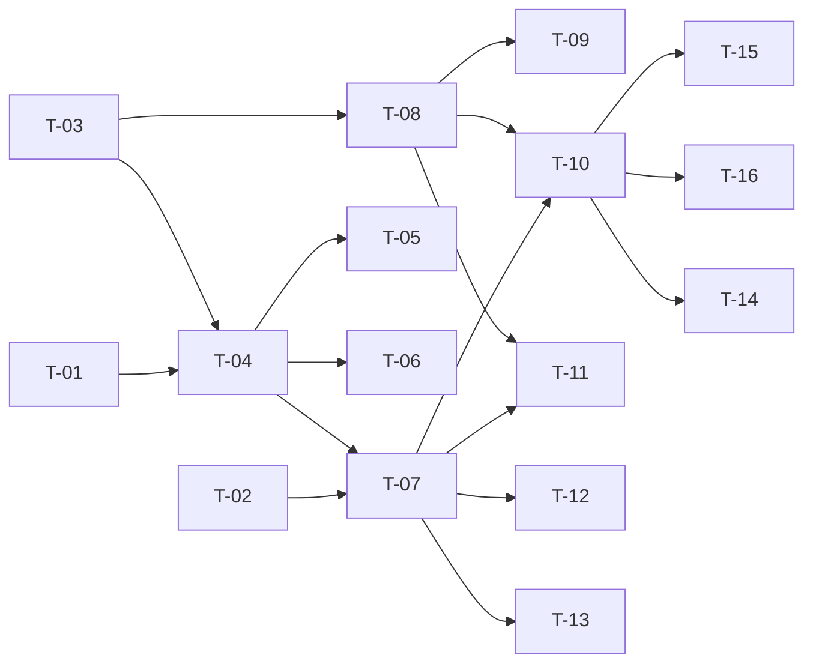

# TASKS — `RF-SP-027` Editar usuario

| Campo | Valor |
|---|---|
| Requerimiento | `RF-SP-027` |
| Especificación | [`spec.md`](spec.md) |
| Plan | [`plan.md`](plan.md) |
| `plan.md` aprobado el | 22-08-2026 |
| Estado | **Aprobadas** — 24-08-2026 |
| Issue | Pendiente de crear |
| Rama | `feature/ciclo-de-vida-de-usuario` |
| Aprobadas por | Responsable técnico, 24-08-2026 |

!!! info "Qué va en este documento"

    **En qué pasos, en qué orden y cómo se verifica cada uno.**

    **Prueba de pertenencia:** si no puede marcarse como hecho, no es una tarea.

    **Es la fuente de verdad de las tareas.** El Issue de GitHub coordina y enlaza aquí; no la sustituye ni la duplica. Si las dos listas discrepan, manda este archivo.

    No se escribe hasta que `plan.md` esté aprobado, y ninguna tarea se ejecuta hasta que este documento lo esté (Art. I.6).

---

## 1. Tareas

Sin migración. La forma la hereda de `RF-SP-004` —`PATCH` parcial, `Patchable<T>`, diff del dominio, «gana el último»— y lo propio son tres cosas, que son también las tres tareas donde se concentra el riesgo:

- **`T-02`**: el tercer estado de `Patchable<T>` aquí **rechaza**, no vacía. El componente se reutiliza y su semántica cambia; copiar la de los roles produce un `500` donde debe haber un `400`.
- **`T-06`**: el evento de seguridad se emite **solo** si cambió el correo. Copiar la fila de la tabla sin la condición emite de más.
- **`T-08`**: la traducción de `uq_users_email` por **nombre de restricción**. Sin ella, dos ediciones concurrentes hacia el mismo correo producen un `500`.

**Dos criterios necesitan `RF-SP-034`** y se completan en el Pull Request en que aquel se integre: `CA-SP-357` —autenticar con el correo nuevo y no con el anterior— y la mitad de extremo a extremo de `CA-SP-227`. La otra mitad sí se prueba ahora, sobre la tabla de sesiones.

| # | Tarea | Depende de | Verificación | Estado |
|---|---|---|---|---|
| `T-01` | `domain`: `User.updateIdentity(firstName, lastName, email)` que aplica lo recibido y **devuelve qué campos mutaron**, y el tipo `UserChanges` que lo transporta | — | Pruebas unitarias **sin Spring ni base de datos**: enviar el valor actual devuelve «sin cambio»; enviar el correo con otra caja y espacios **también**, porque `Email` lo normaliza al construirse | **En curso** |
| `T-02` | `api/UpdateUserRequest`: los tres campos con `Patchable<T>`, Bean Validation y **rechazo de propiedades desconocidas**. El nulo explícito produce `VAL-002` o `VAL-003`, **nunca una orden de vaciado** | — | Prueba de API para los cinco cuerpos de `plan.md` §4, incluido `{"username":"otro"}`, que devuelve `400` por campo desconocido | **Hecha** |
| `T-03` | `domain/UserRepository`: `findActiveByIdForUpdate(UUID)` y `existsEmailOfOther(Email, UUID)`; `JpaUserRepository` los implementa con `SELECT … FOR UPDATE` | — | Prueba de integración: la carga bloquea la fila; la comprobación de unicidad **excluye a la propia persona** | **En curso** |
| `T-04` | `application`: `UpdateUserCommand` y `UpdateUserService` con `@Transactional` y el **orden de verificación** de `plan.md` §4 —normalizar, detectar cambio, y solo entonces comprobar unicidad— | `T-01`, `T-03` | Pruebas con dobles: reenviar el correo actual **no invoca** la comprobación de unicidad; sin cambio efectivo no se invoca ningún auditor | **Hecha** |
| `T-05` | Auditoría de cambio: una fila en `audit_change_log` con `action = 'UPDATE'` y `changes` con **solo** los campos mutados, el correo normalizado en ambos lados y **sin `updated_at`** | `T-04` | Prueba de integración: cambiar solo el nombre deja un diff de un campo; `FA-001` no deja ninguna fila | **Hecha** |
| `T-06` | Auditoría de seguridad: `EMAIL_CHANGED` con `severity = 'ALTA'` y `target_user_id`, **solo cuando cambió el correo**, enganchado al commit, y con un `detail` que **no** contiene ninguno de los dos correos | `T-04` | Prueba de integración de las **dos mitades**: está cuando cambió el correo y **no está** cuando solo cambió el nombre. Y un solo evento aunque la petición cambie ambas cosas | **Hecha** |
| `T-07` | `api`: `PATCH /api/v1/users/{id}` en `UserController` con el permiso `users:update`, devolviendo `200` con `UserResponse` | `T-02`, `T-04` | Prueba de API: la respuesta devuelve `username` sin cambios, que es la mitad comprobable de `CA-SP-222` | **Hecha** |
| `T-08` | `JpaUserRepository` traduce la violación de `uq_users_email` **por nombre de restricción**, nunca por el texto del mensaje del driver, a `409` con `RN-SP-016` y un mensaje que **no nombra** a nadie | `T-03` | Prueba de integración forzando el camino que salta la verificación previa: la violación produce `409`, **nunca `500`** | **Hecha** |
| `T-09` | Prueba de que el silencio del `409` es completo: el correo de una persona **eliminada** produce el mismo cuerpo que el de una vigente | `T-08` | `RN-SP-016` reserva el correo de los eliminados para siempre; la respuesta no puede delatar que esa cuenta existió | **En curso** |
| `T-10` | Pruebas de los criterios de aceptación de `spec.md` §12 | `T-07`, `T-08` | La suite cubre `CA-SP-221` a `CA-SP-229`, `CA-SP-355` y `CA-SP-356`. `CA-SP-227` y `CA-SP-357` quedan **parciales** hasta `RF-SP-034` | **En curso** |
| `T-11` | Pruebas **concurrentes** con transacciones reales: dos ediciones de la misma persona, y dos ediciones distintas hacia **el mismo correo** | `T-07`, `T-08` | En la primera, dos eventos cuyos diffs encadenan; en la segunda, una `200` y una `409`, **nunca `500`** | **Pendiente** |
| `T-12` | Pruebas del resto de casos límite de `spec.md` §13 y de `plan.md` §11: correo igual con otra caja, `INSERT` directo sin normalizar, el actor editándose a sí mismo, persona inactiva, límites de longitud e identificador no canónico | `T-07` | El actor se edita a sí mismo y recibe `200`: no hay regla equivalente a `RN-SEG-011` para las personas | **En curso** |
| `T-13` | Prueba de **número de sentencias**: bloqueo, unicidad **solo si el correo cambió**, `UPDATE` y evento; **ninguna escritura** en `FA-001` | `T-07` | Es lo que hace verificable que el orden de `plan.md` §4 se respeta | **Pendiente** |
| `T-14` | Completar `CA-SP-357` y `CA-SP-227` de extremo a extremo | `RF-SP-034` | Tras cambiar el correo, la persona autentica con el nuevo y **no** con el anterior; su nombre de usuario funciona en ambos momentos; y sus sesiones **siguen abiertas**. En el mismo Pull Request en que `RF-SP-034` se integre | **En curso** |
| `T-15` | Documentación OpenAPI: los tres campos opcionales, la respuesta `200` y los estados `400`, `401`, `403`, `404`, `409` y `500` | `T-10` | El contrato publicado coincide con el comportamiento real (Art. VIII.6), y documenta que el nombre de usuario **no** es modificable y que el nulo explícito se rechaza | **Hecha** |
| `T-16` | Actualizar la matriz de trazabilidad de `docs/requirements.md` | `T-10` | La fila de `RF-SP-027` refleja el estado y enlaza esta tripleta. **No hay enmiendas documentales**: `security.md` §8.1 y `RN-SP-016` ya se enmendaron al aprobarse la spec | **Hecha** |

**Estados:** `Pendiente` · `En curso` · `Hecha` · `Bloqueada`.

## 2. Orden de ejecución

`T-01`, `T-02` y `T-03` son independientes entre sí. `T-14` queda fuera del camino crítico: se cierra cuando `RF-SP-034` se integre.

## 3. Cobertura de los criterios de aceptación

| Criterio | Tarea que lo cubre |
|---|---|
| `CA-SP-221` | `T-01`, `T-07`, `T-10` |
| `CA-SP-222` | `T-02`, `T-07`, `T-10` |
| `CA-SP-223` | `T-02`, `T-10` |
| `CA-SP-224` | `T-08`, `T-09`, `T-10` |
| `CA-SP-225` | `T-01`, `T-05`, `T-10` |
| `CA-SP-226` | `T-01`, `T-05`, `T-10` |
| `CA-SP-355` | `T-08`, `T-10` |
| `CA-SP-356` | `T-06`, `T-10` |
| `CA-SP-357` | `T-14` |
| `CA-SP-227` | `T-10` (parcial), `T-14` (completo) |
| `CA-SP-228` | `T-03`, `T-10` |
| `CA-SP-229` | `T-07`, `T-10` |

`CA-SP-226` se prueba con **tres** cuerpos, no con uno: los valores idénticos, el correo con otra caja y el correo con espacios. Los tres deben caer en `FA-001`, y solo el primero lo hace si la normalización ocurre después de comparar en lugar de antes.

`CA-SP-356` es el único criterio de la lista que se verifica **por ausencia además de por presencia**, y es el que detecta el defecto más probable de `T-06`.

## 4. Bloqueos

| # | Bloqueo | Desde | Responsable | Estado |
|---|---|---|---|---|
| 1 | `CA-SP-357` y la mitad de extremo a extremo de `CA-SP-227` **necesitan `RF-SP-034`**. `T-14` se cierra en el Pull Request de aquel requerimiento; hasta entonces este queda con dos criterios parciales y debe decirse en la revisión | 22-08-2026 | Responsable técnico | Abierto |
| 2 | **El correo sigue sin verificarse.** Es el riesgo declarado en `spec.md` §14, resolución 3, y este plan no lo cierra. **Condición de disparo: antes de aprobar el `plan.md` de `RF-SP-040`**, porque aquel convierte el correo en la llave de recuperación de la cuenta y entonces un correo equivocado deja de ser una molestia y pasa a entregar la cuenta a un tercero | 22-08-2026 | Responsable del proyecto | Abierto |
| 3 | `Patchable<T>` se reutiliza de `RF-SP-004` con **otra semántica** en su tercer estado. Cualquier cambio futuro en ese componente debe comprobarse contra los dos requerimientos, no solo contra el que lo estrenó | 22-08-2026 | Responsable técnico | Abierto |
| 4 | Quien tiene `users:update` puede cambiar el correo de cualquiera —una vía de acceso— y desactivar cualquier cuenta (`RF-SP-028`). Aceptado en `spec.md` §14, resolución 4, y en `RF-SP-028` §14, resolución 1. Separarlo sería un permiso nuevo y un requerimiento nuevo | 22-08-2026 | Responsable del proyecto | Abierto |

## 4.bis Desviaciones respecto del plan e implementación real

| # | Desviación | Motivo | Consecuencia |
|---|---|---|---|
| 1 | `T-01` no produjo `User.updateIdentity(...)`: el agregado expone `rename(...)` y `changeEmail(...)` por separado, cada uno devolviendo si hubo cambio | El correo tiene una consecuencia que el nombre no tiene —dispara la comprobación de unicidad y un evento de seguridad propio—, y un solo método habría devuelto un objeto de tres banderas para que el caso de uso las volviera a separar | El comportamiento que `T-01` pedía está entero y probado; lo que cambia es la forma |
| 2 | `T-03` no produjo `existsEmailOfOther(Email, UUID)`: se reutiliza `existsEmail(...)` de `RF-SP-024` | La consulta se ejecuta **solo si el correo cambió**, de modo que la persona nunca puede chocar consigo misma y la exclusión por identificador sobra. Un método más específico habría sido correcto y más difícil de justificar | Ninguna: el orden de verificación hace innecesaria la exclusión, y la prueba de «reenviar el propio correo en mayúsculas» lo fija |
| 3 | `T-11` y `T-13` quedan **Pendientes** | La primera exige dos transacciones reales simultáneas sobre la misma persona; la segunda, un contador de sentencias que la suite no tiene montado | Que el bloqueo de fila serialice dos ediciones simultáneas está **construido y no verificado**. Es el hueco de esta tripleta |
| 4 | `T-09`, `T-10`, `T-12` y `T-14` quedan **En curso** | El silencio del `409` se comprueba contra una persona vigente, no contra una **eliminada** —que es el caso que más importa, porque `RN-SP-016` reserva su correo para siempre— y faltan casos límite menores | El `409` no revela de quién es el correo, pero que tampoco lo revele cuando el titular ya no existe no está fijado por prueba |

### Lo que sí quedó verificado

- **Los tres estados de un campo `PATCH`**, que es lo que define este requerimiento: ausente no se toca, nulo explícito y blanco se **rechazan** con `VAL-002`, valor cambia. El nulo no puede ser una orden porque las columnas son `NOT NULL`, y aceptarlo produciría un `500` donde corresponde un `400`.
- **El nombre de usuario no se ignora en silencio**: enviarlo —y lo mismo el estado, los roles y la contraseña— devuelve `400` por propiedad desconocida. Sin ese rechazo, quien lo enviara creería haberlo cambiado.
- **El correo se normaliza antes de comparar**: reenviar el propio en otra caja es un cambio sin efecto, no un conflicto consigo mismo, y no deja evento.
- **Solo el correo deja evento de seguridad.** Es la identidad con la que se entra y la llave de la recuperación; corregir un apellido no lo es.
- **El actor sí puede editarse a sí mismo**, al revés que en el cambio de estado y la eliminación: corregir el propio apellido no concede ningún privilegio.

## 5. Definición de terminado

El requerimiento no está terminado hasta cumplir **todas** las condiciones de la constitución §16:

- [ ] Todas las tareas en estado `Hecha`. — faltan `T-11` y `T-13`, y seis en curso.
- [ ] Todos los criterios de aceptación con prueba automatizada en verde. — falta el `409` contra el correo de una persona eliminada.
- [x] `mvn verify` en verde en local. — 99 unitarias y 383 de integración, 24-08-2026.
- [x] Toda escritura emite su evento de auditoría, en la transacción que corresponde. — cambio con **solo** lo que cambió; `EMAIL_CHANGED` enganchado al commit y **solo** si cambió el correo.
- [x] Los endpoints nuevos declaran su permiso. — `users:update`.
- [x] El contrato OpenAPI coincide con el comportamiento real. — `OpenApiContractIT` fija el `PATCH` y la **ausencia** de `PUT` y `DELETE` sobre el recurso.
- [x] Documentación afectada actualizada en el mismo Pull Request. — `requirements.md` v0.41.0.
- [x] Matriz de trazabilidad actualizada.
- [ ] Pull Request aprobado por alguien distinto del autor e integrado.
