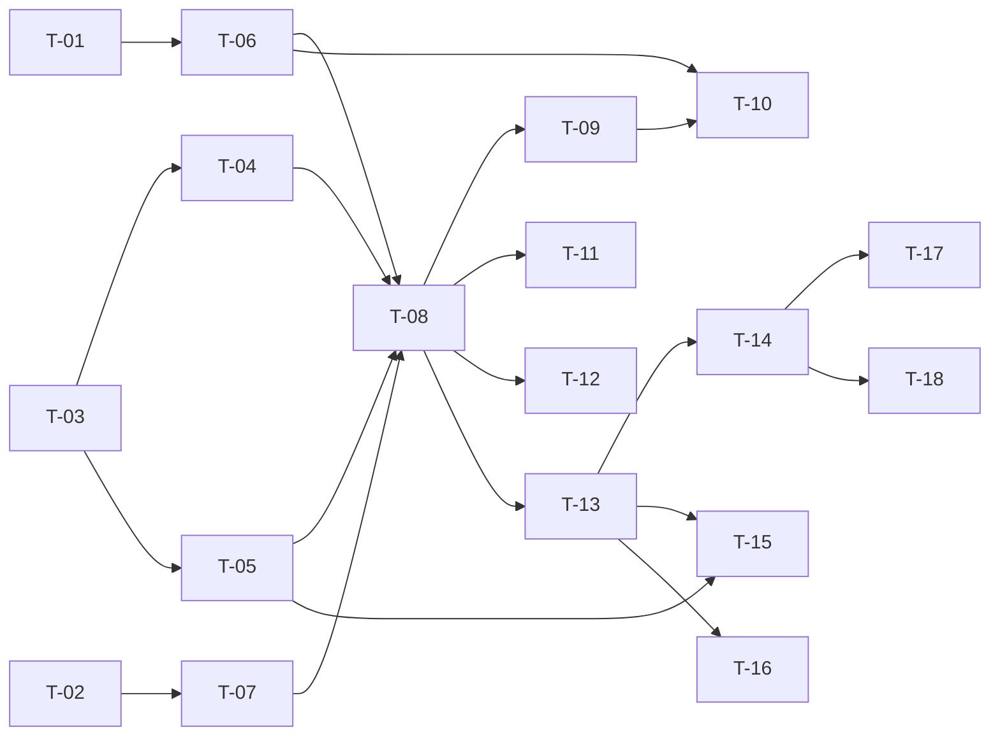

# TASKS — `RF-SP-028` Cambiar el estado de un usuario

| Campo | Valor |
|---|---|
| Requerimiento | `RF-SP-028` |
| Especificación | [`spec.md`](spec.md) |
| Plan | [`plan.md`](plan.md) |
| `plan.md` aprobado el | 22-08-2026 |
| Estado | **En revisión** |
| Issue | Pendiente de crear |
| Rama | `feature/cambiar-estado-usuario` |
| Aprobadas por | Pendiente |

!!! info "Qué va en este documento"

    **En qué pasos, en qué orden y cómo se verifica cada uno.**

    **Prueba de pertenencia:** si no puede marcarse como hecho, no es una tarea.

    **Es la fuente de verdad de las tareas.** El Issue de GitHub coordina y enlaza aquí; no la sustituye ni la duplica. Si las dos listas discrepan, manda este archivo.

    No se escribe hasta que `plan.md` esté aprobado, y ninguna tarea se ejecuta hasta que este documento lo esté (Art. I.6).

---

## 1. Tareas

Un índice y una columna que cambia de valor. Casi todo el trabajo está en lo que **rodea** a esa columna, y tres tareas concentran el riesgo entero del requerimiento:

- **`T-05`** serializa `RN-SP-001` bloqueando el **conjunto** de portadores activos del rol raíz. Implementarla bloqueando la fila del afectado deja abierto el caso que `spec.md` §13 describe, y el resultado es un sistema sin administración posible.
- **`T-09`** corta los tokens de acceso ya emitidos. Sin ella, «retirar el acceso» significa «dentro de quince minutos».
- **`T-04`** decide `FA-003` mirando `locked_until`. Implementarla como caso idempotente hace que un bloqueo manual **se levante solo**, que es exactamente lo que la especificación prohíbe.

Cuatro tareas crean piezas que **otros cuatro requerimientos heredan** (`T-03`, `T-06`, `T-07`, `T-08`). Escribirlas aquí es lo que impide que `RF-SP-029` y `RF-SP-031` reimplementen la misma consulta con otro criterio.

| # | Tarea | Depende de | Verificación | Estado |
|---|---|---|---|---|
| `T-01` | Comprobar que `RF-SP-034` está integrado: `refresh_tokens` con su motivo de revocación, y `failed_attempts`, `locked_until` y `last_login_at` en `users` | — | Prueba de integración: las columnas y la tabla existen. **Antes de empezar `T-06`** | Pendiente |
| `T-02` | `V24__create_user_supervisor_index.sql`: `ix_user_supervisors_supervisor_vigente` sobre `supervisor_id` **con `WHERE ended_at IS NULL`** | — | `mvn flyway:info` la lista aplicada. Prueba de integración: el índice es **parcial**, y el `EXPLAIN` del conteo de equipo lo usa | Pendiente |
| `T-03` | `domain`: `UserStatus`, `StatusChangeReason` —recorta y no admite construirse vacío—, `SelfOperationGuard` (`RN-SP-017`) y `RootAdministratorPresence` (`RN-SP-001`) | — | Pruebas unitarias **sin Spring ni base de datos**: la regla del último administrador decide solo con «porta el rol raíz» y «cuántos otros activos quedan» | Pendiente |
| `T-04` | `domain/User`: `deactivate(motivo)`, `block(motivo)` y `activate()`, que devuelven **qué cambió**. `FA-003` se decide mirando `locked_until`, no un campo aparte | `T-03` | Pruebas unitarias: bloquear a mano una cuenta bloqueada automáticamente **devuelve cambio** y deja `locked_until` nulo; repetir el bloqueo manual devuelve «sin cambio»; activar pone el contador a cero y **no toca la credencial** | Pendiente |
| `T-05` | `application/RootRoleHolderRepository` e implementación: bloquea con `FOR UPDATE` los portadores **activos** del rol raíz, **ordenados por identificador**, y solo cuando la operación retira el acceso a uno de ellos | `T-03` | Prueba de integración: la traza muestra `SELECT … FOR UPDATE` sobre el conjunto y ordenado; sobre alguien que no porta el rol raíz, la consulta **no se ejecuta** | Pendiente |
| `T-06` | `application/SessionRevoker`: puerto de revocación de todas las sesiones de una persona con motivo `ACCESO_RETIRADO`, implementado sobre `refresh_tokens` | `T-01` | Prueba de integración: tras la operación, **todas** las filas de esa persona quedan revocadas con ese motivo, y `RF-SP-035` las trata como `EX-004` y no como reutilización sospechosa | Pendiente |
| `T-07` | `application/SupervisedTeamCounter`: cuántas personas tiene a cargo alguien **hoy**, sobre asignaciones vigentes | `T-02` | Prueba de integración: las asignaciones **cerradas** no cuentan; el número coincide con el que `RF-SP-042` devolverá | Pendiente |
| `T-08` | `application`: `ChangeUserStatusCommand` y `ChangeUserStatusService` con `@Transactional` y el **orden de verificación** de `plan.md` §4, con los pasos 4 y 5 solo al retirar el acceso | `T-04` a `T-07` | Pruebas con dobles: reactivar **no** invoca ni la consulta de portadores ni la de equipo; el motivo se valida antes de saber si la persona existe | Pendiente |
| `T-09` | `shared/security/AccessRevocationRegistry` y el puerto `AccessRevocationPublisher`: corte por usuario publicado **tras el commit**, consultado por el filtro contra el `iat` del token, con caducidad igual a la vida del token y **siembra al arrancar** | `T-08` | Prueba de integración: un token emitido antes del cambio recibe `401` en la petición siguiente; y **tras reiniciar el proceso sigue recibiéndolo** | Pendiente |
| `T-10` | Revocación de sesiones **dentro** de la transacción de negocio, y publicación del corte **fuera y después del commit** | `T-06`, `T-09` | Prueba de integración: forzando el fallo de la revocación, el estado **tampoco** cambia; forzando el fallo del commit, ningún token queda cortado | Pendiente |
| `T-11` | Auditoría: `audit_change_log` con `status` y `locked_until` —**sin `failed_attempts` ni `updated_at`**— en la misma transacción; y **una sola** fila en `audit_security_log` con `USER_STATUS_CHANGED`, `severity = 'ALTA'`, `target_user_id` y el motivo en `detail`, enganchada al commit | `T-08` | Prueba de integración: bloquear a mano produce **un** evento de seguridad, no dos; `FA-003` deja un diff con **solo** `locked_until` | Pendiente |
| `T-12` | Auditoría del rechazo por `RN-SP-017`: `AUTHORIZATION_DENIED` con severidad **`ALTA`**, emitido por el caso de uso **sin esperar al commit**, y `audit_error_log` con `severity = 'MEDIA'` para los dos `409` | `T-08` | Prueba de integración: el `403` deja fila en `audit_security_log` y **ninguna** en `audit_error_log`; el `404` y los `400` no dejan ninguna en ninguno | Pendiente |
| `T-13` | `api`: `ChangeUserStatusRequest` con el motivo condicional en los dos sentidos y rechazo de propiedades desconocidas; `UserStatusResponse`; y `PATCH /api/v1/users/{id}/status` con el permiso `users:update` | `T-08` | Prueba de API: `PENDIENTE` devuelve `400`; un cuerpo con `lockedUntil` devuelve `400` por campo desconocido; el motivo al reactivar devuelve `400` con `VAL-006` | Pendiente |
| `T-14` | Pruebas de los criterios de aceptación de `spec.md` §12 | `T-13` | La suite cubre `CA-SP-230` a `CA-SP-240`, `CA-SP-350` a `CA-SP-354`, `CA-SP-410` y `CA-SP-411` | Pendiente |
| `T-15` | Prueba **concurrente** de dos desactivaciones simultáneas de **dos superadministradores distintos**, con transacciones reales | `T-05`, `T-13` | Una `200` y una `409` con `RN-SP-001`, y **queda al menos un portador activo**. Es la prueba que distingue bloquear el conjunto de bloquear la fila | Pendiente |
| `T-16` | Pruebas de los casos límite de `spec.md` §13 y de `plan.md` §11: `FA-003`, bloqueo que expira mientras se libera, bloqueo manual seguido de desactivación, reactivar con equipo a cargo, y sesión en varios dispositivos | `T-13` | El bloqueo manual **sigue vigente** pasado el tiempo que habría durado uno automático; reactivar nunca se rechaza por `RN-SP-022` ni por `RN-SP-001` | Pendiente |
| `T-17` | Documentación OpenAPI: el cuerpo con su motivo condicional, la respuesta `200` y los estados `400`, `401`, `403`, `404`, `409` y `500` | `T-14` | El contrato publicado coincide con el comportamiento real (Art. VIII.6), y documenta que un bloqueo manual **no caduca** | Pendiente |
| `T-18` | Enmendar `requirements/sp.md` §6.1 (precedencias), §10.8 (`ix_user_supervisors_supervisor_vigente` con su predicado) y §10.10 (reparto de columnas); `security.md` §9 con el mismo reparto; y actualizar la matriz de trazabilidad | `T-14` | §10.8 recoge el nombre definitivo del índice en lugar del que `RF-SP-024` anticipó | Pendiente |

**Estados:** `Pendiente` · `En curso` · `Hecha` · `Bloqueada`.

## 2. Orden de ejecución

`T-01`, `T-02` y `T-03` son independientes y pueden ir en paralelo. `T-05`, `T-06` y `T-07` crean los tres puertos que heredan `RF-SP-029` y `RF-SP-031`, y conviene cerrarlos antes que el caso de uso para que su forma no la decida la prisa.

## 3. Cobertura de los criterios de aceptación

| Criterio | Tarea que lo cubre |
|---|---|
| `CA-SP-230` | `T-04`, `T-13`, `T-14` |
| `CA-SP-231` | `T-08`, `T-14` |
| `CA-SP-232` | `T-06`, `T-10`, `T-14` |
| `CA-SP-233` | `T-09`, `T-14` |
| `CA-SP-350` | `T-04`, `T-16` |
| `CA-SP-351` | `T-04`, `T-13`, `T-14` |
| `CA-SP-234` | `T-04`, `T-14` |
| `CA-SP-235` | `T-04`, `T-14` |
| `CA-SP-236` | `T-08`, `T-14` |
| `CA-SP-352` | `T-03`, `T-13`, `T-14` |
| `CA-SP-353` | `T-13`, `T-14` |
| `CA-SP-354` | `T-11`, `T-14` |
| `CA-SP-410` | `T-07`, `T-08`, `T-14` |
| `CA-SP-411` | `T-07`, `T-16` |
| `CA-SP-237` | `T-03`, `T-12`, `T-14` |
| `CA-SP-238` | `T-05`, `T-14`, `T-15` |
| `CA-SP-239` | `T-04`, `T-11`, `T-14` |
| `CA-SP-240` | `T-11`, `T-14` |

`CA-SP-238` se prueba en **dos formas** y las dos hacen falta: la secuencial —un activo y dos inactivos que portan el rol— verifica que la regla se mide sobre usuarios **activos**; la concurrente (`T-15`) verifica que se **serializa**. Una implementación puede pasar la primera y fallar la segunda, y el fallo solo se manifiesta en producción.

`CA-SP-350` es el criterio que obliga a `T-04`: la única forma honesta de probarlo es **dejar pasar** el tiempo que habría durado un bloqueo automático y comprobar que la cuenta sigue bloqueada.

## 4. Bloqueos

| # | Bloqueo | Desde | Responsable | Estado |
|---|---|---|---|---|
| 1 | **`RF-SP-034` debe implementarse antes.** Crea `refresh_tokens` y las tres columnas de control de acceso, e implementa `SessionRevoker`. Sin él, `CA-SP-232`, `CA-SP-234` y `CA-SP-351` no son verificables (`plan.md` §2) | 22-08-2026 | Responsable técnico | Abierto |
| 2 | **Antes de desplegar una segunda instancia** hay que sustituir el registro de invalidación en memoria por un canal compartido detrás de `AccessRevocationPublisher`. Mientras tanto, el token de acceso puede seguir admitiéndose hasta quince minutos en las instancias que no atendieron la petición. Los refresh tokens **sí** quedan revocados en la base de datos (`plan.md` §10) | 22-08-2026 | Responsable del proyecto | Abierto |
| 3 | `T-02` declara `ix_user_supervisors_supervisor_vigente`, que `RF-SP-024` §2 anticipó con otro nombre y sin predicado. `requirements/sp.md` §10.8 se enmienda en `T-18`; sin esa enmienda, el esquema y el documento discrepan | 22-08-2026 | Responsable técnico | Abierto |
| 4 | **Obligación sobre `RF-SP-034`:** el bloqueo automático por intentos fallidos se aplica aunque la persona tenga equipo a cargo (`CA-SP-411`). `RN-SP-022` alcanza solo al cambio de estado **por decisión de un actor** | 22-08-2026 | Responsable técnico | Abierto |
| 5 | **Obligación sobre `RF-SP-029` y `RF-SP-031`:** heredan `RootRoleHolderRepository`, `SupervisedTeamCounter`, `SessionRevoker` y `SelfOperationGuard`. Ninguno debe escribir su propia consulta de portadores del rol raíz | 22-08-2026 | Responsable técnico | Abierto |
| 6 | `RF-SP-014` §2 atribuye `AUTHORIZATION_DENIED` a la capa de seguridad y a los casos de uso de `RF-SP-004` a `RF-SP-009`. Desde este plan lo emiten también `RF-SP-028`, `RF-SP-029`, `RF-SP-038` y `RF-SP-041`. Le falta una fila en su columna de emisores, y esa compuerta se tramita aparte | 22-08-2026 | Responsable técnico | Abierto |
| 7 | Quien tiene `users:update` puede desactivar cualquier cuenta **y** liberar bloqueos. Aceptado en `spec.md` §14, resolución 1: separarlo sería un permiso nuevo y un requerimiento nuevo | 22-08-2026 | Responsable del proyecto | Abierto |

## 5. Definición de terminado

El requerimiento no está terminado hasta cumplir **todas** las condiciones de la constitución §16:

- [ ] Todas las tareas en estado `Hecha`.
- [ ] Todos los criterios de aceptación con prueba automatizada en verde.
- [ ] `mvn verify` en verde en local.
- [ ] Toda escritura emite su evento de auditoría, en la transacción que corresponde.
- [ ] Los endpoints nuevos declaran su permiso.
- [ ] El contrato OpenAPI coincide con el comportamiento real.
- [ ] Documentación afectada actualizada en el mismo Pull Request.
- [ ] Matriz de trazabilidad actualizada.
- [ ] Pull Request aprobado por alguien distinto del autor e integrado.
