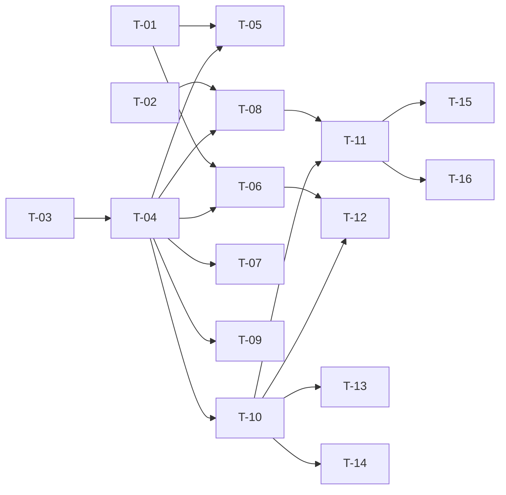

# TASKS — `RF-SP-029` Eliminar usuario

| Campo | Valor |
|---|---|
| Requerimiento | `RF-SP-029` |
| Especificación | [`spec.md`](spec.md) |
| Plan | [`plan.md`](plan.md) |
| `plan.md` aprobado el | 22-08-2026 |
| Estado | **Aprobadas** — 24-08-2026 |
| Issue | Pendiente de crear |
| Rama | `feature/ciclo-de-vida-de-usuario` |
| Aprobadas por | Responsable técnico, 24-08-2026 |

!!! info "Qué va en este documento"

    **En qué pasos, en qué orden y cómo se verifica cada uno.**

    **Prueba de pertenencia:** si no puede marcarse como hecho, no es una tarea.

    **Es la fuente de verdad de las tareas.** El Issue de GitHub coordina y enlaza aquí; no la sustituye ni la duplica. Si las dos listas discrepan, manda este archivo.

    No se escribe hasta que `plan.md` esté aprobado, y ninguna tarea se ejecuta hasta que este documento lo esté (Art. I.6).

---

## 1. Tareas

Sin migración propia. La lista es corta porque **cinco componentes se reutilizan de `RF-SP-028`** y ninguno se reescribe: `SelfOperationGuard`, `RootAdministratorPresence`, `RootRoleHolderRepository`, `SupervisedTeamCounter` y `SessionRevoker`. Que este requerimiento no los vuelva a escribir es parte de lo que hay que revisar, no un detalle de implementación.

Dos tareas concentran el riesgo:

- **`T-04`** captura el estado **antes** de destruir nada. Invertir esos dos pasos pierde la información para siempre y **no produce ningún error**: es el único defecto del requerimiento que no falla, solo deja un `snapshot` vacío que nadie mira hasta que hace falta.
- **`T-02`** añade `USER_DELETED` al `CHECK` de `V4`. Sin ella, la eliminación funciona y **falla su auditoría de seguridad** dentro de la transacción `REQUIRES_NEW`, con un síntoma que no apunta a la eliminación.

| # | Tarea | Depende de | Verificación | Estado |
|---|---|---|---|---|
| `T-01` | Comprobar que `RF-SP-028` y `RF-SP-034` están integrados: los cinco componentes reutilizados, `ix_user_supervisors_supervisor_vigente` y `refresh_tokens` | — | Prueba de integración: el índice es parcial y la tabla de sesiones existe. **Antes de empezar `T-05`** | **Hecha** |
| `T-02` | Añadir `USER_DELETED` a `ck_audit_security_log_event_type` en `V4__create_audit_logs.sql` (`RF-SP-001`), que pasa de dieciocho a **diecinueve** literales. **Antes del primer despliegue** | — | Prueba de integración: la restricción acepta `USER_DELETED` y rechaza variantes de capitalización. Después del despliegue esto sería una alteración sobre una tabla en uso | **Hecha** |
| `T-03` | `domain`: `DeletionReason` —recorta y exige contenido, **distinto de `StatusChangeReason`**— y `User.delete(motivo)`, que marca el borrado y **devuelve el estado previo** | — | Pruebas unitarias **sin Spring ni base de datos**: el motivo en blanco lanza; `delete` **no cambia `status`**; el estado devuelto contiene lo que había antes de marcar | **En curso** |
| `T-04` | `application/DeleteUserService` con `@Transactional`: el orden de `plan.md` §4, con la **captura del estado en el paso 6, antes de tocar nada** | `T-03` | Pruebas con dobles: el auditor de eliminación recibe roles y membresía **no vacíos** aunque las tablas ya estén borradas al final de la transacción | **Hecha** |
| `T-05` | `JpaUserRepository`: carga bloqueada con `FOR UPDATE`, captura del estado completo, `DELETE` de `user_roles` y `user_memberships`, y `UPDATE` de cierre de `user_supervisors` **con la misma marca de tiempo** que `deleted_at` | `T-01`, `T-04` | Prueba de integración: `ended_at` de la asignación de superior es **exactamente igual** a `deleted_at`, y su fila **permanece** | **Hecha** |
| `T-06` | Reutilizar `RootRoleHolderRepository` y `SupervisedTeamCounter` de `RF-SP-028`, con el mismo bloqueo del conjunto y el mismo orden ascendente | `T-01`, `T-04` | Revisión de código: **no existe una segunda consulta** de portadores del rol raíz en el repositorio. Prueba concurrente en `T-12` | **Hecha** |
| `T-07` | Revocación de sesiones **dentro** de la transacción con motivo `ACCESO_RETIRADO`, y publicación del corte de tokens de acceso **tras el commit** | `T-04` | Prueba de integración: forzando el fallo de la revocación, **no queda nada eliminado**; y el token de acceso emitido antes recibe `401` en la petición siguiente | **Hecha** — 26-08-2026, en `AccessRevocationIT` |
| `T-08` | Auditoría: `audit_deletion_log` con `deletion_type = 'LOGICAL'`, motivo y `snapshot` **sin `password_hash`**, en la misma transacción; y `USER_DELETED` en `audit_security_log` con `severity = 'ALTA'` y `target_user_id`, enganchado al commit | `T-02`, `T-04` | Prueba de integración: forzando el fallo del evento, **la eliminación tampoco ocurre**; el `snapshot` contiene roles y membresía y **no** el hash | **Hecha** |
| `T-09` | Auditoría de los rechazos: `AUTHORIZATION_DENIED` con severidad **`ALTA`** para `RN-SP-017`, emitido por el caso de uso sin esperar al commit; y `audit_error_log` con `severity = 'ALTA'` para los dos `409` | `T-04` | Prueba de integración: el `403` deja fila en `audit_security_log` y **ninguna** en `audit_error_log`; el `404` y los `400` no dejan ninguna. La severidad es **`ALTA`**, a diferencia de `RF-SP-028` | **En curso** |
| `T-10` | `api`: `DeleteUserRequest` con el motivo y rechazo de propiedades desconocidas, y `POST /api/v1/users/{id}/deletion` con el permiso `users:delete`, devolviendo `204` | `T-04` | Prueba de API: un actor con `users:update` pero **sin** `users:delete` recibe `403` | **Hecha** |
| `T-11` | Pruebas de los criterios de aceptación de `spec.md` §12 | `T-08`, `T-10` | La suite cubre `CA-SP-241` a `CA-SP-250`, `CA-SP-358` a `CA-SP-360`, `CA-SP-408` y `CA-SP-409` | **En curso** |
| `T-12` | Pruebas **concurrentes** con transacciones reales: eliminación contra inicio de sesión, y dos eliminaciones de superadministradores distintos | `T-06`, `T-10` | Nunca queda una sesión viva sobre una cuenta eliminada; y queda al menos un portador activo del rol raíz | **Pendiente** |
| `T-13` | Prueba de que **`RF-SP-009` no necesitó cambios**: un rol que solo portaba la persona eliminada pasa a poder eliminarse | `T-10` | `CA-SP-359` se verifica ejecutando `RF-SP-009` tal como está, **sin tocar su código** | **Pendiente** |
| `T-14` | Pruebas del resto de casos límite de `spec.md` §13 y de `plan.md` §11: motivo de un carácter, motivo en blanco, ya eliminado, identificador no canónico, `INSERT` directo sin motivo y ausencia de restauración | `T-10` | No existe ningún endpoint que devuelva `deleted_at` a nulo, ni directo ni por edición | **En curso** |
| `T-15` | Documentación OpenAPI: el cuerpo con el motivo, la respuesta `204` y los estados `400`, `401`, `403`, `404`, `409` y `500` | `T-11` | El contrato publicado coincide con el comportamiento real (Art. VIII.6), y documenta que la eliminación es **lógica, irreversible y sin liberación de identidad** | **Hecha** |
| `T-16` | Enmendar `security.md` §8.1 con «Baja de un usuario — Alta — `SUCCESS`»; corregir `RF-SP-014` §2 —diecinueve literales y `USER_STATUS_CHANGED` sin `RF-SP-029` como emisor—; enmendar `requirements/sp.md` §6.1 con las precedencias; y actualizar la matriz de trazabilidad | `T-11` | El catálogo cerrado y el `CHECK` del esquema dicen lo mismo, que es la única forma de que un catálogo cerrado signifique algo | **En curso** |

**Estados:** `Pendiente` · `En curso` · `Hecha` · `Bloqueada`.

## 2. Orden de ejecución

`T-02` es independiente y **urgente**: mientras `V4` no esté aplicada, corregirla cuesta una edición; después es una alteración de restricción sobre la tabla de auditoría en uso.

## 3. Cobertura de los criterios de aceptación

| Criterio | Tarea que lo cubre |
|---|---|
| `CA-SP-241` | `T-05`, `T-10`, `T-11` |
| `CA-SP-242` | `T-03`, `T-10`, `T-11` |
| `CA-SP-243` | `T-07`, `T-11` |
| `CA-SP-244` | `T-11` |
| `CA-SP-245` | `T-05`, `T-11` |
| `CA-SP-246` | `T-08`, `T-11` |
| `CA-SP-358` | `T-05`, `T-11` |
| `CA-SP-359` | `T-13` |
| `CA-SP-360` | `T-04`, `T-08`, `T-11` |
| `CA-SP-408` | `T-06`, `T-11` |
| `CA-SP-409` | `T-05`, `T-11` |
| `CA-SP-247` | `T-09`, `T-11` |
| `CA-SP-248` | `T-06`, `T-11`, `T-12` |
| `CA-SP-249` | `T-14` |
| `CA-SP-250` | `T-10`, `T-11` |

`CA-SP-360` es el criterio más importante de la lista y el más fácil de probar mal. Verificar que existe una fila en `audit_deletion_log` da verde con la implementación equivocada; hay que verificar **su contenido**: que el `snapshot` trae los roles y la membresía que la persona tenía. La forma honesta de comprobar que la prueba sirve es invertir los pasos en una implementación de control y ver que **falla**.

`CA-SP-244` es el otro criterio silencioso: comprueba que **no** ocurre algo. Su defecto —un índice único parcial escrito por costumbre— no se manifiesta hasta que alguien reutiliza la identidad de una persona eliminada, y para entonces la auditoría ya no puede separarlas.

## 4. Bloqueos

| # | Bloqueo | Desde | Responsable | Estado |
|---|---|---|---|---|
| 1 | **`RF-SP-028` y `RF-SP-034` deben implementarse antes.** El primero aporta cinco componentes y el índice; el segundo, `refresh_tokens` y `SessionRevoker` (`plan.md` §2) | 22-08-2026 | Responsable técnico | Abierto |
| 2 | `T-02` toca `V4__create_audit_logs.sql`, de `RF-SP-001`, y `T-16` corrige `RF-SP-014` §2, un plan aprobado (Art. I.7). **Ambas cosas van en este mismo Pull Request**: un catálogo cerrado que no coincide con el `CHECK` del esquema deja de ser un catálogo | 22-08-2026 | Responsable técnico | Abierto |
| 3 | **Obligación sobre `RF-SP-034`:** el inicio de sesión rechaza a quien tiene `deleted_at` informado **sin mirar `status`**, porque esta operación no lo cambia (`plan.md` §4) | 22-08-2026 | Responsable técnico | Abierto |
| 4 | Con más de una instancia, el token de acceso de la persona eliminada sigue admitiéndose hasta quince minutos en las demás. Heredado de `RF-SP-028` §10, con la misma acotación: los refresh tokens **sí** quedan revocados en la base de datos | 22-08-2026 | Responsable del proyecto | Abierto |
| 5 | **Nombre y correo del eliminado se conservan indefinidamente.** Riesgo declarado en `spec.md` §14, resolución 4, con su condición de disparo: el día que exista una obligación formal de supresión, la decisión alcanza a **todos** los módulos y se documenta en `docs/security/`, no en esta tripleta | 22-08-2026 | Responsable del proyecto | Abierto |
| 6 | La operación **no tiene vuelta**. `spec.md` §2 recomienda `RF-SP-028` para casi todos los casos, y no hay mitigación técnica posible: es una decisión de quien opera, acotada por un permiso propio | 22-08-2026 | Responsable del proyecto | Abierto |

## 4.bis Desviaciones respecto del plan e implementación real

| # | Desviación | Motivo | Consecuencia |
|---|---|---|---|
| 1 | `T-03` pedía un `DeletionReason` **distinto** de `StatusChangeReason`; se consume **`ChangeReason`**, el mismo tipo | La regla es idéntica en los tres sitios que lo usan —recorta, exige contenido, no admite construirse vacío—, y tres tipos con el mismo cuerpo divergen en el tercero | La distinción que el plan quería marcar no existe en el código. Si algún día el motivo de una baja necesita otra regla —una longitud mínima, un vocabulario cerrado—, hay que separarlos entonces |
| 2 | `T-07` revoca las sesiones dentro de la transacción, pero **no publica el corte** de tokens de acceso | El registro de corte es de `RF-SP-028` · `T-09` y queda pendiente allí | **El token de acceso ya emitido sigue valiendo hasta quince minutos** tras la eliminación. Los permisos se cortan de inmediato y el refresh token también; la ventana está acotada y existe |
| 3 | `T-12` y `T-13` quedan **Pendientes** | La primera exige transacciones reales simultáneas —eliminación contra inicio de sesión, y dos eliminaciones a la vez—; la segunda comprueba desde el otro lado que `RF-SP-009` no necesitó cambios | Que el bloqueo de fila serialice dos eliminaciones está construido y no verificado |
| 4 | `T-09`, `T-11`, `T-14` y `T-16` quedan **En curso** | El `403` de `RN-SP-017` lo audita el manejador global y no está fijado por prueba; faltan casos límite y la enmienda de `security.md` §8.1 | `USER_DELETED` ya estaba en el catálogo cerrado desde `V4`, de modo que `T-02` no requirió migración |

### Lo que sí quedó verificado

Lo que este requerimiento hace mal se hace **sin fallar**, y por eso las pruebas se escribieron contra eso:

- **La captura del estado va ANTES de tocar nada.** Después de borrar las asignaciones ya no hay qué capturar, y el registro quedaría sin decir qué roles y qué membresía tenía la persona — que es justo lo que el Art. V.13 existe para conservar. Nada avisaría. La prueba comprueba que el `snapshot` lleva sus dos roles, su superior y su estado.
- **El estado NO se toca.** Dejarlo en inactivo parecería natural y sería un error: el registro dejaría de decir en qué situación estaba la persona cuando se la eliminó.
- **El superior se CIERRA, no se borra**, y con la **misma marca de tiempo** que la eliminación: si difirieran, el historial diría que estuvo a cargo de alguien unos milisegundos después de haber dejado de existir.
- **El `404` no distingue** «nunca existió» de «ya estaba eliminada», y se comprueba comparando los dos cuerpos.
- **Tener roles no impide eliminar**, al revés que en la eliminación de un rol: aquí no hay nada aguas abajo, porque las asignaciones se retiran **con** la persona.
- **El motivo se exige el primero de todo**, incluso sobre alguien inexistente: comprobar la existencia antes daría `404` y el Art. V.13 pide rechazar «antes de ejecutarla».
- **El `snapshot` no lleva ningún campo derivado de la credencial** (Art. IV.8).

## 5. Definición de terminado

El requerimiento no está terminado hasta cumplir **todas** las condiciones de la constitución §16:

- [ ] Todas las tareas en estado `Hecha`. — faltan `T-12` y `T-13`, y seis en curso.
- [ ] Todos los criterios de aceptación con prueba automatizada en verde. — faltan las concurrentes con transacciones reales.
- [x] Toda escritura emite su evento de auditoría, en la transacción que corresponde. — eliminación lógica **con motivo** y con el estado completo capturado antes de borrar; `USER_DELETED` enganchado al commit.
- [x] `mvn verify` en verde en local. — 99 unitarias y 383 de integración, 24-08-2026.
- [x] Los endpoints nuevos declaran su permiso. — `users:delete`.
- [x] El contrato OpenAPI coincide con el comportamiento real. — `OpenApiContractIT` fija el subrecurso y la **ausencia** de `DELETE`.
- [ ] Documentación afectada actualizada en el mismo Pull Request. — falta la enmienda de `security.md` §8.1.
- [x] Matriz de trazabilidad actualizada.
- [ ] Pull Request aprobado por alguien distinto del autor e integrado.
