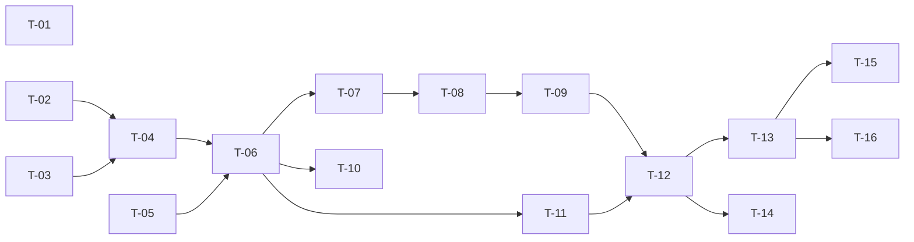

# TASKS — `RF-SP-030` Asignar roles a un usuario

| Campo | Valor |
|---|---|
| Requerimiento | `RF-SP-030` |
| Especificación | [`spec.md`](spec.md) |
| Plan | [`plan.md`](plan.md) |
| `plan.md` aprobado el | 22-08-2026 |
| Estado | **En revisión** |
| Issue | Pendiente de crear |
| Rama | `feature/asignar-roles-usuario` |
| Aprobadas por | Pendiente |

---

## 1. Tareas

La migración es lo más pequeño del requerimiento —un índice— y el peso está repartido entre dos componentes de dominio que **no existen todavía y que otros requerimientos van a consumir**: `RoleGrantPolicy` y `CommercialRank`. Los dos deben poder probarse sin Spring ni base de datos, porque los dos son reglas de negocio (Art. VI.3), y los dos son la causa probable de que este requerimiento salga mal si se escriben pegados al caso de uso.

| # | Tarea | Depende de | Verificación | Estado |
|---|---|---|---|---|
| `T-01` | Migración `V25__create_user_roles_role_index.sql`: `ix_user_roles_role_id` sobre `user_roles (role_id)` | — | `mvn flyway:info` la lista aplicada; un `EXPLAIN` del conteo de portadores de un rol usa el índice y no recorre la tabla | Pendiente |
| `T-02` | `domain/RoleGrantPolicy`: `RN-SEG-010` en un solo componente compartido, que recibe los permisos declarados por cada rol y los efectivos del actor y devuelve **qué roles exceden** | — | Pruebas unitarias sin Spring: el rechazo es completo y enumera los infractores; un actor con el catálogo entero no rechaza nada; la comparación es por **permisos** y no por posición en la jerarquía de roles | Pendiente |
| `T-03` | `domain/CommercialRank`: resuelve el rol vendedor de **mayor rango** de un conjunto y su rol padre inmediato; distingue ascenso, asignación lateral y cúspide | — | Pruebas unitarias sin Spring: sobre `AGENTE` + `DIRECTOR` devuelve `DIRECTOR`; añadir `AGENTE` a un `DIRECTOR` **no** cambia el rango; el rol cuyo padre no es `VENDEDOR` se declara cúspide | Pendiente |
| `T-04` | `domain/User.assignRoles(...)`: agrega los roles que faltan, devuelve **cuáles se agregaron realmente** y expone si la operación produce el primer rol `CONSUMIDOR` y si cambia el rango comercial | `T-02`, `T-03` | Pruebas unitarias: la operación es aditiva e idempotente; repetirla no agrega nada; los roles duplicados en la entrada se colapsan | Pendiente |
| `T-05` | `domain/UserRepository`: carga del usuario con sus roles, su membresía y su superior vigente en **una sola** lectura | — | Prueba de integración: una sola consulta, verificada con el contador de sentencias | Pendiente |
| `T-06` | `application/AssignUserRolesService` con `@Transactional` y el orden de verificación de `plan.md` §4, del usuario a `RN-SP-020` | `T-04`, `T-05` | Pruebas con dobles: cada excepción se lanza en el orden declarado; los pasos 6 a 8 nunca se evalúan antes de resolver los roles; el paso 5 va siempre antes que ellos | Pendiente |
| `T-07` | Persistencia en `user_roles` desde `JpaUserRepository` con **`INSERT … ON CONFLICT DO NOTHING`** en sentencia nativa (`plan.md` §2) | `T-06` | Prueba de integración concurrente: dos peticiones simultáneas con el mismo rol terminan ambas con `200`, dejan **una** fila y **ninguna** produce `500` | Pendiente |
| `T-08` | Escritura condicional de `user_memberships` y de `user_supervisors` **en la misma transacción** que los roles | `T-06`, `T-07` | Prueba de integración: si la escritura del superior falla, no queda ninguna fila en `user_roles`; el estado «vendedor sin superior» no se observa en ningún instante | Pendiente |
| `T-09` | Auditoría de éxito: hasta **tres** eventos en `audit_change_log` —roles, membresía, superior— bajo el **mismo** `correlation_id`, más `USER_ROLES_ASSIGNED` en `audit_security_log` con severidad Alta y `target_user_id`, tras el commit | `T-08` | Prueba de integración: la operación completa se recupera filtrando por `correlation_id`; ninguna fila cuando ningún rol era nuevo | Pendiente |
| `T-10` | Auditoría de los rechazos en el registro que corresponde (`plan.md` §6): `EX-001` en `audit_error_log` con severidad **Alta**; `EX-002`, `EX-003` y `EX-005` a `EX-008` con Media; `EX-004` (`404`) y los `400` de formato **no se auditan** | `T-06` | Prueba de integración: cada rechazo deja su fila con su `error_code`; el `404` y el `400` no dejan ninguna, y el intento de escalada se encuentra filtrando por severidad Alta | Pendiente |
| `T-11` | `api/AssignRolesRequest` con Bean Validation (`VAL-001`, `VAL-002`, `VAL-005`), colapso de duplicados y los tres campos condicionales **declarados pero no validados en el DTO** | `T-06` | Prueba de API: lista vacía y lista de 101 elementos devuelven `400`; un `membershipId` presente **nunca** produce `400` desde el validador, porque su admisibilidad depende del estado (`plan.md` §4) | Pendiente |
| `T-12` | `api/UserController`: añade `POST /api/v1/users/{id}/roles` con el permiso `users:assign-roles`, devolviendo `UserResponse` | `T-09`, `T-11` | Prueba de API: `200` con la lista actualizada; el `409` y los `422` de rol enumeran **cuáles** incumplen; el `403` de permiso y el `422` de negocio llevan `error_code` distinto | Pendiente |
| `T-13` | Pruebas de API e integración de los criterios de aceptación de `spec.md` §12 | `T-12` | La suite cubre `CA-SP-251` a `CA-SP-261`, `CA-SP-369`, `CA-SP-370` y `CA-SP-399` a `CA-SP-404` | Pendiente |
| `T-14` | Pruebas de los casos límite de `spec.md` §13: rechazo parcial, duplicados, usuario inactivo, actor sobre sí mismo y las dos concurrencias | `T-12` | La asignación concurrente del mismo rol y la concurrente con la eliminación del rol terminan sin `500` y sin dejar estado incoherente | Pendiente |
| `T-15` | Documentación OpenAPI del endpoint: cuerpo con los tres campos condicionales y su condición, respuesta `200` y los estados `400`, `401`, `403`, `404`, `409`, `422` y `500` | `T-13` | El contrato publicado coincide con el comportamiento real (Art. VIII.6), y la condición de cada campo condicional está escrita en su descripción | Pendiente |
| `T-16` | Aplicar la enmienda de `plan.md` §4 sobre `spec.md` §11 y actualizar la matriz de trazabilidad de `docs/requirements.md` | `T-13` | `spec.md` lleva su fila de enmienda con fecha; la fila de `RF-SP-030` en la matriz refleja el estado y enlaza esta tripleta | Pendiente |

**Estados:** `Pendiente` · `En curso` · `Hecha` · `Bloqueada`.

## 2. Orden de ejecución

`T-01`, `T-02`, `T-03` y `T-05` no dependen entre sí. `T-02` y `T-03` pueden escribirse y probarse por completo antes de que exista nada de infraestructura: son dominio puro, y son lo que otros requerimientos van a reutilizar.

## 3. Cobertura de los criterios de aceptación

| Criterio | Tarea que lo cubre |
|---|---|
| `CA-SP-251` | `T-04`, `T-07`, `T-13` |
| `CA-SP-252` | `T-04`, `T-13` |
| `CA-SP-253` | `T-02`, `T-12`, `T-13` |
| `CA-SP-254` | `T-06`, `T-13` |
| `CA-SP-255` | `T-06`, `T-13` |
| `CA-SP-256` | `T-04`, `T-07`, `T-13` |
| `CA-SP-257` | `T-09`, `T-13` |
| `CA-SP-258` | `T-13` |
| `CA-SP-259` | `T-08`, `T-09`, `T-13` |
| `CA-SP-369` | `T-06`, `T-13` |
| `CA-SP-370` | `T-06`, `T-13` |
| `CA-SP-399` | `T-03`, `T-06`, `T-13` |
| `CA-SP-403` | `T-03`, `T-06`, `T-13` |
| `CA-SP-404` | `T-03`, `T-13` |
| `CA-SP-400` | `T-06`, `T-13` |
| `CA-SP-401` | `T-08`, `T-09`, `T-13` |
| `CA-SP-402` | `T-03`, `T-06`, `T-13` |
| `CA-SP-260` | `T-09`, `T-13` |
| `CA-SP-261` | `T-12`, `T-13` |

`CA-SP-165` —serialización con la eliminación del rol— pertenece a `RF-SP-009` y se verifica desde el lado de aquel requerimiento; aquí lo cubre `T-14`, que ejecuta la mitad que corresponde a esta operación.

## 4. Bloqueos

| # | Bloqueo | Desde | Responsable | Estado |
|---|---|---|---|---|
| 1 | Ninguna tarea es ejecutable hasta que `RF-SP-024` cree `users` (`V18`), `user_roles` (`V19`), `user_memberships` (`V20`) y `user_supervisors` (`V21`). Este requerimiento no crea ninguna tabla: solo añade un índice sobre una que aún no existe | 22-08-2026 | Responsable técnico | Abierto |
| 2 | `T-02` y `T-03` producen componentes que `RF-SP-024` también necesita. Si aquel se implementa primero, los crea él y aquí se consumen; **no deben escribirse dos veces**, y quien llegue segundo debe verificar que reutiliza y no duplica (`plan.md` §8) | 22-08-2026 | Responsable técnico | Abierto |
| 3 | `T-13` no puede cubrir `CA-SP-258` —los permisos efectivos incluyen los del rol nuevo al renovar el token— hasta que `RF-SP-034` emita tokens. Hasta entonces la prueba verifica la resolución de permisos, no el ciclo completo del token | 22-08-2026 | Responsable técnico | Abierto |

## 5. Definición de terminado

El requerimiento no está terminado hasta cumplir **todas** las condiciones de la constitución §16:

- [ ] Todas las tareas en estado `Hecha`.
- [ ] Todos los criterios de aceptación con prueba automatizada en verde.
- [ ] `mvn verify` en verde en local.
- [ ] Toda escritura emite su evento de auditoría, en la transacción que corresponde.
- [ ] Los endpoints nuevos declaran su permiso.
- [ ] El contrato OpenAPI coincide con el comportamiento real.
- [ ] Documentación afectada actualizada en el mismo Pull Request.
- [ ] Matriz de trazabilidad actualizada.
- [ ] Pull Request aprobado por alguien distinto del autor e integrado.
