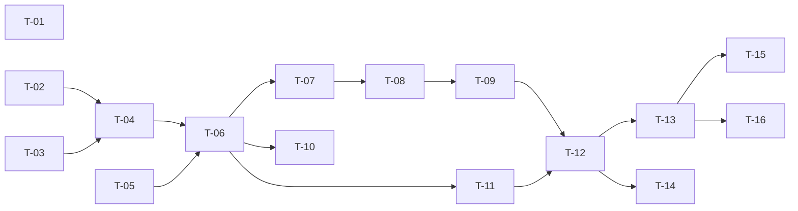

# TASKS — `RF-SP-030` Asignar roles a un usuario

| Campo | Valor |
|---|---|
| Requerimiento | `RF-SP-030` |
| Especificación | [`spec.md`](spec.md) |
| Plan | [`plan.md`](plan.md) |
| `plan.md` aprobado el | 22-08-2026 |
| Estado | **Aprobadas** — 24-08-2026 |
| Issue | Pendiente de crear |
| Rama | `feature/roles-de-usuario` |
| Aprobadas por | Responsable técnico, 24-08-2026 |

---

## 1. Tareas

La migración es lo más pequeño del requerimiento —un índice— y **este requerimiento no crea ningún componente de dominio**: `PrivilegeContainment` y `CommercialStructure` los extrajo `RF-SP-024` al aprobarse su plan el 22-08-2026 (`plan.md` §3). `T-02` y `T-03` no los escriben: verifican que se consumen y les añaden lo único que el alta no puede tener —la comparación de rango **antes y después**, que es lo que distingue un ascenso—. Escribirlos de nuevo aquí es el error que este bloque tiene que evitar, y no falla: concede.

| # | Tarea | Depende de | Verificación | Estado |
|---|---|---|---|---|
| `T-01` | Migración `V25__create_user_roles_role_index.sql`: `ix_user_roles_role_id` sobre `user_roles (role_id)` | — | `mvn flyway:info` la lista aplicada; un `EXPLAIN` del conteo de portadores de un rol usa el índice y no recorre la tabla | **Hecha** |
| `T-02` | Consumir `domain/security/PrivilegeContainment` de `RF-SP-024` para `RN-SEG-010`, **sin reimplantarlo** | — | Pruebas unitarias sin Spring: el rechazo es completo y enumera los infractores; la comparación es por **permisos** y no por posición en la jerarquía de roles. Una prueba de ArchUnit verifica que este módulo no declara una segunda comprobación de `RN-SEG-010` | **Hecha** |
| `T-03` | Ampliar `domain/CommercialStructure` de `RF-SP-024` con la **comparación de rango antes y después**: ascenso, asignación lateral y cúspide | — | Pruebas unitarias sin Spring: sobre `AGENTE` + `DIRECTOR` devuelve `DIRECTOR`; añadir `AGENTE` a un `DIRECTOR` **no** cambia el rango; el rol cuyo padre no es `VENDEDOR` se declara cúspide | **Hecha** |
| `T-04` | `domain/User.assignRoles(...)`: agrega los roles que faltan, devuelve **cuáles se agregaron realmente** y expone si la operación produce el primer rol `CONSUMIDOR` y si cambia el rango comercial | `T-02`, `T-03` | Pruebas unitarias: la operación es aditiva e idempotente; repetirla no agrega nada; los roles duplicados en la entrada se colapsan | **En curso** |
| `T-05` | `domain/UserRepository`: carga del usuario con sus roles, su membresía y su superior vigente en **una sola** lectura | — | Prueba de integración: una sola consulta, verificada con el contador de sentencias | **En curso** |
| `T-06` | `application/AssignUserRolesService` con `@Transactional` y el orden de verificación de `plan.md` §4, del usuario a `RN-SP-020` | `T-04`, `T-05` | Pruebas con dobles: cada excepción se lanza en el orden declarado; los pasos 6 a 8 nunca se evalúan antes de resolver los roles; el paso 5 va siempre antes que ellos | **En curso** |
| `T-07` | Persistencia en `user_roles` desde `JpaUserRepository` con **`INSERT … ON CONFLICT DO NOTHING`** en sentencia nativa (`plan.md` §2) | `T-06` | Prueba de integración concurrente: dos peticiones simultáneas con el mismo rol terminan ambas con `200`, dejan **una** fila y **ninguna** produce `500` | **Hecha** |
| `T-08` | Escritura condicional de `user_memberships` y de `user_supervisors` **en la misma transacción** que los roles | `T-06`, `T-07` | Prueba de integración: si la escritura del superior falla, no queda ninguna fila en `user_roles`; el estado «vendedor sin superior» no se observa en ningún instante | **Hecha** |
| `T-09` | Auditoría de éxito: hasta **tres** eventos en `audit_change_log` —roles, membresía, superior— bajo el **mismo** `correlation_id`, más `USER_ROLES_ASSIGNED` en `audit_security_log` con severidad Alta y `target_user_id`, tras el commit | `T-08` | Prueba de integración: la operación completa se recupera filtrando por `correlation_id`; ninguna fila cuando ningún rol era nuevo | **Hecha** |
| `T-10` | Auditoría de los rechazos en el registro que corresponde (`plan.md` §6): `EX-001` en `audit_error_log` con severidad **Alta**; `EX-002`, `EX-003` y `EX-005` a `EX-008` con Media; `EX-004` (`404`) y los `400` de formato **no se auditan** | `T-06` | Prueba de integración: cada rechazo deja su fila con su `error_code`; el `404` y el `400` no dejan ninguna, y el intento de escalada se encuentra filtrando por severidad Alta | **En curso** |
| `T-11` | `api/AssignRolesRequest` con Bean Validation (`VAL-001`, `VAL-002`, `VAL-005`), colapso de duplicados y los tres campos condicionales **declarados pero no validados en el DTO** | `T-06` | Prueba de API: lista vacía y lista de 101 elementos devuelven `400`; un `membershipId` presente **nunca** produce `400` desde el validador, porque su admisibilidad depende del estado (`plan.md` §4) | **Hecha** |
| `T-12` | `api/UserController`: añade `POST /api/v1/users/{id}/roles` con el permiso `users:assign-roles`, devolviendo `UserResponse` | `T-09`, `T-11` | Prueba de API: `200` con la lista actualizada; el `409` y los `422` de rol enumeran **cuáles** incumplen; el `403` de permiso y el `422` de negocio llevan `error_code` distinto | **Hecha** |
| `T-13` | Pruebas de API e integración de los criterios de aceptación de `spec.md` §12 | `T-12` | La suite cubre `CA-SP-251` a `CA-SP-261`, `CA-SP-369`, `CA-SP-370` y `CA-SP-399` a `CA-SP-404` | **En curso** |
| `T-14` | Pruebas de los casos límite de `spec.md` §13: rechazo parcial, duplicados, usuario inactivo, actor sobre sí mismo y las dos concurrencias | `T-12` | La asignación concurrente del mismo rol y la concurrente con la eliminación del rol terminan sin `500` y sin dejar estado incoherente | **En curso** |
| `T-15` | Documentación OpenAPI del endpoint: cuerpo con los tres campos condicionales y su condición, respuesta `200` y los estados `400`, `401`, `403`, `404`, `409`, `422` y `500` | `T-13` | El contrato publicado coincide con el comportamiento real (Art. VIII.6), y la condición de cada campo condicional está escrita en su descripción | **Hecha** |
| `T-16` | Aplicar la enmienda de `plan.md` §4 sobre `spec.md` §11 y actualizar la matriz de trazabilidad de `docs/requirements.md` | `T-13` | `spec.md` lleva su fila de enmienda con fecha; la fila de `RF-SP-030` en la matriz refleja el estado y enlaza esta tripleta | **Hecha** |

**Estados:** `Pendiente` · `En curso` · `Hecha` · `Bloqueada`.

## 2. Orden de ejecución

`T-01`, `T-02`, `T-03` y `T-05` no dependen entre sí. `T-02` y `T-03` pueden escribirse y probarse por completo antes de que exista nada de infraestructura: son dominio puro, y son lo que otros requerimientos van a reutilizar.

## 3. Cobertura de los criterios de aceptación

| Criterio | Tarea que lo cubre |
|---|---|
| `CA-SP-251` | `T-04`, `T-07`, `T-13` |
| `CA-SP-252` | `T-04`, `T-13` |
| `CA-SP-253` | `T-02`, `T-12`, `T-13` |
| `CA-SP-254` | `T-06`, `T-13` |
| `CA-SP-255` | `T-06`, `T-13` |
| `CA-SP-256` | `T-04`, `T-07`, `T-13` |
| `CA-SP-257` | `T-09`, `T-13` |
| `CA-SP-258` | `T-13` |
| `CA-SP-259` | `T-08`, `T-09`, `T-13` |
| `CA-SP-369` | `T-06`, `T-13` |
| `CA-SP-370` | `T-06`, `T-13` |
| `CA-SP-399` | `T-03`, `T-06`, `T-13` |
| `CA-SP-403` | `T-03`, `T-06`, `T-13` |
| `CA-SP-404` | `T-03`, `T-13` |
| `CA-SP-400` | `T-06`, `T-13` |
| `CA-SP-401` | `T-08`, `T-09`, `T-13` |
| `CA-SP-402` | `T-03`, `T-06`, `T-13` |
| `CA-SP-260` | `T-09`, `T-13` |
| `CA-SP-261` | `T-12`, `T-13` |

`CA-SP-165` —serialización con la eliminación del rol— pertenece a `RF-SP-009` y se verifica desde el lado de aquel requerimiento; aquí lo cubre `T-14`, que ejecuta la mitad que corresponde a esta operación.

## 4. Bloqueos

| # | Bloqueo | Desde | Responsable | Estado |
|---|---|---|---|---|
| 1 | Ninguna tarea es ejecutable hasta que `RF-SP-024` cree `users` (`V18`), `user_roles` (`V19`), `user_memberships` (`V20`) y `user_supervisors` (`V21`). Este requerimiento no crea ninguna tabla: solo añade un índice sobre una que aún no existe | 22-08-2026 | Responsable técnico | **Cerrado** — `V18` a `V21` existen desde el 24-08-2026 |
| 2 | `T-02` y `T-03` consumen `PrivilegeContainment` y `CommercialStructure`, que **crea `RF-SP-024`**. Ninguna de las dos es ejecutable hasta que aquel requerimiento esté implementado, y **ninguna de las dos los escribe** (`plan.md` §3) | 22-08-2026 | Responsable técnico | **Cerrado con desviación** — `RF-SP-024` NO los extrajo (`T-08`, `T-09` quedaron abiertas). Los creó este requerimiento y `RF-SP-024` pasa a consumirlos; ver §4.bis |
| 3 | `T-13` no puede cubrir `CA-SP-258` —los permisos efectivos incluyen los del rol nuevo al renovar el token— hasta que `RF-SP-034` emita tokens. Hasta entonces la prueba verifica la resolución de permisos, no el ciclo completo del token | 22-08-2026 | Responsable técnico | **Cerrado** — `RF-SP-034` emite tokens desde el 24-08-2026, y `AuthIT` verifica el ciclo completo: conceder un rol abre la puerta en la petición siguiente |

## 4.bis Desviaciones respecto del plan e implementación real

| # | Desviación | Motivo | Consecuencia |
|---|---|---|---|
| 1 | La migración es **`V28`** y no `V25` | `V26` y `V27` se aplicaron el 24-08-2026 con el bloque de sesión, y Flyway rechaza un número inferior al último aplicado salvo con `outOfOrder`, que no se habilita: permitir que el orden de aplicación difiera del de numeración convierte el historial en algo que ya no describe cómo llegó el esquema a su estado | **La reserva de números por requerimiento queda muerta.** `V8`–`V12` y `V23`–`V25` no volverán a usarse: quien implemente `RF-SP-002`, los cuatro listados de auditoría, `RF-SP-025` o `RF-SP-028` toma el siguiente número libre. La migración lleva el índice de `RF-SP-031` · `T-04` en el mismo archivo, por lo mismo |
| 2 | `T-02` y `T-03` decían **consumir** `PrivilegeContainment` y `CommercialStructure` «que extrajo `RF-SP-024`». **No existían**: las `T-08` y `T-09` de aquel requerimiento quedaron abiertas y la lógica seguía dentro de `RegisterUserService` | Es exactamente el riesgo que el propio plan declaraba, y llegó el momento en que la segunda copia se iba a escribir | Los tres componentes se **crean aquí** —`PrivilegeContainment`, `CommercialStructure` y `RoleAssignment`— y `RegisterUserService` pasa a consumirlos. Una regla de **ArchUnit** ancla la garantía: nadie fuera de `users/domain/security` lee los permisos que un rol declara, de modo que la segunda copia de `RN-SEG-010` deja de poder escribirse en silencio. Cierra `RF-SP-024` · `T-08` y `T-09` |
| 3 | Los nombres son los del `plan.md` de `RF-SP-030` —`PrivilegeContainment`, `CommercialStructure`, `RootAdministratorPresence`— y no los de `requirements/sp.md` v1.18.0, que los llama `RoleGrantPolicy`, `CommercialRank` y `RootRoleGuard` | Los dos documentos bautizan lo mismo dos veces. Se toman los del plan porque son los que la tripleta usa en su §3 y los que `RF-SP-024` ya referenciaba | Queda una discrepancia de nombres entre `requirements/sp.md` §... y el código. No se corrige el documento transversal aquí para no enmendarlo por un asunto de nomenclatura, pero queda declarado |
| 4 | `T-04` no produjo `User.assignRoles(...)`: el delta lo calcula `RoleAssignment`, puro y estático, y el agregado no se toca | {@code User.roleIds} es una `@ElementCollection` sobre `user_roles`: mutarla hace que Hibernate emita un `INSERT` corriente al confirmar, y ese `INSERT` es justo el que §2 sustituye por `ON CONFLICT DO NOTHING`. **Tocar el agregado deshace la garantía de concurrencia** que la tarea `T-07` construye | El comportamiento que `T-04` pedía —aditivo, idempotente, duplicados colapsados— está implementado y probado sin Spring; lo que no existe es el método en el agregado |
| 5 | `T-05` no carga la persona, sus roles, su membresía y su superior en **una sola** lectura | El caso de uso necesita el conjunto de roles **antes y después** para decidir el ascenso, y unirlo todo en una consulta habría producido una proyección que solo sirve aquí | Son cuatro o cinco consultas por operación en lugar de una. No hay prueba con contador de sentencias, y el número puede crecer sin que nada avise |
| 6 | `T-06`, `T-10`, `T-13` y `T-14` quedan **En curso** | El orden de verificación está implementado y comprobado de extremo a extremo, pero sin las pruebas con dobles que fijan el orden **paso a paso**; de la auditoría de rechazos solo se verifica que el `404` y el `400` no dejan fila | Alguien puede reordenar los pasos 4 y 5 sin que nada falle mientras el resultado final coincida. Y el requisito de `plan.md` §6 —severidad **Alta** para el intento de escalada, Media para el resto— no está fijado por prueba |
| 7 | `UserResponse` gana **`membership` y `supervisor`**, que `RF-SP-024` no había definido | Los planes de `RF-SP-030` y `RF-SP-031` describen la respuesta como «la persona con su lista de roles actualizada, **su membresía y su superior vigente**». Sin esos campos, la respuesta de un retiro no puede mostrar la cascada, que es su efecto más importante | Es una **ampliación del contrato de `RF-SP-024`**. Ambos son nulos y presentes, no ausentes: «no tiene» tiene que distinguirse de «este endpoint no lo informa» |
| 8 | `EX-002` y `EX-003` se separan, y para ello `AssignableRole` gana `deleted` y `active` donde antes tenía un solo `usable` | `RF-SP-030` §4 les asigna códigos distintos. `RF-SP-024` los funde a propósito —al dar de alta, distinguirlos revelaría qué roles existen— y **conserva ese comportamiento**: `usable()` sigue existiendo como derivada | Dos requerimientos responden distinto ante el mismo dato, y es deliberado: quien asigna roles a alguien que ya existe porta `users:assign-roles` y ya puede consultar el catálogo |
| 9 | Se añade un rechazo que el plan no enumera: indicar `membershipId` cuando la persona **ya tiene** membresía | Cambiar la membresía es `RF-SP-032`, con su propio permiso. Admitirlo aquí sería una edición encubierta que se salta esa autorización | Es un `422` `EX-006` más de los que la tabla de errores lista. Queda declarado por si `RF-SP-032` quiere reabrirlo |

### Lo que sí quedó verificado

- La operación es **aditiva**: una segunda asignación no borra la primera.
- Repetirla no cambia nada y **no deja auditoría** — sin el cálculo del delta, cada repetición registraría una concesión que ya existía.
- Dos asignaciones simultáneas del mismo rol terminan **ambas en `200`**, dejan una fila y ninguna produce `500`.
- El **ascenso** de agente a director exige declarar de nuevo el superior, cierra la asignación anterior sin borrarla y abre otra; la **asignación lateral** no exige nada.
- El superior debe portar el **rol padre inmediato**: un ancestro se rechaza.
- Roles, membresía y superior se escriben en **una sola transacción**: un superior inadmisible no deja ni un rol suelto.
- Una cuenta **inactiva sí se puede administrar**: exigir `ACTIVO` la volvería inadministrable.

### Defecto de concurrencia corregido el 26-08-2026

**`RN-SP-018` no se sostenía bajo carrera, y ninguna de las dos operaciones fallaba.** `RF-SP-033` —retirar la membresía— y `RF-SP-030` —asignar el rol de consumidor— leían la persona **sin bloqueo**, de modo que cada una validaba contra el estado que la otra estaba a punto de cambiar: las dos concluían que podían proceder y la persona acababa **portando un rol de consumidor sin nivel**. Es una escritura sesgada de manual, y en `READ COMMITTED` nada la impide.

**Lo que lo destapó fue `RF-SP-024` · `T-21`**, la prueba concurrente del par en los dos órdenes, y lo hizo de forma **intermitente**: falló en CI, pasó en la ejecución siguiente y volvió a fallar dos veces más. Esa intermitencia es la firma del defecto, no una prueba inestable.

**La corrección:** las **cuatro** operaciones que cambian roles o membresía de una persona —`RF-SP-030`, `RF-SP-031`, `RF-SP-032` y `RF-SP-033`— pasan a tomar el bloqueo pesimista sobre su fila (`findNotDeletedByIdForUpdate`), que las otras cinco operaciones sobre una persona ya tomaban. Dos cosas la hacen suficiente: las cuatro bloquean **la misma fila**, de modo que se serializan sin riesgo de abrazo mortal —a diferencia del caso que `RF-SP-028` descartó, donde el bloqueo caía sobre filas de terceros—, y el bloqueo se toma **antes** de leer roles y membresía, porque en `READ COMMITTED` cada sentencia posterior toma instantánea nueva y ve lo que la otra transacción confirmó.

La obligación queda escrita en el puerto, que es donde la encontrará quien añada la décima operación sobre una persona.

## 5. Definición de terminado

El requerimiento no está terminado hasta cumplir **todas** las condiciones de la constitución §16:

- [ ] Todas las tareas en estado `Hecha`. — seis en curso: `T-04`, `T-05`, `T-06`, `T-10`, `T-13` y `T-14`.
- [ ] Todos los criterios de aceptación con prueba automatizada en verde. — sin prueba el rechazo parcial y la concurrencia contra la eliminación del rol.
- [x] `mvn verify` en verde en local. — 85 unitarias y 275 de integración, 24-08-2026.
- [x] Toda escritura emite su evento de auditoría, en la transacción que corresponde. — hasta tres eventos de cambio bajo el mismo `correlation_id`, más `USER_ROLES_ASSIGNED` enganchado al commit.
- [x] Los endpoints nuevos declaran su permiso. — `users:assign-roles`.
- [x] El contrato OpenAPI coincide con el comportamiento real. — `OpenApiContractIT` fija la ruta y la **ausencia** de `PUT` y `DELETE`.
- [x] Documentación afectada actualizada en el mismo Pull Request. — la enmienda de `spec.md` §11 ya estaba aplicada (22-08-2026); `requirements.md` v0.38.0.
- [x] Matriz de trazabilidad actualizada.
- [ ] Pull Request aprobado por alguien distinto del autor e integrado.
