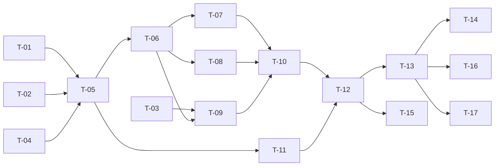

# TASKS — `RF-SP-031` Retirar roles de un usuario

| Campo | Valor |
|---|---|
| Requerimiento | `RF-SP-031` |
| Especificación | [`spec.md`](spec.md) |
| Plan | [`plan.md`](plan.md) |
| `plan.md` aprobado el | 22-08-2026 |
| Estado | **Aprobadas** — 24-08-2026 |
| Issue | Pendiente de crear |
| Rama | `feature/roles-de-usuario` |
| Aprobadas por | Responsable técnico, 24-08-2026 |

---

## 1. Tareas

Sin migración y **sin ningún componente de dominio propio**: los cinco que necesita los crean `RF-SP-024` y `RF-SP-028` (`plan.md` §3). El peso está en dos comportamientos que se implementan mal con facilidad y cuyo modo de fallo es **silencioso** en ambos casos: la comprobación de `RN-SP-001`, que si no serializa deja pasar dos retiros concurrentes sin error visible, y la revocación de sesiones, que si se saca de la transacción deja vivo el acceso que se acaba de retirar.

| # | Tarea | Depende de | Verificación | Estado |
|---|---|---|---|---|
| `T-01` | Consumir `RootAdministratorPresence` y `RootRoleHolderRepository` de `RF-SP-028` para `RN-SP-001`, **con el bloqueo sobre el conjunto de portadores activos** y no sobre la fila del usuario | — | Prueba de integración concurrente: dos retiros simultáneos sobre el último superadministrador terminan uno en `200` y otro en `409`. Sin el bloqueo la prueba falla dejando el sistema sin administración, que es lo que la hace valer | **Hecha** |
| `T-02` | `domain/User.revokeRoles(...)`: retira los presentes, devuelve **cuáles se retiraron realmente**, y si la persona queda sin rol `CONSUMIDOR` y sin rol `VENDEDOR` | — | Pruebas unitarias sin Spring: sustractiva e idempotente; los roles que no tenía se ignoran; los duplicados de la entrada se colapsan | **En curso** |
| `T-03` | Consumir `SessionRevoker`, el puerto de `RF-SP-028` que **implementa** `RF-SP-034` | — | Prueba con dobles: el puerto se invoca una vez por operación efectiva y **nunca** cuando ningún rol se retiró | **Hecha** |
| `T-04` | Cierre de la asignación de superior en `UserRepository`, y **consumo** de `SupervisedTeamCounter` de `RF-SP-028` para `EX-005` | — | Prueba de integración: el conteo usa `ix_user_supervisors_supervisor_vigente` (`V24`) y no recorre la tabla; el conteo **no se reimplanta** en este módulo | **En curso** |
| `T-05` | `application/RevokeUserRolesService` con `@Transactional` y el orden de verificación de `plan.md` §4 | `T-01`, `T-02`, `T-04` | Pruebas con dobles: cada excepción en el orden declarado; los pasos 4 y 5 nunca se evalúan antes de resolver qué roles se retiran de verdad; **no** se verifica que los roles existan en el catálogo | **En curso** |
| `T-06` | `DELETE` de las filas de `user_roles` desde `JpaUserRepository` | `T-05` | Prueba de integración: retirar un rol que la persona no tiene afecta cero filas y no produce error | **Hecha** |
| `T-07` | Cascada de `RN-SP-015`: `DELETE` de `user_memberships` cuando la persona queda sin ningún rol `CONSUMIDOR`, en la misma transacción | `T-06` | Prueba de integración: tras el retiro no queda ni rol de consumidor ni membresía; con otro rol consumidor vigente la membresía **permanece** | **Hecha** |
| `T-08` | Cascada de `RN-SP-019`: `UPDATE` de `ended_at` sobre `user_supervisors` cuando la persona queda sin ningún rol `VENDEDOR`. **Nunca `DELETE`** | `T-06` | Prueba de integración: la fila sigue existiendo con su `ended_at` poblado; conservando otro rol vendedor, la asignación **no** se cierra | **Hecha** |
| `T-09` | Revocación de los refresh tokens **dentro** de la transacción, antes del commit | `T-03`, `T-06` | Prueba de integración: si la revocación falla, el retiro se revierte entero y la persona conserva sus roles | **Hecha el 27-08-2026** — `RevokeUserRolesSessionFailureIT` |
| `T-10` | Auditoría de éxito: `audit_deletion_log` para los roles y para la membresía, `audit_change_log` para el cierre del superior, los tres bajo el **mismo** `correlation_id`, más `USER_ROLES_REVOKED` en `audit_security_log` tras el commit | `T-07`, `T-08`, `T-09` | Prueba de integración: la operación se recupera entera filtrando por `correlation_id`; ninguna fila cuando ningún rol estaba asignado; la de eliminación queda **sin motivo** | **Hecha** |
| `T-11` | Auditoría de los rechazos (`plan.md` §6): `EX-003` en `audit_error_log` con severidad **Alta**, `EX-001` y `EX-005` con Media, `EX-004` y los `400` sin auditar | `T-05` | Prueba de integración: cada rechazo deja su fila con su `error_code`; el `404` y el `400` no dejan ninguna | **En curso** |
| `T-12` | `api/RevokeRolesRequest` y `api/UserController`: `POST /api/v1/users/{id}/roles/revocations` con el permiso `users:assign-roles`, devolviendo `UserResponse` | `T-10`, `T-11` | Prueba de API: `200` con la lista actualizada; el `409` de `RN-SP-022` informa **cuántas** personas y **ninguna** identidad; el endpoint no admite motivo | **Hecha** |
| `T-13` | Pruebas de API e integración de los criterios de aceptación de `spec.md` §12 | `T-12` | La suite cubre `CA-SP-262` a `CA-SP-271`, `CA-SP-361` a `CA-SP-363`, `CA-SP-371` y `CA-SP-405` a `CA-SP-407` | **En curso** |
| `T-14` | Prueba de la **asimetría** con `RF-SP-030`: una sola prueba que asigna y retira, y verifica que solo el retiro revoca sesiones | `T-13` | `CA-SP-363` en verde. Repartida entre las dos tripletas, cada mitad pasaría sin comprobar la diferencia (`plan.md` §11) | **Hecha** |
| `T-15` | Pruebas de los casos límite de `spec.md` §13: retiro concurrente sobre el último superadministrador, rol inactivo, rol eliminado del catálogo, permiso concedido por dos roles y actor sobre sí mismo | `T-12` | Ninguno produce `500` ni deja estado incoherente | **En curso** |
| `T-16` | Documentación OpenAPI del endpoint: cuerpo, respuesta `200` y los estados `400`, `401`, `403`, `404`, `409` y `500` | `T-13` | El contrato publicado coincide con el comportamiento real (Art. VIII.6) | **Hecha** |
| `T-17` | Aplicar la enmienda de `plan.md` §4 sobre `requirements/sp.md` §9 —`DELETE` pasa a `POST …/revocations`— y actualizar la matriz de trazabilidad de `docs/requirements.md` | `T-13` | La tabla de API de §9 refleja la ruta real, con su fila de control de cambios; la fila de `RF-SP-031` en la matriz enlaza esta tripleta | **Hecha** |

**Estados:** `Pendiente` · `En curso` · `Hecha` · `Bloqueada`.

!!! note "Cómo se ejercita el fallo de la revocación — 27-08-2026"

    No hay entrada que haga fallar a `RefreshTokenSessionRevoker`, de modo que la rama solo se alcanza **sustituyendo el puerto por un doble que revienta**. La prueba tiene por eso su propio contexto.

    Lo que se afirma es el estado de la base **después** del fallo: la persona conserva sus dos roles. Si la revocación viviera fuera de la transacción, ahí habría uno — el retiro confirmado y las sesiones vivas, que es la peor combinación posible porque la respuesta diría `200` y el acceso seguiría abierto quince minutos.

    Va acompañada de su pareja —con la revocación en pie, el retiro sí se aplica—, sin la cual la primera pasaría igual con el endpoint roto por cualquier otro motivo.

## 2. Orden de ejecución

`T-01` a `T-04` no dependen entre sí. `T-01` y `T-02` son dominio puro y pueden probarse antes de que exista nada de infraestructura — salvo la prueba concurrente de `T-01`, que necesita base de datos por definición.

## 3. Cobertura de los criterios de aceptación

| Criterio | Tarea que lo cubre |
|---|---|
| `CA-SP-262` | `T-02`, `T-06`, `T-13` |
| `CA-SP-263` | `T-13` |
| `CA-SP-264` | `T-01`, `T-13` |
| `CA-SP-265` | `T-07`, `T-10`, `T-13` |
| `CA-SP-371` | `T-07`, `T-10`, `T-13` |
| `CA-SP-405` | `T-08`, `T-10`, `T-13` |
| `CA-SP-406` | `T-04`, `T-12`, `T-13` |
| `CA-SP-407` | `T-08`, `T-13` |
| `CA-SP-266` | `T-05`, `T-13` |
| `CA-SP-267` | `T-02`, `T-06`, `T-13` |
| `CA-SP-268` | `T-10`, `T-13` |
| `CA-SP-269` | `T-13` |
| `CA-SP-270` | `T-10`, `T-12`, `T-13` |
| `CA-SP-271` | `T-10`, `T-13` |
| `CA-SP-361` | `T-09`, `T-13` |
| `CA-SP-362` | `T-09`, `T-13` |
| `CA-SP-363` | `T-14` |

## 4. Bloqueos

| # | Bloqueo | Desde | Responsable | Estado |
|---|---|---|---|---|
| 1 | Ninguna tarea es ejecutable hasta que `RF-SP-024` cree `users`, `user_roles`, `user_memberships` y `user_supervisors` (`V18` a `V21`) | 22-08-2026 | Responsable técnico | **Cerrado** — `V18` a `V21` existen desde el 24-08-2026 
| 2 | `T-03` y `T-09` no pueden implementarse hasta que exista el almacén de refresh tokens, que crea `RF-SP-035`. **Es el bloqueo que decide el orden del bloque B**: sin él, `CA-SP-361` a `CA-SP-363` no son verificables y el requerimiento no puede darse por terminado | 22-08-2026 | Responsable técnico | **Cerrado** — `RF-SP-034` implementó `refresh_tokens` en `V27`, y `SessionRevoker` se declara en `shared/security` con su adaptador en el módulo de sesión 
| 3 | `T-04` depende de `ix_user_supervisors_supervisor_vigente`, que crea `RF-SP-028` en `V24`. Si aquel se implementa después, esta tripleta debe crear el índice en su lugar y `RF-SP-028` consumirlo | 22-08-2026 | Responsable técnico | **Cerrado con desviación** — el índice existe, pero en `V28` y no en `V24`: ver §4.bis 
| 4 | `T-01`, `T-03` y `T-04` **consumen** componentes de `RF-SP-028` —`RootAdministratorPresence`, `RootRoleHolderRepository`, `SessionRevoker` y `SupervisedTeamCounter`— y ninguna es ejecutable hasta que aquel requerimiento esté implementado. **Ninguna los escribe** (`plan.md` §3) | 22-08-2026 | Responsable técnico | **Cerrado con desviación** — `RF-SP-028` no está implementado y sus componentes no existían. `RootAdministratorPresence` y `RootRoleHolderRepository` se crean aquí; el conteo de equipo a cargo se resuelve en `UserRepository` y no como componente propio. Ver §4.bis 

## 4.bis Desviaciones respecto del plan e implementación real

| # | Desviación | Motivo | Consecuencia |
|---|---|---|---|
| 1 | Los componentes que `T-01`, `T-03` y `T-04` decían **consumir de `RF-SP-028`** no existían, porque aquel requerimiento no está implementado | Alguien tenía que crearlos, y este es el primero que los necesita | `RootAdministratorPresence` y su puerto `RootRoleHolderRepository` se crean aquí, junto con el puerto `SessionRevoker`. `RF-SP-028`, `RF-SP-029` y `RF-SP-037` los consumirán en lugar de escribirlos |
| 2 | `SupervisedTeamCounter` **no existe** como componente: el conteo es un método de `UserRepository` | Un componente con un método y un solo llamador no aporta nada que el puerto no diga ya. Cuando `RF-SP-028` lo necesite, se decidirá con dos usos a la vista | El conteo no se reimplanta —sigue habiendo uno solo—, pero no está anclado por ninguna regla, a diferencia de `RN-SEG-010` |
| 3 | `T-04` no verifica con `EXPLAIN` que el conteo use `ix_user_supervisors_supervisor_vigente` | El índice existe y es parcial sobre `ended_at IS NULL`, pero con las pocas filas de la suite el planificador elige un recorrido secuencial de todos modos | La afirmación «no recorre la tabla» **no está probada**. Es el mismo hueco que `RF-SP-021` · `T-11` |
| 4 | `T-02` no produjo `User.revokeRoles(...)`: el delta lo calcula `RoleAssignment` | Misma razón que en `RF-SP-030` · `T-04` — mutar la `@ElementCollection` del agregado deshace la escritura nativa | Sustractivo e idempotente están implementados y probados sin Spring; no hay método en el agregado |
| 5 | `T-05`, `T-11`, `T-13` y `T-15` quedan **En curso** | El orden de verificación está implementado y comprobado de extremo a extremo, pero sin las pruebas con dobles que lo fijan paso a paso, y de la auditoría de rechazos solo se comprueba que la operación sin efecto no deja fila | Los pasos 3 y 4 pueden reordenarse sin que nada falle mientras el resultado coincida. La severidad **Alta** de `EX-003` en `audit_error_log` no está fijada por prueba |
| 6 | `T-09` no prueba que **si la revocación de sesiones falla, el retiro se revierte** | El puerto está declarado `MANDATORY` —no puede confirmarse solo—, pero forzar su fallo exige un doble en un contexto de integración | La garantía está construida por transacción y por propagación, y no verificada. Es el hueco más serio de esta tripleta: sin ella, un fallo al revocar dejaría vivo el acceso que el retiro dice haber cortado |

### Lo que sí quedó verificado

Es la mitad que importa, porque el modo de fallo de todo lo de abajo es **silencioso**:

- **`RN-SP-001` bajo bloqueo real.** Dos retiros simultáneos sobre los dos últimos superadministradores terminan uno en `200` y otro en `409`, y queda uno. Con el bloqueo sobre la fila de `users` en lugar de sobre la asignación, las dos transacciones tocarían filas distintas, no se esperarían, ambas verían dos portadores y el sistema se quedaría sin administración **sin que nada fallara**.
- **Las dos cascadas, y su distinción.** Quedarse sin rol de consumidor **borra** la membresía; quedarse sin rol de vendedor **cierra** la asignación de superior y la fila sigue ahí con su `ended_at`. La auditoría lo refleja: eliminación para lo que desaparece, cambio para lo que se cierra.
- **`RN-SP-022` informa cuántas personas y ninguna identidad.** Quién forma el equipo se consulta con `RF-SP-042`, que tiene su propio permiso.
- **La asimetría de `CA-SP-363`**, en una sola prueba: asignar no revoca sesiones, retirar sí, y el motivo registrado es `ACCESO_RETIRADO` — no `ROTACION`, que es la única que `RF-SP-035` trata como robo.
- **Un rol eliminado del catálogo se puede retirar.** Comprobar aquí que el rol existe dejaría la asignación atrapada para siempre.
- **`RN-SEG-010` gobierna también el retiro**: quien no posee el permiso no puede quitar el rol que lo concede.

### Defecto de concurrencia corregido el 26-08-2026

**`RN-SP-018` no se sostenía bajo carrera, y ninguna de las dos operaciones fallaba.** `RF-SP-033` —retirar la membresía— y `RF-SP-030` —asignar el rol de consumidor— leían la persona **sin bloqueo**, de modo que cada una validaba contra el estado que la otra estaba a punto de cambiar: las dos concluían que podían proceder y la persona acababa **portando un rol de consumidor sin nivel**. Es una escritura sesgada de manual, y en `READ COMMITTED` nada la impide.

**Lo que lo destapó fue `RF-SP-024` · `T-21`**, la prueba concurrente del par en los dos órdenes, y lo hizo de forma **intermitente**: falló en CI, pasó en la ejecución siguiente y volvió a fallar dos veces más. Esa intermitencia es la firma del defecto, no una prueba inestable.

**La corrección:** las **cuatro** operaciones que cambian roles o membresía de una persona —`RF-SP-030`, `RF-SP-031`, `RF-SP-032` y `RF-SP-033`— pasan a tomar el bloqueo pesimista sobre su fila (`findNotDeletedByIdForUpdate`), que las otras cinco operaciones sobre una persona ya tomaban. Dos cosas la hacen suficiente: las cuatro bloquean **la misma fila**, de modo que se serializan sin riesgo de abrazo mortal —a diferencia del caso que `RF-SP-028` descartó, donde el bloqueo caía sobre filas de terceros—, y el bloqueo se toma **antes** de leer roles y membresía, porque en `READ COMMITTED` cada sentencia posterior toma instantánea nueva y ve lo que la otra transacción confirmó.

La obligación queda escrita en el puerto, que es donde la encontrará quien añada la décima operación sobre una persona.

## 5. Definición de terminado

El requerimiento no está terminado hasta cumplir **todas** las condiciones de la constitución §16:

- [ ] Todas las tareas en estado `Hecha`. — siete en curso: `T-02`, `T-04`, `T-05`, `T-09`, `T-11`, `T-13` y `T-15`.
- [ ] Todos los criterios de aceptación con prueba automatizada en verde. — sin prueba el permiso concedido por dos roles y el actor sobre sí mismo.
- [x] `mvn verify` en verde en local. — 85 unitarias y 275 de integración, 24-08-2026.
- [x] Toda escritura emite su evento de auditoría, en la transacción que corresponde. — eliminación para los roles y la membresía, cambio para el cierre del superior, y `USER_ROLES_REVOKED` enganchado al commit; todo bajo el mismo `correlation_id`.
- [x] Los endpoints nuevos declaran su permiso. — `users:assign-roles`, el mismo que la asignación: quien puede conceder puede retirar.
- [x] El contrato OpenAPI coincide con el comportamiento real. — `OpenApiContractIT` fija la ruta del subrecurso y la **ausencia** de `DELETE`.
- [x] Documentación afectada actualizada en el mismo Pull Request. — la enmienda de `requirements/sp.md` §9 ya estaba aplicada (v1.18.0); `requirements.md` v0.38.0.
- [x] Matriz de trazabilidad actualizada.
- [ ] Pull Request aprobado por alguien distinto del autor e integrado.
