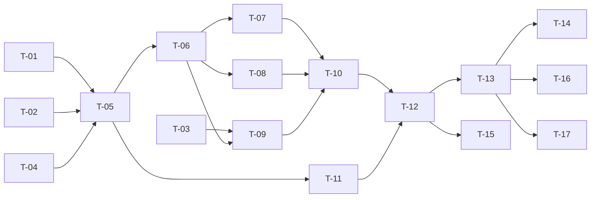

# TASKS — `RF-SP-031` Retirar roles de un usuario

| Campo | Valor |
|---|---|
| Requerimiento | `RF-SP-031` |
| Especificación | [`spec.md`](spec.md) |
| Plan | [`plan.md`](plan.md) |
| `plan.md` aprobado el | 22-08-2026 |
| Estado | **En revisión** |
| Issue | Pendiente de crear |
| Rama | `feature/retirar-roles-usuario` |
| Aprobadas por | Pendiente |

---

## 1. Tareas

Sin migración: este requerimiento no crea ni altera nada (`plan.md` §2). El peso está en dos piezas que se implementan mal con facilidad y cuyo modo de fallo es **silencioso** en ambos casos: `RootRoleGuard`, que si no serializa deja pasar dos retiros concurrentes sin error visible, y la revocación de sesiones, que si se saca de la transacción deja vivo el acceso que se acaba de retirar.

| # | Tarea | Depende de | Verificación | Estado |
|---|---|---|---|---|
| `T-01` | `domain/RootRoleGuard`: `RN-SP-001` en un componente compartido, que cuenta los portadores **activos** del rol raíz **bajo bloqueo** sobre ese conjunto, no sobre la fila del usuario | — | Prueba de integración concurrente: dos retiros simultáneos sobre el último superadministrador terminan uno en `200` y otro en `409`. Sin el bloqueo la prueba falla dejando el sistema sin administración, que es lo que la hace valer | Pendiente |
| `T-02` | `domain/User.revokeRoles(...)`: retira los presentes, devuelve **cuáles se retiraron realmente**, y si la persona queda sin rol `CONSUMIDOR` y sin rol `VENDEDOR` | — | Pruebas unitarias sin Spring: sustractiva e idempotente; los roles que no tenía se ignoran; los duplicados de la entrada se colapsan | Pendiente |
| `T-03` | `application/SessionRevoker`: puerto hacia `shared/security` para revocar los refresh tokens de una persona | — | Prueba con dobles: el puerto se invoca una vez por operación efectiva y **nunca** cuando ningún rol se retiró | Pendiente |
| `T-04` | `domain/UserRepository`: conteo de subordinados vigentes —`user_supervisors` con `ended_at` nulo— y cierre de la asignación de superior | — | Prueba de integración: el conteo usa `ix_user_supervisors_supervisor_vigente` (`V24`) y no recorre la tabla | Pendiente |
| `T-05` | `application/RevokeUserRolesService` con `@Transactional` y el orden de verificación de `plan.md` §4 | `T-01`, `T-02`, `T-04` | Pruebas con dobles: cada excepción en el orden declarado; los pasos 4 y 5 nunca se evalúan antes de resolver qué roles se retiran de verdad; **no** se verifica que los roles existan en el catálogo | Pendiente |
| `T-06` | `DELETE` de las filas de `user_roles` desde `JpaUserRepository` | `T-05` | Prueba de integración: retirar un rol que la persona no tiene afecta cero filas y no produce error | Pendiente |
| `T-07` | Cascada de `RN-SP-015`: `DELETE` de `user_memberships` cuando la persona queda sin ningún rol `CONSUMIDOR`, en la misma transacción | `T-06` | Prueba de integración: tras el retiro no queda ni rol de consumidor ni membresía; con otro rol consumidor vigente la membresía **permanece** | Pendiente |
| `T-08` | Cascada de `RN-SP-019`: `UPDATE` de `ended_at` sobre `user_supervisors` cuando la persona queda sin ningún rol `VENDEDOR`. **Nunca `DELETE`** | `T-06` | Prueba de integración: la fila sigue existiendo con su `ended_at` poblado; conservando otro rol vendedor, la asignación **no** se cierra | Pendiente |
| `T-09` | Revocación de los refresh tokens **dentro** de la transacción, antes del commit | `T-03`, `T-06` | Prueba de integración: si la revocación falla, el retiro se revierte entero y la persona conserva sus roles | Pendiente |
| `T-10` | Auditoría de éxito: `audit_deletion_log` para los roles y para la membresía, `audit_change_log` para el cierre del superior, los tres bajo el **mismo** `correlation_id`, más `USER_ROLES_REVOKED` en `audit_security_log` tras el commit | `T-07`, `T-08`, `T-09` | Prueba de integración: la operación se recupera entera filtrando por `correlation_id`; ninguna fila cuando ningún rol estaba asignado; la de eliminación queda **sin motivo** | Pendiente |
| `T-11` | Auditoría de los rechazos (`plan.md` §6): `EX-003` en `audit_error_log` con severidad **Alta**, `EX-001` y `EX-005` con Media, `EX-004` y los `400` sin auditar | `T-05` | Prueba de integración: cada rechazo deja su fila con su `error_code`; el `404` y el `400` no dejan ninguna | Pendiente |
| `T-12` | `api/RevokeRolesRequest` y `api/UserController`: `POST /api/v1/users/{id}/roles/revocations` con el permiso `users:assign-roles`, devolviendo `UserResponse` | `T-10`, `T-11` | Prueba de API: `200` con la lista actualizada; el `409` de `RN-SP-022` informa **cuántas** personas y **ninguna** identidad; el endpoint no admite motivo | Pendiente |
| `T-13` | Pruebas de API e integración de los criterios de aceptación de `spec.md` §12 | `T-12` | La suite cubre `CA-SP-262` a `CA-SP-271`, `CA-SP-361` a `CA-SP-363`, `CA-SP-371` y `CA-SP-405` a `CA-SP-407` | Pendiente |
| `T-14` | Prueba de la **asimetría** con `RF-SP-030`: una sola prueba que asigna y retira, y verifica que solo el retiro revoca sesiones | `T-13` | `CA-SP-363` en verde. Repartida entre las dos tripletas, cada mitad pasaría sin comprobar la diferencia (`plan.md` §11) | Pendiente |
| `T-15` | Pruebas de los casos límite de `spec.md` §13: retiro concurrente sobre el último superadministrador, rol inactivo, rol eliminado del catálogo, permiso concedido por dos roles y actor sobre sí mismo | `T-12` | Ninguno produce `500` ni deja estado incoherente | Pendiente |
| `T-16` | Documentación OpenAPI del endpoint: cuerpo, respuesta `200` y los estados `400`, `401`, `403`, `404`, `409` y `500` | `T-13` | El contrato publicado coincide con el comportamiento real (Art. VIII.6) | Pendiente |
| `T-17` | Aplicar la enmienda de `plan.md` §4 sobre `requirements/sp.md` §9 —`DELETE` pasa a `POST …/revocations`— y actualizar la matriz de trazabilidad de `docs/requirements.md` | `T-13` | La tabla de API de §9 refleja la ruta real, con su fila de control de cambios; la fila de `RF-SP-031` en la matriz enlaza esta tripleta | Pendiente |

**Estados:** `Pendiente` · `En curso` · `Hecha` · `Bloqueada`.

## 2. Orden de ejecución

`T-01` a `T-04` no dependen entre sí. `T-01` y `T-02` son dominio puro y pueden probarse antes de que exista nada de infraestructura — salvo la prueba concurrente de `T-01`, que necesita base de datos por definición.

## 3. Cobertura de los criterios de aceptación

| Criterio | Tarea que lo cubre |
|---|---|
| `CA-SP-262` | `T-02`, `T-06`, `T-13` |
| `CA-SP-263` | `T-13` |
| `CA-SP-264` | `T-01`, `T-13` |
| `CA-SP-265` | `T-07`, `T-10`, `T-13` |
| `CA-SP-371` | `T-07`, `T-10`, `T-13` |
| `CA-SP-405` | `T-08`, `T-10`, `T-13` |
| `CA-SP-406` | `T-04`, `T-12`, `T-13` |
| `CA-SP-407` | `T-08`, `T-13` |
| `CA-SP-266` | `T-05`, `T-13` |
| `CA-SP-267` | `T-02`, `T-06`, `T-13` |
| `CA-SP-268` | `T-10`, `T-13` |
| `CA-SP-269` | `T-13` |
| `CA-SP-270` | `T-10`, `T-12`, `T-13` |
| `CA-SP-271` | `T-10`, `T-13` |
| `CA-SP-361` | `T-09`, `T-13` |
| `CA-SP-362` | `T-09`, `T-13` |
| `CA-SP-363` | `T-14` |

## 4. Bloqueos

| # | Bloqueo | Desde | Responsable | Estado |
|---|---|---|---|---|
| 1 | Ninguna tarea es ejecutable hasta que `RF-SP-024` cree `users`, `user_roles`, `user_memberships` y `user_supervisors` (`V18` a `V21`) | 22-08-2026 | Responsable técnico | Abierto |
| 2 | `T-03` y `T-09` no pueden implementarse hasta que exista el almacén de refresh tokens, que crea `RF-SP-035`. **Es el bloqueo que decide el orden del bloque B**: sin él, `CA-SP-361` a `CA-SP-363` no son verificables y el requerimiento no puede darse por terminado | 22-08-2026 | Responsable técnico | Abierto |
| 3 | `T-04` depende de `ix_user_supervisors_supervisor_vigente`, que crea `RF-SP-028` en `V24`. Si aquel se implementa después, esta tripleta debe crear el índice en su lugar y `RF-SP-028` consumirlo | 22-08-2026 | Responsable técnico | Abierto |
| 4 | `T-01` produce `RootRoleGuard`, que `RF-SP-028` y `RF-SP-029` también necesitan. Quien llegue segundo **reutiliza y no duplica** (`plan.md` §3) | 22-08-2026 | Responsable técnico | Abierto |

## 5. Definición de terminado

El requerimiento no está terminado hasta cumplir **todas** las condiciones de la constitución §16:

- [ ] Todas las tareas en estado `Hecha`.
- [ ] Todos los criterios de aceptación con prueba automatizada en verde.
- [ ] `mvn verify` en verde en local.
- [ ] Toda escritura emite su evento de auditoría, en la transacción que corresponde.
- [ ] Los endpoints nuevos declaran su permiso.
- [ ] El contrato OpenAPI coincide con el comportamiento real.
- [ ] Documentación afectada actualizada en el mismo Pull Request.
- [ ] Matriz de trazabilidad actualizada.
- [ ] Pull Request aprobado por alguien distinto del autor e integrado.
