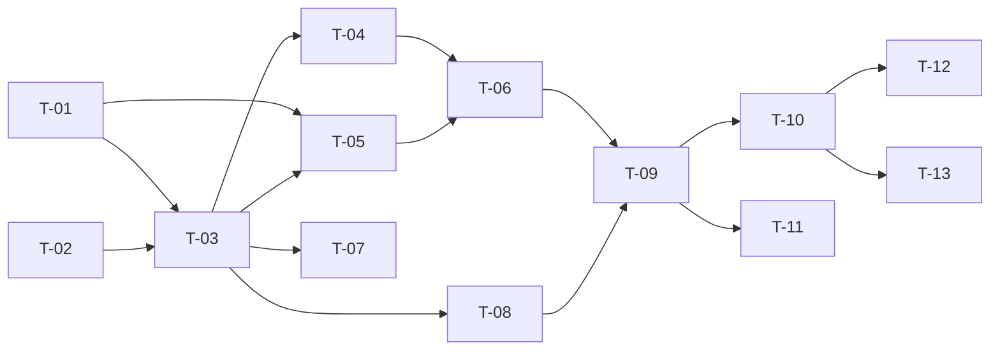

# TASKS — `RF-SP-032` Asignar membresía a un usuario

| Campo | Valor |
|---|---|
| Requerimiento | `RF-SP-032` |
| Especificación | [`spec.md`](spec.md) |
| Plan | [`plan.md`](plan.md) |
| `plan.md` aprobado el | 22-08-2026 |
| Estado | **En revisión** |
| Issue | Pendiente de crear |
| Rama | `feature/asignar-membresia-usuario` |
| Aprobadas por | Pendiente |

---

## 1. Tareas

Sin migración: `user_memberships` la crea `V20__create_user_memberships.sql` (`RF-SP-024`) con todo lo que hace falta (`plan.md` §2). El requerimiento es corto y casi todo él es orquestación, salvo una pieza que no lo es y que otros dos requerimientos van a reutilizar: **la definición de «vigente»**. Se escribe primero y se prueba sola.

| # | Tarea | Depende de | Verificación | Estado |
|---|---|---|---|---|
| `T-01` | `domain/UserMembership`: agregado de la asignación con `isCurrentAt(OffsetDateTime)`, **única definición de «vigente» del sistema** | — | Pruebas unitarias sin Spring sobre los tres bordes: sin fecha es siempre vigente; fecha futura es vigente; fecha **exactamente igual** al instante consultado ya no lo es | Pendiente |
| `T-02` | `domain/User.hasConsumerRole()`: `RN-SP-013` sobre los roles ya cargados | — | Prueba unitaria: basta un rol de clasificación `CONSUMIDOR` entre varios de otras clasificaciones | Pendiente |
| `T-03` | `application/AssignUserMembershipService` con `@Transactional` y el orden de verificación de `plan.md` §4 | `T-01`, `T-02` | Pruebas con dobles: la membresía se comprueba **antes** que el rol de consumidor; cada excepción en el orden declarado | Pendiente |
| `T-04` | Escritura en `user_memberships` desde `JpaUserRepository` con **`INSERT … ON CONFLICT (user_id) DO UPDATE`** en sentencia nativa (`plan.md` §2) | `T-03` | Prueba de integración concurrente: dos asignaciones simultáneas terminan sin `500`, dejan **una** fila y el resultado es una de las dos, nunca una mezcla | Pendiente |
| `T-05` | Detección de «sin cambio» (`FA-002`) frente a renovación (`FA-003`): misma membresía y misma vigencia no escribe ni audita; misma membresía con fecha distinta sí | `T-01`, `T-03` | Prueba de integración: repetir la petición idéntica no deja fila de auditoría; cambiar solo `endsAt` deja una | Pendiente |
| `T-06` | Auditoría de éxito: un evento en `audit_change_log` con `before` y `after` del nivel **y** de la fecha, con `before` nulo en `FA-001`. **Ningún evento de seguridad** | `T-04`, `T-05` | Prueba de integración: el evento conserva ambos niveles; `audit_security_log` queda **vacío** tras la operación | Pendiente |
| `T-07` | Auditoría de los rechazos (`plan.md` §6): `EX-001` y `EX-002` en `audit_error_log` con severidad Media; `EX-003` (`404`) y `EX-004` (`400`) sin auditar | `T-03` | Prueba de integración: los dos primeros dejan su fila con su `error_code`; los dos últimos no dejan ninguna | Pendiente |
| `T-08` | `api/AssignMembershipRequest` con Bean Validation (`VAL-001`, `VAL-002`) y la comprobación de `VAL-005` —fecha posterior al momento de la asignación— contra un `Clock` inyectado | `T-03` | Prueba de API: fecha pasada e igual al instante devuelven `400`; el `Clock` fijado hace la prueba determinista | Pendiente |
| `T-09` | `api/UserMembershipResponse` y `api/UserController`: `PUT /api/v1/users/{id}/membership` con el permiso `users:assign-membership` | `T-06`, `T-08` | Prueba de API: `200` con la membresía, su nivel y su fecha; el `409` indica que primero corresponde `RF-SP-030` | Pendiente |
| `T-10` | Pruebas de API e integración de los criterios de aceptación de `spec.md` §12 | `T-09` | La suite cubre `CA-SP-272` a `CA-SP-280` y `CA-SP-364` a `CA-SP-368` | Pendiente |
| `T-11` | Pruebas de los casos límite de `spec.md` §13: renovar una vencida, convertir indefinida en fechada y al revés, bajar de nivel, cadena vacía, persona inactiva y la asignación concurrente | `T-09` | Ninguno produce `500` ni deja dos filas | Pendiente |
| `T-12` | Documentación OpenAPI del endpoint: cuerpo con `endsAt` opcional y su significado, respuesta `200` y los estados `400`, `401`, `403`, `404`, `409`, `422` y `500` | `T-10` | El contrato publicado coincide con el comportamiento real (Art. VIII.6), y la descripción de `endsAt` dice que ausente significa indefinida | Pendiente |
| `T-13` | Actualizar la matriz de trazabilidad de `docs/requirements.md` | `T-10` | La fila de `RF-SP-032` refleja el estado y enlaza esta tripleta | Pendiente |

**Estados:** `Pendiente` · `En curso` · `Hecha` · `Bloqueada`.

## 2. Orden de ejecución

`T-01` y `T-02` son dominio puro y no dependen de nada. `T-01` es la que conviene escribir primero de todo el bloque A: `RF-SP-026` y `RF-SP-031` la consumen.

## 3. Cobertura de los criterios de aceptación

| Criterio | Tarea que lo cubre |
|---|---|
| `CA-SP-272` | `T-04`, `T-10` |
| `CA-SP-273` | `T-02`, `T-09`, `T-10` |
| `CA-SP-274` | `T-04`, `T-10` |
| `CA-SP-275` | `T-06`, `T-10` |
| `CA-SP-276` | `T-05`, `T-10` |
| `CA-SP-277` | `T-03`, `T-10` |
| `CA-SP-278` | `T-02`, `T-10` |
| `CA-SP-279` | `T-10` |
| `CA-SP-364` | `T-01`, `T-10` |
| `CA-SP-365` | `T-01`, `T-10` |
| `CA-SP-366` | `T-01`, `T-10` |
| `CA-SP-367` | `T-05`, `T-10` |
| `CA-SP-368` | `T-08`, `T-10` |
| `CA-SP-280` | `T-09`, `T-10` |

## 4. Bloqueos

| # | Bloqueo | Desde | Responsable | Estado |
|---|---|---|---|---|
| 1 | Ninguna tarea es ejecutable hasta que `RF-SP-024` cree `users` (`V18`), `user_roles` (`V19`) y `user_memberships` (`V20`) | 22-08-2026 | Responsable técnico | Abierto |
| 2 | `T-03` consume `MembershipCatalog`, el puerto de `RF-SP-016`. Sin la cadena de membresías sembrada, toda asignación se rechaza por `EX-002` — que es correcto, pero deja `T-10` sin poder cubrir el camino feliz | 22-08-2026 | Responsable técnico | Abierto |
| 3 | `T-01` produce la definición de vigencia que `RF-SP-026` y `RF-SP-031` reutilizan. Quien llegue segundo **no la reimplementa** como `WHERE` en su consulta (`plan.md` §10) | 22-08-2026 | Responsable técnico | Abierto |

## 5. Definición de terminado

El requerimiento no está terminado hasta cumplir **todas** las condiciones de la constitución §16:

- [ ] Todas las tareas en estado `Hecha`.
- [ ] Todos los criterios de aceptación con prueba automatizada en verde.
- [ ] `mvn verify` en verde en local.
- [ ] Toda escritura emite su evento de auditoría, en la transacción que corresponde.
- [ ] Los endpoints nuevos declaran su permiso.
- [ ] El contrato OpenAPI coincide con el comportamiento real.
- [ ] Documentación afectada actualizada en el mismo Pull Request.
- [ ] Matriz de trazabilidad actualizada.
- [ ] Pull Request aprobado por alguien distinto del autor e integrado.
