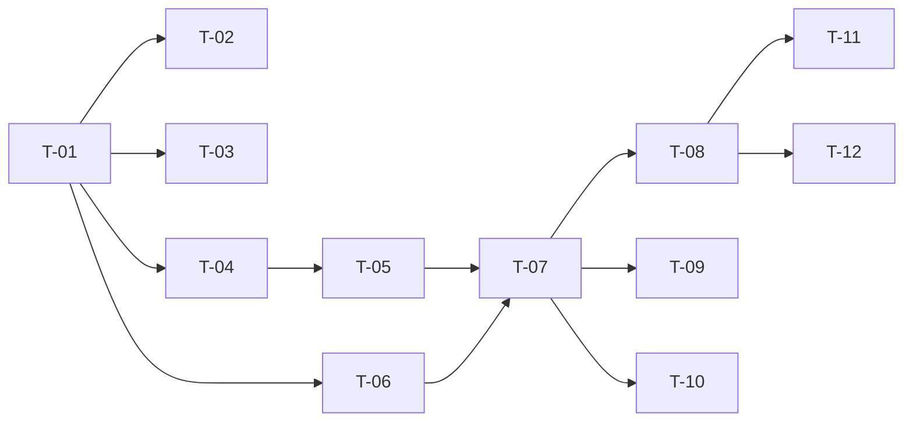

# TASKS — `RF-SP-033` Retirar la membresía de un usuario

| Campo | Valor |
|---|---|
| Requerimiento | `RF-SP-033` |
| Especificación | [`spec.md`](spec.md) |
| Plan | [`plan.md`](plan.md) |
| `plan.md` aprobado el | 22-08-2026 |
| Estado | **Aprobadas** — 24-08-2026 |
| Issue | Pendiente de crear |
| Rama | `feature/membresia-de-usuario` |
| Aprobadas por | Responsable técnico, 24-08-2026 |

---

## 1. Tareas

Sin migración y **sin ningún componente de dominio propio**: todo lo que este requerimiento necesita lo aportan `RF-SP-031` y `RF-SP-032` (`plan.md` §3). Es la lista de tareas más corta del módulo, y eso es correcto — si creciera, sería que la operación está haciendo algo más que corregir un estado.

La primera tarea es la que importa. `EX-001` rechaza a quien **sí** es consumidor, que es lo contrario de lo que sugiere el nombre del requerimiento, y es el defecto más probable de todo él.

| # | Tarea | Depende de | Verificación | Estado |
|---|---|---|---|---|
| `T-01` | `application/RevokeUserMembershipService` con `@Transactional` y el orden de verificación de `plan.md` §4 | — | Pruebas con dobles: cada excepción en el orden declarado | **En curso** |
| `T-02` | `EX-001` en **las dos direcciones**: rechaza a quien porta al menos un rol `CONSUMIDOR`, y **admite** a quien no porta ninguno | `T-01` | Pruebas unitarias con las dos direcciones en el mismo archivo: consumidor → `409`; no consumidor → retiro efectivo. Invertir la condición debe hacer fallar **ambas** | **Hecha** |
| `T-03` | `FA-001` idempotente: sin membresía previa, `204` sin escribir ni auditar | `T-01` | Prueba de integración: ninguna fila nueva en `audit_deletion_log` | **Hecha** |
| `T-04` | `DELETE` de la fila de `user_memberships`, reutilizando la operación que aporta `RF-SP-031` | `T-01` | Prueba de integración: la fila desaparece y la membresía **sigue existiendo en la cadena** | **Hecha** |
| `T-05` | Auditoría de éxito: `audit_deletion_log` con `deletion_type = 'ASSOCIATION'`, `snapshot` de **la membresía y su vigencia**, y **sin motivo**. Ningún evento de seguridad | `T-04` | Prueba de integración: el `snapshot` conserva ambos datos; `audit_security_log` queda **vacío** tras la operación | **Hecha** |
| `T-06` | Auditoría del rechazo: `EX-001` en `audit_error_log` con severidad Media; `EX-002` (`404`) y el `400` de formato sin auditar | `T-01` | Prueba de integración: `EX-001` deja su fila con `RN-SP-018`; los otros dos no dejan ninguna | **En curso** |
| `T-07` | `api/UserController`: `DELETE /api/v1/users/{id}/membership` con el permiso `users:assign-membership`, respondiendo `204` **sin cuerpo** y **sin DTO de entrada** | `T-05`, `T-06` | Prueba de API: `204` sin cuerpo; el `409` cita **las dos** salidas reales —`RF-SP-032` y `RF-SP-031`—; el endpoint no declara ningún cuerpo de petición | **Hecha** |
| `T-08` | Pruebas de API e integración de los criterios de aceptación de `spec.md` §12 | `T-07` | La suite cubre `CA-SP-281`, `CA-SP-282`, `CA-SP-284` a `CA-SP-288` y `CA-SP-374` | **En curso** |
| `T-09` | Prueba concurrente del par: retiro contra asignación de un rol de consumidor, **en los dos órdenes** | `T-07` | En un orden el retiro devuelve `409`; en el otro, la asignación exige indicar membresía. **Ningún orden deja una cuenta incoherente**. Ejecutar un solo orden no prueba nada (`plan.md` §11) | **En curso** |
| `T-10` | Pruebas de los casos límite restantes de `spec.md` §13: membresía vencida, persona inactiva y membresía superior de la cadena | `T-07` | Los tres se retiran sin particularidad | **En curso** |
| `T-11` | Documentación OpenAPI del endpoint: sin cuerpo de petición, respuesta `204` y los estados `400`, `401`, `403`, `404`, `409` y `500` | `T-08` | El contrato publicado coincide con el comportamiento real (Art. VIII.6), y **no** declara cuerpo de petición | **Hecha** |
| `T-12` | Actualizar la matriz de trazabilidad de `docs/requirements.md` | `T-08` | La fila de `RF-SP-033` refleja el estado y enlaza esta tripleta | **Hecha** |

**Estados:** `Pendiente` · `En curso` · `Hecha` · `Bloqueada`.

## 2. Orden de ejecución

## 3. Cobertura de los criterios de aceptación

| Criterio | Tarea que lo cubre |
|---|---|
| `CA-SP-281` | `T-02`, `T-04`, `T-08` |
| `CA-SP-374` | `T-02`, `T-07`, `T-08` |
| `CA-SP-282` | `T-08` |
| `CA-SP-284` | `T-03`, `T-08` |
| `CA-SP-285` | `T-05`, `T-08` |
| `CA-SP-286` | `T-07`, `T-08` |
| `CA-SP-287` | `T-04`, `T-08` |
| `CA-SP-288` | `T-07`, `T-08` |

`CA-SP-283` está retirado por `spec.md` §12 y su número queda consumido. No aparece en esta tabla y no se reutiliza.

## 4. Bloqueos

| # | Bloqueo | Desde | Responsable | Estado |
|---|---|---|---|---|
| 1 | Ninguna tarea es ejecutable hasta que `RF-SP-024` cree `users` (`V18`), `user_roles` (`V19`) y `user_memberships` (`V20`) | 22-08-2026 | Responsable técnico | **Cerrado — `V20` existe desde el 24-08-2026** |
| 2 | `T-04` reutiliza el `DELETE` sobre `user_memberships` que aporta `RF-SP-031`, y `T-02` reutiliza `User.hasConsumerRole()` de `RF-SP-032`. Si este requerimiento se implementa primero, los crea él y **aquellos los consumen**; en ningún caso se escriben dos veces (`plan.md` §3) | 22-08-2026 | Responsable técnico | **Cerrado — `RF-SP-031` está implementado y aporta `removeMembership`** |
| 3 | `T-09` necesita `RF-SP-030` implementado: la mitad concurrente que no es de este requerimiento es la asignación del rol de consumidor | 22-08-2026 | Responsable técnico | **Cerrado en parte — `RF-SP-030` está implementado; la prueba concurrente del par sigue sin escribirse (§4.bis)** |

## 4.bis Desviaciones respecto del plan e implementación real

| # | Desviación | Motivo | Consecuencia |
|---|---|---|---|
| 1 | `T-01`, `T-06`, `T-08` y `T-10` quedan **En curso** | El orden de verificación está implementado y comprobado por API, pero sin pruebas con dobles; de la auditoría de rechazos solo se verifica que la operación sin efecto no deja fila; y de los casos límite faltan la persona inactiva y la membresía superior de la cadena | Los pasos pueden reordenarse sin que nada falle mientras el resultado coincida |
| 2 | `T-09` —la prueba concurrente del par, en **los dos órdenes**— no se escribió | El escenario exige dos peticiones simultáneas de operaciones distintas, y el arnés está pensado para N ejecuciones de la misma | «Ningún orden deja una cuenta incoherente» no está demostrado. La oposición entre las dos operaciones sí lo está, en secuencia |

### Lo que sí quedó verificado

Lo importante de este requerimiento es una sola cosa, y está probada en las dos direcciones dentro del mismo archivo:

- **`EX-001` rechaza a quien SÍ es consumidor**, que es lo contrario de lo que sugiere el nombre y el defecto más probable de todo él. La misma prueba comprueba que **admite** a quien no lo es. Invertir la condición hace fallar las dos mitades; ejecutar solo una no probaría nada.
- El `409` **cita las dos salidas reales** —bajar de nivel, o retirar el rol— y la segunda está verificada de verdad: retirar el rol de consumidor arrastra la membresía por su cuenta, sin pasar por esta operación.
- `FA-001` es idempotente: sin membresía previa, `204` **sin dejar fila de eliminación**. Un evento que no eliminó nada es un dato falso en el registro.
- La eliminación se registra como **asociación, sin motivo**, y el `snapshot` conserva la vigencia: sin la fecha no se podría distinguir si se retiró una membresía viva o una ya vencida.
- Se retira la membresía **vencida** sin particularidad, y la membresía **sigue existiendo en la cadena**: se retiró la asignación, no el eslabón.

## 5. Definición de terminado

El requerimiento no está terminado hasta cumplir **todas** las condiciones de la constitución §16:

- [ ] Todas las tareas en estado `Hecha`. — cinco en curso: `T-01`, `T-06`, `T-08`, `T-09` y `T-10`.
- [ ] Todos los criterios de aceptación con prueba automatizada en verde. — falta la concurrencia del par en los dos órdenes.
- [x] `mvn verify` en verde en local. — 99 unitarias y 326 de integración, 24-08-2026.
- [x] Toda escritura emite su evento de auditoría, en la transacción que corresponde. — eliminación de asociación sin motivo y con la vigencia; **ningún** evento de seguridad.
- [x] Los endpoints nuevos declaran su permiso. — `users:assign-membership`, el mismo que fijarla.
- [x] El contrato OpenAPI coincide con el comportamiento real. — `OpenApiContractIT` fija el `DELETE` y la **ausencia** de cuerpo de petición, que es lo que le permite seguir siendo un `DELETE`.
- [x] Documentación afectada actualizada en el mismo Pull Request. — `requirements.md` v0.39.0.
- [x] Matriz de trazabilidad actualizada.
- [ ] Pull Request aprobado por alguien distinto del autor e integrado.
