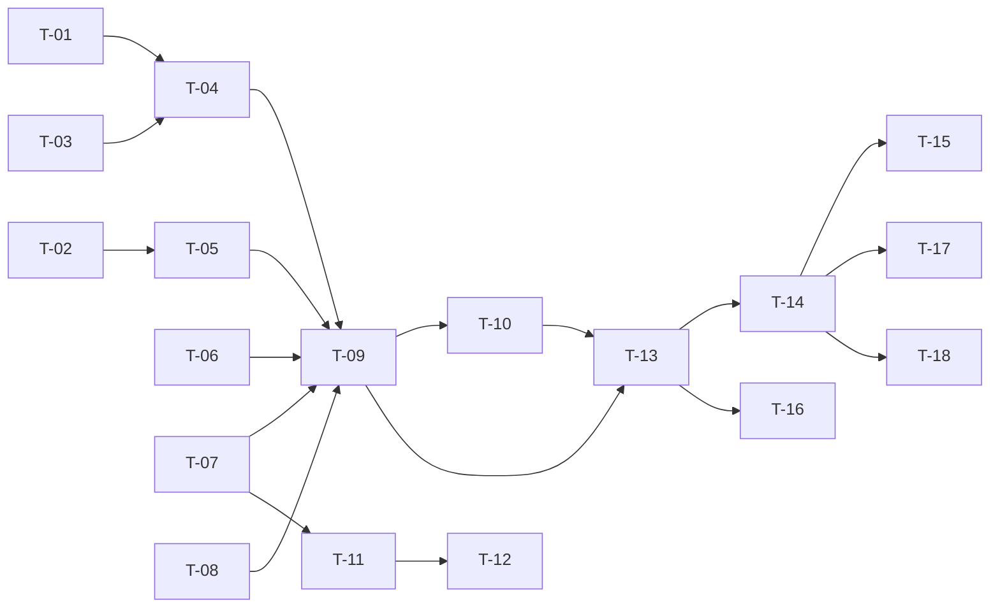

# TASKS — `RF-SP-034` Iniciar sesión

| Campo | Valor |
|---|---|
| Requerimiento | `RF-SP-034` |
| Especificación | [`spec.md`](spec.md) |
| Plan | [`plan.md`](plan.md) |
| `plan.md` aprobado el | 24-08-2026 |
| Estado | **En revisión** |
| Issue | Pendiente de crear |
| Rama | `feature/iniciar-sesion` |
| Aprobadas por | Pendiente |

---

## 1. Tareas

Es el requerimiento que desbloquea el módulo entero: hasta que exista, `CurrentActor` devuelve siempre vacío y ninguna prueba de API de ningún otro `RF` puede ejercitar su camino feliz. Dos tareas concentran el riesgo y ninguna de las dos falla de forma visible si se hace mal — `T-06`, que debe verificar la contraseña **incluso contra una cuenta inexistente**, y `T-03`, cuyo techo es lo único que separa una defensa de una denegación de servicio contra el titular.

| # | Tarea | Depende de | Verificación | Estado |
|---|---|---|---|---|
| `T-01` | Migración `V26__add_user_access_control_columns.sql`: `failed_attempts`, `locked_until` y `last_login_at` sobre `users` | — | `mvn flyway:info` la lista aplicada; `ddl-auto: validate` arranca con el mapeo de `RF-SP-024` intacto | Pendiente |
| `T-02` | Migración `V27__create_refresh_tokens.sql` con sus dos índices, el único sobre `token_hash` y el **`CHECK` que hace `revoked_reason` obligatorio en toda fila revocada** (`plan.md` §2) | — | Prueba de integración de esquema: revocar sin motivo **falla**; el dominio cerrado de motivos rechaza un literal fuera de él | Pendiente |
| `T-03` | `domain/LockoutPolicy`: progresión del bloqueo a partir del número de bloqueos previos, **con techo** | — | Pruebas unitarias sin Spring: la duración crece; a partir de cierto número **deja de crecer**. Sin techo, la prueba del techo es la única que falla | Pendiente |
| `T-04` | `domain/User.authenticate(...)`: contador de fallos consecutivos, umbral y puesta a cero en el éxito | `T-03` | Pruebas unitarias: bloqueo al quinto fallo; un éxito intercalado pone el contador a cero | Pendiente |
| `T-05` | `domain/RefreshToken` y `domain/RefreshTokenRepository`: vigencia, revocación con motivo, familia y agotamiento de la duración máxima de sesión | — | Pruebas unitarias del agregado; prueba de integración del puerto sobre las cuatro operaciones de revocación | Pendiente |
| `T-06` | Ampliar `PasswordHasher` y `Argon2PasswordHasher` de `RF-SP-024` con la **verificación** de credenciales y la **verificación en vacío** contra un hash de descarte cuando la cuenta no existe | — | **Prueba de temporización**: la mediana del caso «cuenta inexistente» y la de «contraseña incorrecta» quedan dentro del margen declarado. Saltar el hash hace fallar esta prueba y ninguna otra | Pendiente |
| `T-07` | `application/AccessTokenIssuer` y `JwtAccessTokenIssuer`: firma con `JWT_SECRET`, claims de `security.md` §5.2 **más `mcp`** (`plan.md` §5) | — | Prueba unitaria sobre el token decodificado: lleva los códigos de rol y `mcp`, y **ningún** dato personal ni correo | Pendiente |
| `T-08` | `application/RateLimiter` e `InMemoryRateLimiter`: ventana deslizante por credencial y por origen | — | Prueba de API: superar el límite devuelve `429`; la ventana se reabre al pasar | Pendiente |
| `T-09` | `application/LoginService` con el orden de verificación de `plan.md` §4, **que no cortocircuita** | `T-04`, `T-05`, `T-06`, `T-07`, `T-08` | Pruebas con dobles: el bloqueo rechaza **antes** de tocar la contraseña; el estado de la cuenta se comprueba **después** del hash, nunca antes | Pendiente |
| `T-10` | Auditoría: `LOGIN_SUCCESS` informativa, `LOGIN_FAILURE` media y `ACCOUNT_LOCKED` alta, las tres en transacción **independiente y sin esperar al commit**; el `429` **no se audita** | `T-09` | Prueba de integración: el evento de fallo **sobrevive al `rollback`** de la transacción de negocio; el `429` no deja fila | Pendiente |
| `T-11` | `shared/security/JwtAuthenticationFilter`: valida el token de acceso y puebla el contexto, de modo que `CurrentActor` deje de devolver vacío | `T-07` | Prueba de API sobre `GET /api/v1/permissions`: con token válido responde `200`; sin él, `401` | Pendiente |
| `T-12` | `shared/security/MustChangePasswordFilter`: niega todo endpoint salvo `RF-SP-037` mientras `mcp` esté en verdadero | `T-11` | Prueba de API: con la marca puesta, un endpoint cualquiera responde el rechazo declarado y `RF-SP-037` sigue accesible | Pendiente |
| `T-13` | `api/AuthController`, `LoginRequest` y `LoginResponse`: `POST /api/v1/auth/login` público, con `423` para la cuenta bloqueada | `T-09`, `T-10` | Prueba de API: los cuatro casos de `EX-001` devuelven cuerpo **idéntico byte a byte**; la cuenta bloqueada devuelve `423` distinguiendo bloqueo manual de automático | Pendiente |
| `T-14` | Pruebas de API e integración de los criterios de aceptación de `spec.md` §12 | `T-13` | La suite cubre `CA-SP-289` a `CA-SP-300` y `CA-SP-375` a `CA-SP-380` | Pendiente |
| `T-15` | **Las dos pruebas de temporización**: `CA-SP-293` y `CA-SP-377`, con medianas sobre repeticiones y margen declarado y justificado en el propio archivo | `T-14` | Ambas estables en CI. Si resultan intermitentes, se suben las repeticiones o se afina el margen — **nunca se desactivan** (`plan.md` §11) | Pendiente |
| `T-16` | Pruebas de los casos límite de `spec.md` §13: fallos alternados, bloqueo que expira, identificador con arroba, correo liberado, cuenta eliminada y muchos intentos sobre una cuenta inexistente | `T-13` | El último debe demostrar que **el límite por origen es la única defensa** y que se dispara | Pendiente |
| `T-17` | Documentación OpenAPI del endpoint: cuerpo, respuesta `200` y los estados `400`, `401`, `423`, `429` y `500` | `T-14` | El contrato publicado coincide con el comportamiento real (Art. VIII.6). **El `401` no documenta detalle por campo** | Pendiente |
| `T-18` | Aplicar la enmienda de `plan.md` §5 sobre `security.md` §5.2 —el claim `mcp`— y actualizar la matriz de trazabilidad de `docs/requirements.md` | `T-14` | §5.2 enumera `mcp` con su justificación y su fila de control de cambios; la fila de `RF-SP-034` en la matriz enlaza esta tripleta | Pendiente |

**Estados:** `Pendiente` · `En curso` · `Hecha` · `Bloqueada`.

## 2. Orden de ejecución

`T-03`, `T-06`, `T-07` y `T-08` no dependen entre sí y son las cuatro piezas que conviene escribir primero: tres son dominio o puertos puros y la cuarta es la que sostiene `CA-SP-293`.

## 3. Cobertura de los criterios de aceptación

| Criterio | Tarea que lo cubre |
|---|---|
| `CA-SP-289` | `T-09`, `T-13`, `T-14` |
| `CA-SP-290` | `T-07`, `T-14` |
| `CA-SP-291` | `T-02`, `T-05`, `T-14` |
| `CA-SP-292` | `T-13`, `T-14` |
| `CA-SP-293` | `T-06`, `T-15` |
| `CA-SP-294` | `T-04`, `T-14` |
| `CA-SP-295` | `T-04`, `T-14` |
| `CA-SP-296` | `T-10`, `T-14` |
| `CA-SP-297` | `T-10`, `T-14` |
| `CA-SP-298` | `T-10`, `T-14` |
| `CA-SP-299` | `T-07`, `T-14` |
| `CA-SP-375` | `T-09`, `T-14` |
| `CA-SP-376` | `T-03`, `T-04`, `T-14` |
| `CA-SP-377` | `T-09`, `T-13`, `T-15` |
| `CA-SP-378` | `T-13`, `T-14` |
| `CA-SP-379` | `T-12`, `T-13`, `T-14` |
| `CA-SP-380` | `T-05`, `T-14` |
| `CA-SP-300` | `T-08`, `T-14` |

## 4. Bloqueos

| # | Bloqueo | Desde | Responsable | Estado |
|---|---|---|---|---|
| 1 | `T-01` y `T-04` no son ejecutables hasta que `RF-SP-024` cree `users` en `V18` | 24-08-2026 | Responsable técnico | Abierto |
| 2 | `T-12` verifica que `RF-SP-037` siga accesible con la marca puesta, y `RF-SP-037` pertenece al bloque C. Hasta entonces la prueba comprueba la **negación** del resto de endpoints y deja la excepción anotada | 24-08-2026 | Responsable técnico | Abierto |
| 3 | Los parámetros de costo de Argon2id, el umbral de bloqueo, su progresión, su techo, la duración máxima de sesión y los dos límites de tasa se declaran **en configuración** (`security.md` §3.2 y §5.5) y **ninguno tiene valor decidido todavía**. Se fijan al implementar `T-03`, `T-06` y `T-08`, y quedan en `application.yml` sin valor por defecto donde sean obligatorios (Art. IX.5) | 24-08-2026 | Responsable técnico | Abierto |

## 5. Definición de terminado

El requerimiento no está terminado hasta cumplir **todas** las condiciones de la constitución §16:

- [ ] Todas las tareas en estado `Hecha`.
- [ ] Todos los criterios de aceptación con prueba automatizada en verde.
- [ ] `mvn verify` en verde en local.
- [ ] Toda escritura emite su evento de auditoría, en la transacción que corresponde.
- [ ] Los endpoints nuevos declaran su permiso.
- [ ] El contrato OpenAPI coincide con el comportamiento real.
- [ ] Documentación afectada actualizada en el mismo Pull Request.
- [ ] Matriz de trazabilidad actualizada.
- [ ] Pull Request aprobado por alguien distinto del autor e integrado.
