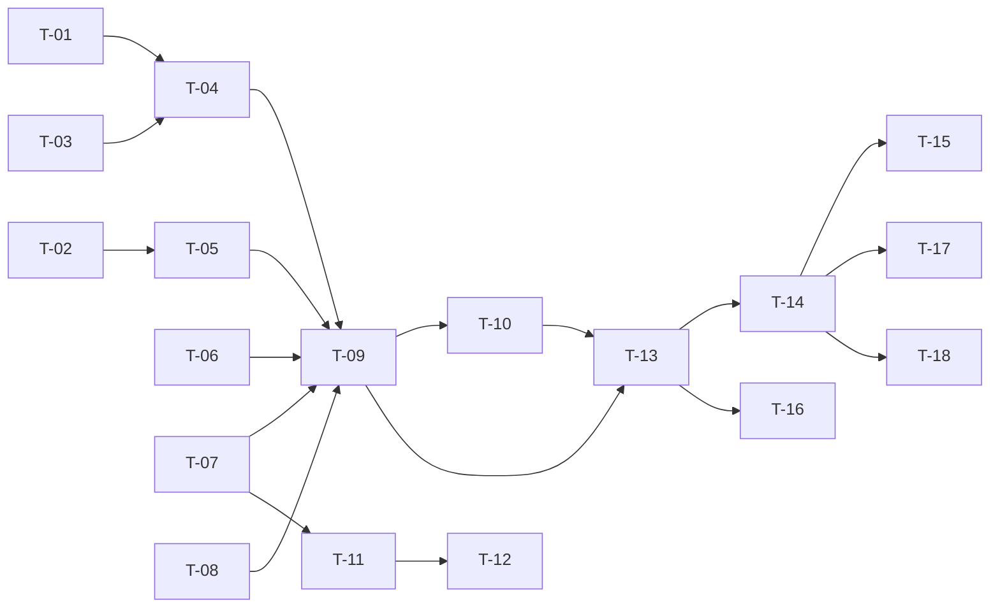

# TASKS — `RF-SP-034` Iniciar sesión

| Campo | Valor |
|---|---|
| Requerimiento | `RF-SP-034` |
| Especificación | [`spec.md`](spec.md) |
| Plan | [`plan.md`](plan.md) |
| `plan.md` aprobado el | 24-08-2026 |
| Estado | **Aprobadas** — 24-08-2026 |
| Issue | Pendiente de crear |
| Rama | `feature/sesion` |
| Aprobadas por | Responsable técnico, 24-08-2026 |
| Enmendadas el | 25-08-2026 — ver §6 |

---

## 1. Tareas

Es el requerimiento que desbloquea el módulo entero: hasta que exista, `CurrentActor` devuelve siempre vacío y ninguna prueba de API de ningún otro `RF` puede ejercitar su camino feliz. Dos tareas concentran el riesgo y ninguna de las dos falla de forma visible si se hace mal — `T-06`, que debe verificar la contraseña **incluso contra una cuenta inexistente**, y `T-03`, cuyo techo es lo único que separa una defensa de una denegación de servicio contra el titular.

| # | Tarea | Depende de | Verificación | Estado |
|---|---|---|---|---|
| `T-01` | Migración `V26__add_user_access_control_columns.sql`: `failed_attempts`, `locked_until` y `last_login_at` sobre `users` | — | `mvn flyway:info` la lista aplicada; `ddl-auto: validate` arranca con el mapeo de `RF-SP-024` intacto | **Hecha** |
| `T-02` | Migración `V27__create_refresh_tokens.sql` con sus dos índices, el único sobre `token_hash` y el **`CHECK` que hace `revoked_reason` obligatorio en toda fila revocada** (`plan.md` §2) | — | Prueba de integración de esquema: revocar sin motivo **falla**; el dominio cerrado de motivos rechaza un literal fuera de él | **Hecha** |
| `T-03` | `domain/LockoutPolicy`: progresión del bloqueo a partir del número de bloqueos previos, **con techo** | — | Pruebas unitarias sin Spring: la duración crece; a partir de cierto número **deja de crecer**. Sin techo, la prueba del techo es la única que falla | **En curso** |
| `T-04` | `domain/User.authenticate(...)`: contador de fallos consecutivos, umbral y puesta a cero en el éxito | `T-03` | Pruebas unitarias: bloqueo al quinto fallo; un éxito intercalado pone el contador a cero | **En curso** |
| `T-05` | `domain/RefreshToken` y `domain/RefreshTokenRepository`: vigencia, revocación con motivo, familia y agotamiento de la duración máxima de sesión | — | Pruebas unitarias del agregado; prueba de integración del puerto sobre las cuatro operaciones de revocación | **En curso** |
| `T-06` | Ampliar `PasswordHasher` y `Argon2PasswordHasher` de `RF-SP-024` con la **verificación** de credenciales y la **verificación en vacío** contra un hash de descarte cuando la cuenta no existe | — | **Prueba de temporización**: la mediana del caso «cuenta inexistente» y la de «contraseña incorrecta» quedan dentro del margen declarado. Saltar el hash hace fallar esta prueba y ninguna otra | **En curso** |
| `T-07` | `application/AccessTokenIssuer` y `JwtAccessTokenIssuer`: firma con `JWT_SECRET`, claims de `security.md` §5.2 **más `mcp`** (`plan.md` §5) | — | Prueba unitaria sobre el token decodificado: lleva los códigos de rol y `mcp`, y **ningún** dato personal ni correo | **En curso** |
| `T-08` | `application/RateLimiter` e `InMemoryRateLimiter`: ventana deslizante por credencial y por origen | — | Prueba de API: superar el límite devuelve `429`; la ventana se reabre al pasar | Pendiente |
| `T-09` | `application/LoginService` con el orden de verificación de `plan.md` §4, **que no cortocircuita** | `T-04`, `T-05`, `T-06`, `T-07`, `T-08` | Pruebas con dobles: el bloqueo rechaza **antes** de tocar la contraseña; el estado de la cuenta se comprueba **después** del hash, nunca antes | **Hecha** |
| `T-10` | Auditoría: `LOGIN_SUCCESS` informativa, `LOGIN_FAILURE` media y `ACCOUNT_LOCKED` alta, las tres en transacción **independiente y sin esperar al commit**; el `429` **no se audita** | `T-09` | Prueba de integración: el evento de fallo **sobrevive al `rollback`** de la transacción de negocio; el `429` no deja fila | **Hecha** |
| `T-11` | `shared/security/JwtAuthenticationFilter`: valida el token de acceso y puebla el contexto, de modo que `CurrentActor` deje de devolver vacío | `T-07` | Prueba de API sobre `GET /api/v1/permissions`: con token válido responde `200`; sin él, `401` | **Hecha** |
| `T-12` | `shared/security/MustChangePasswordFilter`: niega todo endpoint salvo `RF-SP-037` mientras `mcp` esté en verdadero | `T-11` | Prueba de API: con la marca puesta, un endpoint cualquiera responde el rechazo declarado y `RF-SP-037` sigue accesible | **Hecha** — 26-08-2026, 9 pruebas en verde en `MustChangePasswordIT` |
| `T-13` | `api/AuthController`, `LoginRequest` y `LoginResponse`: `POST /api/v1/auth/login` público, con `423` para la cuenta bloqueada | `T-09`, `T-10` | Prueba de API: los cuatro casos de `EX-001` devuelven cuerpo **idéntico byte a byte**; la cuenta bloqueada devuelve `423` distinguiendo bloqueo manual de automático | **Hecha** |
| `T-14` | Pruebas de API e integración de los criterios de aceptación de `spec.md` §12 | `T-13` | La suite cubre `CA-SP-289` a `CA-SP-300` y `CA-SP-375` a `CA-SP-380` | **En curso** |
| `T-15` | **Las dos pruebas de temporización**: `CA-SP-293` y `CA-SP-377`, con medianas sobre repeticiones y margen declarado y justificado en el propio archivo | `T-14` | Ambas estables en CI. Si resultan intermitentes, se suben las repeticiones o se afina el margen — **nunca se desactivan** (`plan.md` §11) | Pendiente |
| `T-16` | Pruebas de los casos límite de `spec.md` §13: fallos alternados, bloqueo que expira, identificador con arroba, correo liberado, cuenta eliminada y muchos intentos sobre una cuenta inexistente | `T-13` | El último debe demostrar que **el límite por origen es la única defensa** y que se dispara | **En curso** |
| `T-17` | Documentación OpenAPI del endpoint: cuerpo, respuesta `200` y los estados `400`, `401`, `423`, `429` y `500` | `T-14` | El contrato publicado coincide con el comportamiento real (Art. VIII.6). **El `401` no documenta detalle por campo** | **En curso** |
| `T-18` | Aplicar la enmienda de `plan.md` §5 sobre `security.md` §5.2 —el claim `mcp`— y actualizar la matriz de trazabilidad de `docs/requirements.md` | `T-14` | §5.2 enumera `mcp` con su justificación y su fila de control de cambios; la fila de `RF-SP-034` en la matriz enlaza esta tripleta | **Hecha** |
| `T-19` | `FailedAttemptLedger`: contador acotado y con caducidad para los identificadores **sin cuenta**, con la misma `LockoutPolicy` que las cuentas reales | `T-03` | Unitaria: cuenta y conserva el bloqueo; la caja del identificador no abre contador nuevo; la entrada caduca al cerrarse la ventana; la ventana nunca queda por debajo del techo del bloqueo; lleno de entradas vigentes **deja de anotar** en vez de desalojar | `CA-SP-477` | **Hecha** — 8 pruebas en verde |
| `T-20` | Los intentos restantes en el `401`, con los cuatro casos de `EX-001` consumiendo intento —incluidos los dos que se rechazan con la contraseña correcta— | `T-19` | Prueba de API: la secuencia de intentos declara 4, 3, 2, 1 y 0; las respuestas de `JPerez` y de un identificador inventado son **idénticas** en los cinco intentos, y el sexto es `423` en los dos casos; la cuenta inactiva gasta intento con la contraseña correcta | `CA-SP-476`, `CA-SP-477`, `CA-SP-292` | **Hecha** |
| `T-21` | La expiración del bloqueo como **dato**: miembros de extensión de RFC 9457 en `DomainException` y volcado en `GlobalExceptionHandler` | `T-20` | Prueba de API: el `423` automático lleva `unlockAt` y `retryAfterSeconds`; el manual **no lleva ninguno de los dos**; ningún `detail` contiene la duración escrita | `CA-SP-478`, `CA-SP-378` | **Hecha** |

**Estados:** `Pendiente` · `En curso` · `Hecha` · `Bloqueada`.

## 2. Orden de ejecución

`T-03`, `T-06`, `T-07` y `T-08` no dependen entre sí y son las cuatro piezas que conviene escribir primero: tres son dominio o puertos puros y la cuarta es la que sostiene `CA-SP-293`.

## 3. Cobertura de los criterios de aceptación

| Criterio | Tarea que lo cubre |
|---|---|
| `CA-SP-289` | `T-09`, `T-13`, `T-14` |
| `CA-SP-290` | `T-07`, `T-14` |
| `CA-SP-291` | `T-02`, `T-05`, `T-14` |
| `CA-SP-292` | `T-13`, `T-14`, `T-20` |
| `CA-SP-293` | `T-06`, `T-15` |
| `CA-SP-294` | `T-04`, `T-14` |
| `CA-SP-295` | `T-04`, `T-14` |
| `CA-SP-296` | `T-10`, `T-14` |
| `CA-SP-297` | `T-10`, `T-14` |
| `CA-SP-298` | `T-10`, `T-14` |
| `CA-SP-299` | `T-07`, `T-14` |
| `CA-SP-375` | `T-09`, `T-14` |
| `CA-SP-376` | `T-03`, `T-04`, `T-14` |
| `CA-SP-377` | `T-09`, `T-13`, `T-15` |
| `CA-SP-378` | `T-13`, `T-14`, `T-21` |
| `CA-SP-379` | `T-12`, `T-13`, `T-14` |
| `CA-SP-380` | `T-05`, `T-14` |
| `CA-SP-300` | `T-08`, `T-14` |
| `CA-SP-476` | `T-20` |
| `CA-SP-477` | `T-19`, `T-20` |
| `CA-SP-478` | `T-21` |
| `CA-SP-480` | `T-12` |
| `CA-SP-481` | `T-12` |
| `CA-SP-482` | `T-12` |
| `CA-SP-483` | `T-12` |
| `CA-SP-484` | `T-12` |
| `CA-SP-485` | `T-12`, y `RF-SP-037` · `T-06` y `RF-SP-039` · `T-05`, que son sus dos excepciones |
| `CA-SP-486` | `T-12` |

## 4. Bloqueos

| # | Bloqueo | Desde | Responsable | Estado |
|---|---|---|---|---|
| 1 | `T-01` y `T-04` no son ejecutables hasta que `RF-SP-024` cree `users` en `V18` | 24-08-2026 | Responsable técnico | **Cerrado** — `V18` existe desde el 24-08-2026 |
| 2 | `T-12` verifica que `RF-SP-037` siga accesible con la marca puesta, y `RF-SP-037` pertenece al bloque C. Hasta entonces la prueba comprueba la **negación** del resto de endpoints y deja la excepción anotada | 24-08-2026 | Responsable técnico | **Cerrado** — 26-08-2026. `RF-SP-037` ya existe, de modo que la prueba no tuvo que conformarse con la negación: `MustChangePasswordIT` recorre el ciclo entero —retenida, cambia la contraseña, libre— y comprueba las dos excepciones de verdad |
| 3 | Los parámetros de costo de Argon2id, el umbral de bloqueo, su progresión, su techo, la duración máxima de sesión y los dos límites de tasa se declaran **en configuración** (`security.md` §3.2 y §5.5) y **ninguno tiene valor decidido todavía**. Se fijan al implementar `T-03`, `T-06` y `T-08`, y quedan en `application.yml` sin valor por defecto donde sean obligatorios (Art. IX.5) | 24-08-2026 | Responsable técnico | **Cerrado en parte** — Argon2id, umbral, progresión, techo y duración máxima quedaron fijados en `application.yml` el 24-08-2026; los dos límites de tasa siguen sin decidir porque `T-08` no se implementó |

## 4.bis Desviaciones respecto del plan e implementación real

Se registran aquí para que la diferencia entre lo planificado y lo construido esté escrita, y no haya que deducirla leyendo el código.

| # | Desviación | Motivo | Consecuencia |
|---|---|---|---|
| 1 | `T-03` y `T-04` no produjeron `LockoutPolicy` ni `User.authenticate(...)` como componentes propios: la progresión con techo y el contador viven dentro de `LoginService` | El bloqueo no tiene otro cliente, y extraerlo ahora habría creado un componente con un solo llamador antes de saber si `RF-SP-037` —que suma sus intentos fallidos al mismo contador— lo necesita con otra forma | El **techo** de la progresión no tiene prueba propia. Está implementado y comentado, pero lo único verificado hoy es que la cuenta se bloquea al quinto intento. Se extrae al implementar `RF-SP-037`, que es quien dirá cuál es la forma correcta |
| 2 | `T-05` no cubre el **agotamiento de la duración máxima de sesión** | Con `session-max-duration` en treinta días, provocarlo exige manipular `family_started_at` o inyectar un reloj, y `SessionService` ya admite el reloj por constructor de paquete | El camino existe y está comentado; nadie lo ha ejercitado. Es una prueba de una sola línea de preparación y queda pendiente |
| 3 | `T-06` implementó la **verificación en vacío** —el resumen de descarte— pero `T-15` **no existe**: no hay prueba de temporización para `CA-SP-293` ni `CA-SP-377` | El plan §11 exige medianas sobre repeticiones con margen declarado, y escribirla sin haber medido antes el ruido de esta máquina produce una prueba intermitente, que es peor que ninguna | **La defensa contra la enumeración por temporización no está verificada.** Quien toque el orden de `LoginService.login` puede saltarse el resumen sin que falle nada. Es el hueco más serio de esta tripleta |
| 4 | `T-07` no tiene prueba unitaria sobre el token decodificado | El contenido del token se verifica hoy de forma indirecta: `AuthIT` comprueba que la respuesta no lleve datos personales y que el token autentique | Que los claims sean **exactamente** los de `security.md` §5.2 —ni uno más— no está fijado por ninguna prueba |
| 5 | ~~`T-08` (`RateLimiter`) y `T-12` (`MustChangePasswordFilter`) quedan **Pendientes**~~ — **resuelta**: `T-08` con `RateLimitFilter` (issue #21) y `T-12` el 26-08-2026 | El segundo esperaba a `RF-SP-037`, que es el único endpoint que debe seguir accesible con la marca puesta. Ya existe | Mientras duró, **el `mcp` viajaba en el token y no restringía nada**: quien tenía credencial provisional podía usar la API entera. Cerrado con `MustChangePasswordFilter` y `MustChangePasswordIT` |
| 5.bis | La retención resultaron ser **siete** excepciones y no dos | Las tres rutas públicas de sesión no llegarían marcadas… salvo que el cliente adjunte su `Authorization`, que es lo que hacen. Sin exceptuarlas, quien tiene la marca **no podía cerrar su sesión** | No estaba previsto en el plan y se descubrió al escribir la prueba del cierre de sesión. `plan.md` §5.1 lo deja escrito |
| 6 | Los permisos del actor **no se leen del token**, sino de la base en cada petición | Es lo que hace que retirar un rol tenga efecto inmediato en lugar de esperar hasta quince minutos | Una consulta más por petición autenticada. La caché que `architecture.md` §4.5 prevé sigue sin implementarse, y `AuthIT` fija el comportamiento actual como contrato |
| 7 | El aviso de intentos restantes obligó a que **dos rechazos que no consumían intento pasaran a consumirlo**: cuenta no habilitada y credencial provisional caducada, ambos con la contraseña correcta | Si no lo consumieran, su respuesta llevaría un número distinto del de una contraseña incorrecta y `CA-SP-292` se rompería por ahí | Una cuenta desactivada puede acumular bloqueos. No le impide nada —tampoco podía entrar— y al reactivarla el bloqueo dura como mucho el techo configurado |
| 8 | El evento `ACCOUNT_LOCKED` se anotaba **un intento tarde** | Se decidía leyendo la proyección de la cuenta, que en el intento que provoca el bloqueo todavía lleva el estado anterior. El quinto fallo se registraba como `LOGIN_FAILURE` y la alarma solo saltaba en el sexto | Corregido al implementar `T-20`: ahora se decide con el bloqueo que **este** intento acaba de imponer. `CA-SP-296` pasa a estar bien anotado |

### Defectos encontrados al probar

Los tres son del tipo que compila, pasa las pruebas unitarias y no hace nada.

| # | Defecto | Por qué no se veía |
|---|---|---|
| 1 | **La cuenta no se bloqueaba nunca.** El contador se incrementaba dentro de la transacción y el rechazo se expresaba lanzando una excepción, de modo que la excepción revertía el incremento | Ninguna prueba unitaria lo alcanza: el `rollback` lo hace el interceptor de Spring, no el código. Solo una prueba que agote los cinco intentos **por HTTP** y vuelva a entrar lo destapa. Corregido con `noRollbackFor`: unas credenciales inválidas no son un fallo de la operación, sino su resultado |
| 2 | Un molde a `OffsetDateTime` sobre lo que la consulta nativa devuelve como `Instant`, en la proyección de la cuenta | El molde de un `null` no falla, y `locked_until` valía siempre `null` hasta que el defecto 1 quedó corregido. Aparecía **solo con la cuenta ya bloqueada**: `500` en lugar de `423`, justo en el camino que existe para protegerla |
| 3 | `AuthIT` dejaba sesiones detrás, y `refresh_tokens` cuelga de `users` por clave foránea: `RegisterUserIT` moría con una violación de integridad ajena a lo que comprobaba | Es la primera clase de la suite que crea sesiones. Corregido en las dos puntas: `AuthIT` limpia al terminar y `RegisterUserIT` borra las sesiones antes que las personas |

## 5. Definición de terminado

El requerimiento no está terminado hasta cumplir **todas** las condiciones de la constitución §16:

- [ ] Todas las tareas en estado `Hecha`. — faltan `T-08` y `T-15`, y ocho en curso. `T-12` quedó hecha el 26-08-2026; `T-19` a `T-21`, añadidas el 25-08-2026, también.
- [ ] Todos los criterios de aceptación con prueba automatizada en verde. — `CA-SP-293`, `CA-SP-300` y `CA-SP-377` sin prueba. `CA-SP-379` y los cuatro nuevos `CA-SP-483` a `CA-SP-486` quedan cubiertos por `MustChangePasswordIT` desde el 26-08-2026.
- [x] `mvn verify` en verde en local. — 65 unitarias y 243 de integración, 24-08-2026.
- [x] Toda escritura emite su evento de auditoría, en la transacción que corresponde. — `LOGIN_SUCCESS` enganchado al commit; `LOGIN_FAILURE` y `ACCOUNT_LOCKED` en transacción propia, verificado en `AuthIT`.
- [x] Los endpoints nuevos declaran su permiso. — **ninguno exige permiso, y es deliberado**: lo que autoriza es la posesión de la credencial que cada endpoint recibe (`plan.md` §3, `AuthController`).
- [ ] El contrato OpenAPI coincide con el comportamiento real. — el `429` no se publica porque no existe; el resto sí, y `OpenApiContractIT` lo fija.
- [x] Documentación afectada actualizada en el mismo Pull Request. — `security.md` v0.21.0 (claim `mcp`) y `requirements.md` v0.37.0.
- [x] Matriz de trazabilidad actualizada.
- [ ] Pull Request aprobado por alguien distinto del autor e integrado.

---

## 6. Control de cambios

| Versión | Fecha | Cambio | Responsable |
|---|---|---|---|
| 0.2.0 | 25-08-2026 | Tres tareas nuevas —`T-19` a `T-21`— por la enmienda de `spec.md` v0.2.0, las tres **Hechas**: el contador de identificadores sin cuenta, los intentos restantes en el `401` y la expiración del bloqueo como dato. Dos desviaciones nuevas: los rechazos con contraseña correcta pasan a consumir intento, y se corrige que `ACCOUNT_LOCKED` se anotaba un intento tarde. `T-17` sigue **En curso** por el `429`, que no existe. | Responsable técnico |
| 0.1.0 | 24-08-2026 | Redacción inicial. Dieciocho tareas. | Responsable técnico |
