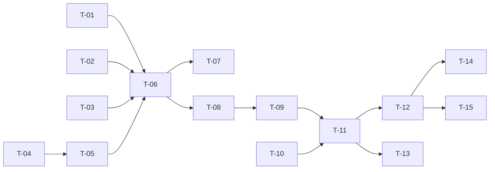

# TASKS — `RF-SP-035` Refrescar el token de acceso

| Campo | Valor |
|---|---|
| Requerimiento | `RF-SP-035` |
| Especificación | [`spec.md`](spec.md) |
| Plan | [`plan.md`](plan.md) |
| `plan.md` aprobado el | 24-08-2026 |
| Estado | **En revisión** |
| Issue | Pendiente de crear |
| Rama | `feature/refrescar-token` |
| Aprobadas por | Pendiente |

---

## 1. Tareas

Sin migración: `refresh_tokens` y sus cuatro columnas críticas las crea `V27` (`RF-SP-034`). Todo el riesgo está concentrado en dos tareas cuyo fallo es **silencioso**: `T-03`, que clasifica por `revoked_reason` y decide si un token revocado es un robo o un cierre, y `T-05`, que sin el bloqueo de fila deja dos cadenas vivas de la misma sesión sin que nada dé error.

| # | Tarea | Depende de | Verificación | Estado |
|---|---|---|---|---|
| `T-01` | `domain/SessionLifetimePolicy`: duración máxima de la familia a partir de `family_started_at`. Función pura | — | Prueba unitaria: una cadena de refrescos encadenados **no** amplía el techo; el vencimiento se mide desde el inicio de sesión | Pendiente |
| `T-02` | `domain/RefreshToken.rotate(...)`: revoca el presentado con motivo `ROTACION`, emite el sucesor y deja el vínculo | — | Prueba unitaria sin Spring: el presentado queda revocado con su motivo y `replaced_by_id` apunta al nuevo | Pendiente |
| `T-03` | **Clasificación del motivo de revocación**: `ROTACION` → reutilización; cualquier otro → rechazo simple | — | Pruebas unitarias sobre **los seis** literales del dominio cerrado de `V27`. Un motivo nuevo sin clasificar debe hacer fallar la prueba, no caer en un `else` | Pendiente |
| `T-04` | `domain/RefreshTokenRepository`: búsqueda por hash **con bloqueo de fila** y revocación de familia en un solo `UPDATE` | — | Prueba de integración: la revocación de familia afecta a todas las filas de ese `family_id` y a ninguna de otro | Pendiente |
| `T-05` | `JpaRefreshTokenRepository`: `SELECT … FOR UPDATE` sobre la fila localizada por su hash | `T-04` | **Prueba de integración concurrente**: dos refrescos simultáneos con el mismo token dejan **una** cadena viva; uno gana y el otro cae en reutilización. Sin `FOR UPDATE` la prueba falla con dos cadenas y ningún error | Pendiente |
| `T-06` | `application/RefreshTokenService` con el orden de verificación de `plan.md` §4, **clasificando por motivo antes de mirar la vigencia de la familia y el estado de la persona** | `T-01`, `T-02`, `T-03`, `T-05` | Pruebas con dobles: un robo sobre una sesión caducada y sobre una cuenta desactivada siguen produciendo reutilización; el orden no se puede invertir sin romperlas | Pendiente |
| `T-07` | Revalidación de la persona (`EX-003`): inactiva, bloqueada o eliminada rechazan y revocan el token presentado | `T-06` | Prueba de integración: el token queda revocado y no se emite ninguno nuevo | Pendiente |
| `T-08` | Revocación de familia **dentro** de la transacción que la detecta, tanto en `EX-001` como en `EX-005` | `T-06` | Prueba de integración: dos peticiones simultáneas con el token robado no dejan la familia sin revocar | Pendiente |
| `T-09` | Auditoría: `REFRESH_TOKEN_REUSE` con severidad alta en `EX-001` y `LOGOUT` informativa en `EX-005`, ambas en transacción independiente y sin esperar al commit. **Ningún evento** en el resto de salidas | `T-08` | Prueba de integración: el refresco exitoso, `EX-002`, `EX-003` y `EX-004` no dejan **ninguna** fila; el `detail` de la reutilización lleva identificadores y **nunca** el valor del token | Pendiente |
| `T-10` | Límite de tasa **por origen** y no por credencial, con cota propia más holgada que la del inicio de sesión | — | Prueba de API: superar el límite devuelve `429`; la cota es distinta de la de `RF-SP-034` | Pendiente |
| `T-11` | `api/RefreshRequest` y `AuthController`: `POST /api/v1/auth/refresh`, y **añadir la ruta a `RUTAS_PUBLICAS`** de `SecurityConfig` | `T-09`, `T-10` | Prueba de API: la ruta responde sin token de acceso; las **cinco** condiciones de `401` devuelven cuerpo idéntico byte a byte | Pendiente |
| `T-12` | Pruebas de API e integración de los criterios de aceptación de `spec.md` §12 | `T-11` | La suite cubre `CA-SP-301` a `CA-SP-310` y `CA-SP-381` a `CA-SP-385` | Pendiente |
| `T-13` | Pruebas de los casos límite de `spec.md` §13, con la de **persona desactivada mientras refresca** como la más cuidadosa: debe verificar la **ausencia** de `REFRESH_TOKEN_REUSE` | `T-11` | Los seis casos en verde; ninguno produce un evento de severidad alta que no corresponda | Pendiente |
| `T-14` | Documentación OpenAPI del endpoint: cuerpo, respuesta `200` y los estados `400`, `401`, `429` y `500`. **El `401` no distingue entre sus cinco causas** | `T-12` | El contrato publicado coincide con el comportamiento real (Art. VIII.6) | Pendiente |
| `T-15` | Actualizar la matriz de trazabilidad de `docs/requirements.md` | `T-12` | La fila de `RF-SP-035` refleja el estado y enlaza esta tripleta | Pendiente |

**Estados:** `Pendiente` · `En curso` · `Hecha` · `Bloqueada`.

## 2. Orden de ejecución

`T-01`, `T-02`, `T-03` y `T-10` no dependen entre sí. `T-03` es dominio puro y conviene escribirla primero: es la que decide la naturaleza del requerimiento.

## 3. Cobertura de los criterios de aceptación

| Criterio | Tarea que lo cubre |
|---|---|
| `CA-SP-301` | `T-02`, `T-11`, `T-12` |
| `CA-SP-302` | `T-02`, `T-12` |
| `CA-SP-303` | `T-02`, `T-12` |
| `CA-SP-304` | `T-03`, `T-08`, `T-12` |
| `CA-SP-305` | `T-09`, `T-12` |
| `CA-SP-306` | `T-09`, `T-12` |
| `CA-SP-307` | `T-07`, `T-12` |
| `CA-SP-308` | `T-06`, `T-12` |
| `CA-SP-309` | `T-06`, `T-11`, `T-12` |
| `CA-SP-381` | `T-01`, `T-12` |
| `CA-SP-382` | `T-03`, `T-12` |
| `CA-SP-383` | `T-03`, `T-09`, `T-12` |
| `CA-SP-384` | `T-10`, `T-12` |
| `CA-SP-385` | `T-09`, `T-12` |
| `CA-SP-310` | `T-04`, `T-12` |

## 4. Bloqueos

| # | Bloqueo | Desde | Responsable | Estado |
|---|---|---|---|---|
| 1 | Ninguna tarea es ejecutable hasta que `RF-SP-034` cree `refresh_tokens` en `V27`, con `revoked_reason`, `family_id`, `family_started_at` y `replaced_by_id`. Este requerimiento **no crea ninguna tabla** | 24-08-2026 | Responsable técnico | Abierto |
| 2 | `CA-SP-383` necesita `RF-SP-036` para producir un token revocado con motivo `CIERRE`. Hasta entonces la prueba lo simula revocando con ese motivo desde el repositorio, y queda anotada para rehacerse por la vía real | 24-08-2026 | Responsable técnico | Abierto |
| 3 | El caso «persona desactivada mientras refresca» de `T-13` necesita `RF-SP-028`. Mismo tratamiento provisional que el anterior | 24-08-2026 | Responsable técnico | Abierto |
| 4 | **La purga de tokens expirados y revocados no tiene requerimiento.** `security.md` §5.5 la exige y una familia de siete días encadenando refrescos cada quince minutos deja cientos de filas por sesión. Queda como hueco declarado del módulo, no de esta tripleta | 24-08-2026 | Responsable técnico | Abierto |

## 5. Definición de terminado

El requerimiento no está terminado hasta cumplir **todas** las condiciones de la constitución §16:

- [ ] Todas las tareas en estado `Hecha`.
- [ ] Todos los criterios de aceptación con prueba automatizada en verde.
- [ ] `mvn verify` en verde en local.
- [ ] Toda escritura emite su evento de auditoría, en la transacción que corresponde.
- [ ] Los endpoints nuevos declaran su permiso.
- [ ] El contrato OpenAPI coincide con el comportamiento real.
- [ ] Documentación afectada actualizada en el mismo Pull Request.
- [ ] Matriz de trazabilidad actualizada.
- [ ] Pull Request aprobado por alguien distinto del autor e integrado.
