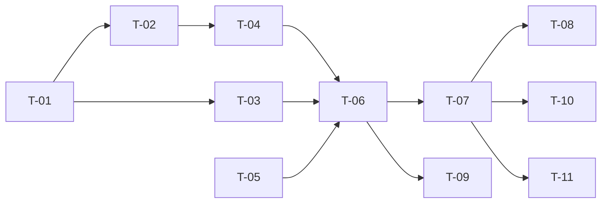

# TASKS — `RF-SP-036` Cerrar sesión

| Campo | Valor |
|---|---|
| Requerimiento | `RF-SP-036` |
| Especificación | [`spec.md`](spec.md) |
| Plan | [`plan.md`](plan.md) |
| `plan.md` aprobado el | 24-08-2026 |
| Estado | **Aprobadas** — 24-08-2026 |
| Issue | Pendiente de crear |
| Rama | `feature/sesion` |
| Aprobadas por | Responsable técnico, 24-08-2026 |

---

## 1. Tareas

Sin migración y sin ningún componente de dominio propio: todo lo aporta `RF-SP-034` (`plan.md` §3). Es la lista más corta del bloque B, y su valor está concentrado en dos garantías que ninguna prueba del camino feliz alcanza: que la revocación lleve el motivo `CIERRE` —del que depende que `RF-SP-035` no la confunda con un robo— y que la variante total no pueda alcanzar sesiones de otra persona.

| # | Tarea | Depende de | Verificación | Estado |
|---|---|---|---|---|
| `T-01` | `application/LogoutService`: revoca el token presentado con motivo **`CIERRE`**, según el orden de `plan.md` §4 | — | Prueba con dobles: el literal registrado es `CIERRE` y no otro; un token ya revocado no vuelve a escribirse | **Hecha** |
| `T-02` | Variante `allSessions`: revoca **todas** las sesiones vigentes **del titular del token presentado** | `T-01` | Prueba de integración: revoca las de esa persona y **ninguna** de otra; el alcance se resuelve desde el titular, nunca desde un dato de entrada | **Hecha** |
| `T-03` | Respuesta **uniforme `204`** para los cuatro casos sin efecto —ya cerrada, expirada, revocada por otro motivo y **token inexistente**— sin escribir ni auditar (enmienda de `plan.md` §4) | `T-01` | Prueba de API: los cuatro devuelven `204` con cuerpo vacío e **indistinguibles entre sí**. Un `400` en el caso del token inexistente reabre el oráculo y debe hacer fallar la prueba | **Hecha** |
| `T-04` | Auditoría: un evento `LOGOUT` informativo por operación efectiva, con el alcance y **cuántas sesiones** en `detail`, en transacción independiente y **enganchada al commit** | `T-02` | Prueba de integración: una sola fila aunque se revoquen diez sesiones; ninguna fila en los cuatro casos sin efecto; el valor del token no aparece en `detail` | **En curso** |
| `T-05` | Límite de tasa por origen, con la cota holgada del refresco | — | Prueba de API: superar el límite devuelve `429` | Pendiente |
| `T-06` | `api/LogoutRequest` y `AuthController`: `POST /api/v1/auth/logout` respondiendo `204`, y **añadir la ruta a `RUTAS_PUBLICAS`** de `SecurityConfig` junto con la de `RF-SP-035` | `T-04`, `T-05` | Prueba de API: funciona **sin token de acceso** y con uno expirado; solo el token ausente o con formato imposible devuelve `400` | **Hecha** |
| `T-07` | Pruebas de API e integración de los criterios de aceptación de `spec.md` §12 | `T-06` | La suite cubre `CA-SP-311` a `CA-SP-315`, `CA-SP-317`, `CA-SP-318` y `CA-SP-386` a `CA-SP-388` | **En curso** |
| `T-08` | **Prueba cruzada con `RF-SP-035`**: cerrar sesión y después refrescar con el mismo token | `T-07` | El refresco lo rechaza **sin** revocar familia y **sin** evento de severidad alta, porque el motivo es `CIERRE`. Es la única prueba que verifica que lo que una operación escribe es lo que la otra lee (`plan.md` §11) | **Hecha** |
| `T-09` | Pruebas de los casos límite restantes de `spec.md` §13: cierres concurrentes, cuenta desactivada, dispositivo distinto y persona con una sola sesión | `T-06` | Los cierres concurrentes se serializan y el segundo no deja segundo evento | **En curso** |
| `T-10` | Documentación OpenAPI del endpoint: cuerpo con `allSessions` opcional, respuesta `204` y los estados `400`, `429` y `500`. **No documenta `401` ni `404`** | `T-07` | El contrato publicado coincide con el comportamiento real (Art. VIII.6) | **En curso** |
| `T-11` | Aplicar la enmienda de `plan.md` §4 sobre `spec.md` §10 —`EX-001` absorbido por `FA-001`— y actualizar la matriz de trazabilidad de `docs/requirements.md` | `T-07` | `spec.md` lleva su fila de enmienda con fecha; la fila de `RF-SP-036` en la matriz enlaza esta tripleta | **Hecha** |

**Estados:** `Pendiente` · `En curso` · `Hecha` · `Bloqueada`.

## 2. Orden de ejecución

## 3. Cobertura de los criterios de aceptación

| Criterio | Tarea que lo cubre |
|---|---|
| `CA-SP-311` | `T-01`, `T-07` |
| `CA-SP-312` | `T-07` |
| `CA-SP-313` | `T-01`, `T-07` |
| `CA-SP-314` | `T-03`, `T-04`, `T-07` |
| `CA-SP-315` | `T-01`, `T-08` |
| `CA-SP-386` | `T-06`, `T-07` |
| `CA-SP-387` | `T-02`, `T-07` |
| `CA-SP-388` | `T-01`, `T-08` |
| `CA-SP-317` | `T-04`, `T-07` |
| `CA-SP-318` | `T-04`, `T-07` |

`CA-SP-316` no existe en `spec.md` §12: la numeración salta de `CA-SP-315` a `CA-SP-317`. Se deja constancia para que la ausencia no se lea como una fila que falta en esta tabla.

## 4. Bloqueos

| # | Bloqueo | Desde | Responsable | Estado |
|---|---|---|---|---|
| 1 | Ninguna tarea es ejecutable hasta que `RF-SP-034` cree `refresh_tokens` en `V27`, con el literal `CIERRE` en el dominio de `revoked_reason` y el índice `ix_refresh_tokens_user` | 24-08-2026 | Responsable técnico | **Cerrado** — `V27` existe desde el 24-08-2026 |
| 2 | `T-08` necesita `RF-SP-035` implementado: es una prueba de dos requerimientos y no puede escribirse desde un solo lado | 24-08-2026 | Responsable técnico | **Cerrado** — `RF-SP-035` está implementado y `T-08` está en verde |
| 3 | El caso «cuenta desactivada mientras la sesión estaba abierta» de `T-09` necesita `RF-SP-028`. Hasta entonces se simula revocando con motivo `ACCESO_RETIRADO` desde el repositorio, y queda anotado para rehacerse por la vía real | 24-08-2026 | Responsable técnico | Abierto |

## 4.bis Desviaciones respecto del plan e implementación real

| # | Desviación | Motivo | Consecuencia |
|---|---|---|---|
| 1 | `T-04` audita el cierre con el **alcance** en `detail`, pero no con **cuántas sesiones** se revocaron | `revokeAllActive` devuelve el número de filas, de modo que el dato está disponible: simplemente no se incorporó al evento | Un cierre total no dice en el registro cuántas sesiones cerró. Es información útil para reconstruir un incidente y falta |
| 2 | `T-05` (límite de tasa) queda **Pendiente**, igual que en los otros dos del bloque | Misma razón | `T-10` queda en curso: el contrato no publica un `429` que no existe. Lo que sí publica —y `OpenApiContractIT` lo fija— es la **ausencia** de `401` y `404`, que es la forma comprobable de decir que el cierre no distingue tokens |
| 3 | `T-09` no cubre los **cierres concurrentes** ni el dispositivo distinto | El arnés existe y el escenario es sencillo; no se llegó a escribir en este bloque | Que dos cierres simultáneos no dejen dos eventos no está demostrado |

### Lo que sí quedó verificado

- El cierre revoca con motivo `CIERRE`, y `RF-SP-035` **no lo confunde con un robo**: la prueba cruzada de `T-08` comprueba que refrescar después de cerrar rechaza sin revocar familia y sin evento de severidad alta. Es la garantía que da sentido a que `revoked_reason` sea obligatorio en el esquema.
- Los cuatro casos sin efecto —token inexistente, ya revocado, expirado y revocado por otro motivo— devuelven `204` e **indistinguibles entre sí**. Un `400` en el caso del token inexistente reabriría el oráculo que la enmienda de `spec.md` §10 cerró.
- La variante total revoca **todas** las sesiones del titular del token presentado, y el alcance se resuelve desde el titular y nunca desde un dato de entrada.

## 5. Definición de terminado

El requerimiento no está terminado hasta cumplir **todas** las condiciones de la constitución §16:

- [ ] Todas las tareas en estado `Hecha`. — falta `T-05`, y cuatro en curso.
- [ ] Todos los criterios de aceptación con prueba automatizada en verde. — `CA-SP-317` y `CA-SP-318` sin el número de sesiones en `detail`.
- [x] `mvn verify` en verde en local. — 65 unitarias y 243 de integración, 24-08-2026.
- [x] Toda escritura emite su evento de auditoría, en la transacción que corresponde. — `LOGOUT` informativo, enganchado al commit; ninguna fila en los cuatro casos sin efecto.
- [x] Los endpoints nuevos declaran su permiso. — no exige permiso, y es deliberado: exigir un token de acceso vigente impediría cerrar sesión justo cuando se sospecha que lo robaron.
- [ ] El contrato OpenAPI coincide con el comportamiento real. — el `429` no se publica porque no existe; la ausencia de `401` y `404` sí está fijada por prueba.
- [x] Documentación afectada actualizada en el mismo Pull Request. — `spec.md` §10 enmendada el 24-08-2026; `requirements.md` v0.37.0.
- [x] Matriz de trazabilidad actualizada.
- [ ] Pull Request aprobado por alguien distinto del autor e integrado.
