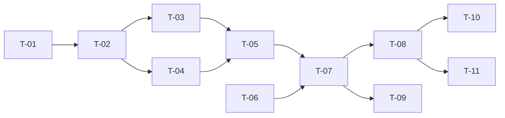

# TASKS — `RF-SP-037` Cambiar la propia contraseña

| Campo | Valor |
|---|---|
| Requerimiento | `RF-SP-037` |
| Especificación | [`spec.md`](spec.md) |
| Plan | [`plan.md`](plan.md) |
| `plan.md` aprobado el | 24-08-2026 |
| Estado | **Aprobadas** — 24-08-2026 |
| Issue | Pendiente de crear |
| Rama | `feature/credenciales-y-perfil-propio` |
| Aprobadas por | Responsable técnico, 24-08-2026 |

---

## 1. Tareas

Sin migración y **sin ningún componente de dominio nuevo**: la política la aporta `RF-SP-024`, el bloqueo `RF-SP-034` y la revocación `RF-SP-028` (`plan.md` §3). Lo propio es el orden en que se combinan y tres detalles que fallan en silencio: el contador de fallos en transacción propia, la revocación de **todas** las sesiones incluida la actual, y la excepción de esta ruta en el filtro de cambio obligatorio.

| # | Tarea | Depende de | Verificación | Estado |
|---|---|---|---|---|
| `T-01` | `domain/User.changePassword(...)`: sustituye el hash, limpia `must_change_password` y pone a cero el contador | — | Pruebas unitarias sin Spring: los tres efectos ocurren juntos; ninguno por separado | **En curso** |
| `T-02` | `application/ChangeOwnPasswordService` con `@Transactional` y el orden de `plan.md` §4, **con la comprobación de la vigente en último lugar** | `T-01` | Pruebas con dobles: una petición con la contraseña nueva mal formada **no** consume intento del contador. Invertir el orden hace fallar esta prueba y ninguna otra | **Hecha** |
| `T-03` | Incremento del contador de fallos en **transacción propia**, que confirma aunque la petición termine en rechazo | `T-02` | Prueba de integración: tras cinco intentos con la vigente incorrecta la cuenta queda bloqueada. Dentro de la transacción principal el `rollback` lo borra y la prueba falla | **Hecha** |
| `T-04` | Revocación de **todas** las sesiones con motivo `ACCESO_RETIRADO`, **incluida la que ejecutó el cambio**, dentro de la transacción, más la publicación del corte de tokens de acceso | `T-02` | Prueba de integración: ningún refresh token vigente queda; el token de acceso de la sesión que hizo el cambio deja de admitirse | **Hecha** |
| `T-05` | Auditoría: `PASSWORD_CHANGED` con severidad alta y `outcome = 'SUCCESS'` enganchado al commit; el fallo como **`PASSWORD_CHANGED` con `outcome = 'FAILURE'`** y severidad media, sin esperar al commit; `ACCOUNT_LOCKED` cuando se alcanza el umbral | `T-03`, `T-04` | Prueba de integración: **ninguna** fila de `LOGIN_FAILURE` sale de este endpoint; el `detail` no contiene ninguna de las dos contraseñas | **Hecha** |
| `T-06` | **Exceptuar esta ruta en `MustChangePasswordFilter`** de `RF-SP-034` | — | Prueba de API: con `mcp` en verdadero, esta ruta responde y **cualquier otra** es negada. Sin la excepción, la cuenta queda sin salida | **Pendiente** |
| `T-07` | `api/ChangePasswordRequest` y `AuthController`: `POST /api/v1/auth/password` autenticado, respondiendo `204`, **sin identificador de usuario en el cuerpo** | `T-05`, `T-06` | Prueba de API: `422` para la vigente incorrecta y `400` para política y contraseña repetida; el DTO no declara ningún campo por el que dirigir la operación a un tercero | **Hecha** |
| `T-08` | Pruebas de API e integración de los criterios de aceptación de `spec.md` §12 | `T-07` | La suite cubre `CA-SP-319` a `CA-SP-328` y `CA-SP-389` a `CA-SP-391` | **En curso** |
| `T-09` | Pruebas de los casos límite de `spec.md` §13: cambio con la marca puesta, cambios concurrentes, persona bloqueada y contraseña igual al nombre de usuario | `T-07` | La primera es la más importante: verifica la interacción con el filtro de `RF-SP-034` cuyo fallo deja la cuenta sin recuperación posible | **En curso** |
| `T-10` | Documentación OpenAPI del endpoint: cuerpo, respuesta `204` y los estados `400`, `401`, `422`, `423` y `500` | `T-08` | El contrato publicado coincide con el comportamiento real (Art. VIII.6) | **Hecha** |
| `T-11` | Actualizar la matriz de trazabilidad de `docs/requirements.md` | `T-08` | La fila de `RF-SP-037` refleja el estado y enlaza esta tripleta | **Hecha** |

**Estados:** `Pendiente` · `En curso` · `Hecha` · `Bloqueada`.

## 2. Orden de ejecución

`T-06` no depende de nada de este requerimiento y sí de que `RF-SP-034` exista. Conviene hacerla la primera: es la que decide si la cuenta tiene salida.

## 3. Cobertura de los criterios de aceptación

| Criterio | Tarea que lo cubre |
|---|---|
| `CA-SP-319` | `T-01`, `T-07`, `T-08` |
| `CA-SP-320` | `T-01`, `T-08` |
| `CA-SP-321` | `T-05`, `T-07`, `T-08` |
| `CA-SP-322` | `T-07`, `T-08` |
| `CA-SP-323` | `T-07`, `T-08` |
| `CA-SP-324` | `T-04`, `T-08` |
| `CA-SP-325` | `T-01`, `T-08` |
| `CA-SP-326` | `T-05`, `T-08` |
| `CA-SP-327` | `T-05`, `T-08` |
| `CA-SP-389` | `T-03`, `T-08` |
| `CA-SP-390` | `T-08` |
| `CA-SP-391` | `T-04`, `T-08` |
| `CA-SP-328` | `T-07`, `T-08` |

## 4. Bloqueos

| # | Bloqueo | Desde | Responsable | Estado |
|---|---|---|---|---|
| 1 | Ninguna tarea es ejecutable hasta que `RF-SP-034` exista: aporta la verificación de contraseña, `LockoutPolicy`, `refresh_tokens` y el filtro que `T-06` debe exceptuar | 24-08-2026 | Responsable técnico | Abierto |
| 2 | `T-04` consume `SessionRevoker` y `AccessRevocationPublisher`, puertos de `RF-SP-028` implementados por `RF-SP-034`. **Ninguna tarea los escribe** | 24-08-2026 | Responsable técnico | Abierto |
| 3 | `CA-SP-330` de `RF-SP-038` —la marca se limpia al ejecutar este requerimiento— se verifica desde aquel lado y necesita este implementado. Es la única dependencia en esa dirección | 24-08-2026 | Responsable técnico | Abierto |

## 4.bis Desviaciones respecto del plan e implementación real

| # | Desviación | Motivo | Consecuencia |
|---|---|---|---|
| 1 | `T-01` no produjo `User.changePassword(...)` en el agregado: la sustitución la hace el puerto de sesión en una sola sentencia | El agregado de personas **no mapea** el contador de intentos ni la caducidad provisional, y este caso de uso vive en el módulo de sesión —donde está la ruta, `/auth/password`, y donde ya están el verificador de contraseñas y la configuración de bloqueo—. Cargar el agregado de otro módulo para escribir tres columnas habría cruzado una frontera por comodidad | La sentencia limpia **a la vez** la marca de cambio obligatorio, la caducidad y el contador: los tres describen el mismo hecho, y dejar uno sin limpiar produce un estado que ninguna regla contempla — el `CHECK` del esquema rechazaría además una caducidad sin la marca |
| 2 | **`LockoutPolicy` se extrae aquí**, y con ella se cierra `RF-SP-034` · `T-03`, que la pedía y quedó pendiente | Dos operaciones consumen el mismo contador —autenticarse y cambiar la propia contraseña—, y con la progresión escrita dos veces la segunda copia acabaría con otro techo o sin ninguno | El techo tiene por fin **prueba propia**, incluida la del desbordamiento: sin tope de duplicaciones, el desplazamiento de bits da un factor negativo y con él una fecha en el pasado — la cuenta quedaría desbloqueada justo cuando más fallos acumula |
| 3 | `T-06` —exceptuar esta ruta en el filtro de cambio obligatorio— queda **Pendiente** | Ese filtro no existe: `RF-SP-034` · `T-12` sigue abierta | **La marca de cambio obligatorio no restringe nada todavía.** Quien la tiene puede usar el resto de la API con normalidad. Se cierra cuando exista el filtro, y esta ruta y la del perfil propio son sus dos excepciones |
| 4 | `T-08` y `T-09` quedan **En curso** | Faltan los cambios concurrentes y la contraseña igual al nombre de usuario — esta última la cubre la política compartida, pero no desde este endpoint | La política se verifica sin nombre de usuario ni correo, porque la proyección de sesión no los trae: la prohibición de que la contraseña los contenga **no se aplica aquí**, y sí en el alta. Queda declarado |

### Lo que sí quedó verificado

- **El orden de los cuatro pasos**, que es lo que define el requerimiento. Una contraseña nueva que no cumple la política **no gasta intento**, y la que es igual a la actual tampoco: ponerlos después haría que cinco peticiones descuidadas de un cliente propio bloquearan la cuenta de su titular.
- **La contraseña actual incorrecta es `422` y no `401`.** Un `401` le diría al cliente que su sesión ya no vale y lo mandaría a iniciar sesión, cuando lo único que ocurrió es que escribió mal su contraseña.
- **No hay forma de dirigir la operación a un tercero**: el cuerpo no declara identificador, y enviarlo lo rechaza en lugar de ignorarlo.
- **Se revocan todas las sesiones**, incluida la que ejecutó el cambio, con motivo propio — no el de retiro de acceso.
- **El fallo se audita como el mismo evento con `outcome = FAILURE`**, sin inventar un literal que habría obligado a alterar el dominio cerrado del esquema para separar lo que una columna ya separa.

## 5. Definición de terminado

El requerimiento no está terminado hasta cumplir **todas** las condiciones de la constitución §16:

- [ ] Todas las tareas en estado `Hecha`. — falta `T-06` (el filtro de cambio obligatorio no existe) y tres en curso.
- [ ] Todos los criterios de aceptación con prueba automatizada en verde. — faltan los cambios concurrentes.
- [x] `mvn verify` en verde en local. — 103 unitarias y 407 de integración, 24-08-2026.
- [x] Toda escritura emite su evento de auditoría, en la transacción que corresponde. — `PASSWORD_CHANGED` con `SUCCESS` enganchado al commit y con `FAILURE` en transacción propia, que sobrevive al rechazo.
- [x] Los endpoints nuevos declaran su permiso. — **no exige permiso, y es deliberado**: el sujeto es quien porta el token. Sí exige estar autenticado, y el contrato lo declara.
- [x] El contrato OpenAPI coincide con el comportamiento real. — `OpenApiContractIT` fija que este es el único endpoint de `/auth` que exige token.
- [x] Documentación afectada actualizada en el mismo Pull Request. — `requirements.md` v0.42.0.
- [x] Matriz de trazabilidad actualizada.
- [ ] Pull Request aprobado por alguien distinto del autor e integrado.
