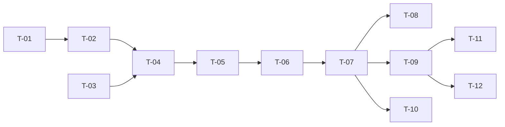

# TASKS — `RF-SP-038` Restablecer la contraseña de un usuario

| Campo | Valor |
|---|---|
| Requerimiento | `RF-SP-038` |
| Especificación | [`spec.md`](spec.md) |
| Plan | [`plan.md`](plan.md) |
| `plan.md` aprobado el | 24-08-2026 |
| Estado | **Aprobadas** — 24-08-2026 |
| Issue | Pendiente de crear |
| Rama | `feature/credenciales-y-perfil-propio` |
| Aprobadas por | Responsable técnico, 24-08-2026 |

---

## 1. Tareas

Una migración de una columna y ningún componente de dominio nuevo (`plan.md` §3). Todo el peso está en lo que la operación **no** debe hacer —levantar un bloqueo, devolver la credencial, aplicarse sobre el propio actor— y en una mitad que no vive aquí: la caducidad se fija en `T-02` y se comprueba en `RF-SP-034`.

| # | Tarea | Depende de | Verificación | Estado |
|---|---|---|---|---|
| `T-01` | Migración `V28__add_provisional_credential_expiry.sql`: `provisional_password_expires_at` sobre `users`, con el **`CHECK` que la ata a `must_change_password`** (`plan.md` §2) | — | Prueba de integración de esquema: una fecha de caducidad sin la marca **falla**; una credencial provisional sin caducidad también | **Hecha** |
| `T-02` | `domain/User.resetPasswordBy(...)`: sustituye el hash, marca el cambio obligatorio y fija la caducidad. **No toca el estado ni el bloqueo** | `T-01` | Pruebas unitarias sin Spring: sobre una cuenta bloqueada, el bloqueo permanece; sobre una inactiva, el estado permanece | **Hecha** |
| `T-03` | Consumir `SelfOperationGuard` de `RF-SP-028` para `RN-SP-017`, **sin reimplantarlo** | — | Prueba unitaria: el actor sobre sí mismo se rechaza; sobre otro, procede | **Hecha** |
| `T-04` | `application/ResetUserPasswordService` con `@Transactional` y el orden de `plan.md` §4 | `T-02`, `T-03` | Pruebas con dobles: la política se comprueba **antes** de leer la cuenta; `RN-SP-017` **después** de resolverla | **Hecha** |
| `T-05` | Revocación de todas las sesiones y publicación del corte de tokens de acceso, la primera dentro de la transacción y **el corte tras el commit** (`RF-SP-028` `plan.md` §7) | `T-04` | Prueba de integración: la sesión abierta de la persona afectada cae de inmediato, no en quince minutos | **Hecha** — 26-08-2026, en `AccessRevocationIT` |
| `T-06` | Auditoría: `PASSWORD_RESET` con severidad alta y `target_user_id` de la persona afectada, con **la fecha de caducidad en `detail`** y nada más; el `409` de `RN-SP-017` en `audit_error_log` | `T-05` | Prueba de integración: `actor_id` y `target_user_id` son **personas distintas**; ni la contraseña ni su longitud aparecen en `detail` | **Hecha** |
| `T-07` | `api/ResetPasswordRequest` y `UserController`: `POST /api/v1/users/{id}/password-reset` con el permiso `users:reset-password`, respondiendo `204` | `T-06` | Prueba de API: `204` sin cuerpo; un actor con `users:update` y sin `users:reset-password` recibe `403`; el `409` cita `RF-SP-037` | **Hecha** |
| `T-08` | **Comprobación de la caducidad en `RF-SP-034`**: pasado el plazo, la credencial provisional deja de autenticar | `T-07` | Prueba que ejecuta el restablecimiento, adelanta el reloj e intenta iniciar sesión. Es la mitad del requerimiento que no vive en él (`plan.md` §11) | **Hecha** |
| `T-09` | Pruebas de API e integración de los criterios de aceptación de `spec.md` §12 | `T-07` | La suite cubre `CA-SP-329` a `CA-SP-337` y `CA-SP-392` a `CA-SP-394` | **En curso** |
| `T-10` | Pruebas de los casos límite de `spec.md` §13: usuario inactivo, último superadministrador, sesión abierta, credencial nunca usada, dos restablecimientos concurrentes y restablecimiento seguido de cambio propio | `T-07` | Ninguno levanta un bloqueo ni cambia el estado de la cuenta | **En curso** |
| `T-11` | Documentación OpenAPI del endpoint: cuerpo, respuesta `204` y los estados `400`, `401`, `403`, `404`, `409` y `500` | `T-09` | El contrato publicado coincide con el comportamiento real (Art. VIII.6), y **no** documenta ningún cuerpo de respuesta | **Hecha** |
| `T-12` | Aplicar las enmiendas de `plan.md` §8: `requirements/sp.md` §10.10 gana la columna, `security.md` §3.2 gana la caducidad de la credencial provisional. Actualizar la matriz de trazabilidad | `T-09` | Ambos documentos con su fila de control de cambios y versión subida; la fila de `RF-SP-038` en la matriz enlaza esta tripleta | **En curso** |

**Estados:** `Pendiente` · `En curso` · `Hecha` · `Bloqueada`.

## 2. Orden de ejecución

## 3. Cobertura de los criterios de aceptación

| Criterio | Tarea que lo cubre |
|---|---|
| `CA-SP-329` | `T-02`, `T-09` |
| `CA-SP-330` | `T-02`, `T-09` |
| `CA-SP-331` | `T-05`, `T-09` |
| `CA-SP-332` | `T-03`, `T-07`, `T-09` |
| `CA-SP-333` | `T-04`, `T-09` |
| `CA-SP-334` | `T-07`, `T-09` |
| `CA-SP-335` | `T-02`, `T-09` |
| `CA-SP-336` | `T-06`, `T-09` |
| `CA-SP-392` | `T-01`, `T-08` |
| `CA-SP-393` | `T-06`, `T-07`, `T-09` |
| `CA-SP-394` | `T-02`, `T-10` |
| `CA-SP-337` | `T-07`, `T-09` |

## 4. Bloqueos

| # | Bloqueo | Desde | Responsable | Estado |
|---|---|---|---|---|
| 1 | `T-01` no es ejecutable hasta que `RF-SP-024` cree `users` con `must_change_password`, y `T-05` hasta que `RF-SP-034` cree `refresh_tokens` | 24-08-2026 | Responsable técnico | Abierto |
| 2 | `T-08` **modifica `RF-SP-034`**: la comprobación de la caducidad vive en el inicio de sesión. Debe coordinarse con aquella tripleta y no duplicarse en esta | 24-08-2026 | Responsable técnico | Abierto |
| 3 | `CA-SP-330` necesita `RF-SP-037` implementado para verificar que la marca y la caducidad se limpian | 24-08-2026 | Responsable técnico | Abierto |
| 4 | El **plazo de caducidad** de la credencial provisional no tiene valor decidido. Se declara en configuración junto al resto de parámetros de credenciales (`security.md` §3.2), y se fija al implementar `T-01` | 24-08-2026 | Responsable técnico | Abierto |
| 5 | **El aviso a la persona afectada sigue sin resolverse aquí** (`spec.md` §14, pregunta 3). Depende de **D-23** y lo cierra `RF-SP-040`. Mientras tanto, un restablecimiento que la persona no pidió solo es detectable revisando la auditoría | 24-08-2026 | Responsable del proyecto | Abierto |

## 4.bis Desviaciones respecto del plan e implementación real

| # | Desviación | Motivo | Consecuencia |
|---|---|---|---|
| 1 | La migración es **`V31`** y no `V28` | Ese número ya está ocupado. La reserva por requerimiento quedó muerta el 24-08-2026 | Ninguna. La columna y su `CHECK` son los que el plan pedía |
| 2 | `T-03` consume `SelfOperationGuard`, que se creó en `RF-SP-041` y no en `RF-SP-028` | `RF-SP-028` no estaba implementado cuando hizo falta | Ninguna: hay un solo sitio donde se compara actor y objetivo. Lo que **no** es único es el código de estado — aquí `RN-SP-017` es `409` y en el cambio de estado y la eliminación es `403`, porque los planes aprobados no coinciden. La comparación vive en un sitio y el estado lo elige cada contrato |
| 3 | `T-05` revoca las sesiones pero **no publica el corte** de tokens de acceso ya emitidos | El registro de corte es de `RF-SP-028` · `T-09` y sigue pendiente | **El token de acceso ya emitido sigue valiendo hasta quince minutos** tras el restablecimiento. El refresh token sí cae de inmediato, de modo que la ventana está acotada |
| 4 | `T-09`, `T-10` y `T-12` quedan **En curso** | Faltan los casos límite —último superadministrador, dos restablecimientos seguidos— y las enmiendas a `requirements/sp.md` §10.10 y `security.md` §3.2 | Las enmiendas de los documentos transversales están pendientes y declaradas |

### Lo que sí quedó verificado

- **La caducidad, que es la decisión que define el requerimiento.** Recién fijada, la credencial provisional entra; pasado el plazo, deja de autenticar — y el rechazo es el **genérico**, porque decir «su credencial provisional caducó» confirmaría que la cuenta existe y que alguien la restableció.
- **La contraseña que se pone el titular no caduca.** Es la otra mitad: sin ella, la caducidad se habría aplicado a todas y habría echado a la gente de su propia cuenta cada dos días.
- **Restablecer no reactiva.** Una cuenta desactivada sigue desactivada: confundirlos convertiría esta operación en una vía lateral para devolver el acceso sin pasar por la que existe para eso, y sin su motivo obligatorio.
- **La contraseña asignada no se devuelve**, y el evento lleva **la caducidad y nada más** — ni la contraseña, ni su resumen, ni su longitud.
- **Sobre la propia cuenta es `409`, y el mensaje dice cuál es la operación correcta**: sin esa indicación, quien lo recibe concluye que no puede cambiar su propia contraseña.

## 5. Definición de terminado

El requerimiento no está terminado hasta cumplir **todas** las condiciones de la constitución §16:

- [ ] Todas las tareas en estado `Hecha`. — cuatro en curso.
- [ ] Todos los criterios de aceptación con prueba automatizada en verde. — faltan el último superadministrador y dos restablecimientos seguidos.
- [x] `mvn verify` en verde en local. — 103 unitarias y 407 de integración, 24-08-2026.
- [x] Toda escritura emite su evento de auditoría, en la transacción que corresponde. — `PASSWORD_RESET` con severidad alta, la caducidad en el detalle y nada derivado de la credencial.
- [x] Los endpoints nuevos declaran su permiso. — `users:reset-password`.
- [x] El contrato OpenAPI coincide con el comportamiento real.
- [ ] Documentación afectada actualizada en el mismo Pull Request. — faltan las enmiendas de `requirements/sp.md` §10.10 y `security.md` §3.2.
- [x] Matriz de trazabilidad actualizada.
- [ ] Pull Request aprobado por alguien distinto del autor e integrado.
