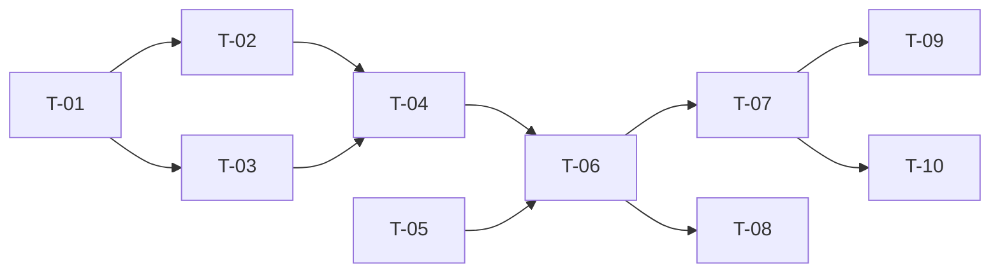

# TASKS — `RF-SP-039` Consultar el propio perfil

| Campo | Valor |
|---|---|
| Requerimiento | `RF-SP-039` |
| Especificación | [`spec.md`](spec.md) |
| Plan | [`plan.md`](plan.md) |
| `plan.md` aprobado el | 24-08-2026 |
| Estado | **Aprobadas** — 24-08-2026 |
| Issue | Pendiente de crear |
| Rama | `feature/credenciales-y-perfil-propio` |
| Aprobadas por | Responsable técnico, 24-08-2026 |

---

## 1. Tareas

Sin migración y sin componentes de dominio: es una consulta (`plan.md` §3). La lista es corta y lo que la hace no trivial son dos cosas que no se ven en el camino feliz: que el endpoint **no admita ninguna entrada** —lo que lo hace imposible de desviar hacia otra persona— y que el filtro de cambio obligatorio **lo exceptúe**, sin lo cual la interfaz queda ciega justo cuando más necesita orientar.

| # | Tarea | Depende de | Verificación | Estado |
|---|---|---|---|---|
| `T-01` | `application/GetOwnProfileQuery`: resuelve el actor del contexto de seguridad y **no recibe ningún identificador** | — | Prueba con dobles: la firma del caso de uso no admite parámetro alguno; el actor sale de `AuthenticatedActor` | **Hecha** |
| `T-02` | Resolución de permisos efectivos **con el mismo componente que autoriza**, reutilizando el de `RF-SP-026` | `T-01` | Prueba de integración: los permisos del perfil coinciden exactamente con los que el sistema aplica al autorizar una petición del mismo actor | **Hecha** |
| `T-03` | Reutilizar `UserDetailQueryRepository` de `RF-SP-026` para los datos, **sin escribir una consulta paralela** | `T-01` | Prueba de integración: una sola consulta; el conteo de sentencias no crece respecto de `RF-SP-026` | **Hecha** |
| `T-04` | `api/OwnProfileResponse`: DTO **propio**, sin fechas de creación ni modificación, sin expiración de bloqueo y sin equipo a cargo | `T-02`, `T-03` | Prueba de API sobre el JSON: los campos prohibidos por `CA-SP-470` y `CA-SP-471` **no aparecen**; `membership` y `supervisor` van **ausentes**, no en nulo, cuando no aplican | **Hecha** |
| `T-05` | **Exceptuar esta ruta en `MustChangePasswordFilter`** de `RF-SP-034`, junto con `RF-SP-037` | — | Prueba de API: con `mcp` en verdadero, el perfil responde y el indicador llega activo. Sin la excepción la interfaz no sabe por qué la rechazan | **Hecha** — 26-08-2026, en `MustChangePasswordIT` |
| `T-06` | `api/UserController`: `GET /api/v1/users/me`, autenticado y sin permiso, **sin parámetros de ruta, consulta ni cuerpo** | `T-04`, `T-05` | Prueba de API: `200` con el perfil; ningún método de escritura sobre la ruta; `401` sin credencial y con cuenta eliminada | **Hecha** |
| `T-07` | Pruebas de API e integración de los criterios de aceptación de `spec.md` §12 | `T-06` | La suite cubre `CA-SP-430` a `CA-SP-441` y `CA-SP-470` a `CA-SP-472` | **En curso** |
| `T-08` | Pruebas de los casos límite de `spec.md` §13, con la del **rol retirado con la sesión abierta** documentando la asimetría | `T-06` | El perfil refleja el estado real aunque el token siga transportando el rol retirado. Sin esta prueba, alguien «arreglará» la consulta para que lea del token | **En curso** |
| `T-09` | Documentación OpenAPI del endpoint: respuesta `200` y estados `401` y `500`, con `lastLoginAt` descrito como **dato informativo de la sesión en curso**, no señal de acceso ajeno | `T-07` | El contrato publicado coincide con el comportamiento real (Art. VIII.6), y la descripción evita la lectura equivocada del último acceso | **Hecha** |
| `T-10` | Actualizar la matriz de trazabilidad de `docs/requirements.md` | `T-07` | La fila de `RF-SP-039` refleja el estado y enlaza esta tripleta | **Hecha** |

### 1.1 `id` en la respuesta — 04-09-2026

Enmienda del Art. I.7 sobre un requerimiento ya implementado. La pidió el frontend como `R-28`, y lo que destapó es que el motivo por el que este campo faltaba —«quien pregunta ya sabe quién es»— **era falso**: el identificador viaja dentro del token y leerlo obligaría al navegador a descomponer un JWT.

| ID | Tarea | Depende de | Verificación | Estado |
|---|---|---|---|---|
| `T-11` | `OwnProfileResponse` abre con `id`, y su Javadoc **deja de afirmar que no lo lleva** | — | La respuesta trae el `uuid` del actor | **Hecha** — 04-09-2026 |
| `T-12` | Prueba de `CA-SP-473`: el identificador es **el mismo** con el que `RF-SP-026` consulta a esa persona | `T-11` | No basta con que venga un `uuid`: tiene que ser **ese**. Un identificador plausible y equivocado dejaría comprar a nombre de otro sin que nada fallara | **Hecha** — 04-09-2026 |
| `T-13` | OpenAPI: el campo entra en el contrato publicado | `T-11` | `mvn verify` regenera `docs/api/` y CI compara | **Hecha** — 04-09-2026 |

**`T-12` es la que importa, y no es una formalidad.** Este campo existe para poner el identificador en el cuerpo de una compra: si devolviera un `uuid` cualquiera —el de la sesión, el de otra tabla— la prueba de que «viene un identificador» pasaría igual, y el defecto aparecería como una venta a nombre de otro. Se contrasta contra la tabla, no contra sí mismo.

**Lo que esta enmienda NO desbloquea, y conviene que quede escrito aquí también:** `POST /api/v1/movements` exige `movements:create`, hoy reservado a `SUPERADMIN` (`requirements/mv.md` §6.1). Un cliente sigue sin poder llamarlo. La compra propia es `RF-MV-002` —`POST /api/v1/movements/mine`, sin permiso—, aprobada el 02-09-2026 y **sin construir**.

**Estados:** `Pendiente` · `En curso` · `Hecha` · `Bloqueada`.

## 2. Orden de ejecución

## 3. Cobertura de los criterios de aceptación

| Criterio | Tarea que lo cubre |
|---|---|
| `CA-SP-430` | `T-06`, `T-07` |
| `CA-SP-431` | `T-02`, `T-07` |
| `CA-SP-432` | `T-02`, `T-07` |
| `CA-SP-433` | `T-02`, `T-07` |
| `CA-SP-434` | `T-01`, `T-06`, `T-07` |
| `CA-SP-435` | `T-04`, `T-07` |
| `CA-SP-436` | `T-04`, `T-05`, `T-07` |
| `CA-SP-437` | `T-03`, `T-04`, `T-07` |
| `CA-SP-438` | `T-06`, `T-07` |
| `CA-SP-439` | `T-06`, `T-07` |
| `CA-SP-440` | `T-03`, `T-07` |
| `CA-SP-441` | `T-03`, `T-07` |
| `CA-SP-470` | `T-04`, `T-07` |
| `CA-SP-471` | `T-04`, `T-07` |
| `CA-SP-472` | `T-06`, `T-07` |

## 4. Bloqueos

| # | Bloqueo | Desde | Responsable | Estado |
|---|---|---|---|---|
| 1 | Ninguna tarea es ejecutable hasta que `RF-SP-024` cree `users` y `RF-SP-026` aporte `UserDetailQueryRepository` y la resolución de permisos | 24-08-2026 | Responsable técnico | Abierto |
| 2 | `T-05` modifica un filtro de `RF-SP-034` y debe coordinarse con `RF-SP-037`, que exceptúa el otro endpoint. **Las dos excepciones son la misma lista** y conviene escribirlas juntas | 24-08-2026 | Responsable técnico | Abierto |
| 3 | `CA-SP-440` necesita `RF-SP-034` implementado: es quien escribe `last_login_at`, y `CA-SP-441` necesita `RF-SP-041` | 24-08-2026 | Responsable técnico | Abierto |
| 4 | **Hueco declarado, no de esta tripleta:** nadie puede comprobar si otra persona entró con su cuenta, porque `RF-SP-034` sobrescribe `last_login_at` en cada entrada y `RF-SP-014` exige permiso de auditoría (`spec.md` §4.2 y §13) | 22-08-2026 | Responsable del proyecto | Abierto |
| 5 | **Hueco declarado, no de esta tripleta:** la autoedición del propio perfil no existe como requerimiento. Su síntoma —tráfico de soporte por correcciones triviales— es la condición para registrarlo (`spec.md` §14, pregunta 3) | 22-08-2026 | Responsable del proyecto | Abierto |

## 4.bis Desviaciones respecto del plan e implementación real

| # | Desviación | Motivo | Consecuencia |
|---|---|---|---|
| 1 | ~~`T-05` —exceptuar esta ruta en el filtro de cambio obligatorio— queda **Pendiente**~~ — **cerrada el 26-08-2026** | El filtro ya existe: `RF-SP-034` · `T-12` se implementó ese día | Esta ruta y la del cambio de contraseña son sus dos excepciones de negocio; resultaron ser siete en total, porque las tres rutas públicas de sesión también hubo que exceptuarlas (`RF-SP-034` `plan.md` §5.1). `MustChangePasswordIT` comprueba que el perfil responde con el indicador activo |
| 2 | La marca de cambio obligatorio se lee del agregado y no de la proyección | La proyección de detalle **no la selecciona a propósito**: un tercero con permiso de lectura no debe verla. Aquí sí, porque al titular le dice que tiene que actuar | Una consulta más en este endpoint. La alternativa —añadirla a la proyección compartida— habría filtrado el dato al detalle de terceros |
| 3 | `T-07` y `T-08` quedan **En curso** | Falta el caso del rol retirado con la sesión abierta, que documenta la asimetría entre lo que el perfil dice y lo que el token lleva | Los permisos se resuelven contra la base en cada petición, de modo que el perfil ya refleja el retiro; lo que no está fijado por prueba es esa asimetría |

### Lo que sí quedó verificado

Casi todo lo que define este endpoint es **qué no devuelve** y **a quién**:

- **Los permisos efectivos**, que son su razón de ser: cierran el hallazgo `DF-04` del frontend. Sin ellos, la interfaz tenía que deducir del listado de roles qué puede hacer la persona, duplicando en el navegador una regla que vive en el servidor — y la copia del navegador se quedaba atrás.
- **`me` es un literal**: la ruta con identificador es otra operación y exige permiso, y un actor sin permisos recibe `403` allí y `200` aquí. Un parámetro de consulta no cambia nada, porque no hay ninguno declarado.
- **Solo el superior, nunca el equipo.** A quién reporta uno es un dato del actor; quiénes dependen de uno es un conjunto de terceros — la distinción que sostiene la reserva de **D-22**.
- **Ni identificador, ni fechas de la ficha, ni expiración de bloqueo, ni intentos fallidos, ni nada de la credencial.**
- **La cuenta eliminada tras emitirse el token devuelve `401` y no `404`**: lo que ha dejado de valer es la sesión, no la ruta.
- **No exige permiso alguno**, solo estar autenticado: no hay recurso ajeno que proteger.

Y el <b>recorrido completo</b>, que ninguno de los tres requerimientos verifica por su cuenta: restablecer, entrar con la credencial provisional, ver en el perfil que toca cambiarla, cambiarla, y comprobar que el perfil deja de pedirlo.

## 5. Definición de terminado

El requerimiento no está terminado hasta cumplir **todas** las condiciones de la constitución §16:

- [ ] Todas las tareas en estado `Hecha`. — `T-05` quedó hecha el 26-08-2026, al existir el filtro. Quedan dos en curso.
- [ ] Todos los criterios de aceptación con prueba automatizada en verde. — falta el rol retirado con la sesión abierta.
- [x] `mvn verify` en verde en local. — 103 unitarias y 407 de integración, 24-08-2026.
- [x] Toda escritura emite su evento de auditoría, en la transacción que corresponde. — no escribe: es una consulta.
- [x] Los endpoints nuevos declaran su permiso. — **no exige ninguno, y es deliberado**: no hay recurso ajeno que proteger.
- [x] El contrato OpenAPI coincide con el comportamiento real. — `OpenApiContractIT` fija la **ausencia** de parámetros y de los tres estados que no le corresponden.
- [x] Documentación afectada actualizada en el mismo Pull Request. — `requirements.md` v0.42.0.
- [x] Matriz de trazabilidad actualizada.
- [ ] Pull Request aprobado por alguien distinto del autor e integrado.
