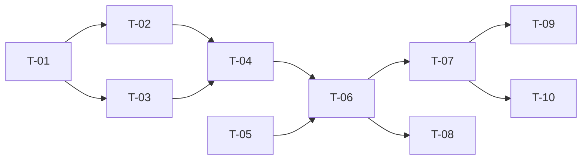

# TASKS — `RF-SP-039` Consultar el propio perfil

| Campo | Valor |
|---|---|
| Requerimiento | `RF-SP-039` |
| Especificación | [`spec.md`](spec.md) |
| Plan | [`plan.md`](plan.md) |
| `plan.md` aprobado el | 24-08-2026 |
| Estado | **En revisión** |
| Issue | Pendiente de crear |
| Rama | `feature/consultar-perfil-propio` |
| Aprobadas por | Pendiente |

---

## 1. Tareas

Sin migración y sin componentes de dominio: es una consulta (`plan.md` §3). La lista es corta y lo que la hace no trivial son dos cosas que no se ven en el camino feliz: que el endpoint **no admita ninguna entrada** —lo que lo hace imposible de desviar hacia otra persona— y que el filtro de cambio obligatorio **lo exceptúe**, sin lo cual la interfaz queda ciega justo cuando más necesita orientar.

| # | Tarea | Depende de | Verificación | Estado |
|---|---|---|---|---|
| `T-01` | `application/GetOwnProfileQuery`: resuelve el actor del contexto de seguridad y **no recibe ningún identificador** | — | Prueba con dobles: la firma del caso de uso no admite parámetro alguno; el actor sale de `AuthenticatedActor` | Pendiente |
| `T-02` | Resolución de permisos efectivos **con el mismo componente que autoriza**, reutilizando el de `RF-SP-026` | `T-01` | Prueba de integración: los permisos del perfil coinciden exactamente con los que el sistema aplica al autorizar una petición del mismo actor | Pendiente |
| `T-03` | Reutilizar `UserDetailQueryRepository` de `RF-SP-026` para los datos, **sin escribir una consulta paralela** | `T-01` | Prueba de integración: una sola consulta; el conteo de sentencias no crece respecto de `RF-SP-026` | Pendiente |
| `T-04` | `api/OwnProfileResponse`: DTO **propio**, sin fechas de creación ni modificación, sin expiración de bloqueo y sin equipo a cargo | `T-02`, `T-03` | Prueba de API sobre el JSON: los campos prohibidos por `CA-SP-470` y `CA-SP-471` **no aparecen**; `membership` y `supervisor` van **ausentes**, no en nulo, cuando no aplican | Pendiente |
| `T-05` | **Exceptuar esta ruta en `MustChangePasswordFilter`** de `RF-SP-034`, junto con `RF-SP-037` | — | Prueba de API: con `mcp` en verdadero, el perfil responde y el indicador llega activo. Sin la excepción la interfaz no sabe por qué la rechazan | Pendiente |
| `T-06` | `api/UserController`: `GET /api/v1/users/me`, autenticado y sin permiso, **sin parámetros de ruta, consulta ni cuerpo** | `T-04`, `T-05` | Prueba de API: `200` con el perfil; ningún método de escritura sobre la ruta; `401` sin credencial y con cuenta eliminada | Pendiente |
| `T-07` | Pruebas de API e integración de los criterios de aceptación de `spec.md` §12 | `T-06` | La suite cubre `CA-SP-430` a `CA-SP-441` y `CA-SP-470` a `CA-SP-472` | Pendiente |
| `T-08` | Pruebas de los casos límite de `spec.md` §13, con la del **rol retirado con la sesión abierta** documentando la asimetría | `T-06` | El perfil refleja el estado real aunque el token siga transportando el rol retirado. Sin esta prueba, alguien «arreglará» la consulta para que lea del token | Pendiente |
| `T-09` | Documentación OpenAPI del endpoint: respuesta `200` y estados `401` y `500`, con `lastLoginAt` descrito como **dato informativo de la sesión en curso**, no señal de acceso ajeno | `T-07` | El contrato publicado coincide con el comportamiento real (Art. VIII.6), y la descripción evita la lectura equivocada del último acceso | Pendiente |
| `T-10` | Actualizar la matriz de trazabilidad de `docs/requirements.md` | `T-07` | La fila de `RF-SP-039` refleja el estado y enlaza esta tripleta | Pendiente |

**Estados:** `Pendiente` · `En curso` · `Hecha` · `Bloqueada`.

## 2. Orden de ejecución

## 3. Cobertura de los criterios de aceptación

| Criterio | Tarea que lo cubre |
|---|---|
| `CA-SP-430` | `T-06`, `T-07` |
| `CA-SP-431` | `T-02`, `T-07` |
| `CA-SP-432` | `T-02`, `T-07` |
| `CA-SP-433` | `T-02`, `T-07` |
| `CA-SP-434` | `T-01`, `T-06`, `T-07` |
| `CA-SP-435` | `T-04`, `T-07` |
| `CA-SP-436` | `T-04`, `T-05`, `T-07` |
| `CA-SP-437` | `T-03`, `T-04`, `T-07` |
| `CA-SP-438` | `T-06`, `T-07` |
| `CA-SP-439` | `T-06`, `T-07` |
| `CA-SP-440` | `T-03`, `T-07` |
| `CA-SP-441` | `T-03`, `T-07` |
| `CA-SP-470` | `T-04`, `T-07` |
| `CA-SP-471` | `T-04`, `T-07` |
| `CA-SP-472` | `T-06`, `T-07` |

## 4. Bloqueos

| # | Bloqueo | Desde | Responsable | Estado |
|---|---|---|---|---|
| 1 | Ninguna tarea es ejecutable hasta que `RF-SP-024` cree `users` y `RF-SP-026` aporte `UserDetailQueryRepository` y la resolución de permisos | 24-08-2026 | Responsable técnico | Abierto |
| 2 | `T-05` modifica un filtro de `RF-SP-034` y debe coordinarse con `RF-SP-037`, que exceptúa el otro endpoint. **Las dos excepciones son la misma lista** y conviene escribirlas juntas | 24-08-2026 | Responsable técnico | Abierto |
| 3 | `CA-SP-440` necesita `RF-SP-034` implementado: es quien escribe `last_login_at`, y `CA-SP-441` necesita `RF-SP-041` | 24-08-2026 | Responsable técnico | Abierto |
| 4 | **Hueco declarado, no de esta tripleta:** nadie puede comprobar si otra persona entró con su cuenta, porque `RF-SP-034` sobrescribe `last_login_at` en cada entrada y `RF-SP-014` exige permiso de auditoría (`spec.md` §4.2 y §13) | 22-08-2026 | Responsable del proyecto | Abierto |
| 5 | **Hueco declarado, no de esta tripleta:** la autoedición del propio perfil no existe como requerimiento. Su síntoma —tráfico de soporte por correcciones triviales— es la condición para registrarlo (`spec.md` §14, pregunta 3) | 22-08-2026 | Responsable del proyecto | Abierto |

## 5. Definición de terminado

El requerimiento no está terminado hasta cumplir **todas** las condiciones de la constitución §16:

- [ ] Todas las tareas en estado `Hecha`.
- [ ] Todos los criterios de aceptación con prueba automatizada en verde.
- [ ] `mvn verify` en verde en local.
- [ ] Toda escritura emite su evento de auditoría, en la transacción que corresponde.
- [ ] Los endpoints nuevos declaran su permiso.
- [ ] El contrato OpenAPI coincide con el comportamiento real.
- [ ] Documentación afectada actualizada en el mismo Pull Request.
- [ ] Matriz de trazabilidad actualizada.
- [ ] Pull Request aprobado por alguien distinto del autor e integrado.
