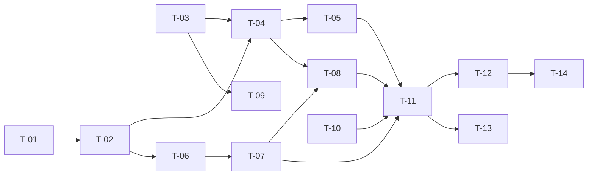

# TASKS — `RF-SP-040` Restablecer la propia contraseña olvidada

| Campo | Valor |
|---|---|
| Requerimiento | `RF-SP-040` |
| Especificación | [`spec.md`](spec.md) |
| Plan | [`plan.md`](plan.md) |
| `plan.md` aprobado el | 24-08-2026 |
| Estado | **En revisión** |
| Issue | Pendiente de crear |
| Rama | `feature/restablecer-contrasena-olvidada` |
| Aprobadas por | Pendiente |

---

## 1. Tareas

**`T-09` está bloqueada por D-23 y ninguna otra lo está.** El adaptador de envío es la única pieza que la decisión pendiente impide escribir; todo lo demás se construye contra el puerto `NotificationSender` y se prueba con un doble.

Eso permite avanzar el requerimiento casi entero, pero **no darlo por terminado**: sin envío real nadie recibe nada, y `T-14` no puede cerrarse.

| # | Tarea | Depende de | Verificación | Estado |
|---|---|---|---|---|
| `T-01` | Migración `V29__create_password_reset_permits.sql`, con el índice único sobre `permit_hash` y el **único parcial que garantiza un solo permiso vivo por persona** (`plan.md` §2) | — | Prueba de integración de esquema: dos permisos vivos para el mismo usuario **fallan**; uno consumido y otro vivo se admiten | Pendiente |
| `T-02` | `domain/PasswordResetPermit` y su puerto: vigencia, consumo, sustitución, y búsqueda por hash **con bloqueo de fila** | `T-01` | Pruebas unitarias del agregado sobre los cuatro motivos de invalidez; prueba de integración del bloqueo | Pendiente |
| `T-03` | `shared/notification/NotificationSender`: **puerto transversal**, no de `SP` (`architecture.md` §15.1) | — | Prueba con doble: el puerto se declara con tipos del JDK y **sin** ninguna referencia a `SP` ni a ningún proveedor | Pendiente |
| `T-04` | `application/RequestPasswordRecoveryService`: emite el permiso, invalida el anterior y **dispara el envío después del commit**, nunca dentro | `T-02`, `T-03` | Prueba de integración: una transacción revertida **no** envía nada; el permiso enviado siempre existe en la base de datos | Pendiente |
| `T-05` | **Respuesta indistinguible** de la solicitud, en cuerpo y en tiempo: mismo `202` exista o no la identidad, con el envío desacoplado | `T-04` | **Prueba de temporización**: la mediana de identidad existente e inexistente queda dentro del margen declarado. Esperar al envío hace fallar esta prueba y ninguna otra | Pendiente |
| `T-06` | `application/ConfirmPasswordRecoveryService` con el orden de `plan.md` §4: **la política se comprueba antes de tocar el permiso** | `T-02` | Prueba de integración: una contraseña corta se rechaza y el permiso **sigue vivo** | Pendiente |
| `T-07` | Sustitución de la credencial, consumo del permiso, limpieza de la marca de cambio obligatorio y de su caducidad, y revocación de todas las sesiones, en una sola transacción | `T-06` | Prueba de integración: los cinco efectos ocurren juntos; la cuenta **no** queda marcada para cambio obligatorio | Pendiente |
| `T-08` | Auditoría: cuatro filas de `PASSWORD_RESET` distinguidas por `outcome` y por la etapa en `detail`, **sin registrar la identidad probada** cuando no existe | `T-04`, `T-07` | Prueba de integración: la solicitud sobre una identidad inexistente deja fila con `target_user_id` nulo y **sin** el identificador en `detail` | Pendiente |
| `T-09` | **Adaptador de envío**: proveedor, desacople, reintentos y rebotes | `T-03`, **D-23** | Un envío real llega a su destinatario, y un fallo del proveedor no altera ninguna de las dos respuestas | **Bloqueada** |
| `T-10` | Límites de tasa: por identidad **y** por origen en la solicitud, por origen en la confirmación | — | Prueba de API: superar cualquiera de los dos devuelve `429` **sin revelar** si la identidad existe | Pendiente |
| `T-11` | `api`: las dos rutas de `plan.md` §4, y **añadirlas a `RUTAS_PUBLICAS`** de `SecurityConfig` | `T-05`, `T-07`, `T-08`, `T-10` | Prueba de API: ambas responden sin token; los cuatro casos de `EX-001` devuelven cuerpo idéntico | Pendiente |
| `T-12` | Pruebas de API e integración de los criterios de aceptación de `spec.md` §12 | `T-11` | La suite cubre `CA-SP-456` a `CA-SP-469`, `CA-SP-473` y `CA-SP-475`. **`CA-SP-474` queda pendiente de `T-09`** | Pendiente |
| `T-13` | Pruebas de los casos límite de `spec.md` §13, con las **dos concurrentes** como las más importantes | `T-11` | Dos confirmaciones simultáneas: una consume y otra se rechaza. Dos solicitudes simultáneas: queda **un** permiso vivo | Pendiente |
| `T-14` | Documentación OpenAPI de las dos rutas, y aplicar las enmiendas de `plan.md` §8: `requirements/sp.md` §9 gana la segunda ruta y `security.md` §5.5 los dos límites de tasa. Actualizar la matriz | `T-12` | Ambos documentos con su fila de control de cambios; la fila de `RF-SP-040` en la matriz enlaza esta tripleta | Pendiente |

**Estados:** `Pendiente` · `En curso` · `Hecha` · `Bloqueada`.

## 2. Orden de ejecución

`T-09` cuelga solo de `T-03` y de **D-23**, y no bloquea a ninguna otra. Es lo que permite construir el requerimiento entero mientras la decisión sigue abierta.

## 3. Cobertura de los criterios de aceptación

| Criterio | Tarea que lo cubre |
|---|---|
| `CA-SP-456` | `T-07`, `T-11`, `T-12` |
| `CA-SP-457` | `T-05`, `T-12` |
| `CA-SP-458` | `T-02`, `T-07`, `T-12` |
| `CA-SP-459` | `T-02`, `T-12` |
| `CA-SP-460` | `T-01`, `T-04`, `T-12` |
| `CA-SP-461` | `T-06`, `T-12` |
| `CA-SP-462` | `T-07`, `T-12` |
| `CA-SP-463` | `T-07`, `T-12` |
| `CA-SP-464` | `T-07`, `T-12` |
| `CA-SP-465` | `T-07`, `T-12` |
| `CA-SP-466` | `T-01`, `T-08`, `T-12` |
| `CA-SP-467` | `T-10`, `T-12` |
| `CA-SP-468` | `T-08`, `T-12` |
| `CA-SP-469` | `T-08`, `T-12` |
| `CA-SP-473` | `T-05` |
| `CA-SP-474` | **`T-09`** — bloqueado por D-23 |
| `CA-SP-475` | `T-05`, `T-12` |

**`CA-SP-474` es el único criterio del módulo que ninguna tarea ejecutable cubre.** Verifica que el titular recibe el aviso, y eso exige un envío real.

## 4. Bloqueos

| # | Bloqueo | Desde | Responsable | Estado |
|---|---|---|---|---|
| 1 | **D-23** — mecanismo concreto de envío: proveedor, desacople, reintentos y rebotes. Bloquea `T-09` y con ella `CA-SP-474`. **No bloquea ninguna otra tarea**: la forma quedó decidida en `architecture.md` §15.1 y el resto se construye contra el puerto | 22-08-2026 | Responsable del proyecto | Abierto |
| 2 | Ninguna tarea es ejecutable hasta que `RF-SP-024` cree `users` y `RF-SP-034` cree `refresh_tokens` | 24-08-2026 | Responsable técnico | Abierto |
| 3 | `T-03` crea un puerto **transversal** que no pertenece a `SP`. Su ubicación y su firma deben revisarse con la vista puesta en `RF-SP-027` y en los envíos de academia y comisiones, que serán sus otros consumidores | 24-08-2026 | Responsable técnico | Abierto |
| 4 | La **vigencia del permiso** son treinta minutos (`security.md` §3.2) y las **cotas de tasa** no tienen valor decidido. Se fijan al implementar `T-01` y `T-10` | 24-08-2026 | Responsable técnico | Abierto |
| 5 | **El correo de la cuenta no está verificado** y esta operación lo convierte en la llave de la cuenta. Heredado de `RF-SP-027` y agravado aquí; **no tiene requerimiento que lo cubra**. Es un hueco del módulo, no de esta tripleta | 24-08-2026 | Responsable del proyecto | Abierto |
| 6 | La **purga** de permisos consumidos y caducados no tiene requerimiento, igual que la de `refresh_tokens` (`RF-SP-035`) | 24-08-2026 | Responsable técnico | Abierto |

## 5. Definición de terminado

El requerimiento no está terminado hasta cumplir **todas** las condiciones de la constitución §16:

- [ ] Todas las tareas en estado `Hecha` — **incluida `T-09`, que exige cerrar D-23**.
- [ ] Todos los criterios de aceptación con prueba automatizada en verde, **incluido `CA-SP-474`**.
- [ ] `mvn verify` en verde en local.
- [ ] Toda escritura emite su evento de auditoría, en la transacción que corresponde.
- [ ] Los endpoints nuevos declaran su permiso.
- [ ] El contrato OpenAPI coincide con el comportamiento real.
- [ ] Documentación afectada actualizada en el mismo Pull Request.
- [ ] Matriz de trazabilidad actualizada.
- [ ] Pull Request aprobado por alguien distinto del autor e integrado.
