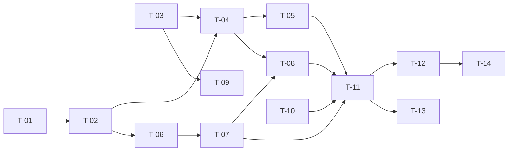

# TASKS — `RF-SP-040` Restablecer la propia contraseña olvidada

| Campo | Valor |
|---|---|
| Requerimiento | `RF-SP-040` |
| Especificación | [`spec.md`](spec.md) |
| Plan | [`plan.md`](plan.md) |
| `plan.md` aprobado el | 24-08-2026 |
| Estado | **Aprobadas** — 26-08-2026 |
| Issue | Pendiente de crear |
| Rama | `feature/restablecer-contrasena-olvidada` |
| Aprobadas por | Responsable técnico, 26-08-2026 |

---

## 1. Tareas

**D-23 quedó cerrada el 26-08-2026 con Resend**, y con ella la única tarea que estaba bloqueada. Las catorce están hechas.

Se construyó en el orden que el plan previó —todo contra el puerto `NotificationSender`, con un doble— y el adaptador entró al final, que es exactamente lo que ese diseño perseguía: la decisión pendiente nunca llegó a detener el requerimiento.

| # | Tarea | Depende de | Verificación | Estado |
|---|---|---|---|---|
| `T-01` | Migración `V37__create_password_reset_permits.sql`, con el índice único sobre `permit_hash` y el **único parcial que garantiza un solo permiso vivo por persona** (`plan.md` §2) | — | Prueba de integración de esquema: dos permisos vivos para el mismo usuario **fallan**; uno consumido y otro vivo se admiten | **Hecha** — 26-08-2026. **`V29` estaba tomada**: el número se reservó al aprobar el plan, antes de que se aplicaran `V13` a `V36`. Misma corrección que `V32` y `V33` |
| `T-02` | `domain/PasswordResetPermit` y su puerto: vigencia, consumo, sustitución, y búsqueda por hash **con bloqueo de fila** | `T-01` | Pruebas unitarias del agregado sobre los cuatro motivos de invalidez; prueba de integración del bloqueo | **Hecha** — 26-08-2026 |
| `T-03` | `shared/notification/NotificationSender`: **puerto transversal**, no de `SP` (`architecture.md` §15.1) | — | Prueba con doble: el puerto se declara con tipos del JDK y **sin** ninguna referencia a `SP` ni a ningún proveedor | **Hecha** — 26-08-2026 |
| `T-04` | `application/RequestPasswordRecoveryService`: emite el permiso, invalida el anterior y **dispara el envío después del commit**, nunca dentro | `T-02`, `T-03` | Prueba de integración: una transacción revertida **no** envía nada; el permiso enviado siempre existe en la base de datos | **Hecha** — 26-08-2026 |
| `T-05` | **Respuesta indistinguible** de la solicitud, en cuerpo y en tiempo: mismo `202` exista o no la identidad, con el envío desacoplado | `T-04` | **Prueba de temporización**: la mediana de identidad existente e inexistente queda dentro del margen declarado. Esperar al envío hace fallar esta prueba y ninguna otra | **Hecha** — 26-08-2026 |
| `T-06` | `application/ConfirmPasswordRecoveryService` con el orden de `plan.md` §4: **la política se comprueba antes de tocar el permiso** | `T-02` | Prueba de integración: una contraseña corta se rechaza y el permiso **sigue vivo** | **Hecha** — 26-08-2026 |
| `T-07` | Sustitución de la credencial, consumo del permiso, limpieza de la marca de cambio obligatorio y de su caducidad, y revocación de todas las sesiones, en una sola transacción | `T-06` | Prueba de integración: los cinco efectos ocurren juntos; la cuenta **no** queda marcada para cambio obligatorio | **Hecha** — 26-08-2026 |
| `T-08` | Auditoría: cuatro filas de `PASSWORD_RESET` distinguidas por `outcome` y por la etapa en `detail`, **sin registrar la identidad probada** cuando no existe | `T-04`, `T-07` | Prueba de integración: la solicitud sobre una identidad inexistente deja fila con `target_user_id` nulo y **sin** el identificador en `detail` | **Hecha** — 26-08-2026 |
| `T-09` | **Adaptador de envío**: proveedor, desacople, reintentos y rebotes | `T-03`, ~~**D-23**~~ | Un envío real llega a su destinatario, y un fallo del proveedor no altera ninguna de las dos respuestas | **Hecha** — 26-08-2026. **D-23 se cierra con Resend**, por decisión del responsable del proyecto. La segunda mitad de la verificación la fija `CA-SP-475`; la primera —un envío real— exige una clave y un dominio verificado, y se comprueba en el entorno, no en la suite |
| `T-10` | Límites de tasa: por identidad **y** por origen en la solicitud, por origen en la confirmación | — | Prueba de API: superar cualquiera de los dos devuelve `429` **sin revelar** si la identidad existe | **Hecha** — 26-08-2026 |
| `T-11` | `api`: las dos rutas de `plan.md` §4, y **añadirlas a `RUTAS_PUBLICAS`** de `SecurityConfig` | `T-05`, `T-07`, `T-08`, `T-10` | Prueba de API: ambas responden sin token; los cuatro casos de `EX-001` devuelven cuerpo idéntico | **Hecha** — 26-08-2026 |
| `T-12` | Pruebas de API e integración de los criterios de aceptación de `spec.md` §12 | `T-11` | La suite cubre `CA-SP-456` a `CA-SP-469`, `CA-SP-473` y `CA-SP-475`. **`CA-SP-474` queda pendiente de `T-09`** | **Hecha** — 26-08-2026 |
| `T-13` | Pruebas de los casos límite de `spec.md` §13, con las **dos concurrentes** como las más importantes | `T-11` | Dos confirmaciones simultáneas: una consume y otra se rechaza. Dos solicitudes simultáneas: queda **un** permiso vivo | **Hecha** — 26-08-2026 |
| `T-14` | Documentación OpenAPI de las dos rutas, y aplicar las enmiendas de `plan.md` §8: `requirements/sp.md` §9 gana la segunda ruta y `security.md` §5.5 los dos límites de tasa. Actualizar la matriz | `T-12` | Ambos documentos con su fila de control de cambios; la fila de `RF-SP-040` en la matriz enlaza esta tripleta | **Hecha** — 26-08-2026 |

**Estados:** `Pendiente` · `En curso` · `Hecha` · `Bloqueada`.

## 2. Orden de ejecución

`T-09` cuelga solo de `T-03`, y no bloquea a ninguna otra. Es lo que permitió construir el requerimiento entero mientras D-23 seguía abierta.

## 3. Cobertura de los criterios de aceptación

| Criterio | Tarea que lo cubre |
|---|---|
| `CA-SP-456` | `T-07`, `T-11`, `T-12` |
| `CA-SP-457` | `T-05`, `T-12` |
| `CA-SP-458` | `T-02`, `T-07`, `T-12` |
| `CA-SP-459` | `T-02`, `T-12` |
| `CA-SP-460` | `T-01`, `T-04`, `T-12` |
| `CA-SP-461` | `T-06`, `T-12` |
| `CA-SP-462` | `T-07`, `T-12` |
| `CA-SP-463` | `T-07`, `T-12` |
| `CA-SP-464` | `T-07`, `T-12` |
| `CA-SP-465` | `T-07`, `T-12` |
| `CA-SP-466` | `T-01`, `T-08`, `T-12` |
| `CA-SP-467` | `T-10`, `T-12` |
| `CA-SP-468` | `T-08`, `T-12` |
| `CA-SP-469` | `T-08`, `T-12` |
| `CA-SP-473` | `T-05` |
| `CA-SP-474` | `T-09` |
| `CA-SP-475` | `T-05`, `T-12` |

`CA-SP-474` verifica que el titular **recibe** el aviso, y eso exige un envío real: la suite comprueba que el mensaje sale con su código y que un fallo del proveedor no altera la respuesta, pero que llegue a una bandeja de entrada se comprueba en el entorno, con una clave y un dominio verificado. Queda anotado en §5.

## 4. Bloqueos

| # | Bloqueo | Desde | Responsable | Estado |
|---|---|---|---|---|
| 1 | **D-23** — mecanismo concreto de envío | 22-08-2026 | Responsable del proyecto | **Cerrado** — 26-08-2026 con **Resend**, por decisión del responsable del proyecto. Se eligió su API HTTP y no SMTP por lo que se paga por operar cada uno: SMTP obliga a gestionar credenciales, puertos salientes que muchas redes bloquean y una cola propia para los reintentos; aquí la entrega, los reintentos y los rebotes los lleva el proveedor. Queda un resto declarado: **el remitente debe pertenecer a un dominio verificado en Resend**, o el envío se rechaza con un `403` que no se descubre hasta producción |
| 2 | Ninguna tarea es ejecutable hasta que `RF-SP-024` cree `users` y `RF-SP-034` cree `refresh_tokens` | 24-08-2026 | Responsable técnico | **Cerrado** — las dos existen desde el 24-08-2026 |
| 3 | `T-03` crea un puerto **transversal** que no pertenece a `SP`. Su ubicación y su firma deben revisarse con la vista puesta en `RF-SP-027` y en los envíos de academia y comisiones, que serán sus otros consumidores | 24-08-2026 | Responsable técnico | Abierto |
| 4 | La **vigencia del permiso** y las **cotas de tasa** no tienen valor decidido | 24-08-2026 | Responsable técnico | **Cerrado** — 26-08-2026 en `application.yml`: vigencia `PT30M`; solicitud 10/hora por origen y 3/hora por identidad; confirmación 30/hora **solo por origen**, porque su cuerpo no lleva identidad ninguna |
| 5 | **El correo de la cuenta no está verificado** y esta operación lo convierte en la llave de la cuenta. Heredado de `RF-SP-027` y agravado aquí; **no tiene requerimiento que lo cubra**. Es un hueco del módulo, no de esta tripleta | 24-08-2026 | Responsable del proyecto | Abierto |
| 6 | La **purga** de permisos consumidos y caducados no tiene requerimiento, igual que la de `refresh_tokens` (`RF-SP-035`) | 24-08-2026 | Responsable técnico | Abierto |

## 5. Definición de terminado

El requerimiento no está terminado hasta cumplir **todas** las condiciones de la constitución §16:

- [x] Todas las catorce tareas en estado `Hecha`. — 26-08-2026, con D-23 cerrada.
- [x] Todos los criterios de aceptación con prueba automatizada en verde. — `CA-SP-456` a `CA-SP-469`, `CA-SP-473` y `CA-SP-475`. **`CA-SP-474` se verifica en el entorno y no en la suite**: que el mensaje sale con su código sí está probado; que llega a una bandeja de entrada exige clave y dominio verificado en Resend.
- [x] `mvn verify` en verde en local. — 26-08-2026.
- [x] Toda escritura emite su evento de auditoría, en la transacción que corresponde. — `PASSWORD_RESET` con las dos etapas en `detail`; el de éxito enganchado al commit y el de fallo en transacción propia, que sobrevive al rechazo.
- [x] Los endpoints nuevos declaran su permiso. — **ninguno exige permiso, y es deliberado**: uno es público por definición y al otro lo autoriza el permiso temporal. Declarado con su motivo en la lista blanca de `EndpointPermissionsIT`.
- [x] El contrato OpenAPI coincide con el comportamiento real. — `OpenApiContractIT` lo fija.
- [x] Documentación afectada actualizada en el mismo Pull Request. — `security.md`, `requirements.md`, `requirements/sp.md` §9 y `architecture.md` §15.1.
- [x] Matriz de trazabilidad actualizada.
- [ ] Pull Request aprobado por alguien distinto del autor e integrado.
