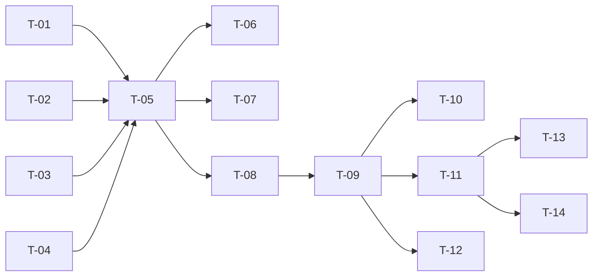

# TASKS — `RF-SP-041` Asignar o cambiar el superior comercial de un usuario

| Campo | Valor |
|---|---|
| Requerimiento | `RF-SP-041` |
| Especificación | [`spec.md`](spec.md) |
| Plan | [`plan.md`](plan.md) |
| `plan.md` aprobado el | 24-08-2026 |
| Estado | **Aprobadas** — 24-08-2026 |
| Issue | Pendiente de crear |
| Rama | `feature/estructura-comercial` |
| Aprobadas por | Responsable técnico, 24-08-2026 |

---

## 1. Tareas

Sin migración: `user_supervisors` la crea `V21` con la unicidad parcial que declara `RN-SP-021` en el esquema (`plan.md` §2). Tres tareas concentran el riesgo, y las tres fallan sin dar error: `T-02`, que si se escribe como `UPDATE` destruye el historial; `T-05`, que sin bloqueo convierte una reasignación concurrente en un `500`; y `T-07`, cuya implementación equivocada reorganizaría la empresa entera con cada cambio.

| # | Tarea | Depende de | Verificación | Estado |
|---|---|---|---|---|
| `T-01` | Ampliar `domain/CommercialStructure` con `RN-SP-020` completa: **qué rol debe portar el superior** de un subordinado dado, y si ese subordinado es la cúspide | — | Pruebas unitarias sin Spring: para un `AGENTE` devuelve `DIRECTOR`; para un `MANAGER` declara cúspide; con dos roles comerciales evalúa el de **mayor rango** | **Hecha** |
| `T-02` | `domain/SupervisorAssignment` y su puerto: apertura, **cierre con fecha** y una sola vigente. **Nunca `UPDATE` del superior sobre una fila** | — | Prueba de integración: tras el cambio quedan **dos** filas —una cerrada con su `ended_at` y una vigente—, no una modificada | **Hecha** |
| `T-03` | Generalizar `StatusChangeReason` de `RF-SP-028` a `ChangeReason`: recorta, exige contenido y no admite construirse vacío | — | Prueba unitaria: un motivo de solo espacios no construye. `RF-SP-028` sigue en verde con el tipo generalizado | **Hecha** |
| `T-04` | Consumir `SelfOperationGuard` de `RF-SP-028` para `RN-SP-017`, **sin reimplantarlo** | — | Prueba unitaria: el actor sobre su propia cuenta se rechaza | **Hecha** |
| `T-05` | `application/AssignSupervisorService` con `@Transactional`, el orden de `plan.md` §4 y **bloqueo sobre el subordinado** | `T-01`, `T-02`, `T-03`, `T-04` | **Prueba de integración concurrente**: dos reasignaciones simultáneas se serializan; nunca quedan dos vigentes ni sale `500` por `23505`. Sin el bloqueo, la unicidad parcial hace fallar una con error interno | **Hecha** |
| `T-06` | `FA-001` idempotente: el mismo superior no cierra ni abre nada, **no registra evento** y no parte el historial. **El motivo se valida igual, antes de saberlo** | `T-05` | Prueba de integración: repetir la operación deja **una** sola fila vigente y **ninguna** fila de auditoría nueva; sin motivo devuelve `400` aunque no hubiera cambio | **Hecha** |
| `T-07` | Verificar que **el equipo se mueve con el reasignado**: sus subordinados conservan su superior y solo cambia de quién depende la rama | `T-05` | Prueba de integración con tres niveles: tras mover al del medio, sus subordinados siguen apuntándole a él. Una implementación que los arrastrara al superior nuevo pasa todas las demás pruebas | **Hecha** |
| `T-08` | Auditoría: **un** evento de `audit_change_log` con `entity_id` del **subordinado**, `before`/`after` del superior y el motivo; los `409` en `audit_error_log` | `T-05` | Prueba de integración: **ninguna** fila en `audit_security_log` (`CA-SP-428`); un solo evento aunque la operación cierre y abra | **Hecha** |
| `T-09` | `api/AssignSupervisorRequest`, `CommercialStructureResponse` **compartido con `RF-SP-042`**, y `PATCH /api/v1/users/{id}/supervisor` con el permiso `users:assign-supervisor` | `T-08` | Prueba de API: la respuesta lleva el superior **anterior** con su fecha de cierre; el `409` de `EX-003` informa **qué rol** debería portar el superior; el endpoint **no admite** fecha de inicio ni superior nulo | **Hecha** |
| `T-10` | Verificar que la operación **no toca ningún permiso ni sesión** de ninguno de los tres implicados | `T-09` | Prueba de integración: los permisos efectivos del subordinado, del superior nuevo y del anterior son idénticos antes y después; ningún refresh token se revoca | **En curso** |
| `T-11` | Pruebas de API e integración de los criterios de aceptación de `spec.md` §12 | `T-09` | La suite cubre `CA-SP-412` a `CA-SP-429` | **En curso** |
| `T-12` | Pruebas de los casos límite de `spec.md` §13: reasignación concurrente, inversión de rama, dos roles comerciales, subordinado inactivo y motivo de una palabra | `T-09` | Ninguno deja dos asignaciones vigentes ni produce `500` | **En curso** |
| `T-13` | Documentación OpenAPI del endpoint: cuerpo, respuesta `200` y los estados `400`, `401`, `403`, `404`, `409` y `500`. **Debe decir que no admite fecha de inicio ni retirar el superior** | `T-11` | El contrato publicado coincide con el comportamiento real (Art. VIII.6) | **Hecha** |
| `T-14` | Actualizar la matriz de trazabilidad de `docs/requirements.md` | `T-11` | La fila de `RF-SP-041` refleja el estado y enlaza esta tripleta | **Hecha** |

**Estados:** `Pendiente` · `En curso` · `Hecha` · `Bloqueada`.

## 2. Orden de ejecución

`T-01` a `T-04` no dependen entre sí y son dominio puro. `T-03` toca código de `RF-SP-028` ya escrito: conviene hacerla temprano y confirmar que aquella suite sigue en verde.

## 3. Cobertura de los criterios de aceptación

| Criterio | Tarea que lo cubre |
|---|---|
| `CA-SP-412` | `T-02`, `T-05`, `T-11` |
| `CA-SP-413` | `T-01`, `T-09`, `T-11` |
| `CA-SP-414` | `T-01`, `T-11` |
| `CA-SP-415` | `T-02`, `T-11` |
| `CA-SP-416` | `T-06`, `T-11` |
| `CA-SP-417` | `T-01`, `T-05`, `T-11` |
| `CA-SP-418` | `T-01`, `T-05`, `T-11` |
| `CA-SP-419` | `T-05`, `T-11` |
| `CA-SP-420` | `T-05`, `T-11` |
| `CA-SP-421` | `T-07` |
| `CA-SP-422` | `T-10` |
| `CA-SP-423` | `T-10` |
| `CA-SP-424` | `T-08`, `T-11` |
| `CA-SP-426` | `T-03`, `T-06`, `T-11` |
| `CA-SP-427` | `T-04`, `T-11` |
| `CA-SP-428` | `T-08`, `T-11` |
| `CA-SP-429` | `T-02`, `T-09`, `T-11` |
| `CA-SP-425` | `T-09`, `T-11` |

## 4. Bloqueos

| # | Bloqueo | Desde | Responsable | Estado |
|---|---|---|---|---|
| 1 | Ninguna tarea es ejecutable hasta que `RF-SP-024` cree `users` y `user_supervisors` (`V18`, `V21`) y aporte `CommercialStructure` | 24-08-2026 | Responsable técnico | **Cerrado — `V21` existe desde el 24-08-2026, con su unicidad parcial** |
| 2 | `T-03` **modifica código de `RF-SP-028`**: generaliza su objeto de valor del motivo. Debe coordinarse con aquella tripleta y su suite volver a verde | 24-08-2026 | Responsable técnico | **Cerrado con desviación — `RF-SP-028` no está implementado: `ChangeReason` se crea aquí y aquel lo consumirá (§4.bis)** |
| 3 | `T-09` crea `CommercialStructureResponse`, **compartido con `RF-SP-042`**. Quien llegue segundo lo consume y **no lo duplica** (`plan.md` §3) | 24-08-2026 | Responsable técnico | **Cerrado — `CommercialStructureResponse` se creó aquí y `RF-SP-042` lo comparte sin duplicarlo** |
| 4 | **D-22 sigue abierta.** El día que se cierre y el alcance de datos dependa de esta relación, `spec.md` §7 y `plan.md` §6 obligan a **volver a la compuerta** para añadir el evento de seguridad. No bloquea la implementación de hoy | 22-08-2026 | Responsable del proyecto | Abierto |
| 5 | **Hueco declarado, no de esta tripleta:** cuando un superior asciende, sus subordinados quedan incumpliendo `RN-SP-020` y el sistema no lo detecta. La corrección es ejecutar esta misma operación sobre cada uno (`spec.md` §13) | 22-08-2026 | Responsable técnico | Abierto |

## 4.bis Desviaciones respecto del plan e implementación real

| # | Desviación | Motivo | Consecuencia |
|---|---|---|---|
| 1 | `T-04` decía **consumir** `SelfOperationGuard` de `RF-SP-028`, y `T-03` generalizar su `StatusChangeReason`. Ninguno existía: `RF-SP-028` no está implementado | Alguien tenía que crearlos, y este es el primero que los necesita | `ChangeReason` y `SelfOperationGuard` se crean aquí. `RF-SP-028` y `RF-SP-029` los consumirán en lugar de escribirlos — que es exactamente lo que el plan quería garantizar, aunque en el orden inverso |
| 2 | `T-02` no produjo un agregado `SupervisorAssignment`: la apertura y el cierre son dos operaciones del puerto de personas | La fila no tiene comportamiento propio más allá de abrirse y cerrarse, y un agregado para eso habría sido un envoltorio | La garantía que importaba —**cerrar y abrir, nunca sobrescribir**— está implementada y probada: tras un cambio quedan **dos** filas y una sola vigente |
| 3 | `T-10` verifica que no se revoca ninguna sesión, pero **no compara los permisos efectivos** de los tres implicados antes y después | Los permisos se derivan de los roles, y esta operación no toca ninguno | Que la reasignación no altere permisos se sigue del diseño y no está fijado por prueba. La mitad que sí lo está es la que podía fallar: las sesiones |
| 4 | `T-11` y `T-12` quedan **En curso** | Faltan la inversión de rama, la persona con dos roles comerciales y el subordinado inactivo | Ninguno de los tres es un camino habitual, pero el primero es el que más se parece a un error real de reorganización |

### Lo que sí quedó verificado

Las tres tareas que el propio plan señalaba como las de mayor riesgo, y las tres fallan sin dar error:

- **`T-02`: el historial no se sobrescribe.** Tras una reasignación quedan dos filas —una cerrada con su `ended_at` y una vigente—, no una modificada. Sobrescribir haría que las comisiones ya liquidadas dejaran de poder justificarse.
- **`T-05`: dos reasignaciones simultáneas se serializan.** Nunca quedan dos vigentes y ninguna produce `500`. Sin el bloqueo sobre el subordinado, la unicidad parcial hace fallar a la segunda con `23505`.
- **`T-07`: el equipo se mueve con el reasignado.** Sus subordinados le siguen apuntando a él. Una implementación que los arrastrara al superior nuevo reorganizaría la empresa con cada cambio y **pasaría todas las demás pruebas**.

Y además: `FA-001` no cierra ni abre nada y no deja auditoría, pero **el motivo se exige igual**, antes de saber si habrá cambio; el `409` de `EX-003` dice **qué rol** debería portar el superior; y la operación **no deja evento de seguridad** (`CA-SP-428`) ni un solo evento de más — uno solo, aunque cierre y abra.

## 5. Definición de terminado

El requerimiento no está terminado hasta cumplir **todas** las condiciones de la constitución §16:

- [ ] Todas las tareas en estado `Hecha`. — tres en curso: `T-10`, `T-11` y `T-12`.
- [ ] Todos los criterios de aceptación con prueba automatizada en verde. — falta la inversión de rama y la persona con dos roles comerciales.
- [x] `mvn verify` en verde en local. — 99 unitarias y 326 de integración, 24-08-2026.
- [x] Toda escritura emite su evento de auditoría, en la transacción que corresponde. — **un** evento de cambio con `entity_id` del subordinado, `before`/`after` y el motivo; **ninguno** de seguridad, y así está probado.
- [x] Los endpoints nuevos declaran su permiso. — `users:assign-supervisor`.
- [x] El contrato OpenAPI coincide con el comportamiento real. — `OpenApiContractIT` fija el `PATCH` y la **ausencia** de `PUT` y `DELETE`, que es como se declara que no se puede retirar el superior.
- [x] Documentación afectada actualizada en el mismo Pull Request. — `requirements.md` v0.39.0.
- [x] Matriz de trazabilidad actualizada.
- [ ] Pull Request aprobado por alguien distinto del autor e integrado.
