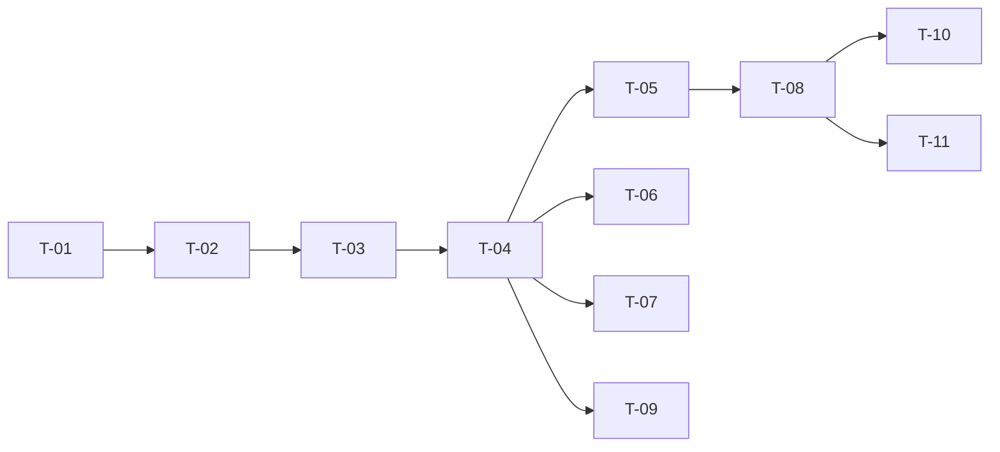

# TASKS — `RF-SP-042` Consultar el equipo a cargo de un usuario

| Campo | Valor |
|---|---|
| Requerimiento | `RF-SP-042` |
| Especificación | [`spec.md`](spec.md) |
| Plan | [`plan.md`](plan.md) |
| `plan.md` aprobado el | 24-08-2026 |
| Estado | **En revisión** |
| Issue | Pendiente de crear |
| Rama | `feature/consultar-equipo-a-cargo` |
| Aprobadas por | Pendiente |

---

## 1. Tareas

Sin migración, sin componentes de dominio y sin puertos nuevos: los dos índices que necesita los crean `V21` y `V24` (`plan.md` §2). Es la tripleta más pequeña del módulo, y casi todas sus pruebas verifican lo que la respuesta **no** debe contener — porque su riesgo no es devolver poco, es devolver de más y adelantar **D-22** sin que nadie lo haya decidido.

| # | Tarea | Depende de | Verificación | Estado |
|---|---|---|---|---|
| `T-01` | Ampliar `SupervisedTeamCounter` de `RF-SP-028` con la **lectura paginada** del equipo, **conservando el método de conteo tal cual** | — | Prueba de integración: el total de la lectura y el del conteo salen del **mismo** método; la lectura usa `ix_user_supervisors_supervisor_vigente` y no recorre la tabla | Pendiente |
| `T-02` | `application/GetCommercialTeamQuery`: superior vigente, equipo directo paginado y total, **todo en una transacción de solo lectura** | `T-01` | Prueba con dobles: una sola transacción; el superior y el equipo no se leen por separado | Pendiente |
| `T-03` | Ampliar `CommercialStructureResponse` de `RF-SP-041` con el equipo y su paginación, **sin duplicar el DTO** | `T-02` | Prueba de API: la parte de estructura es idéntica a la que devuelve `RF-SP-041`; `supervisor` va **ausente**, no en nulo, en la cúspide | Pendiente |
| `T-04` | `api/UserController`: `GET /api/v1/users/{id}/team` con `users:read`, `page` y `size`, **y ningún filtro** | `T-03` | Prueba de API: `size` por encima del máximo devuelve `400`; cualquier parámetro de filtro es ignorado o rechazado, nunca aplicado | Pendiente |
| `T-05` | `FA-001` y `FA-002`: sin rol comercial devuelve estructura vacía con `200`; la cúspide omite el superior | `T-04` | Prueba de API: ninguno de los dos es un error, y se distinguen entre sí y de `404` | Pendiente |
| `T-06` | **Prueba cruzada del total** con `RF-SP-028`, `RF-SP-029` y `RF-SP-031` | `T-04` | Crea un equipo, lee el total por esta vía, intenta retirar el rol comercial a su responsable y comprueba que el número del rechazo es **el mismo** (`plan.md` §11) | Pendiente |
| `T-07` | Pruebas de lo que la respuesta **no** contiene: árbol descendente, conteo indirecto, historial de superiores, filtros y variante «mi equipo» | `T-04` | `CA-SP-449`, `CA-SP-450`, `CA-SP-453`, `CA-SP-454` y `CA-SP-455` en verde. Son las cinco que impiden adelantar D-22 | Pendiente |
| `T-08` | Pruebas de API e integración del resto de criterios de `spec.md` §12 | `T-05` | La suite cubre `CA-SP-442` a `CA-SP-455` | Pendiente |
| `T-09` | Pruebas de los casos límite de `spec.md` §13, con la **consulta durante una reasignación** como concurrente | `T-04` | Ve el estado anterior o el posterior, **nunca sin superior ni con dos**; el subordinado inactivo aparece y cuenta, el eliminado no aparece | Pendiente |
| `T-10` | Documentación OpenAPI del endpoint: parámetros, respuesta `200` y los estados `400`, `401`, `403`, `404` y `500`. **Debe decir que el alcance es global** mientras D-22 siga abierta | `T-08` | El contrato publicado coincide con el comportamiento real (Art. VIII.6) | Pendiente |
| `T-11` | Actualizar la matriz de trazabilidad de `docs/requirements.md` | `T-08` | La fila de `RF-SP-042` refleja el estado y enlaza esta tripleta | Pendiente |

**Estados:** `Pendiente` · `En curso` · `Hecha` · `Bloqueada`.

## 2. Orden de ejecución

## 3. Cobertura de los criterios de aceptación

| Criterio | Tarea que lo cubre |
|---|---|
| `CA-SP-442` | `T-02`, `T-08` |
| `CA-SP-443` | `T-01`, `T-08` |
| `CA-SP-444` | `T-05`, `T-08` |
| `CA-SP-445` | `T-03`, `T-05`, `T-08` |
| `CA-SP-446` | `T-05`, `T-08` |
| `CA-SP-447` | `T-01`, `T-06` |
| `CA-SP-448` | `T-04`, `T-08` |
| `CA-SP-449` | `T-07` |
| `CA-SP-450` | `T-07` |
| `CA-SP-451` | `T-04`, `T-08` |
| `CA-SP-452` | `T-04`, `T-08` |
| `CA-SP-453` | `T-07` |
| `CA-SP-454` | `T-07` |
| `CA-SP-455` | `T-04`, `T-07` |

## 4. Bloqueos

| # | Bloqueo | Desde | Responsable | Estado |
|---|---|---|---|---|
| 1 | Ninguna tarea es ejecutable hasta que `RF-SP-024` cree `user_supervisors` (`V21`) y `RF-SP-028` cree `ix_user_supervisors_supervisor_vigente` (`V24`) y `SupervisedTeamCounter` | 24-08-2026 | Responsable técnico | Abierto |
| 2 | `T-03` amplía `CommercialStructureResponse`, que crea `RF-SP-041`. Quien llegue segundo lo **consume y no lo duplica** | 24-08-2026 | Responsable técnico | Abierto |
| 3 | `T-06` necesita `RF-SP-028`, `RF-SP-029` y `RF-SP-031` implementados: es una prueba de cuatro requerimientos y no puede escribirse desde uno solo | 24-08-2026 | Responsable técnico | Abierto |
| 4 | **D-22 sigue abierta.** El alcance de esta consulta es **global** y así queda documentado en el contrato (`T-10`). Al cerrarse, esta consulta es de las primeras afectadas y `plan.md` §5 es el párrafo que habrá que revisar | 22-08-2026 | Responsable del proyecto | Abierto |
| 5 | **Hueco declarado, no de esta tripleta:** el historial de superiores se conserva (`RN-SP-021`) y **no tiene ninguna vía de lectura**. La tendrá la auditoría de reparto de comisiones, que no existe (`spec.md` §14, pregunta 1) | 22-08-2026 | Responsable del proyecto | Abierto |

## 5. Definición de terminado

El requerimiento no está terminado hasta cumplir **todas** las condiciones de la constitución §16:

- [ ] Todas las tareas en estado `Hecha`.
- [ ] Todos los criterios de aceptación con prueba automatizada en verde.
- [ ] `mvn verify` en verde en local.
- [ ] Toda escritura emite su evento de auditoría, en la transacción que corresponde.
- [ ] Los endpoints nuevos declaran su permiso.
- [ ] El contrato OpenAPI coincide con el comportamiento real.
- [ ] Documentación afectada actualizada en el mismo Pull Request.
- [ ] Matriz de trazabilidad actualizada.
- [ ] Pull Request aprobado por alguien distinto del autor e integrado.
