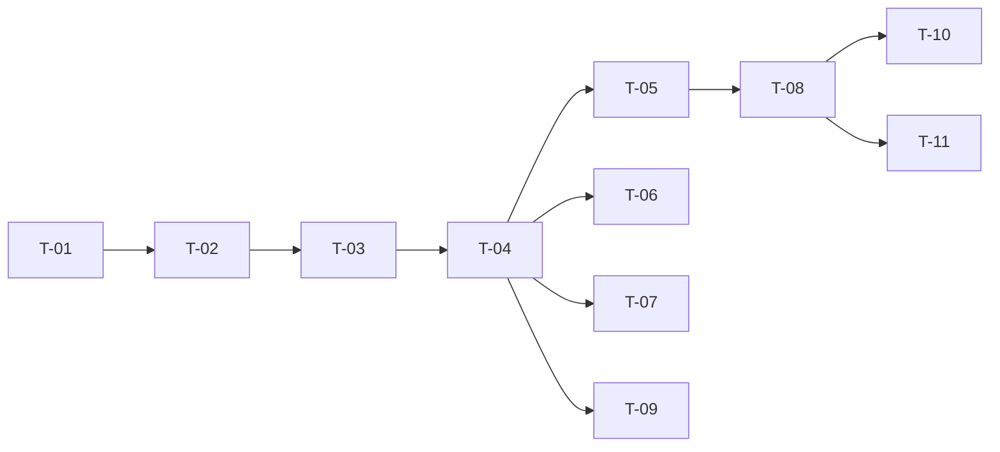

# TASKS — `RF-SP-042` Consultar el equipo a cargo de un usuario

| Campo | Valor |
|---|---|
| Requerimiento | `RF-SP-042` |
| Especificación | [`spec.md`](spec.md) |
| Plan | [`plan.md`](plan.md) |
| `plan.md` aprobado el | 24-08-2026 |
| Estado | **Aprobadas** — 24-08-2026 |
| Issue | Pendiente de crear |
| Rama | `feature/estructura-comercial` |
| Aprobadas por | Responsable técnico, 24-08-2026 |

---

## 1. Tareas

Sin migración, sin componentes de dominio y sin puertos nuevos: los dos índices que necesita los crean `V21` y `V24` (`plan.md` §2). Es la tripleta más pequeña del módulo, y casi todas sus pruebas verifican lo que la respuesta **no** debe contener — porque su riesgo no es devolver poco, es devolver de más y adelantar **D-22** sin que nadie lo haya decidido.

| # | Tarea | Depende de | Verificación | Estado |
|---|---|---|---|---|
| `T-01` | Ampliar `SupervisedTeamCounter` de `RF-SP-028` con la **lectura paginada** del equipo, **conservando el método de conteo tal cual** | — | Prueba de integración: el total de la lectura y el del conteo salen del **mismo** método; la lectura usa `ix_user_supervisors_supervisor_vigente` y no recorre la tabla | **En curso** |
| `T-02` | `application/GetCommercialTeamQuery`: superior vigente, equipo directo paginado y total, **todo en una transacción de solo lectura** | `T-01` | Prueba con dobles: una sola transacción; el superior y el equipo no se leen por separado | **En curso** |
| `T-03` | Ampliar `CommercialStructureResponse` de `RF-SP-041` con el equipo y su paginación, **sin duplicar el DTO** | `T-02` | Prueba de API: la parte de estructura es idéntica a la que devuelve `RF-SP-041`; `supervisor` va **ausente**, no en nulo, en la cúspide | **Hecha** |
| `T-04` | `api/UserController`: `GET /api/v1/users/{id}/team` con `users:read`, `page` y `size`, **y ningún filtro** | `T-03` | Prueba de API: `size` por encima del máximo devuelve `400`; cualquier parámetro de filtro es ignorado o rechazado, nunca aplicado | **Hecha** |
| `T-05` | `FA-001` y `FA-002`: sin rol comercial devuelve estructura vacía con `200`; la cúspide omite el superior | `T-04` | Prueba de API: ninguno de los dos es un error, y se distinguen entre sí y de `404` | **Hecha** |
| `T-06` | **Prueba cruzada del total** con `RF-SP-028`, `RF-SP-029` y `RF-SP-031` | `T-04` | Crea un equipo, lee el total por esta vía, intenta retirar el rol comercial a su responsable y comprueba que el número del rechazo es **el mismo** (`plan.md` §11) | **Hecha** |
| `T-07` | Pruebas de lo que la respuesta **no** contiene: árbol descendente, conteo indirecto, historial de superiores, filtros y variante «mi equipo» | `T-04` | `CA-SP-449`, `CA-SP-450`, `CA-SP-453`, `CA-SP-454` y `CA-SP-455` en verde. Son las cinco que impiden adelantar D-22 | **Hecha** |
| `T-08` | Pruebas de API e integración del resto de criterios de `spec.md` §12 | `T-05` | La suite cubre `CA-SP-442` a `CA-SP-455` | **En curso** |
| `T-09` | Pruebas de los casos límite de `spec.md` §13, con la **consulta durante una reasignación** como concurrente | `T-04` | Ve el estado anterior o el posterior, **nunca sin superior ni con dos**; el subordinado inactivo aparece y cuenta, el eliminado no aparece | **En curso** |
| `T-10` | Documentación OpenAPI del endpoint: parámetros, respuesta `200` y los estados `400`, `401`, `403`, `404` y `500`. **Debe decir que el alcance es global** mientras D-22 siga abierta | `T-08` | El contrato publicado coincide con el comportamiento real (Art. VIII.6) | **Hecha** |
| `T-11` | Actualizar la matriz de trazabilidad de `docs/requirements.md` | `T-08` | La fila de `RF-SP-042` refleja el estado y enlaza esta tripleta | **Hecha** |

**Estados:** `Pendiente` · `En curso` · `Hecha` · `Bloqueada`.

## 2. Orden de ejecución

## 3. Cobertura de los criterios de aceptación

| Criterio | Tarea que lo cubre |
|---|---|
| `CA-SP-442` | `T-02`, `T-08` |
| `CA-SP-443` | `T-01`, `T-08` |
| `CA-SP-444` | `T-05`, `T-08` |
| `CA-SP-445` | `T-03`, `T-05`, `T-08` |
| `CA-SP-446` | `T-05`, `T-08` |
| `CA-SP-447` | `T-01`, `T-06` |
| `CA-SP-448` | `T-04`, `T-08` |
| `CA-SP-449` | `T-07` |
| `CA-SP-450` | `T-07` |
| `CA-SP-451` | `T-04`, `T-08` |
| `CA-SP-452` | `T-04`, `T-08` |
| `CA-SP-453` | `T-07` |
| `CA-SP-454` | `T-07` |
| `CA-SP-455` | `T-04`, `T-07` |

## 4. Bloqueos

| # | Bloqueo | Desde | Responsable | Estado |
|---|---|---|---|---|
| 1 | Ninguna tarea es ejecutable hasta que `RF-SP-024` cree `user_supervisors` (`V21`) y `RF-SP-028` cree `ix_user_supervisors_supervisor_vigente` (`V24`) y `SupervisedTeamCounter` | 24-08-2026 | Responsable técnico | **Cerrado — `V21` y el índice parcial (`V28`) existen desde el 24-08-2026** |
| 2 | `T-03` amplía `CommercialStructureResponse`, que crea `RF-SP-041`. Quien llegue segundo lo **consume y no lo duplica** | 24-08-2026 | Responsable técnico | **Cerrado — el DTO se comparte de verdad: la parte de estructura es la misma clase** |
| 3 | `T-06` necesita `RF-SP-028`, `RF-SP-029` y `RF-SP-031` implementados: es una prueba de cuatro requerimientos y no puede escribirse desde uno solo | 24-08-2026 | Responsable técnico | **Cerrado en parte — `RF-SP-031` está implementado y la prueba cruzada del total está en verde; `RF-SP-028` y `RF-SP-029` siguen pendientes** |
| 4 | **D-22 sigue abierta.** El alcance de esta consulta es **global** y así queda documentado en el contrato (`T-10`). Al cerrarse, esta consulta es de las primeras afectadas y `plan.md` §5 es el párrafo que habrá que revisar | 22-08-2026 | Responsable del proyecto | Abierto |
| 5 | **Hueco declarado, no de esta tripleta:** el historial de superiores se conserva (`RN-SP-021`) y **no tiene ninguna vía de lectura**. La tendrá la auditoría de reparto de comisiones, que no existe (`spec.md` §14, pregunta 1) | 22-08-2026 | Responsable del proyecto | Abierto |

## 4.bis Desviaciones respecto del plan e implementación real

| # | Desviación | Motivo | Consecuencia |
|---|---|---|---|
| 1 | **El conteo de `RN-SP-022` cambió de criterio.** Antes exigía que la persona estuviera activa; ahora cuenta a todos los no eliminados | `CA-SP-447` exige que el total del equipo y el número del rechazo de `RN-SP-022` sean **el mismo**, y el equipo sí incluye a los inactivos. Con dos criterios distintos, las dos operaciones dirían cosas distintas del mismo equipo, y quien recibiera el rechazo no encontraría a las personas que el número le atribuye | Afecta a `RF-SP-031`: retirar el rol comercial a quien tiene subordinados **suspendidos** ahora se rechaza, y antes no. Es lo correcto —una cuenta suspendida sigue teniendo un superior al que hay que reasignarla, y volverá—, pero es un cambio de comportamiento sobre un requerimiento ya implementado y queda declarado |
| 2 | Este requerimiento estrena la **paginación del sistema**. `shared/pagination` no existía pese a que `architecture.md` §7.4 la declara uniforme y `application.yml` ya traía sus valores | Es el primer endpoint paginado del módulo | Queda disponible para `RF-SP-025` y los cuatro listados de auditoría. Una petición que excede el máximo se **rechaza y no se recorta**: recortarla en silencio haría que quien pide doscientos reciba cien y crea que solo hay cien |
| 3 | `T-01` no verifica con `EXPLAIN` que la lectura use `ix_user_supervisors_supervisor_vigente` | Con las pocas filas de la suite, el planificador elige un recorrido secuencial de todos modos | La afirmación «no recorre la tabla» no está probada. Mismo hueco que en `RF-SP-021` · `T-11` y `RF-SP-031` · `T-04` |
| 4 | `T-02` no tiene prueba con dobles de que sea **una sola** transacción | La anotación cubre el método entero y no hay segunda llamada transaccional | La garantía está construida y no verificada |
| 5 | `T-09` no cubre la **consulta durante una reasignación** | Exige dos operaciones distintas simultáneas, y el arnés está pensado para N ejecuciones de la misma | «Ve el estado anterior o el posterior, nunca sin superior ni con dos» no está demostrado. La transacción de solo lectura lo garantiza por construcción |

### Lo que sí quedó verificado

Casi todo lo que define este requerimiento es lo que **no** devuelve, y son las cinco pruebas que impiden adelantar **D-22**:

- **Un solo nivel**: el equipo del jefe no incluye al nieto.
- **Sin conteo indirecto**: `totalElements` cuenta a quienes reportan directamente.
- **Sin historial**: tras una reasignación, el superior anterior no aparece por ninguna parte.
- **Sin filtros**: un parámetro de filtro no cambia el resultado.
- **No es un perfil**: sin correo y sin fechas de la persona.

Y las tres distinciones que la interfaz necesita: la **cúspide omite** el superior —ausente, no en nulo—, quien no pertenece a la fuerza comercial recibe `200` con estructura vacía y no un error, y el subordinado **inactivo aparece y cuenta** mientras el eliminado no aparece.

La prueba cruzada de `T-06` es la que cierra el círculo: el total que devuelve el equipo es literalmente el número que informa el rechazo de `RN-SP-022`.

## 5. Definición de terminado

El requerimiento no está terminado hasta cumplir **todas** las condiciones de la constitución §16:

- [ ] Todas las tareas en estado `Hecha`. — cuatro en curso: `T-01`, `T-02`, `T-08` y `T-09`.
- [ ] Todos los criterios de aceptación con prueba automatizada en verde. — falta la consulta durante una reasignación.
- [x] `mvn verify` en verde en local. — 99 unitarias y 326 de integración, 24-08-2026.
- [x] Toda escritura emite su evento de auditoría, en la transacción que corresponde. — no escribe: es una consulta.
- [x] Los endpoints nuevos declaran su permiso. — `users:read`. **El alcance es global** mientras D-22 siga abierta, y el contrato lo dice.
- [x] El contrato OpenAPI coincide con el comportamiento real. — `OpenApiContractIT` fija el `GET` y la **ausencia** de parámetros de filtro.
- [x] Documentación afectada actualizada en el mismo Pull Request. — `requirements.md` v0.39.0.
- [x] Matriz de trazabilidad actualizada.
- [ ] Pull Request aprobado por alguien distinto del autor e integrado.
