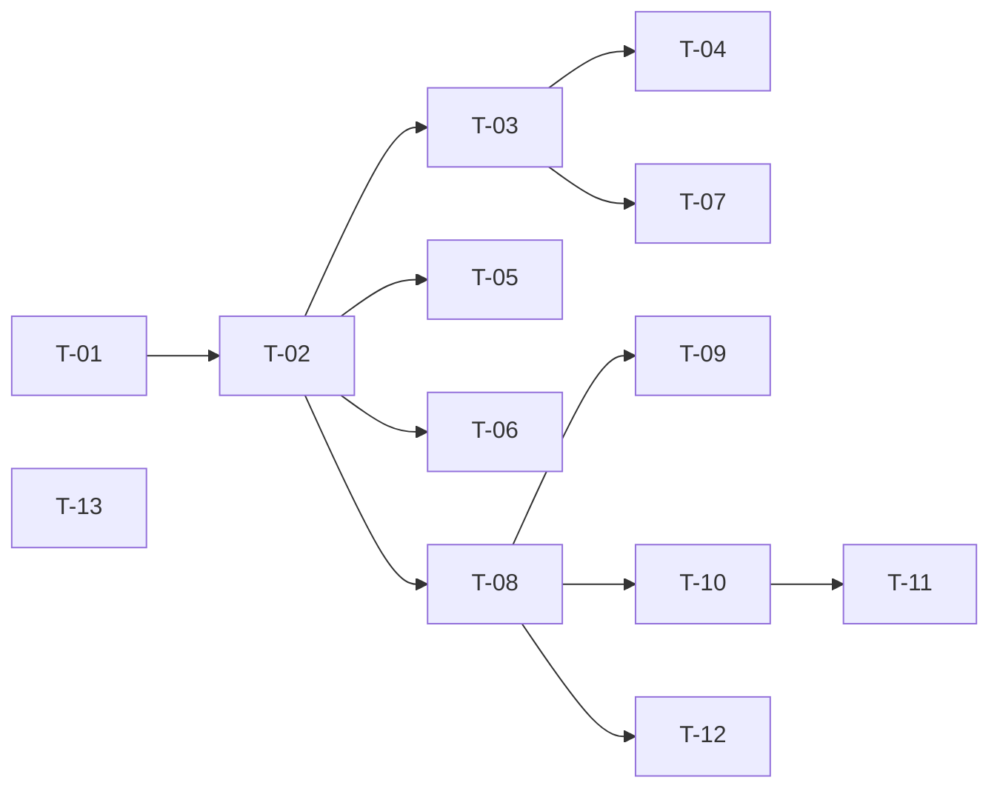

# TASKS — `RF-SP-044` Editar el propio perfil

| Campo | Valor |
|---|---|
| Requerimiento | `RF-SP-044` |
| Especificación | [`spec.md`](spec.md) |
| Plan | [`plan.md`](plan.md) |
| `plan.md` aprobado el | 31-08-2026 |
| Estado | **En revisión** |
| Issue | Pendiente de crear |
| Rama | `feature/editar-perfil-propio` |
| Aprobadas por | Pendiente |

---

## 1. Tareas

Sin migración y sin componentes de dominio nuevos más allá del caso de uso (`plan.md` §2 y §3). Lo que hace no trivial esta lista son tres cosas que no se ven en el camino feliz: que el sujeto **no pueda desviarse** a otra persona, que la contraseña se exija **exactamente cuando toca**, y que el fallo de contraseña **no se convierta en un arma** contra la persona legítima.

| # | Tarea | Depende de | Verificación | Estado |
|---|---|---|---|---|
| `T-01` | `application/UpdateOwnProfileRequest`: tres `Patchable<String>` heredados de `UpdateUserRequest` más `currentPassword` llano. **Sin campo de identificador** | — | Prueba unitaria: enviar un `userId` en el cuerpo produce `400` por campo desconocido, que ya garantiza la configuración de Jackson | **Hecha** |
| `T-02` | `domain/service/UpdateOwnProfileService`: resuelve al actor con `CurrentActor` **dentro del servicio**, igual que `GetOwnProfileService`. El controlador no le pasa identificador alguno | `T-01` | El caso de uso no recibe identificador: no hay parámetro que manipular. Sin actor, `UnauthorizedException` | **Hecha** |
| `T-03` | Exigencia condicional de la contraseña: **si y solo si** viene `email`. `VAL-006` cuando falta, `VAL-007` cuando no coincide | `T-02` | Unitaria: los cuatro cruces —con y sin correo, con y sin contraseña— incluida la comprobación de que cambiar solo el nombre **no** la pide (`CA-SP-499`) | **Hecha** |
| `T-04` | El correo repetido **sigue exigiendo** la contraseña, antes de comparar con el actual | `T-03` | Unitaria: enviar el correo vigente sin contraseña da `VAL-006` y no `200`. Sin esto, el endpoint dice cuál es el correo bueno (`spec.md` `FA-001`) | **Hecha** |
| `T-05` | Unicidad del correo dentro de la transacción, traducida a `409` y no a `500` | `T-02` | Integración: dos peticiones concurrentes con el mismo correo; una responde `409` y ninguna rompe con violación de `uq_users_email` | **Hecha** |
| `T-06` | Auditoría: cambio en `audit_change_log` con antes y después; **seguridad solo si cambió el correo**; y evento de fallo en `EX-002` | `T-02` | Integración: cambiar el nombre **no** deja evento de seguridad; cambiar el correo sí, con severidad alta (`CA-SP-503`) | **Hecha** |
| `T-07` | El fallo de contraseña **no incrementa `failed_attempts` ni bloquea la cuenta** | `T-03` | Integración: repetir el fallo más veces que el umbral de bloqueo y comprobar que la cuenta sigue admitiendo inicio de sesión (`CA-SP-504`) | **Hecha** |
| `T-08` | `interfaces/UserController`: `PATCH /api/v1/users/me`, **autenticado y sin `@PreAuthorize`**, devolviendo `OwnProfileResponse` | `T-02` | API: `200` con la misma forma que `GET /users/me`; `401` sin token | **Hecha** |
| `T-09` | **No** añadir la ruta a `ALCANZABLE_CON_LA_MARCA` de `MustChangePasswordFilter`, y dejar constancia de por qué | `T-08` | API **en `MustChangePasswordIT`**, que inicia sesión de verdad: el claim `mcp` solo existe en un token real, y con el actor simulado la prueba daría verde **sin ejercitar el filtro** (`CL-003`) | **Hecha** |
| `T-10` | `UpdateOwnProfileIT`: los trece criterios de `spec.md` §12, con una persona de la semilla **sin ningún permiso** | `T-08` | La suite cubre `CA-SP-494` a `CA-SP-506` | **Hecha** |
| `T-11` | Prueba de que roles, membresía, estado y superior comercial quedan intactos tras la edición | `T-10` | Integración: se comparan antes y después las cuatro relaciones (`CA-SP-502`) | **Hecha** |
| `T-12` | Documentación OpenAPI del endpoint, con los seis códigos de `plan.md` §4 y la condicionalidad de `currentPassword` descrita | `T-08` | El contrato publicado coincide con el comportamiento real (Art. VIII.6) | **Hecha** |
| `T-13` | Registrar `RF-SP-044` en `requirements/sp.md` —§6.1, ficha y tabla de rutas— y en la matriz de `docs/requirements.md`, con sus filas de control de cambios | — | Los dos documentos citan la tripleta y ninguna tabla queda desactualizada (`plan.md` §8) | **Hecha** |

**Estados:** `Pendiente` · `En curso` · `Hecha` · `Bloqueada`.

## 2. Orden de ejecución

`T-13` no depende de nada y puede ir primero: registrar el requerimiento es lo que da número a todo lo demás.

## 3. Definición de terminado

- Los trece criterios de aceptación de `spec.md` §12 verificados por pruebas automáticas.
- `./mvnw verify` en verde, con `spotless` incluido.
- El contrato OpenAPI publicado coincide con el comportamiento.
- `requirements/sp.md` y `requirements.md` registran el requerimiento y enlazan esta tripleta.
- Pull Request aprobado e integrado (Art. XVI), momento en que `RF-SP-044` pasa a `Implementado`.
