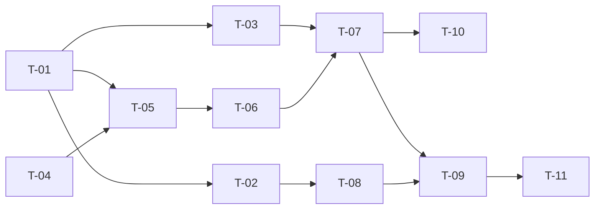

# TASKS — `RF-SP-051` Consultar tipos de documento

| Campo | Valor |
|---|---|
| Requerimiento | `RF-SP-051` |
| Especificación | [`spec.md`](spec.md) |
| Plan | [`plan.md`](plan.md) |
| `plan.md` aprobado el | 08-09-2026 |
| Estado | **En revisión** |
| Issue | Pendiente de crear |
| Rama | `feature/documento-y-contacto` |
| Aprobadas por | Pendiente |

!!! info "Qué va en este documento"

    **En qué pasos, en qué orden y cómo se verifica cada uno.**

    **Prueba de pertenencia:** si no puede marcarse como hecho, no es una tarea.

    **Es la fuente de verdad de las tareas.** El Issue de GitHub coordina y enlaza aquí; no la sustituye ni la duplica. Si las dos listas discrepan, manda este archivo.

    No se escribe hasta que `plan.md` esté aprobado, y ninguna tarea se ejecuta hasta que este documento lo esté (Art. I.6).

---

## 1. Tareas

Es una consulta de una tabla sin filtros ni paginación, y aun así **`T-02` es la tarea de más alcance de toda la entrega**: la lista de `INSERT` que siembra el catálogo **es** la validación de mayoría de edad. Todo lo demás de este requerimiento es fontanería.

**Estados:** `Pendiente` · `En curso` · `Hecha` · `Bloqueada`.

| # | Tarea | Depende de | Verificación | Estado |
|---|---|---|---|---|
| `T-01` | `V67__create_document_types.sql`, primera mitad: la tabla con `abbreviation`, `name` con intercalación `es-x-icu`, `is_active`, las dos marcas de tiempo, `uq_document_types_abbreviation`, los dos `CHECK` y el índice único funcional sobre `f_unaccent(lower(name))` | — | `mvn flyway:info` la lista aplicada. Prueba de esquema: dos nombres que solo difieran en acentos o en caja son rechazados por `uq_document_types_name`; una abreviación en minúsculas la rechaza el `CHECK` | Pendiente |
| `T-02` | **La siembra, en la MISMA migración**: `CC`, `CE`, `PA` y `NIT`, con identificadores UUID v7 literales. **Sin tarjeta de identidad y sin registro civil** | `T-01` | `CA-SP-587` y `CA-SP-588`. **Es la tarea que hay que revisar como se revisa una regla, no como se revisa una siembra**: lo que esta lista contiene decide quién puede registrarse en el sistema | Pendiente |
| `T-03` | `V69__seed_document_types_permission.sql`: el permiso `document-types:read` con UUID v7 literal, **su asociación a `SUPERADMIN` y `ADMIN`**, y la guarda que aborta si falta alguna de las tres filas | `T-01` | Integración: el permiso existe y **los dos roles lo tienen**. Sin la segunda mitad, `ADMIN` no podría concederlo | Pendiente |
| `T-04` | `application`: `DocumentTypeItem`, `DocumentTypeCatalogResponse` y `ListDocumentTypesRequest` con `includeInactive` como **`Boolean` y no `boolean`** | — | Prueba de API: la petición **sin** el parámetro devuelve `200` y no `400`. Es el defecto exacto que el catálogo de monedas tuvo que corregir | Pendiente |
| `T-05` | `domain/repository`: puerto `DocumentTypeQueryRepository` y su adaptador, con **una sola sentencia** ordenada por nombre | `T-01`, `T-04` | El puerto **no declara ningún método de escritura**, y eso es `RN-SP-036` en el código. Integración: una sola sentencia, y el orden respeta la intercalación —`Ñ` no cae al final— | Pendiente |
| `T-06` | `domain/service/ListDocumentTypesService` con `@Transactional(readOnly = true)` | `T-05` | Prueba con dobles: pedir sin inactivos no los trae; pedirlos los **añade**, no los sustituye | Pendiente |
| `T-07` | `interfaces/DocumentTypeController`: `GET /api/v1/document-types` con `document-types:read` sobre el método. **Un solo método en la clase** | `T-03`, `T-06` | `403` sin el permiso (`CA-SP-589`). **Prueba de arquitectura: la clase no declara ningún `@PostMapping`, `@PatchMapping`, `@PutMapping` ni `@DeleteMapping`** — es la forma verificable de `CA-SP-585` | Pendiente |
| `T-08` | **La prueba de la ausencia**: sobre el **contenido de la tabla**, ni la tarjeta de identidad ni el registro civil están, por abreviación (`TI`, `RC`) ni por nombre | `T-02` | `CA-SP-587`. **Contra la tabla y NO contra la respuesta del endpoint**: escrita contra la respuesta, una tarjeta de identidad **inactiva** la dejaría verde — y sigue siendo una fila que alguien reactiva con un `UPDATE` | Pendiente |
| `T-09` | Pruebas de los criterios de `spec.md` §12 | `T-07`, `T-08` | La suite cubre `CA-SP-584` a `CA-SP-589` | Pendiente |
| `T-10` | Contrato OpenAPI: la ruta documentada, y `OpenApiContractIT` comprueba que **no existe ninguna otra** bajo `/api/v1/document-types` | `T-07` | El contrato publicado coincide con el comportamiento real (Art. VIII.6). Que no haya rutas de escritura tiene que ser **verificable**, no solo cierto hoy | Pendiente |
| `T-11` | Enmendar la matriz de trazabilidad de `docs/requirements.md` | `T-09` | La fila de `RF-SP-051` refleja el estado y enlaza esta tripleta | Pendiente |

**Las enmiendas documentales del plan ya están aplicadas**: `requirements/sp.md` v1.41.0 (§2, `RN-SP-035` a `RN-SP-037`, ficha, §10.15, §10.16 y once restricciones de §10.8), `modelo-datos.md` v0.32.0, `security.md` v0.43.0 y `requirements.md` v0.113.0. No hay tarea para ellas.

## 2. Orden de ejecución

`T-04` es independiente de las migraciones y puede ir en paralelo con `T-01`.

## 3. Cobertura de los criterios de aceptación

| Criterio | Tarea que lo cubre |
|---|---|
| `CA-SP-584` | `T-04`, `T-05`, `T-09` |
| `CA-SP-585` | `T-07`, `T-10` |
| `CA-SP-586` | `T-06`, `T-09` |
| `CA-SP-587` | **`T-02`, `T-08`** |
| `CA-SP-588` | `T-02`, `T-08` |
| `CA-SP-589` | `T-07`, `T-09` |

**`CA-SP-585` se cubre con dos tareas y ninguna es una prueba funcional**, y es deliberado: «no existe una operación» no se demuestra llamándola —no hay a qué llamar—, se demuestra comprobando que la clase no declara verbos de escritura y que el contrato publicado no los lista. Es lo que convierte `RN-SP-036` en algo que una refactorización no puede romper en silencio.

## 4. Bloqueos

| # | Bloqueo | Desde | Responsable | Estado |
|---|---|---|---|---|
| 1 | **`T-02` no es una siembra, es una regla.** La lista de tipos decide quién puede registrarse en el sistema, y añadir una fila desactiva `RN-SP-035` para todo el mundo. Debe revisarla el responsable del proyecto, no solo el técnico | 08-09-2026 | **Responsable del proyecto** | **Abierto** |
| 2 | **`PA` y `NIT` no prueban mayoría de edad**, y están en la lista porque el negocio los admite como identificación. Es el límite declarado del diseño (`spec.md` §14, pregunta 2). Si el negocio quiere una lista más estrecha —solo `CC` y `CE`—, es ahora: cambiarla después obliga a mirar qué personas ya se registraron con los que se retiren | 08-09-2026 | **Responsable del proyecto** | **Abierto** |
| 3 | **El registro público de `RF-SP-045` no puede leer este catálogo.** Pide `document-types:read`, que quien se registra no tiene. **Es el mismo bloqueo que el de países** —bloqueo 6 de `RF-SP-045`— y ahora son **dos** catálogos, lo que convierte una excepción puntual en una decisión de forma: un endpoint público de catálogos bajo `/auth` con su límite de tasa, en lugar de dos parches | 08-09-2026 | **Responsable del proyecto** | **Abierto** |
| 4 | `V68` —las seis columnas de `users`— **depende de `T-01`**: su clave foránea apunta a una tabla que esta migración crea. Pertenece a la enmienda de `RF-SP-024` y se anota aquí solo para fijar el orden | 08-09-2026 | Responsable técnico | Abierto |

## 5. Definición de terminado

El requerimiento no está terminado hasta cumplir **todas** las condiciones de la constitución §16:

- [ ] Todas las tareas en estado `Hecha`.
- [ ] Todos los criterios de aceptación con prueba automatizada en verde.
- [ ] `mvn verify` en verde en local.
- [ ] Toda escritura emite su evento de auditoría, en la transacción que corresponde. *(No aplica: esta consulta no escribe.)*
- [ ] Los endpoints nuevos declaran su permiso.
- [ ] El contrato OpenAPI coincide con el comportamiento real.
- [ ] Documentación afectada actualizada en el mismo Pull Request.
- [ ] Matriz de trazabilidad actualizada.
- [ ] Pull Request aprobado por alguien distinto del autor e integrado.
