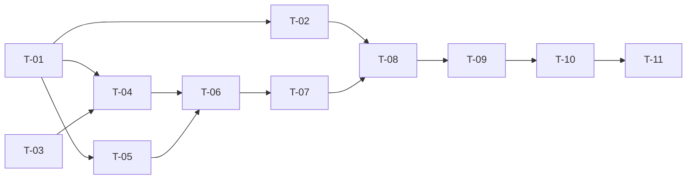

# TASKS — `RF-SP-063` Registrar equipo

| Campo | Valor |
|---|---|
| Requerimiento | `RF-SP-063` |
| Especificación | [`spec.md`](spec.md) |
| Plan | [`plan.md`](plan.md), aprobado el 22-09-2026 |
| Estado | **En revisión** |
| Issue | Pendiente de crear |
| Rama | `feature/equipos` |
| Autor | Responsable técnico |

---

## 1. Tareas

| ID | Tarea | Depende de | Verificación | Estado |
|---|---|---|---|---|
| `T-01` | Migración `V33__sp_equipos.sql`: `teams` y `team_members` con sus `CHECK`, claves foráneas, `uq_teams_name` (funcional y parcial), `ix_teams_busqueda` (gin de trigramas), `uq_team_members_vigente` e `ix_team_members_team_vigente`, y los `COMMENT` que dicen qué significa una fila y que la tabla no concede alcance | — | `mvn flyway:info` la lista aplicada; `CA-SP-737` | Pendiente |
| `T-02` | Migración `V34__sp_semilla_permisos_equipos.sql`: los ocho `teams:` con literales `…5e7ad000002c` a `…5e7ad0000033`, asociados a `SUPERADMIN` y `ADMIN`, con las guardas de 133 / 133 / 127 y la de contención | `T-01` | `CA-SP-738`; la migración falla con mensaje propio si el catálogo no está en 125 | Pendiente |
| `T-03` | `Team`, `TeamStatus` y `TeamMember` en `teams/domain/models`: normalización del nombre y de la descripción, estado inicial, apertura y cierre de la pertenencia | — | `TeamTest` unitaria, sin Spring | Pendiente |
| `T-04` | `TeamRepository` y `JpaTeamRepository`: `save`, `existsAliveName` con la expresión del índice y `findAlive`; la violación de `uq_teams_name` traducida **por nombre de restricción** al `409` de `EX-001` | `T-01`, `T-03` | `CA-SP-732`, `CA-SP-736` | Pendiente |
| `T-05` | `TeamDetailReader` y `TeamDetailResponse` / `TeamMemberItem`: la ficha con sus miembros vigentes, que aquí se ejercita **vacía** y que `RF-SP-065` reutiliza entera | `T-01` | `CA-SP-731` | Pendiente |
| `T-06` | `RegisterTeamService`: comprobación del nombre, inserción, `AuditWriter` con la fila `CREATE` y relectura del detalle, todo en una transacción | `T-04`, `T-05` | `CA-SP-731`, `CA-SP-735` | Pendiente |
| `T-07` | `TeamController` con `POST /api/v1/teams` y `teams:create`, `RegisterTeamRequest` que rechaza campos desconocidos, y la **prosa OpenAPI**: qué es un equipo, que nace vacío y activo, que el nombre es único sin acentos ni caja entre los no eliminados, y que pertenecer a un equipo no concede acceso a nada | `T-06` | `CA-SP-733`, `CA-SP-734`, `CA-SP-739` | Pendiente |
| `T-08` | Recuentos y rutas: `EndpointPermissionsIT` con `POST /teams` en `PERMISO_DE_CADA_OPERACION`; `PermissionsSeedIT`, `PermissionIT`, `JpaPermissionQueryRepositoryIT` y `ListPermissionsServiceIT` en **133** (ocho de `teams`, `ADMIN` 127); `OpenApiContractIT` con la `x-required-permission` | `T-02`, `T-07` | `CA-SP-738`, `CA-SP-739` | Pendiente |
| `T-09` | `TeamsIT` (`CA-SP-731` a `CA-SP-735`, `CA-SP-739`), `TeamConcurrencyIT` (`CA-SP-736`) y `TeamsSchemaIT` (`CA-SP-737`, con los `INSERT` directos que ejercitan cada restricción) | `T-08` | Los nueve criterios | Pendiente |
| `T-10` | Contrato regenerado y comparado —solo altas: `POST /teams`, `TeamDetailResponse`, `TeamMemberItem`— y `api/index.md` con su fila | `T-09` | El diff del contrato no toca ninguna forma existente | Pendiente |
| `T-11` | Matriz de `docs/requirements.md`, la ficha de `requirements/sp.md` §6.1 y los estados de esta tripleta | `T-10` | La fila de `RF-SP-063` refleja el estado | Pendiente |

## 2. Orden de ejecución

`T-01` y `T-03` abren y no dependen entre sí. **`T-08` va antes que `T-09`**, como en `RF-SP-061`: si la inyectividad de `EndpointPermissionsIT` o una guarda de `V34` falla, es ahí donde se ve por qué, y no dentro de una suite de endpoint que devuelve `403` sin decir cuál es el código que falta.

## 3. Cobertura de los criterios de aceptación

| Criterio | Tareas |
|---|---|
| `CA-SP-731` | `T-05`, `T-06`, `T-09` |
| `CA-SP-732` | `T-04`, `T-09` |
| `CA-SP-733`, `CA-SP-734` | `T-07`, `T-09` |
| `CA-SP-735` | `T-06`, `T-09` |
| `CA-SP-736` | `T-04`, `T-09` |
| `CA-SP-737` | `T-01`, `T-09` |
| `CA-SP-738` | `T-02`, `T-08` |
| `CA-SP-739` | `T-07`, `T-08`, `T-09` |

## 4. Bloqueos

| # | Bloqueo | Desde | Responsable | Estado |
|---|---|---|---|---|
| 1 | **Los números de migración se comparten con otra sesión.** `V32` es de `RF-MV-015` (`backend-62`, ya integrado); equipos toma `V33` y `V34`. Antes de escribirlas, `git log` y `ListAgents`: si otra sesión tomó un número, esta tripleta se renumera y no al revés | 21-09-2026 | Responsable técnico | **Abierto** |
| 2 | **El catálogo de permisos parte de 125.** Las guardas de `V34` y los recuentos de `T-08` lo dan por cierto; si entre medias entra otra migración de catálogo, los tres números de este documento —125 antes, 133 después, `ADMIN` 127— se recalculan antes de tocar código | 22-09-2026 | Responsable técnico | **Abierto** |

## 5. Definición de terminado

- [ ] Todas las tareas en estado `Hecha`.
- [ ] Todos los criterios de aceptación con prueba automatizada en verde.
- [ ] `mvn verify` en verde en local; CI en el PR.
- [ ] El alta emite su fila `CREATE` en `audit_change_log`, en la misma transacción.
- [ ] `POST /teams` consta en `EndpointPermissionsIT` con `teams:create`.
- [ ] El contrato OpenAPI coincide con el comportamiento real, **prosa incluida**.
- [ ] Documentación afectada actualizada en el mismo Pull Request.
- [ ] Matriz de trazabilidad actualizada.
- [ ] Pull Request aprobado por alguien distinto del autor e integrado.
