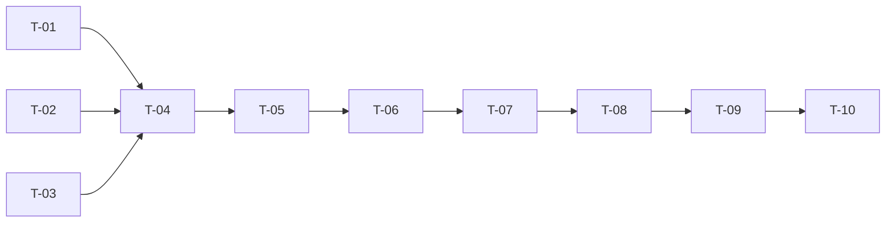

# TASKS — `RF-SP-064` Consultar equipos

| Campo | Valor |
|---|---|
| Requerimiento | `RF-SP-064` |
| Especificación | [`spec.md`](spec.md) |
| Plan | [`plan.md`](plan.md), aprobado el 22-09-2026 |
| Estado | **Aprobadas** |
| Issue | [#89](https://github.com/NexusPro-Dev/backend/issues/89) |
| Rama | `feature/equipos` |
| Autor | Responsable técnico |

---

## 1. Tareas

| ID | Tarea | Depende de | Verificación | Estado |
|---|---|---|---|---|
| `T-01` | `TeamQueryRepository` y `JpaTeamQueryRepository`: `TeamRow`, `count` y `page` nativas, con el filtro por estado, `includeDeleted`, la búsqueda por `f_unaccent(lower(name))` —**la expresión del índice**— y `memberCount` como subconsulta correlacionada sobre `team_members` vigentes | `RF-SP-063` `T-01` | `CA-SP-740`, `CA-SP-744`, `CA-SP-745` | Hecha |
| `T-02` | `TeamSortField` con la lista cerrada (`name` por omisión, `createdAt`) y su `resolver` que rechaza lo demás con `VAL-003`; `ListTeamsRequest` con las cuatro validaciones | — | `CA-SP-741` | Hecha |
| `T-03` | `TeamItem` y `TeamPageResponse` en `teams/application`, con `deletedAt` en `NON_NULL` | — | `CA-SP-742` | Hecha |
| `T-04` | `ListTeamsService`: `Pagination.resolver`, total y página sobre la misma instantánea, `BoundedCount.exacto`, `@Transactional(readOnly = true)` | `T-01`, `T-02`, `T-03` | `CA-SP-746` | Hecha |
| `T-05` | `TeamController`: `GET /api/v1/teams` con `teams:list`, y la **prosa OpenAPI** —qué es `memberCount`, que cuenta vigentes y no historial, que un equipo `INACTIVO` los conserva, que la fila no trae ni descripción ni miembros y dónde están— | `T-04` | `CA-SP-747` | Hecha |
| `T-06` | `EndpointPermissionsIT` con `GET /teams` en `PERMISO_DE_CADA_OPERACION`; `OpenApiContractIT` con la `x-required-permission` y el esquema `PageResponseTeamItem` | `T-05` | `CA-SP-747` | Hecha |
| `T-07` | `TeamListIT` con el fixture de cuatro equipos —dos activos, uno inactivo con miembros, uno eliminado—, nombres que se solapan con y sin acentos, y un manager con dos pertenencias cerradas y una abierta: `CA-SP-740` a `CA-SP-745` y `CA-SP-747` | `T-06` | Siete de los ocho criterios | Hecha |
| `T-08` | La prueba de **número de sentencias** del listado (`CA-SP-746`): página de uno y de veinte, dos sentencias en ambas | `T-07` | `CA-SP-746` | Hecha |
| `T-09` | Contrato regenerado y comparado —solo altas— y `api/index.md` con su fila | `T-08` | El diff del contrato no toca ninguna forma existente | Hecha |
| `T-10` | Matriz de `docs/requirements.md`, la ficha de `requirements/sp.md` §6.1 y los estados de esta tripleta | `T-09` | La fila de `RF-SP-064` refleja el estado | Hecha |

## 2. Orden de ejecución

`T-01`, `T-02` y `T-03` no dependen entre sí. **`T-08` va aparte de `T-07`** y no dentro: la prueba de sentencias es la que impide que una refactorización convierta la subconsulta en un `N+1`, y separarla deja claro que ese es su único trabajo — es la lección que `RF-CM-002` `T-09` dejó pendiente durante semanas por no tenerla escrita como tarea propia.

## 3. Cobertura de los criterios de aceptación

| Criterio | Tareas |
|---|---|
| `CA-SP-740` | `T-01`, `T-07` |
| `CA-SP-741` | `T-02`, `T-07` |
| `CA-SP-742` | `T-03`, `T-07` |
| `CA-SP-743`, `CA-SP-744` | `T-01`, `T-07` |
| `CA-SP-745` | `T-01`, `T-07` |
| `CA-SP-746` | `T-04`, `T-08` |
| `CA-SP-747` | `T-05`, `T-06`, `T-07` |

## 4. Bloqueos

| # | Bloqueo | Desde | Responsable | Estado |
|---|---|---|---|---|
| 1 | **Depende de `RF-SP-063`**: sin `V33` no hay tabla que listar ni índice que usar, y sin `V34` no hay permiso que exigir. No bloquea la redacción; bloquea la construcción | 22-09-2026 | Responsable técnico | **Cerrado** el 22-09-2026 — `RF-SP-063` construido e integrado en `feature/academia`: `V33` y `V34` aplicadas, y este listado estrena `ix_teams_busqueda` |
| 2 | **`memberCount` dirá cero en todas las filas** hasta que `RF-SP-069` exista. **No bloquea**: el contrato ya es el definitivo y la prueba inserta las pertenencias a mano, como hizo `RF-SP-061` con las filas `HOTLINK` | 22-09-2026 | Responsable técnico | **Abierto** |

## 5. Definición de terminado

- [x] Todas las tareas en estado `Hecha`.
- [x] Todos los criterios de aceptación con prueba automatizada en verde.
- [x] `mvn verify` en verde en local; CI en el PR.
- [x] El número de sentencias no crece con el tamaño de la página, y hay una prueba que lo dice.
- [x] `GET /teams` consta en `EndpointPermissionsIT` con `teams:list`.
- [x] El contrato OpenAPI coincide con el comportamiento real, **prosa incluida**.
- [x] Documentación afectada actualizada en el mismo Pull Request.
- [x] Matriz de trazabilidad actualizada.
- [ ] Pull Request aprobado por alguien distinto del autor e integrado.
