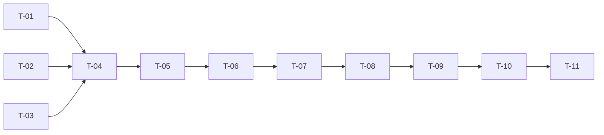

# TASKS — `RF-SP-065` Consultar el detalle de un equipo

| Campo | Valor |
|---|---|
| Requerimiento | `RF-SP-065` |
| Especificación | [`spec.md`](spec.md) |
| Plan | [`plan.md`](plan.md), aprobado el 22-09-2026 |
| Estado | **Aprobadas** |
| Issue | [#91](https://github.com/NexusPro-Dev/backend/issues/91) |
| Rama | `feature/equipos` |
| Autor | Responsable técnico |

---

## 1. Tareas

| ID | Tarea | Depende de | Verificación | Estado |
|---|---|---|---|---|
| `T-01` | `JpaTeamQueryRepository.findDetail(id)`: la ficha con `memberCount` —la subconsulta de `RF-SP-064`—, **viva o eliminada** | `RF-SP-064` `T-01` | `CA-SP-748`, `CA-SP-751` | Hecha |
| `T-02` | `JpaTeamQueryRepository.findMembers(teamId)`: `JOIN users`, solo vigentes, `ORDER BY started_at, username`, con el `status` de la persona | `RF-SP-063` `T-01` | `CA-SP-749`, `CA-SP-750` | Hecha |
| `T-03` | `TeamDetailResponse` y `TeamMemberItem` completos: `deletedAt` y `deletionReason` en `NON_NULL`, `joinedAt` y el estado de la persona en cada miembro | — | `CA-SP-748`, `CA-SP-752` | Hecha |
| `T-04` | `TeamDetailReader` gana los miembros y el motivo de eliminación, leído del puerto de `audit_deletion_log` que ya usan `RF-PM-003` y `RF-AC-003`; nulo y presente si no hay registro | `T-01`, `T-02`, `T-03` | `CA-SP-752`, `CA-SP-753` | Hecha |
| `T-05` | `GetTeamService`: el `404` del inexistente, la orquestación de las dos o tres lecturas y `@Transactional(readOnly = true)` | `T-04` | `CA-SP-752` | Hecha |
| `T-06` | `TeamController`: `GET /api/v1/teams/{id}` con `teams:read`, y la **prosa OpenAPI** —que devuelve el eliminado con su motivo y por qué, que `members` son solo los vigentes, que el `status` de cada miembro es el de la persona y que pertenecer a un equipo no concede acceso a nada | `T-05` | `CA-SP-755` | Hecha |
| `T-07` | `EndpointPermissionsIT` con `GET /teams/{id}` en `PERMISO_DE_CADA_OPERACION`; `OpenApiContractIT` con la `x-required-permission` | `T-06` | `CA-SP-755` | Hecha |
| `T-08` | `TeamDetailIT` con el fixture del plan §11: `CA-SP-748` a `CA-SP-753` y `CA-SP-755` | `T-07` | Siete de los ocho criterios | Hecha |
| `T-09` | La prueba de **número de sentencias** del detalle (`CA-SP-754`): dos con uno y con cinco miembros, tres en el eliminado | `T-08` | `CA-SP-754` | Hecha |
| `T-10` | Contrato regenerado y comparado —solo altas— y `api/index.md` con su fila | `T-09` | El diff del contrato no toca ninguna forma existente | Hecha |
| `T-11` | Matriz de `docs/requirements.md`, la ficha de `requirements/sp.md` §6.1 y los estados de esta tripleta | `T-10` | La fila de `RF-SP-065` refleja el estado | Hecha |

## 2. Orden de ejecución

`T-01`, `T-02` y `T-03` son independientes. **`T-09` va aparte**, por lo mismo que en `RF-SP-064`: la prueba de sentencias es la que impide que la lista de miembros se convierta en una consulta por persona, y una tarea propia es lo que hace que no se quede sin escribir.

## 3. Cobertura de los criterios de aceptación

| Criterio | Tareas |
|---|---|
| `CA-SP-748` | `T-01`, `T-03`, `T-08` |
| `CA-SP-749`, `CA-SP-750` | `T-02`, `T-08` |
| `CA-SP-751` | `T-01`, `T-08` |
| `CA-SP-752` | `T-03`, `T-04`, `T-05`, `T-08` |
| `CA-SP-753` | `T-04`, `T-08` |
| `CA-SP-754` | `T-09` |
| `CA-SP-755` | `T-06`, `T-07`, `T-08` |

## 4. Bloqueos

| # | Bloqueo | Desde | Responsable | Estado |
|---|---|---|---|---|
| 1 | **Depende de `RF-SP-063` y `RF-SP-064`**: del primero, las tablas, el permiso y `TeamDetailReader`; del segundo, la subconsulta de `memberCount` que este detalle reutiliza. No bloquea la redacción; bloquea la construcción — **Cerrado** el 22-09-2026: los dos están construidos e integrados, y `TeamDetailReader` llegó ya completo desde `RF-SP-063` | 22-09-2026 | Responsable técnico | **Abierto** |
| 2 | **Los miembros los inserta el fixture** hasta que exista `RF-SP-069`. **No bloquea**: el contrato ya es el definitivo | 22-09-2026 | Responsable técnico | **Abierto** |

## 5. Definición de terminado

- [x] Todas las tareas en estado `Hecha`.
- [x] Todos los criterios de aceptación con prueba automatizada en verde.
- [x] `mvn verify` en verde en local; CI en el PR.
- [x] El número de sentencias no crece con el número de miembros, y hay una prueba que lo dice.
- [x] `GET /teams/{id}` consta en `EndpointPermissionsIT` con `teams:read`.
- [x] El contrato OpenAPI coincide con el comportamiento real, **prosa incluida**.
- [x] Documentación afectada actualizada en el mismo Pull Request.
- [x] Matriz de trazabilidad actualizada.
- [ ] Pull Request aprobado por alguien distinto del autor e integrado.
