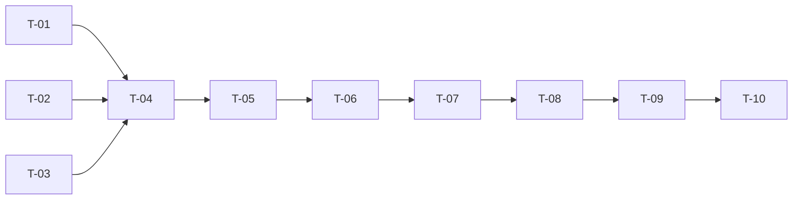

# TASKS — `RF-SP-066` Editar equipo

| Campo | Valor |
|---|---|
| Requerimiento | `RF-SP-066` |
| Especificación | [`spec.md`](spec.md) |
| Plan | [`plan.md`](plan.md), aprobado el 22-09-2026 |
| Estado | **Aprobadas** |
| Issue | [#93](https://github.com/NexusPro-Dev/backend/issues/93) |
| Rama | `feature/equipos` |
| Autor | Responsable técnico |

---

## 1. Tareas

| ID | Tarea | Depende de | Verificación | Estado |
|---|---|---|---|---|
| `T-01` | `Team.rename` y `Team.describe`: recorte, nombre vacío rechazado, descripción de solo espacios a nula, `updatedAt` que avanza | `RF-SP-063` `T-03` | `TeamTest` unitaria, sin Spring | Hecha |
| `T-02` | `TeamRepository.existsAliveNameExcluding(name, id)` con la expresión del índice, y la lectura **con bloqueo** del equipo no eliminado | `RF-SP-063` `T-04` | `CA-SP-758` | Hecha |
| `T-03` | `UpdateTeamRequest`: los dos campos opcionales con la distinción **ausente / nulo**, `VAL-003` si no viene ninguno y rechazo de campos desconocidos | — | `CA-SP-757`, `CA-SP-759` | Hecha |
| `T-04` | `UpdateTeamService`: `404` del inexistente o eliminado, `409` del nombre tomado, aplicación, **diff por valor** al `AuditWriter` y relectura del detalle, en una transacción | `T-01`, `T-02`, `T-03` | `CA-SP-756`, `CA-SP-760`, `CA-SP-762` | Hecha |
| `T-05` | `TeamController`: `PATCH /api/v1/teams/{id}` con `teams:update`, y la **prosa OpenAPI** —qué se edita y qué no, que `null` borra la descripción y omitirla la conserva, que el eliminado responde `404` y que un `INACTIVO` sí se edita | `T-04` | `CA-SP-759`, `CA-SP-761` | Hecha |
| `T-06` | `EndpointPermissionsIT` con `PATCH /teams/{id}` en `PERMISO_DE_CADA_OPERACION`; `OpenApiContractIT` con la `x-required-permission` | `T-05` | `CA-SP-762` | Hecha |
| `T-07` | `TeamUpdateIT`: `CA-SP-756` a `CA-SP-762`, con un equipo `INACTIVO` con dos miembros para comprobar lo que **no** cambia | `T-06` | Los siete criterios | Hecha |
| `T-08` | `TeamConcurrencyIT` gana el caso de los dos renombrados simultáneos al mismo nombre: uno `200`, otro `409`, ningún `500` | `T-07` | `CA-SP-758` | Hecha |
| `T-09` | Contrato regenerado y comparado —solo altas— y `api/index.md` con su fila | `T-08` | El diff del contrato no toca ninguna forma existente | Hecha |
| `T-10` | Matriz de `docs/requirements.md`, la ficha de `requirements/sp.md` §6.1 y los estados de esta tripleta | `T-09` | La fila de `RF-SP-066` refleja el estado | Hecha |

## 2. Orden de ejecución

`T-01`, `T-02` y `T-03` son independientes. `T-08` va detrás de `T-07` y no dentro: la prueba de concurrencia usa el mismo fixture y se escribe cuando el camino normal ya está en verde, porque una carrera que falla sobre un endpoint que aún no funciona no dice nada.

## 3. Cobertura de los criterios de aceptación

| Criterio | Tareas |
|---|---|
| `CA-SP-756` | `T-01`, `T-04`, `T-07` |
| `CA-SP-757` | `T-03`, `T-07` |
| `CA-SP-758` | `T-02`, `T-07`, `T-08` |
| `CA-SP-759` | `T-03`, `T-05`, `T-07` |
| `CA-SP-760` | `T-04`, `T-07` |
| `CA-SP-761` | `T-05`, `T-07` |
| `CA-SP-762` | `T-04`, `T-06`, `T-07` |

## 4. Bloqueos

| # | Bloqueo | Desde | Responsable | Estado |
|---|---|---|---|---|
| 1 | **Depende de `RF-SP-063` y `RF-SP-065`**: del primero, la tabla, el permiso y el agregado; del segundo, el detalle completo que esta edición devuelve. No bloquea la redacción; bloquea la construcción | 22-09-2026 | Responsable técnico | **Abierto** |

## 5. Definición de terminado

- [x] Todas las tareas en estado `Hecha`.
- [x] Todos los criterios de aceptación con prueba automatizada en verde.
- [ ] `mvn verify` en verde en local; CI en el PR.
- [x] La edición emite su fila `UPDATE` con el diff, en la misma transacción.
- [x] `PATCH /teams/{id}` consta en `EndpointPermissionsIT` con `teams:update`.
- [x] El contrato OpenAPI coincide con el comportamiento real, **prosa incluida**.
- [x] Documentación afectada actualizada en el mismo Pull Request.
- [x] Matriz de trazabilidad actualizada.
- [ ] Pull Request aprobado por alguien distinto del autor e integrado.
