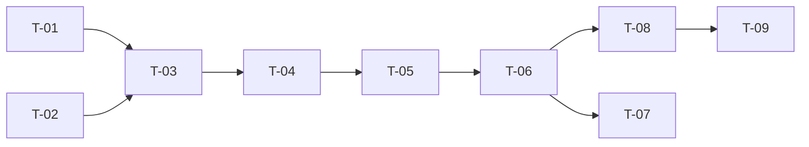

# TASKS — `RF-SP-067` Cambiar el estado de un equipo

| Campo | Valor |
|---|---|
| Requerimiento | `RF-SP-067` |
| Especificación | [`spec.md`](spec.md) |
| Plan | [`plan.md`](plan.md), aprobado el 22-09-2026 |
| Estado | **Aprobadas** |
| Issue | [#98](https://github.com/NexusPro-Dev/backend/issues/98) |
| Rama | `feature/equipos` |
| Autor | Responsable técnico |

---

## 1. Tareas

| ID | Tarea | Depende de | Verificación | Estado |
|---|---|---|---|---|
| `T-01` | `Team.activate(ahora)` y `Team.deactivate(ahora)`: aplican, **devuelven si hubo cambio** y solo entonces avanzan `updatedAt` | `RF-SP-063` `T-03` | `TeamTest` unitaria, sin Spring | Hecha |
| `T-02` | `ChangeTeamStatusRequest`: `status` obligatorio, resuelto sin distinguir mayúsculas, con `VAL-001`; rechaza campos desconocidos, **`reason` incluido** | — | `CA-SP-767` | Hecha |
| `T-03` | `ChangeTeamStatusService`: lectura con bloqueo del equipo no eliminado, `404`, aplicación, **auditoría solo si hubo cambio** y relectura del detalle, en una transacción | `T-01`, `T-02` | `CA-SP-763`, `CA-SP-765`, `CA-SP-768` | Hecha |
| `T-04` | `TeamController`: `PATCH /api/v1/teams/{id}/status` con `teams:change-status`, y la **prosa OpenAPI** —que es idempotente, que desactivar **no** vacía el equipo, que la restricción de `INACTIVO` es sobre el que recibe miembros y que no exige motivo | `T-03` | `CA-SP-767`, `CA-SP-769` | Hecha |
| `T-05` | `EndpointPermissionsIT` con `PATCH /teams/{id}/status` en `PERMISO_DE_CADA_OPERACION`; `OpenApiContractIT` con la `x-required-permission` | `T-04` | `CA-SP-769` | Hecha |
| `T-06` | `TeamStatusIT`: `CA-SP-763` a `CA-SP-765` y `CA-SP-767` a `CA-SP-769`, con un equipo con dos miembros para comprobar que la suspensión los conserva en el detalle y en el recuento del listado | `T-05` | Seis de los siete criterios | Hecha |
| `T-07` | **`CA-SP-766`, cuando `RF-SP-069` exista**: asignar a un equipo suspendido responde `409` y pasa tras reactivarlo. Es la única prueba del bloque que cruza dos requerimientos, y vive aquí porque la regla que verifica es `RN-SP-053` | `T-06`, `RF-SP-069` `T-05` | `CA-SP-766` | Hecha |
| `T-08` | Contrato regenerado y comparado —solo altas— y `api/index.md` con su fila | `T-06` | El diff del contrato no toca ninguna forma existente | Hecha |
| `T-09` | Matriz de `docs/requirements.md`, la ficha de `requirements/sp.md` §6.1 y los estados de esta tripleta | `T-08` | La fila de `RF-SP-067` refleja el estado | Hecha |

## 2. Orden de ejecución

`T-07` cuelga de `RF-SP-069` y **no bloquea el cierre de esta tripleta**: el requerimiento se da por construido con los otros seis criterios en verde, y `CA-SP-766` se marca cuando la asignación exista. Queda declarado en §4 para que no se pierda, que es lo que le pasó a `RF-SP-010` `T-10` durante un mes.

## 3. Cobertura de los criterios de aceptación

| Criterio | Tareas |
|---|---|
| `CA-SP-763` | `T-01`, `T-03`, `T-06` |
| `CA-SP-764` | `T-06` |
| `CA-SP-765` | `T-01`, `T-03`, `T-06` |
| `CA-SP-766` | `T-07` |
| `CA-SP-767` | `T-02`, `T-04`, `T-06` |
| `CA-SP-768` | `T-03`, `T-06` |
| `CA-SP-769` | `T-04`, `T-05`, `T-06` |

## 4. Bloqueos

| # | Bloqueo | Desde | Responsable | Estado |
|---|---|---|---|---|
| 1 | **Depende de `RF-SP-063` y `RF-SP-065`** para la tabla, el permiso, el agregado y el detalle que devuelve | 22-09-2026 | Responsable técnico | **Cerrado** el 23-09-2026 — los cuatro anteriores del submódulo están construidos; `findAliveByIdForUpdate` y `TeamDetailReader` llegaron completos desde `RF-SP-063` y esta tripleta no añadió una línea a ninguno de los dos |
| 2 | **`CA-SP-766` necesita `RF-SP-069`**: la regla que verifica —un equipo `INACTIVO` no recibe miembros— se ejerce desde la asignación, que es donde vive. **No bloquea** el cierre de esta tripleta; `T-07` queda declarada y se hace en el bloque siguiente | 22-09-2026 | Responsable técnico | **Cerrado** el 23-09-2026 — `RF-SP-069` existe y `CA-SP-766` está escrita en `TeamStatusIT`, que es donde vive lo que prueba: qué significa el estado |

## 5. Definición de terminado

- [x] Todas las tareas en estado `Hecha`, incluida `T-07`, hecha el 23-09-2026 con `RF-SP-069`.
- [x] Todos los criterios de aceptación con prueba automatizada en verde, **incluido `CA-SP-766`** desde el 23-09-2026.
- [x] `mvn verify` en verde en local; CI en el PR.
- [x] El cambio efectivo emite su fila `UPDATE`; la petición idempotente **no** emite nada.
- [x] `PATCH /teams/{id}/status` consta en `EndpointPermissionsIT` con `teams:change-status`.
- [x] El contrato OpenAPI coincide con el comportamiento real, **prosa incluida**.
- [x] Documentación afectada actualizada en el mismo Pull Request.
- [x] Matriz de trazabilidad actualizada.
- [ ] Pull Request aprobado por alguien distinto del autor e integrado.
