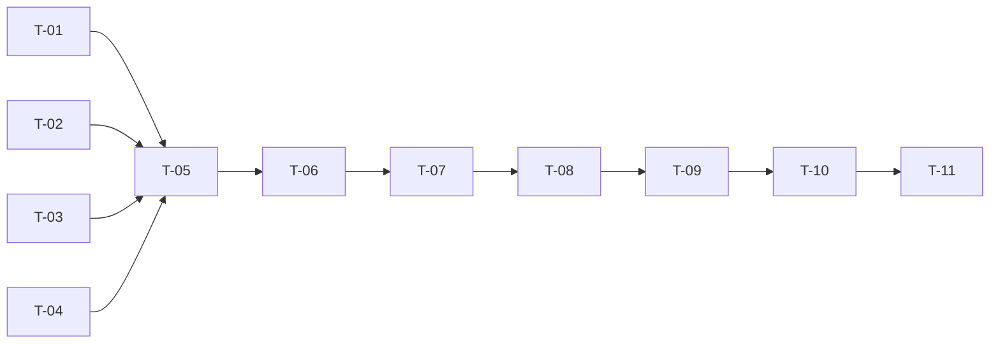

# TASKS — `RF-SP-068` Eliminar equipo

| Campo | Valor |
|---|---|
| Requerimiento | `RF-SP-068` |
| Especificación | [`spec.md`](spec.md) |
| Plan | [`plan.md`](plan.md), aprobado el 22-09-2026 |
| Estado | **Aprobadas** |
| Issue | [#99](https://github.com/NexusPro-Dev/backend/issues/99) |
| Rama | `feature/equipos` |
| Autor | Responsable técnico |

---

## 1. Tareas

| ID | Tarea | Depende de | Verificación | Estado |
|---|---|---|---|---|
| `T-01` | `Team.delete(ahora)`: marca `deleted_at` **sin tocar `status`** ni ningún otro campo | `RF-SP-063` `T-03` | `TeamTest` unitaria, sin Spring | Hecha |
| `T-02` | `TeamRepository.findForUpdate(id)` —en cualquier estado, **con bloqueo**— y `countActiveMembers(teamId)` por `ix_team_members_team_vigente` | `RF-SP-063` `T-04` | `CA-SP-771`, `CA-SP-774` | Hecha |
| `T-03` | `TeamMemberRepository.findAllMemberIdsEver(teamId)` para la instantánea: **todas** las personas que pasaron, no solo las vigentes | `RF-SP-063` `T-01` | `CA-SP-775` | Hecha |
| `T-04` | `DeleteTeamRequest` con `DeletionReason` de `shared/audit`: los dos códigos ya publicados, `VAL-002` para el ausente y `VAL-003` para el largo | — | `CA-SP-773` | Hecha |
| `T-05` | `DeleteTeamService`: motivo **antes de consultar**, resolución con bloqueo, `EX-001`/`EX-002`/`EX-003` con `error_code` distinto cada uno, instantánea, `deleted_at` y `AuditWriter` en una transacción | `T-01`, `T-02`, `T-03`, `T-04` | `CA-SP-770` a `CA-SP-775` | Hecha |
| `T-06` | `TeamController`: `POST /api/v1/teams/{id}/deletion` con `teams:delete`, y la **prosa OpenAPI** —que exige el equipo vacío y por qué, cuáles son las dos salidas, que el historial sobrevive, que el nombre queda libre y que un alta con ese nombre no hereda nada | `T-05` | `CA-SP-776` | Hecha |
| `T-07` | `EndpointPermissionsIT` con `POST /teams/{id}/deletion` en `PERMISO_DE_CADA_OPERACION`; `OpenApiContractIT` con la `x-required-permission` | `T-06` | `CA-SP-777` | Hecha |
| `T-08` | `TeamDeletionIT`: `CA-SP-770` a `CA-SP-776`, con un equipo vacío, uno con dos pertenencias cerradas, uno con un miembro vigente, uno ya eliminado y el alta posterior con el nombre liberado | `T-07` | Siete de los ocho criterios | Hecha |
| `T-09` | `TeamConcurrencyIT` gana **dos carreras**: dos eliminaciones simultáneas (un `204`, un `409`, **una** fila de auditoría) y —cuando `RF-SP-069` exista— eliminación contra asignación al mismo equipo. **La primera está hecha el 23-09-2026** y deja `CA-SP-777` en verde; la cruzada es la que espera, y por eso la tarea no se cierra | `T-08` | `CA-SP-777` | Pendiente |
| `T-10` | Contrato regenerado y comparado —solo altas— y `api/index.md` con su fila | `T-09` | El diff del contrato no toca ninguna forma existente | Hecha |
| `T-11` | Matriz de `docs/requirements.md`, la ficha de `requirements/sp.md` §6.1 y los estados de esta tripleta | `T-10` | La fila de `RF-SP-068` refleja el estado | Hecha |

## 2. Orden de ejecución

`T-01` a `T-04` son independientes. **La mitad de `T-09` espera a `RF-SP-069`**: la carrera entre eliminar y asignar no se puede escribir sin la asignación, y la de dos eliminaciones sí — se hace ahora y la otra se añade en el bloque siguiente.

## 3. Cobertura de los criterios de aceptación

| Criterio | Tareas |
|---|---|
| `CA-SP-770` | `T-01`, `T-05`, `T-08` |
| `CA-SP-771` | `T-02`, `T-05`, `T-08` |
| `CA-SP-772` | `T-02`, `T-08` |
| `CA-SP-773` | `T-04`, `T-05`, `T-08` |
| `CA-SP-774` | `T-02`, `T-05`, `T-08` |
| `CA-SP-775` | `T-03`, `T-05`, `T-08` |
| `CA-SP-776` | `T-06`, `T-08` |
| `CA-SP-777` | `T-07`, `T-09` |

## 4. Bloqueos

| # | Bloqueo | Desde | Responsable | Estado |
|---|---|---|---|---|
| 1 | **Depende de `RF-SP-063`** (tabla, permiso, agregado) y, para `CA-SP-776`, de `RF-SP-064` y `RF-SP-065` —el listado y el detalle que comprueban el efecto de la baja | 22-09-2026 | Responsable técnico | **Cerrado** el 23-09-2026 — los cinco anteriores del submódulo están construidos, y `CA-SP-776` comprueba el efecto de la baja contra el listado y el detalle de verdad, no contra la tabla |
| 2 | **La carrera entre eliminar y asignar necesita `RF-SP-069`.** No bloquea el cierre: la otra mitad de `T-09` —dos eliminaciones simultáneas— cubre `CA-SP-777`, y la carrera cruzada se añade con el bloque siguiente | 22-09-2026 | Responsable técnico | **Abierto** |

## 5. Definición de terminado

- [x] Todas las tareas en estado `Hecha`, salvo la mitad de `T-09` declarada en el bloqueo 2.
- [x] Todos los criterios de aceptación con prueba automatizada en verde.
- [x] La baja emite su fila `LOGICAL` con motivo, actor e instantánea, en la misma transacción.
- [x] Un motivo inválido no cuesta ni una sentencia.
- [x] `POST /teams/{id}/deletion` consta en `EndpointPermissionsIT` con `teams:delete`.
- [x] `mvn verify` en verde en local; CI en el PR.
- [x] El contrato OpenAPI coincide con el comportamiento real, **prosa incluida**.
- [x] Documentación afectada actualizada en el mismo Pull Request.
- [x] Matriz de trazabilidad actualizada.
- [ ] Pull Request aprobado por alguien distinto del autor e integrado.
