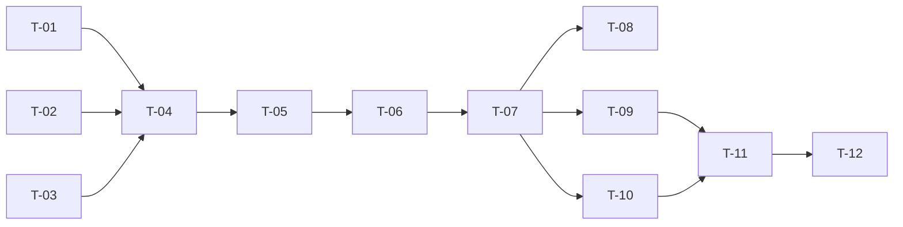

# TASKS — `RF-SP-069` Asignar miembros a un equipo

| Campo | Valor |
|---|---|
| Requerimiento | `RF-SP-069` |
| Especificación | [`spec.md`](spec.md) |
| Plan | [`plan.md`](plan.md), aprobado el 22-09-2026 |
| Estado | **En revisión** |
| Issue | Pendiente de crear |
| Rama | `feature/equipos` |
| Autor | Responsable técnico |

---

## 1. Tareas

| ID | Tarea | Depende de | Verificación | Estado |
|---|---|---|---|---|
| `T-01` | `TeamMembershipRules` en `teams/domain/service`: dada la lista de personas con sus roles, separa quién puede entrar de quién no y por qué, **usando `CommercialStructure.esCuspide`** y sin reimplementar la regla | `RF-SP-063` `T-03` | `TeamMembershipRulesTest` unitaria, sin Spring: manager sí; director, agente, cliente y persona sin rol, no | Pendiente |
| `T-02` | `TeamMemberRepository`: `findActiveOf(userIds)` en **una** consulta, `save` y `saveAll`; la violación de `uq_team_members_vigente` traducida **por nombre de restricción** al `409` de negocio | `RF-SP-063` `T-01` | `CA-SP-779` y la carrera de `T-09` | Pendiente |
| `T-03` | `AssignTeamMembersRequest`: `memberIds` 1..100 sin repetidos, `reason` con `ChangeReason` de `shared/audit`, rechazo de campos desconocidos —`startedAt` incluido | — | `CA-SP-785` | Pendiente |
| `T-04` | `AssignTeamMembersService`: bloqueo del equipo, `404` y `409` de estado, resolución **en bloque** de personas y roles, `TeamMembershipRules`, los dos `422` con la lista de causantes, cierres y aperturas, y auditoría **con un solo identificador de correlación** | `T-01`, `T-02`, `T-03` | `CA-SP-778` a `CA-SP-784`, `CA-SP-786` | Pendiente |
| `T-05` | `TeamController`: `POST /api/v1/teams/{id}/members` con `teams:assign-members`, y la **prosa OpenAPI** —quién puede entrar y por qué, que asignar cierra la pertenencia anterior, que quien ya está no pierde antigüedad, que el equipo inactivo responde `409` y el eliminado `404`, y que pertenecer no concede acceso a nada | `T-04` | `CA-SP-788` | Pendiente |
| `T-06` | `EndpointPermissionsIT` con `POST /teams/{id}/members` en `PERMISO_DE_CADA_OPERACION`; `OpenApiContractIT` con la `x-required-permission` | `T-05` | `CA-SP-788` | Pendiente |
| `T-07` | `TeamMembersIT` con el fixture del plan §11: `CA-SP-778` a `CA-SP-788` | `T-06` | Los once criterios | Pendiente |
| `T-08` | **Cerrar `CA-SP-766` de `RF-SP-067`** en `TeamStatusIT`: asignar a un equipo suspendido responde `409` y pasa tras reactivarlo; marcar su `T-07` como hecha y quitar el bloqueo 2 de aquella tripleta | `T-07` | `CA-SP-766` | Pendiente |
| `T-09` | `TeamConcurrencyIT` gana dos carreras: la misma persona a dos equipos a la vez —una gana, otra `409`, ningún `500`— y **asignación contra eliminación** del mismo equipo, que cierra la media carrera declarada en `RF-SP-068` `T-09` | `T-07` | `CA-SP-777`, `CA-SP-779` | Pendiente |
| `T-10` | La prueba del lote de cien: el número de sentencias **no crece** con el tamaño de la lista —resolución en bloque, no una consulta por persona | `T-07` | El plan §10, riesgo del `N+1` | Pendiente |
| `T-11` | Contrato regenerado y comparado —solo altas— y `api/index.md` con su fila | `T-09`, `T-10` | El diff del contrato no toca ninguna forma existente | Pendiente |
| `T-12` | Matriz de `docs/requirements.md`, la ficha de `requirements/sp.md` §6.1 y los estados de esta tripleta y de la de `RF-SP-067` | `T-11` | Las filas de `RF-SP-069` y `RF-SP-067` reflejan el estado | Pendiente |

## 2. Orden de ejecución

`T-01` es la primera a propósito: es la regla, se prueba sin Spring y en minutos, y si `RN-SP-051` no está bien entendida, es ahí donde se ve y no dentro de una suite de endpoint.

## 3. Cobertura de los criterios de aceptación

| Criterio | Tareas |
|---|---|
| `CA-SP-778`, `CA-SP-780` | `T-04`, `T-07` |
| `CA-SP-779` | `T-02`, `T-04`, `T-07`, `T-09` |
| `CA-SP-781` | `T-04`, `T-07` |
| `CA-SP-782` | `T-01`, `T-04`, `T-07` |
| `CA-SP-783`, `CA-SP-784` | `T-04`, `T-07` |
| `CA-SP-785` | `T-03`, `T-07` |
| `CA-SP-786` | `T-04`, `T-07` |
| `CA-SP-787` | `T-07` |
| `CA-SP-788` | `T-05`, `T-06`, `T-07` |
| `CA-SP-766` (de `RF-SP-067`) | `T-08` |
| `CA-SP-777` (de `RF-SP-068`) | `T-09` |

## 4. Bloqueos

| # | Bloqueo | Desde | Responsable | Estado |
|---|---|---|---|---|
| 1 | **Depende de `RF-SP-063`, `RF-SP-065` y `RF-SP-067`**: la tabla y el permiso del primero, el detalle que devuelve del segundo, y el estado que consulta del tercero | 22-09-2026 | Responsable técnico | **Abierto** |
| 2 | **Cierra dos deudas de bloques anteriores**: `CA-SP-766` (`RF-SP-067` `T-07`) y la media carrera de `RF-SP-068` `T-09`. Si esta tripleta se pospusiera, esas dos siguen abiertas y **no** se dan por cubiertas | 22-09-2026 | Responsable técnico | **Abierto** |

## 5. Definición de terminado

- [ ] Todas las tareas en estado `Hecha`.
- [ ] Todos los criterios de aceptación con prueba automatizada en verde, **incluidos `CA-SP-766` y `CA-SP-777`**, que se cierran aquí.
- [ ] `mvn verify` en verde en local; CI en el PR.
- [ ] Cada pertenencia abierta y cerrada emite su fila de auditoría, con motivo y un solo identificador de correlación por petición.
- [ ] El número de sentencias no crece con el tamaño del lote.
- [ ] `POST /teams/{id}/members` consta en `EndpointPermissionsIT` con `teams:assign-members`.
- [ ] El contrato OpenAPI coincide con el comportamiento real, **prosa incluida**.
- [ ] Documentación afectada actualizada en el mismo Pull Request, **incluida la tripleta de `RF-SP-067`**.
- [ ] Matriz de trazabilidad actualizada.
- [ ] Pull Request aprobado por alguien distinto del autor e integrado.
