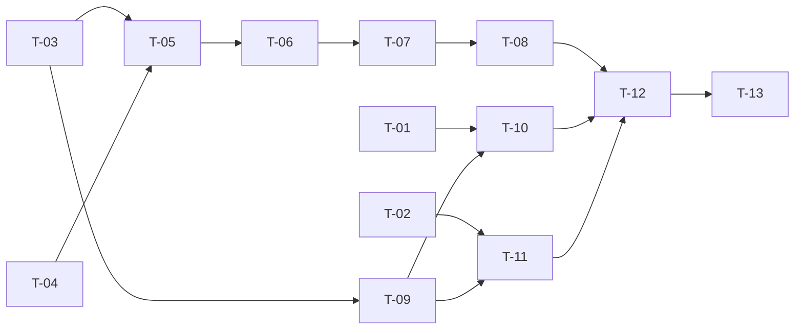

# TASKS — `RF-SP-070` Retirar miembros de un equipo

| Campo | Valor |
|---|---|
| Requerimiento | `RF-SP-070` |
| Especificación | [`spec.md`](spec.md) |
| Plan | [`plan.md`](plan.md), aprobado el 22-09-2026 |
| Estado | **En revisión** |
| Issue | Pendiente de crear |
| Rama | `feature/equipos` |
| Autor | Responsable técnico |

---

## 1. Tareas

| ID | Tarea | Depende de | Verificación | Estado |
|---|---|---|---|---|
| `T-01` | **Enmienda de Art. I.7 a la tripleta de `RF-SP-031`** (retirar roles, construido): `spec.md`, `plan.md` y `tasks.md` declaran que retirar el rol vendedor de mayor rango **cierra la pertenencia al equipo en la misma transacción y con la misma correlación** (`RN-SP-055`), con `CA-SP-795` citado. **No toca código** | — | Las tres piezas de `docs/specs/sp/031-retirar-roles-usuario/` lo dicen, y su control de cambios lo registra | Pendiente |
| `T-02` | **Enmienda de Art. I.7 a la tripleta de `RF-SP-029`** (eliminar usuario, construido): lo mismo para la eliminación, y que **cambiar el estado (`RF-SP-028`) no saca del equipo**, con `CA-SP-796` citado. **No toca código** | — | Ídem en `docs/specs/sp/029-eliminar-usuario/` | Pendiente |
| `T-03` | `TeamMemberRepository.findActiveIn(teamId, userIds)`: las pertenencias vigentes **de este equipo** para un conjunto, en una consulta | `RF-SP-069` `T-02` | `CA-SP-789`, `CA-SP-790` | Pendiente |
| `T-04` | `RemoveTeamMembersRequest`: `memberIds` 1..100, `reason` con `ChangeReason`, rechazo de campos desconocidos | — | `CA-SP-792` | Pendiente |
| `T-05` | `RemoveTeamMembersService`: bloqueo, `404`, `422` con la lista de quienes no pertenecen, cierres y auditoría con una sola correlación, relectura del detalle | `T-03`, `T-04` | `CA-SP-789`, `CA-SP-790`, `CA-SP-793`, `CA-SP-794` | Pendiente |
| `T-06` | `TeamController`: `POST /api/v1/teams/{id}/members/removals` con `teams:remove-members`, y la **prosa OpenAPI** —que cierra y no borra, que se puede sobre un equipo inactivo y por qué, que «no pertenece» es `422` y que retirar no toca el rol ni la cadena de mando | `T-05` | `CA-SP-791`, `CA-SP-797` | Pendiente |
| `T-07` | `EndpointPermissionsIT` con la ruta en `PERMISO_DE_CADA_OPERACION`; `OpenApiContractIT` con la `x-required-permission` | `T-06` | `CA-SP-797` | Pendiente |
| `T-08` | `TeamMemberRemovalIT`: `CA-SP-789` a `CA-SP-794` y `CA-SP-797`, incluido el recorrido entero de `RN-SP-054` —vaciar el último y comprobar que `RF-SP-068` ya no responde `409` | `T-07` | Siete de los nueve criterios | Pendiente |
| `T-09` | **El puerto `TeamMembershipRetirement`**: cierra la pertenencia vigente si la hay, **no falla si no la hay**, no toca nada más; con su prueba propia | `T-03` | `TeamMembershipRetirementIT` | Pendiente |
| `T-10` | **`RN-SP-055` en `RevokeUserRolesService`** (`RF-SP-031`): si el retiro deja a la persona sin el rol de mayor rango, invoca el puerto **en la misma transacción y con la misma correlación**. Solo después de `T-01` | `T-01`, `T-09` | `CA-SP-795`, incluido el caso en que **el retiro falla y la pertenencia no se cierra** | Pendiente |
| `T-11` | **`RN-SP-055` en `DeleteUserService`** (`RF-SP-029`): ídem para la eliminación. Solo después de `T-02` | `T-02`, `T-09` | `CA-SP-796`, y que `RF-SP-028` **no** saca del equipo | Pendiente |
| `T-12` | Contrato regenerado y comparado —solo altas— y `api/index.md` con su fila | `T-08`, `T-10`, `T-11` | El diff del contrato no toca ninguna forma existente | Pendiente |
| `T-13` | Matriz de `docs/requirements.md` —fila de `RF-SP-070` y las notas de enmienda en `RF-SP-029` y `RF-SP-031`—, la ficha de `requirements/sp.md` §6.1 y los estados de esta tripleta | `T-12` | Las tres filas reflejan el estado | Pendiente |

## 2. Orden de ejecución

**`T-01` y `T-02` van primero y no tocan código**, que es lo que el Art. I.7 exige: los dos requerimientos que se enmiendan están construidos, y la tripleta se corrige **antes** que su implementación. Hacerlo al revés convierte la spec en una descripción de lo que se hizo.

## 3. Cobertura de los criterios de aceptación

| Criterio | Tareas |
|---|---|
| `CA-SP-789` | `T-03`, `T-05`, `T-08` |
| `CA-SP-790` | `T-03`, `T-05`, `T-08` |
| `CA-SP-791` | `T-06`, `T-08` |
| `CA-SP-792` | `T-04`, `T-08` |
| `CA-SP-793`, `CA-SP-794` | `T-05`, `T-08` |
| `CA-SP-795` | `T-01`, `T-09`, `T-10` |
| `CA-SP-796` | `T-02`, `T-09`, `T-11` |
| `CA-SP-797` | `T-06`, `T-07`, `T-08` |

## 4. Bloqueos

| # | Bloqueo | Desde | Responsable | Estado |
|---|---|---|---|---|
| 1 | **Depende de `RF-SP-069`**: comparte el repositorio de pertenencias y el patrón de auditoría correlacionada; y de `RF-SP-063` y `RF-SP-065` para la tabla, el permiso y el detalle | 22-09-2026 | Responsable técnico | **Abierto** |
| 2 | **`T-10` y `T-11` tocan código construido** (`RF-SP-031` y `RF-SP-029`). No se ejecutan hasta que `T-01` y `T-02` estén hechas, y sus suites existentes tienen que seguir en verde: son dos casos de uso con pruebas propias que esta enmienda amplía, no sustituye | 22-09-2026 | Responsable técnico | **Abierto** |

## 5. Definición de terminado

- [ ] Todas las tareas en estado `Hecha`.
- [ ] Todos los criterios de aceptación con prueba automatizada en verde.
- [ ] Las tripletas de `RF-SP-029` y `RF-SP-031` enmendadas **antes** de tocar su código, con su control de cambios.
- [ ] El cierre por `RN-SP-055` ocurre en la transacción de la operación que lo causa, y hay una prueba del caso de fallo.
- [ ] `POST /teams/{id}/members/removals` consta en `EndpointPermissionsIT` con `teams:remove-members`.
- [ ] `mvn verify` en verde en local, **con las suites de `RF-SP-029` y `RF-SP-031` incluidas**; CI en el PR.
- [ ] El contrato OpenAPI coincide con el comportamiento real, **prosa incluida**.
- [ ] Documentación afectada actualizada en el mismo Pull Request.
- [ ] Matriz de trazabilidad actualizada, con las notas de enmienda en las dos filas ajenas.
- [ ] Pull Request aprobado por alguien distinto del autor e integrado.
