# Flujos por caso de uso — `SP` Sistema Principal

| Campo | Valor |
|---|---|
| Módulo | `SP` — Sistema Principal |
| Versión | 0.1.0 |
| Estado | **Borrador** |
| Responsable | Bonilla Diaz William Steven |
| Fecha de creación | 21-08-2026 |
| Última actualización | 21-08-2026 |

!!! info "Qué va en este documento"

    Un diagrama por caso de uso: qué puede hacer el actor, qué verifica el sistema en cada paso y por dónde sale la operación cuando una verificación falla.

    Cada diagrama es la transcripción literal de las **§8 Flujo principal**, **§9 Flujos alternativos** y **§10 Excepciones** de su spec. No añade comportamiento. Ante cualquier discrepancia, **manda la spec**.

    Cubre los **21 requerimientos con spec aprobada**. `RF-SP-022` —cambiar el estado de un país— y `RF-SP-023` —cambiar el estado de una moneda— están registrados en `requirements/sp.md` pero todavía no tienen tripleta, así que no aparecen aquí.

!!! note "Convención de los diagramas"

    | Forma | Significado |
    |---|---|
    | Cápsula | Acción del actor, o respuesta final del sistema |
    | Rombo | Verificación del sistema |
    | Rectángulo | Paso del sistema que produce efecto |
    | Recuadro rojo | Rechazo tipificado, con su identificador `EX-00n` |
    | Línea punteada | Flujo alternativo `FA-00n`: no es error |

    Cuando una excepción no tiene un paso propio en la §8 se dibuja en el punto donde el sistema necesariamente la detecta. Cuando el flujo principal verifica algo que la §10 no tipifica, el rechazo aparece marcado como **sin excepción tipificada**.

---

## 1. Roles

### `RF-SP-001` · Registrar rol

El único camino de entrada de un rol al sistema. Nace activo y con sus permisos ya contenidos en los del padre.

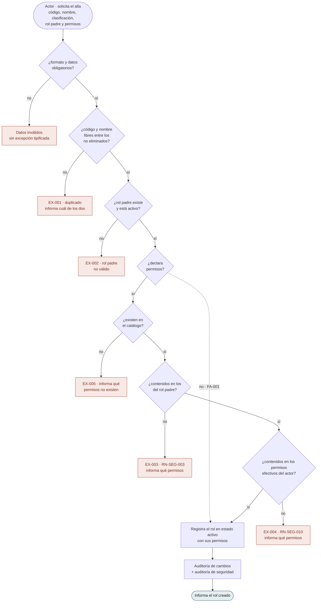
```mermaid
flowchart TD
    A(["Actor · solicita el alta<br/>código, nombre, clasificación,<br/>rol padre y permisos"])
    A --> V1{"¿formato y datos<br/>obligatorios?"}
    V1 -->|no| E0["Datos inválidos<br/>sin excepción tipificada"]
    V1 -->|sí| V2{"¿código y nombre<br/>libres entre los<br/>no eliminados?"}
    V2 -->|no| E1["EX-001 · duplicado<br/>informa cuál de los dos"]
    V2 -->|sí| V3{"¿rol padre existe<br/>y está activo?"}
    V3 -->|no| E2["EX-002 · rol padre<br/>no válido"]
    V3 -->|sí| D1{"¿declara<br/>permisos?"}
    D1 -.->|"no · FA-001"| P1
    D1 -->|sí| V4{"¿existen en<br/>el catálogo?"}
    V4 -->|no| E5["EX-005 · informa qué<br/>permisos no existen"]
    V4 -->|sí| V5{"¿contenidos en los<br/>del rol padre?"}
    V5 -->|no| E3["EX-003 · RN-SEG-003<br/>informa qué permisos"]
    V5 -->|sí| V6{"¿contenidos en los permisos<br/>efectivos del actor?"}
    V6 -->|no| E4["EX-004 · RN-SEG-010<br/>informa qué permisos"]
    V6 -->|sí| P1["Registra el rol en estado activo<br/>con sus permisos"]
    P1 --> P2["Auditoría de cambios<br/>+ auditoría de seguridad"]
    P2 --> FIN(["Informa el rol creado"])

    classDef ex fill:#F7E9E5,stroke:#A33B2A,color:#7A2B1E
    classDef ok fill:#E5EEF0,stroke:#2D5A6B,color:#141B1E
    class E0,E1,E2,E3,E4,E5 ex
    class FIN ok
```

`FA-001` — sin permisos iniciales el sistema omite las dos verificaciones de contención y el rol queda registrado vacío, a la espera de `RF-SP-005`.

---

### `RF-SP-002` · Consultar roles

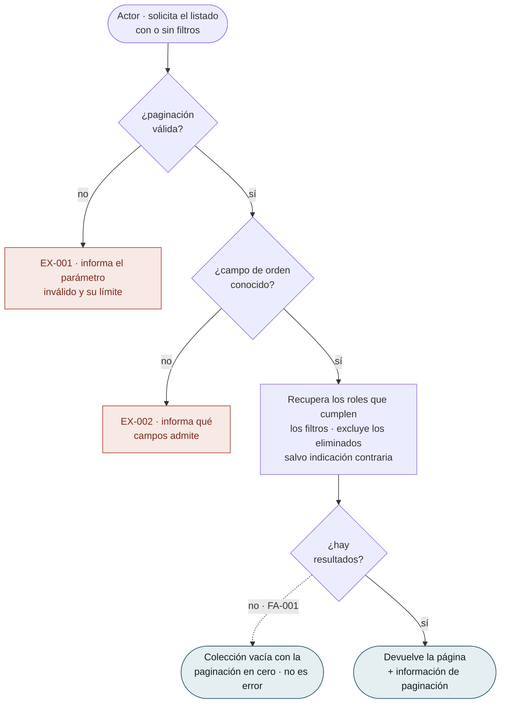
```mermaid
flowchart TD
    A(["Actor · solicita el listado<br/>con o sin filtros"])
    A --> V1{"¿paginación<br/>válida?"}
    V1 -->|no| E1["EX-001 · informa el parámetro<br/>inválido y su límite"]
    V1 -->|sí| V2{"¿campo de orden<br/>conocido?"}
    V2 -->|no| E2["EX-002 · informa qué<br/>campos admite"]
    V2 -->|sí| P1["Recupera los roles que cumplen<br/>los filtros · excluye los eliminados<br/>salvo indicación contraria"]
    P1 --> D1{"¿hay<br/>resultados?"}
    D1 -.->|"no · FA-001"| F2(["Colección vacía con la<br/>paginación en cero · no es error"])
    D1 -->|sí| FIN(["Devuelve la página<br/>+ información de paginación"])

    classDef ex fill:#F7E9E5,stroke:#A33B2A,color:#7A2B1E
    classDef ok fill:#E5EEF0,stroke:#2D5A6B,color:#141B1E
    class E1,E2 ex
    class FIN,F2 ok
```

---

### `RF-SP-003` · Consultar detalle de rol

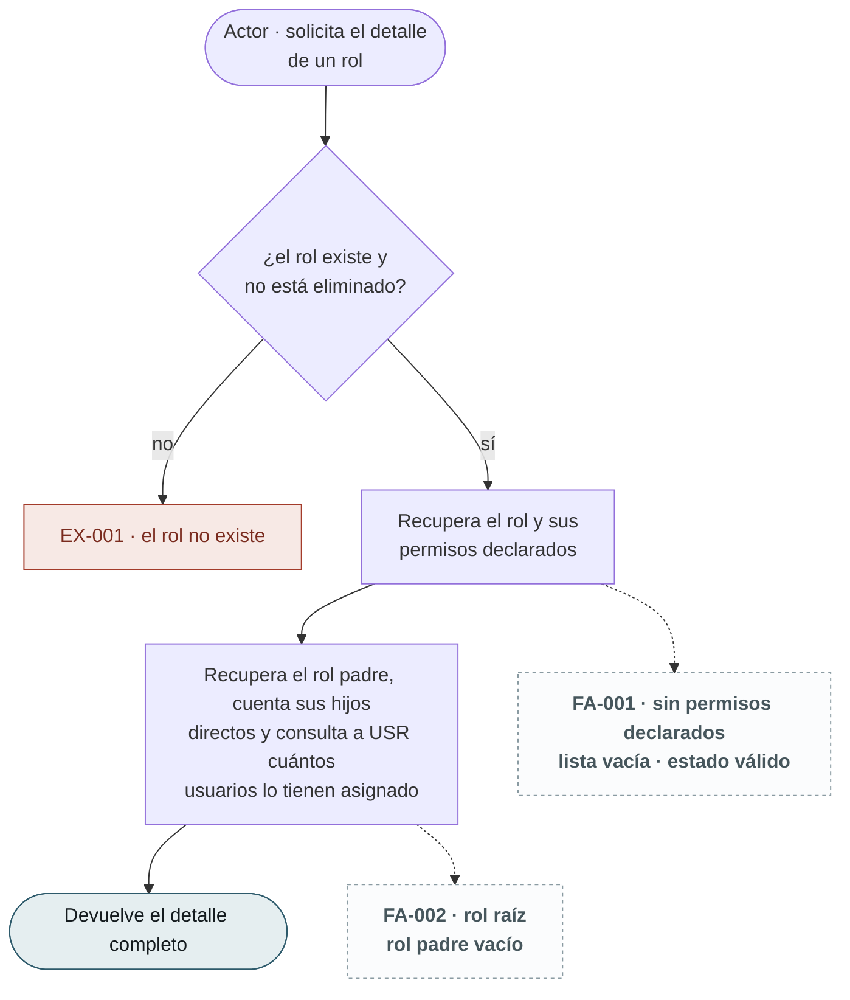
```mermaid
flowchart TD
    A(["Actor · solicita el detalle<br/>de un rol"])
    A --> V1{"¿el rol existe y<br/>no está eliminado?"}
    V1 -->|no| E1["EX-001 · el rol no existe"]
    V1 -->|sí| P1["Recupera el rol y sus<br/>permisos declarados"]
    P1 --> P2["Recupera el rol padre, cuenta sus hijos<br/>directos y consulta a USR cuántos<br/>usuarios lo tienen asignado"]
    P2 --> FIN(["Devuelve el detalle completo"])
    P1 -.-> N1["FA-001 · sin permisos declarados<br/>lista vacía · estado válido"]
    P2 -.-> N2["FA-002 · rol raíz<br/>rol padre vacío"]

    classDef ex fill:#F7E9E5,stroke:#A33B2A,color:#7A2B1E
    classDef ok fill:#E5EEF0,stroke:#2D5A6B,color:#141B1E
    classDef fa fill:#FBFCFD,stroke:#8A9BA2,stroke-dasharray:3 3,color:#46565C
    class E1 ex
    class FIN ok
    class N1,N2 fa
```

---

### `RF-SP-004` · Editar rol

Toca nombre, descripción y clasificación. **No** toca código, permisos, estado ni rol padre: cada uno tiene su propio caso de uso.

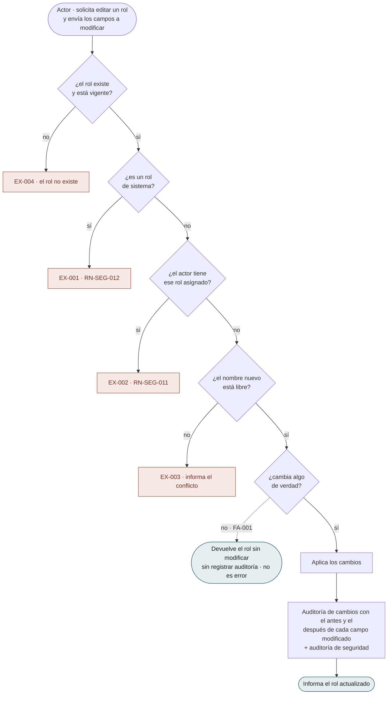
```mermaid
flowchart TD
    A(["Actor · solicita editar un rol<br/>y envía los campos a modificar"])
    A --> V1{"¿el rol existe<br/>y está vigente?"}
    V1 -->|no| E4["EX-004 · el rol no existe"]
    V1 -->|sí| V2{"¿es un rol<br/>de sistema?"}
    V2 -->|sí| E1["EX-001 · RN-SEG-012"]
    V2 -->|no| V3{"¿el actor tiene<br/>ese rol asignado?"}
    V3 -->|sí| E2["EX-002 · RN-SEG-011"]
    V3 -->|no| V4{"¿el nombre nuevo<br/>está libre?"}
    V4 -->|no| E3["EX-003 · informa el conflicto"]
    V4 -->|sí| D1{"¿cambia algo<br/>de verdad?"}
    D1 -.->|"no · FA-001"| F1(["Devuelve el rol sin modificar<br/>sin registrar auditoría · no es error"])
    D1 -->|sí| P1["Aplica los cambios"]
    P1 --> P2["Auditoría de cambios con el antes y el<br/>después de cada campo modificado<br/>+ auditoría de seguridad"]
    P2 --> FIN(["Informa el rol actualizado"])

    classDef ex fill:#F7E9E5,stroke:#A33B2A,color:#7A2B1E
    classDef ok fill:#E5EEF0,stroke:#2D5A6B,color:#141B1E
    class E1,E2,E3,E4 ex
    class FIN,F1 ok
```

---

### `RF-SP-005` · Asignar permisos

Idempotente y de todo o nada: si un solo permiso incumple, se rechaza la operación completa.

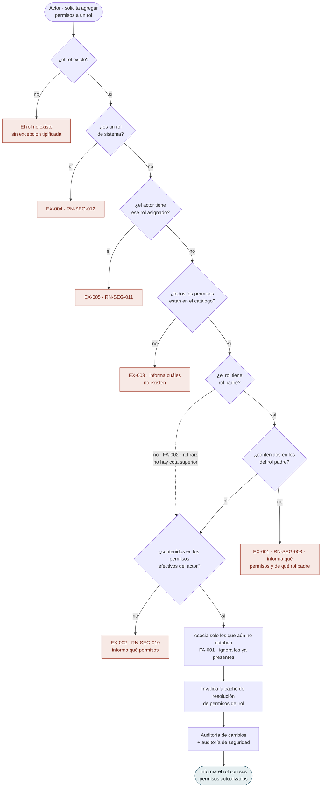
```mermaid
flowchart TD
    A(["Actor · solicita agregar<br/>permisos a un rol"])
    A --> V1{"¿el rol existe?"}
    V1 -->|no| E0["El rol no existe<br/>sin excepción tipificada"]
    V1 -->|sí| V2{"¿es un rol<br/>de sistema?"}
    V2 -->|sí| E4["EX-004 · RN-SEG-012"]
    V2 -->|no| V3{"¿el actor tiene<br/>ese rol asignado?"}
    V3 -->|sí| E5["EX-005 · RN-SEG-011"]
    V3 -->|no| V4{"¿todos los permisos<br/>están en el catálogo?"}
    V4 -->|no| E3["EX-003 · informa cuáles<br/>no existen"]
    V4 -->|sí| D1{"¿el rol tiene<br/>rol padre?"}
    D1 -.->|"no · FA-002 · rol raíz<br/>no hay cota superior"| V6
    D1 -->|sí| V5{"¿contenidos en los<br/>del rol padre?"}
    V5 -->|no| E1["EX-001 · RN-SEG-003 · informa qué<br/>permisos y de qué rol padre"]
    V5 -->|sí| V6{"¿contenidos en los permisos<br/>efectivos del actor?"}
    V6 -->|no| E2["EX-002 · RN-SEG-010<br/>informa qué permisos"]
    V6 -->|sí| P1["Asocia solo los que aún no estaban<br/>FA-001 · ignora los ya presentes"]
    P1 --> P2["Invalida la caché de resolución<br/>de permisos del rol"]
    P2 --> P3["Auditoría de cambios<br/>+ auditoría de seguridad"]
    P3 --> FIN(["Informa el rol con sus<br/>permisos actualizados"])

    classDef ex fill:#F7E9E5,stroke:#A33B2A,color:#7A2B1E
    classDef ok fill:#E5EEF0,stroke:#2D5A6B,color:#141B1E
    class E0,E1,E2,E3,E4,E5 ex
    class FIN ok
```

Los roles hijos no se tocan: la contención sigue valiendo porque el conjunto del padre solo creció.

---

### `RF-SP-006` · Revocar permisos

El espejo del anterior, con una verificación que el otro no necesita: retirar un permiso puede dejar a un hijo excediendo a su padre.

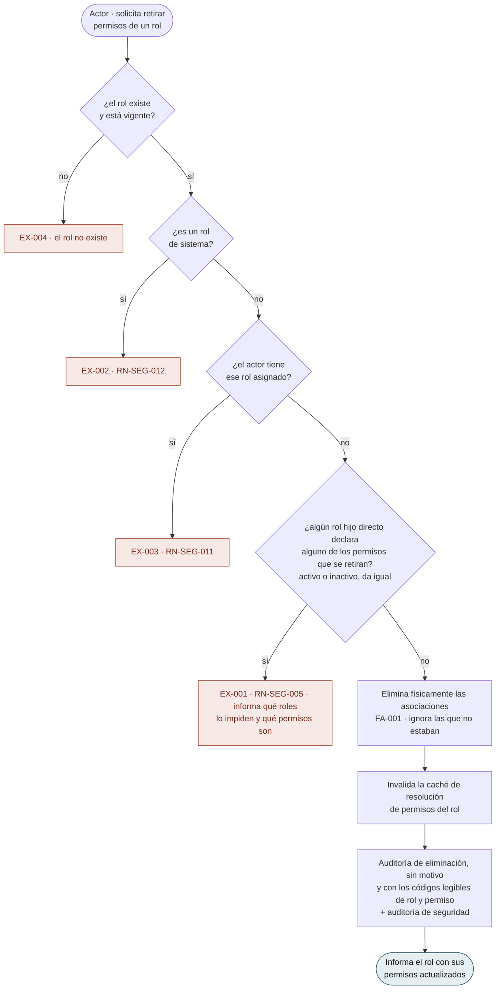
```mermaid
flowchart TD
    A(["Actor · solicita retirar<br/>permisos de un rol"])
    A --> V1{"¿el rol existe<br/>y está vigente?"}
    V1 -->|no| E4["EX-004 · el rol no existe"]
    V1 -->|sí| V2{"¿es un rol<br/>de sistema?"}
    V2 -->|sí| E2["EX-002 · RN-SEG-012"]
    V2 -->|no| V3{"¿el actor tiene<br/>ese rol asignado?"}
    V3 -->|sí| E3["EX-003 · RN-SEG-011"]
    V3 -->|no| V4{"¿algún rol hijo directo declara<br/>alguno de los permisos que se retiran?<br/>activo o inactivo, da igual"}
    V4 -->|sí| E1["EX-001 · RN-SEG-005 · informa qué roles<br/>lo impiden y qué permisos son"]
    V4 -->|no| P1["Elimina físicamente las asociaciones<br/>FA-001 · ignora las que no estaban"]
    P1 --> P2["Invalida la caché de resolución<br/>de permisos del rol"]
    P2 --> P3["Auditoría de eliminación, sin motivo<br/>y con los códigos legibles de rol y permiso<br/>+ auditoría de seguridad"]
    P3 --> FIN(["Informa el rol con sus<br/>permisos actualizados"])

    classDef ex fill:#F7E9E5,stroke:#A33B2A,color:#7A2B1E
    classDef ok fill:#E5EEF0,stroke:#2D5A6B,color:#141B1E
    class E1,E2,E3,E4 ex
    class FIN ok
```

---

### `RF-SP-007` · Cambiar estado del rol

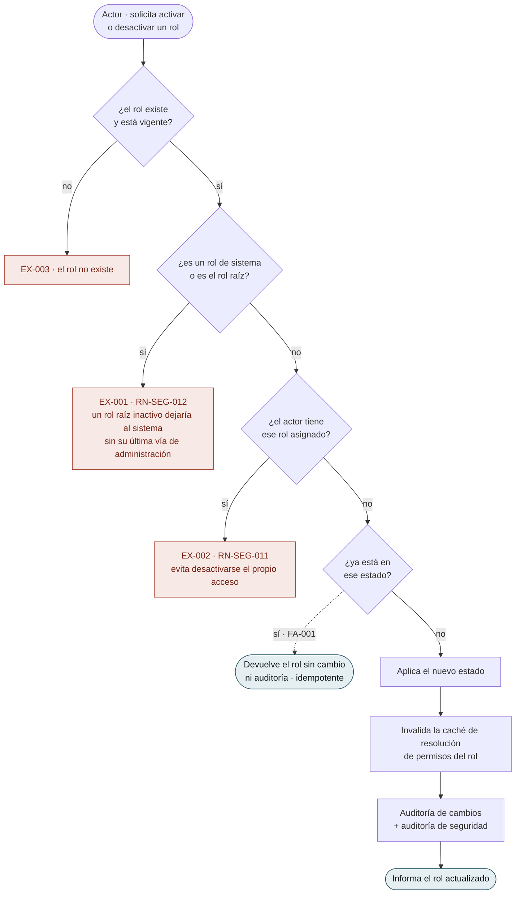
```mermaid
flowchart TD
    A(["Actor · solicita activar<br/>o desactivar un rol"])
    A --> V1{"¿el rol existe<br/>y está vigente?"}
    V1 -->|no| E3["EX-003 · el rol no existe"]
    V1 -->|sí| V2{"¿es un rol de sistema<br/>o es el rol raíz?"}
    V2 -->|sí| E1["EX-001 · RN-SEG-012<br/>un rol raíz inactivo dejaría al sistema<br/>sin su última vía de administración"]
    V2 -->|no| V3{"¿el actor tiene<br/>ese rol asignado?"}
    V3 -->|sí| E2["EX-002 · RN-SEG-011<br/>evita desactivarse el propio acceso"]
    V3 -->|no| D1{"¿ya está en<br/>ese estado?"}
    D1 -.->|"sí · FA-001"| F1(["Devuelve el rol sin cambio<br/>ni auditoría · idempotente"])
    D1 -->|no| P1["Aplica el nuevo estado"]
    P1 --> P2["Invalida la caché de resolución<br/>de permisos del rol"]
    P2 --> P3["Auditoría de cambios<br/>+ auditoría de seguridad"]
    P3 --> FIN(["Informa el rol actualizado"])

    classDef ex fill:#F7E9E5,stroke:#A33B2A,color:#7A2B1E
    classDef ok fill:#E5EEF0,stroke:#2D5A6B,color:#141B1E
    class E1,E2,E3 ex
    class FIN,F1 ok
```

Desactivar corta la concesión de permisos de inmediato para todos los portadores, pero **conserva intactas** sus asignaciones: reactivar lo restituye entero.

---

### `RF-SP-008` · Cambiar rol padre

La operación con más verificaciones del módulo: mueve un nodo de la jerarquía sin romper ni la aciclicidad ni la contención.

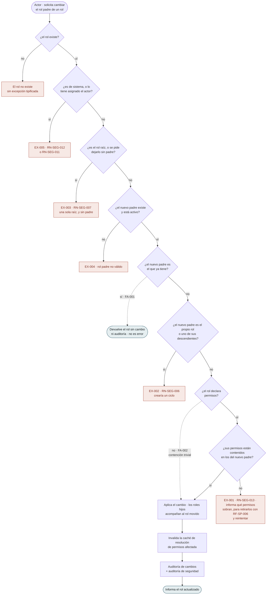
```mermaid
flowchart TD
    A(["Actor · solicita cambiar<br/>el rol padre de un rol"])
    A --> V1{"¿el rol existe?"}
    V1 -->|no| E0["El rol no existe<br/>sin excepción tipificada"]
    V1 -->|sí| V2{"¿es de sistema, o lo<br/>tiene asignado el actor?"}
    V2 -->|sí| E5["EX-005 · RN-SEG-012<br/>o RN-SEG-011"]
    V2 -->|no| V3{"¿es el rol raíz, o se pide<br/>dejarlo sin padre?"}
    V3 -->|sí| E3["EX-003 · RN-SEG-007<br/>una sola raíz, y sin padre"]
    V3 -->|no| V4{"¿el nuevo padre existe<br/>y está activo?"}
    V4 -->|no| E4["EX-004 · rol padre no válido"]
    V4 -->|sí| D1{"¿el nuevo padre es<br/>el que ya tiene?"}
    D1 -.->|"sí · FA-001"| F1(["Devuelve el rol sin cambio<br/>ni auditoría · no es error"])
    D1 -->|no| V5{"¿el nuevo padre es el propio rol<br/>o uno de sus descendientes?"}
    V5 -->|sí| E2["EX-002 · RN-SEG-006<br/>crearía un ciclo"]
    V5 -->|no| D2{"¿el rol declara<br/>permisos?"}
    D2 -.->|"no · FA-002<br/>contención trivial"| P1
    D2 -->|sí| V6{"¿sus permisos están contenidos<br/>en los del nuevo padre?"}
    V6 -->|no| E1["EX-001 · RN-SEG-013 · informa qué permisos<br/>sobran, para retirarlos con RF-SP-006<br/>y reintentar"]
    V6 -->|sí| P1["Aplica el cambio · los roles hijos<br/>acompañan al rol movido"]
    P1 --> P2["Invalida la caché de resolución<br/>de permisos afectada"]
    P2 --> P3["Auditoría de cambios<br/>+ auditoría de seguridad"]
    P3 --> FIN(["Informa el rol actualizado"])

    classDef ex fill:#F7E9E5,stroke:#A33B2A,color:#7A2B1E
    classDef ok fill:#E5EEF0,stroke:#2D5A6B,color:#141B1E
    class E0,E1,E2,E3,E4,E5 ex
    class FIN,F1 ok
```

---

### `RF-SP-009` · Eliminar rol

Sin flujos alternativos: o se cumplen todas las condiciones, o se rechaza.

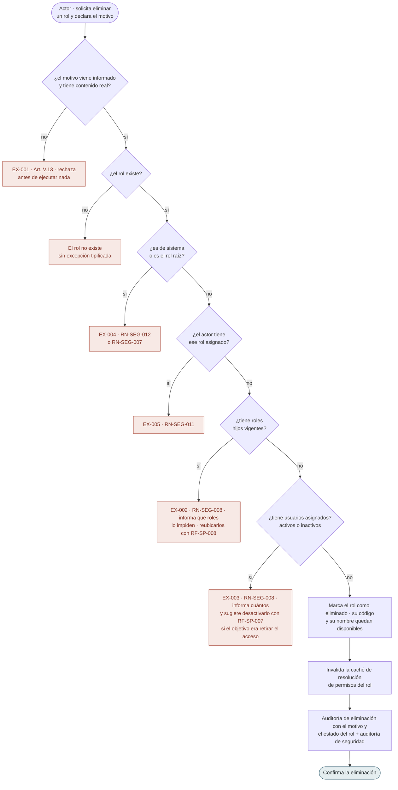
```mermaid
flowchart TD
    A(["Actor · solicita eliminar<br/>un rol y declara el motivo"])
    A --> V1{"¿el motivo viene informado<br/>y tiene contenido real?"}
    V1 -->|no| E1["EX-001 · Art. V.13 · rechaza<br/>antes de ejecutar nada"]
    V1 -->|sí| V2{"¿el rol existe?"}
    V2 -->|no| E0["El rol no existe<br/>sin excepción tipificada"]
    V2 -->|sí| V3{"¿es de sistema<br/>o es el rol raíz?"}
    V3 -->|sí| E4["EX-004 · RN-SEG-012<br/>o RN-SEG-007"]
    V3 -->|no| V4{"¿el actor tiene<br/>ese rol asignado?"}
    V4 -->|sí| E5["EX-005 · RN-SEG-011"]
    V4 -->|no| V5{"¿tiene roles<br/>hijos vigentes?"}
    V5 -->|sí| E2["EX-002 · RN-SEG-008 · informa qué roles<br/>lo impiden · reubicarlos con RF-SP-008"]
    V5 -->|no| V6{"¿tiene usuarios asignados?<br/>activos o inactivos"}
    V6 -->|sí| E3["EX-003 · RN-SEG-008 · informa cuántos<br/>y sugiere desactivarlo con RF-SP-007<br/>si el objetivo era retirar el acceso"]
    V6 -->|no| P1["Marca el rol como eliminado · su código<br/>y su nombre quedan disponibles"]
    P1 --> P2["Invalida la caché de resolución<br/>de permisos del rol"]
    P2 --> P3["Auditoría de eliminación con el motivo y<br/>el estado del rol + auditoría de seguridad"]
    P3 --> FIN(["Confirma la eliminación"])

    classDef ex fill:#F7E9E5,stroke:#A33B2A,color:#7A2B1E
    classDef ok fill:#E5EEF0,stroke:#2D5A6B,color:#141B1E
    class E0,E1,E2,E3,E4,E5 ex
    class FIN ok
```

---

## 2. Catálogo de permisos

### `RF-SP-010` · Consultar permisos

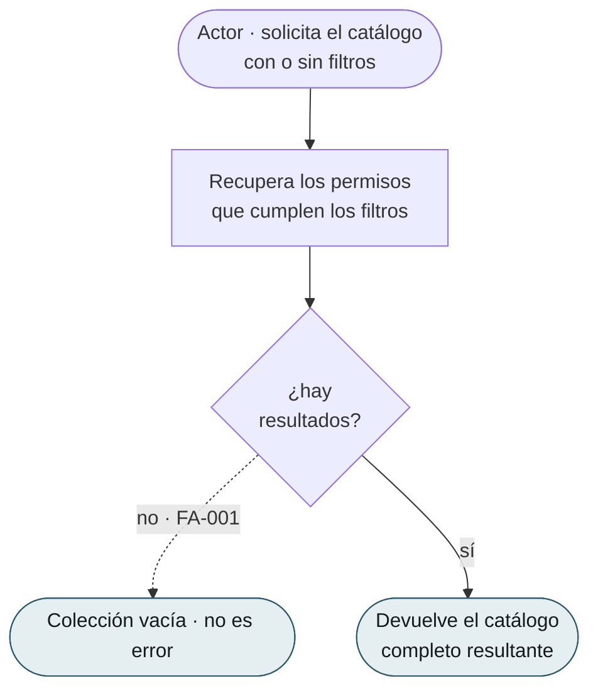
```mermaid
flowchart TD
    A(["Actor · solicita el catálogo<br/>con o sin filtros"])
    A --> P1["Recupera los permisos<br/>que cumplen los filtros"]
    P1 --> D1{"¿hay<br/>resultados?"}
    D1 -.->|"no · FA-001"| F1(["Colección vacía · no es error"])
    D1 -->|sí| FIN(["Devuelve el catálogo<br/>completo resultante"])

    classDef ok fill:#E5EEF0,stroke:#2D5A6B,color:#141B1E
    class FIN,F1 ok
```

Sin excepciones propias: autenticación y autorización se resuelven en el borde.

---

### `RF-SP-015` · Consultar detalle de permiso

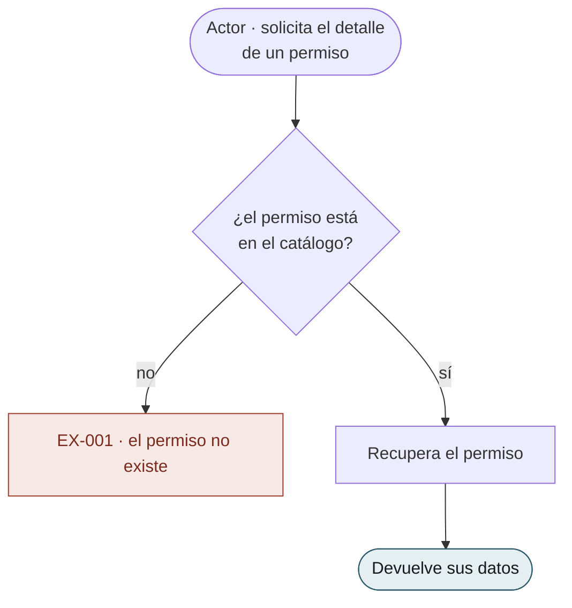
```mermaid
flowchart TD
    A(["Actor · solicita el detalle<br/>de un permiso"])
    A --> V1{"¿el permiso está<br/>en el catálogo?"}
    V1 -->|no| E1["EX-001 · el permiso no existe"]
    V1 -->|sí| P1["Recupera el permiso"]
    P1 --> FIN(["Devuelve sus datos"])

    classDef ex fill:#F7E9E5,stroke:#A33B2A,color:#7A2B1E
    classDef ok fill:#E5EEF0,stroke:#2D5A6B,color:#141B1E
    class E1 ex
    class FIN ok
```

---

## 3. Auditoría

Las cuatro consultas comparten esqueleto —validar, recuperar del más reciente al más antiguo, paginar—. Lo que las distingue es su flujo alternativo, y en un caso, un paso de más.

### `RF-SP-011` · Consultar auditoría de cambios

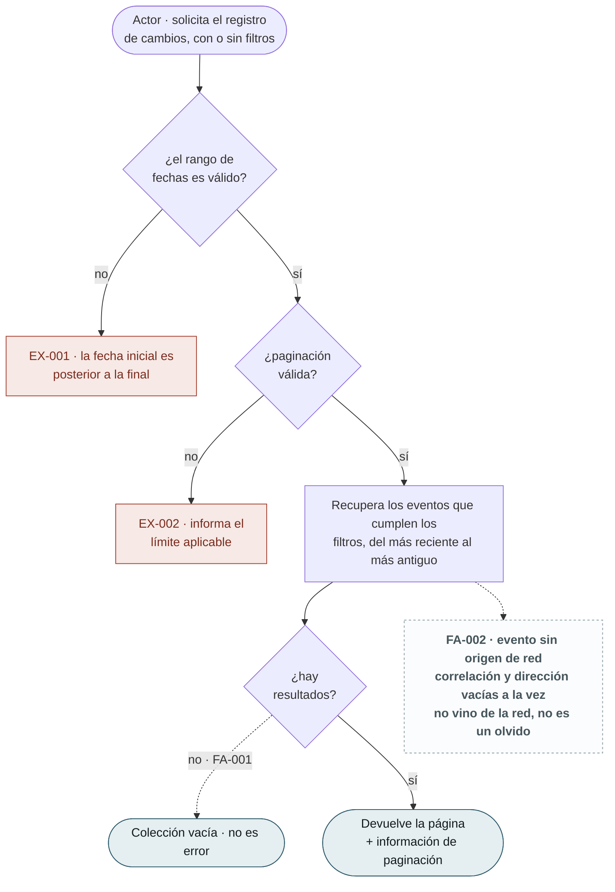
```mermaid
flowchart TD
    A(["Actor · solicita el registro<br/>de cambios, con o sin filtros"])
    A --> V1{"¿el rango de<br/>fechas es válido?"}
    V1 -->|no| E1["EX-001 · la fecha inicial es<br/>posterior a la final"]
    V1 -->|sí| V2{"¿paginación<br/>válida?"}
    V2 -->|no| E2["EX-002 · informa el<br/>límite aplicable"]
    V2 -->|sí| P1["Recupera los eventos que cumplen los<br/>filtros, del más reciente al más antiguo"]
    P1 --> D1{"¿hay<br/>resultados?"}
    D1 -.->|"no · FA-001"| F1(["Colección vacía · no es error"])
    D1 -->|sí| FIN(["Devuelve la página<br/>+ información de paginación"])
    P1 -.-> N1["FA-002 · evento sin origen de red<br/>correlación y dirección vacías <b>a la vez</b><br/>no vino de la red, no es un olvido"]

    classDef ex fill:#F7E9E5,stroke:#A33B2A,color:#7A2B1E
    classDef ok fill:#E5EEF0,stroke:#2D5A6B,color:#141B1E
    classDef fa fill:#FBFCFD,stroke:#8A9BA2,stroke-dasharray:3 3,color:#46565C
    class E1,E2 ex
    class FIN,F1 ok
    class N1 fa
```

---

### `RF-SP-012` · Consultar auditoría de eliminación

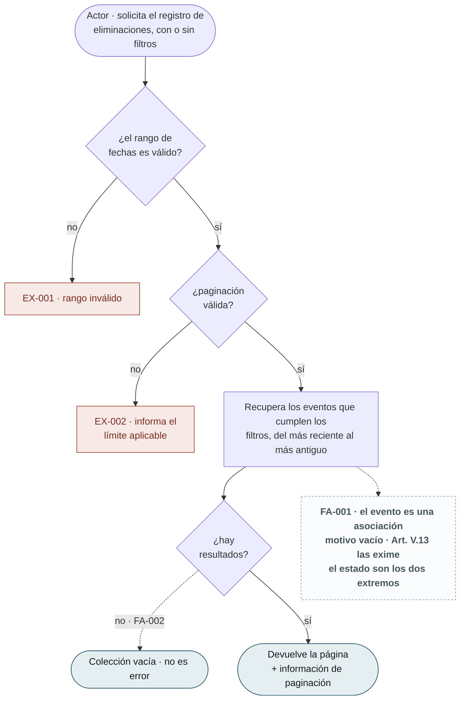
```mermaid
flowchart TD
    A(["Actor · solicita el registro de<br/>eliminaciones, con o sin filtros"])
    A --> V1{"¿el rango de<br/>fechas es válido?"}
    V1 -->|no| E1["EX-001 · rango inválido"]
    V1 -->|sí| V2{"¿paginación<br/>válida?"}
    V2 -->|no| E2["EX-002 · informa el<br/>límite aplicable"]
    V2 -->|sí| P1["Recupera los eventos que cumplen los<br/>filtros, del más reciente al más antiguo"]
    P1 --> D1{"¿hay<br/>resultados?"}
    D1 -.->|"no · FA-002"| F1(["Colección vacía · no es error"])
    D1 -->|sí| FIN(["Devuelve la página<br/>+ información de paginación"])
    P1 -.-> N1["FA-001 · el evento es una asociación<br/>motivo <b>vacío</b> · Art. V.13 las exime<br/>el estado son los dos extremos"]

    classDef ex fill:#F7E9E5,stroke:#A33B2A,color:#7A2B1E
    classDef ok fill:#E5EEF0,stroke:#2D5A6B,color:#141B1E
    classDef fa fill:#FBFCFD,stroke:#8A9BA2,stroke-dasharray:3 3,color:#46565C
    class E1,E2 ex
    class FIN,F1 ok
    class N1 fa
```

---

### `RF-SP-013` · Consultar auditoría de error

El diagnóstico por correlación no es un caso raro: es el flujo para el que existe esta consulta.

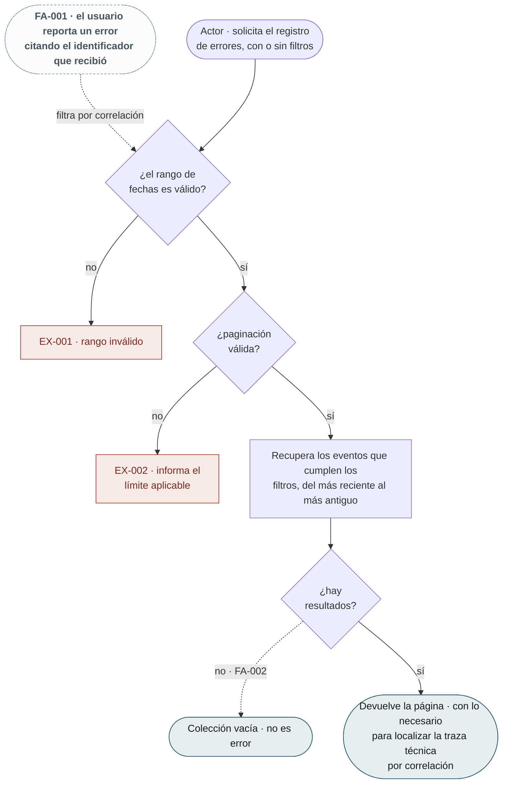
```mermaid
flowchart TD
    A(["Actor · solicita el registro<br/>de errores, con o sin filtros"])
    A2(["FA-001 · el usuario reporta un error<br/>citando el identificador que recibió"])
    A2 -.->|"filtra por correlación"| V1
    A --> V1{"¿el rango de<br/>fechas es válido?"}
    V1 -->|no| E1["EX-001 · rango inválido"]
    V1 -->|sí| V2{"¿paginación<br/>válida?"}
    V2 -->|no| E2["EX-002 · informa el<br/>límite aplicable"]
    V2 -->|sí| P1["Recupera los eventos que cumplen los<br/>filtros, del más reciente al más antiguo"]
    P1 --> D1{"¿hay<br/>resultados?"}
    D1 -.->|"no · FA-002"| F1(["Colección vacía · no es error"])
    D1 -->|sí| FIN(["Devuelve la página · con lo necesario<br/>para localizar la traza técnica<br/>por correlación"])

    classDef ex fill:#F7E9E5,stroke:#A33B2A,color:#7A2B1E
    classDef ok fill:#E5EEF0,stroke:#2D5A6B,color:#141B1E
    classDef fa fill:#FBFCFD,stroke:#8A9BA2,stroke-dasharray:3 3,color:#46565C
    class E1,E2 ex
    class FIN,F1 ok
    class A2 fa
```

---

### `RF-SP-014` · Consultar auditoría de seguridad

**La única consulta del módulo que escribe.** Mirar quién intentó qué contra el control de acceso es, en sí mismo, un evento de seguridad.

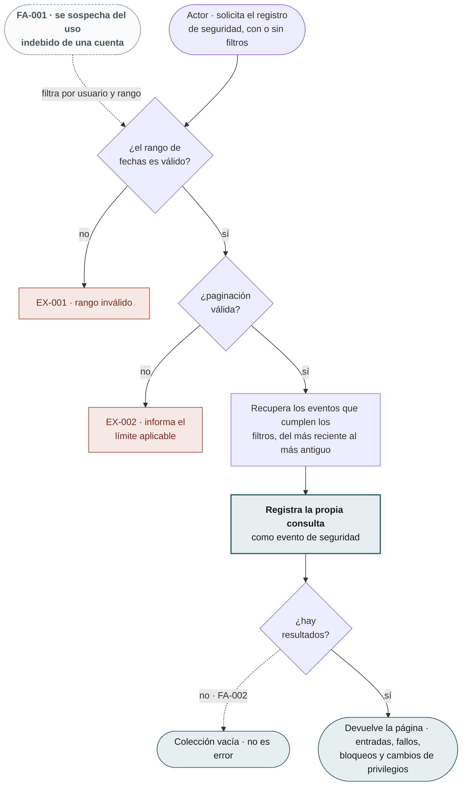
```mermaid
flowchart TD
    A(["Actor · solicita el registro<br/>de seguridad, con o sin filtros"])
    A2(["FA-001 · se sospecha del uso<br/>indebido de una cuenta"])
    A2 -.->|"filtra por usuario y rango"| V1
    A --> V1{"¿el rango de<br/>fechas es válido?"}
    V1 -->|no| E1["EX-001 · rango inválido"]
    V1 -->|sí| V2{"¿paginación<br/>válida?"}
    V2 -->|no| E2["EX-002 · informa el<br/>límite aplicable"]
    V2 -->|sí| P1["Recupera los eventos que cumplen los<br/>filtros, del más reciente al más antiguo"]
    P1 --> P2["<b>Registra la propia consulta</b><br/>como evento de seguridad"]
    P2 --> D1{"¿hay<br/>resultados?"}
    D1 -.->|"no · FA-002"| F1(["Colección vacía · no es error"])
    D1 -->|sí| FIN(["Devuelve la página · entradas, fallos,<br/>bloqueos y cambios de privilegios"])

    classDef ex fill:#F7E9E5,stroke:#A33B2A,color:#7A2B1E
    classDef ok fill:#E5EEF0,stroke:#2D5A6B,color:#141B1E
    classDef fa fill:#FBFCFD,stroke:#8A9BA2,stroke-dasharray:3 3,color:#46565C
    classDef esc fill:#E5EEF0,stroke:#2D5A6B,stroke-width:2px,color:#141B1E
    class E1,E2 ex
    class FIN,F1 ok
    class A2 fa
    class P2 esc
```

---

## 4. Membresías

### `RF-SP-016` · Registrar membresía

La cadena es lineal: cada membresía tiene como mucho una hija. Insertar en medio obliga a recolocar y a recalcular niveles.

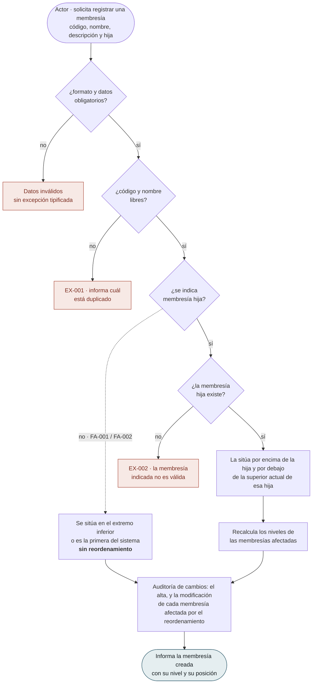
```mermaid
flowchart TD
    A(["Actor · solicita registrar una membresía<br/>código, nombre, descripción y hija"])
    A --> V1{"¿formato y datos<br/>obligatorios?"}
    V1 -->|no| E0["Datos inválidos<br/>sin excepción tipificada"]
    V1 -->|sí| V2{"¿código y nombre<br/>libres?"}
    V2 -->|no| E1["EX-001 · informa cuál<br/>está duplicado"]
    V2 -->|sí| D1{"¿se indica<br/>membresía hija?"}
    D1 -.->|"no · FA-001 / FA-002"| P0["Se sitúa en el extremo inferior<br/>o es la primera del sistema<br/><b>sin reordenamiento</b>"]
    D1 -->|sí| V3{"¿la membresía<br/>hija existe?"}
    V3 -->|no| E2["EX-002 · la membresía<br/>indicada no es válida"]
    V3 -->|sí| P1["La sitúa por encima de la hija y por debajo<br/>de la superior actual de esa hija"]
    P1 --> P2["Recalcula los niveles de<br/>las membresías afectadas"]
    P0 --> P3
    P2 --> P3["Auditoría de cambios: el alta, y la modificación<br/>de cada membresía afectada por el reordenamiento"]
    P3 --> FIN(["Informa la membresía creada<br/>con su nivel y su posición"])

    classDef ex fill:#F7E9E5,stroke:#A33B2A,color:#7A2B1E
    classDef ok fill:#E5EEF0,stroke:#2D5A6B,color:#141B1E
    class E0,E1,E2 ex
    class FIN ok
```

---

### `RF-SP-017` · Consultar membresías

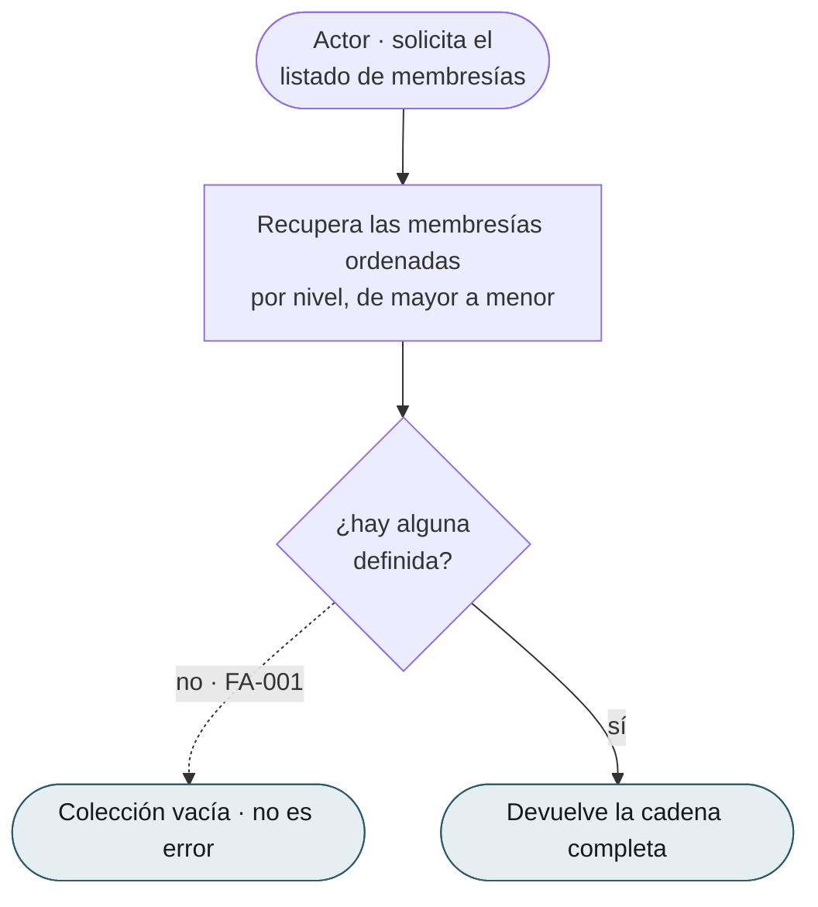
```mermaid
flowchart TD
    A(["Actor · solicita el<br/>listado de membresías"])
    A --> P1["Recupera las membresías ordenadas<br/>por nivel, de mayor a menor"]
    P1 --> D1{"¿hay alguna<br/>definida?"}
    D1 -.->|"no · FA-001"| F1(["Colección vacía · no es error"])
    D1 -->|sí| FIN(["Devuelve la cadena completa"])

    classDef ok fill:#E5EEF0,stroke:#2D5A6B,color:#141B1E
    class FIN,F1 ok
```

---

### `RF-SP-018` · Consultar detalle de membresía

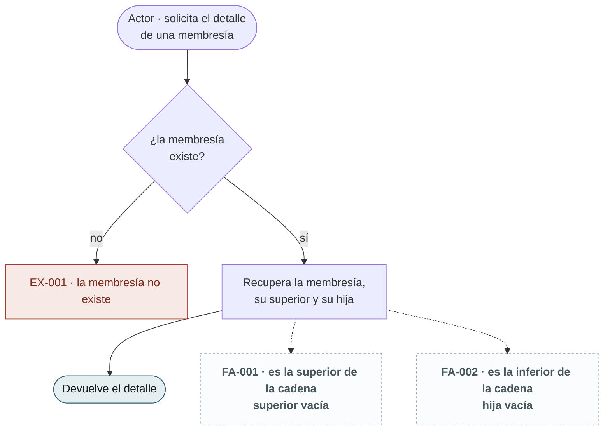
```mermaid
flowchart TD
    A(["Actor · solicita el detalle<br/>de una membresía"])
    A --> V1{"¿la membresía<br/>existe?"}
    V1 -->|no| E1["EX-001 · la membresía no existe"]
    V1 -->|sí| P1["Recupera la membresía,<br/>su superior y su hija"]
    P1 --> FIN(["Devuelve el detalle"])
    P1 -.-> N1["FA-001 · es la superior de la cadena<br/>superior vacía"]
    P1 -.-> N2["FA-002 · es la inferior de la cadena<br/>hija vacía"]

    classDef ex fill:#F7E9E5,stroke:#A33B2A,color:#7A2B1E
    classDef ok fill:#E5EEF0,stroke:#2D5A6B,color:#141B1E
    classDef fa fill:#FBFCFD,stroke:#8A9BA2,stroke-dasharray:3 3,color:#46565C
    class E1 ex
    class FIN ok
    class N1,N2 fa
```

---

## 5. Monedas y países

### `RF-SP-019` · Consultar monedas

Sin flujos alternativos y sin excepciones propias. Hoy devuelve un único elemento, y aun así existe: el catálogo está desde el principio para que sumar una moneda sea insertar una fila.

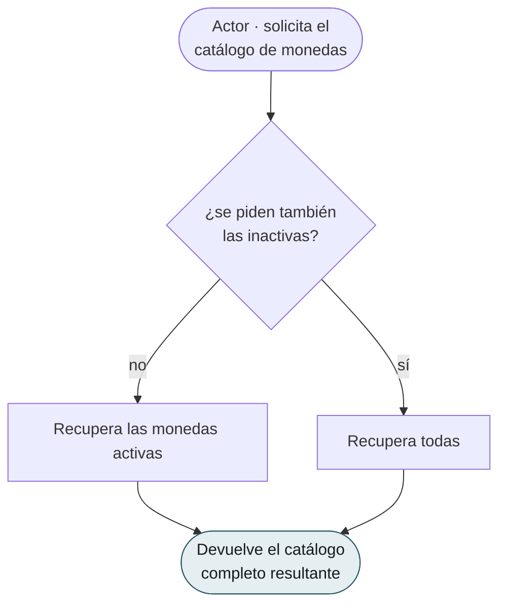
```mermaid
flowchart TD
    A(["Actor · solicita el<br/>catálogo de monedas"])
    A --> D1{"¿se piden también<br/>las inactivas?"}
    D1 -->|no| P1["Recupera las monedas activas"]
    D1 -->|sí| P2["Recupera todas"]
    P1 --> FIN(["Devuelve el catálogo<br/>completo resultante"])
    P2 --> FIN

    classDef ok fill:#E5EEF0,stroke:#2D5A6B,color:#141B1E
    class FIN ok
```

---

### `RF-SP-020` · Registrar país

Sin flujos alternativos. El código y el nombre son **definitivos**: no hay edición ni baja, y por eso un duplicado sería permanente. Lo único reversible es el estado, con `RF-SP-022` (`RN-SP-009`).

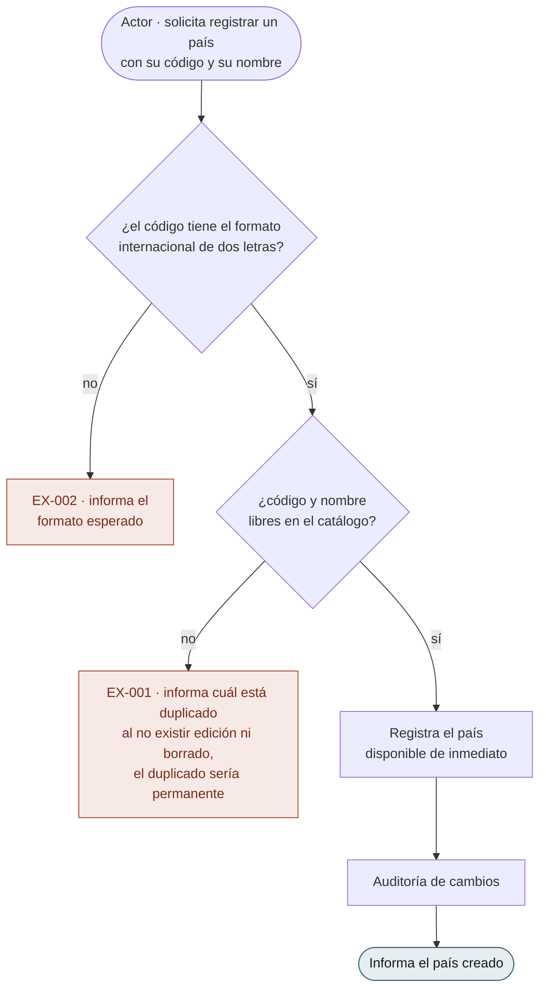
```mermaid
flowchart TD
    A(["Actor · solicita registrar un país<br/>con su código y su nombre"])
    A --> V1{"¿el código tiene el formato<br/>internacional de dos letras?"}
    V1 -->|no| E2["EX-002 · informa el<br/>formato esperado"]
    V1 -->|sí| V2{"¿código y nombre<br/>libres en el catálogo?"}
    V2 -->|no| E1["EX-001 · informa cuál está duplicado<br/>al no existir edición ni borrado,<br/>el duplicado sería permanente"]
    V2 -->|sí| P1["Registra el país<br/>disponible de inmediato"]
    P1 --> P2["Auditoría de cambios"]
    P2 --> FIN(["Informa el país creado"])

    classDef ex fill:#F7E9E5,stroke:#A33B2A,color:#7A2B1E
    classDef ok fill:#E5EEF0,stroke:#2D5A6B,color:#141B1E
    class E1,E2 ex
    class FIN ok
```

---

### `RF-SP-021` · Consultar países

```mermaid
flowchart TD
    A(["Actor · solicita el catálogo<br/>de países, con o sin búsqueda"])
    A --> D1{"¿se piden también<br/>los inactivos?"}
    D1 -->|no| P1["Recupera los países activos que<br/>cumplen la búsqueda, por nombre"]
    D1 -->|sí| P2["Recupera todos, por nombre"]
    P1 --> D2{"¿hay<br/>resultados?"}
    P2 --> D2
    D2 -.->|"no · FA-001"| F1(["Colección vacía · no es error"])
    D2 -->|sí| FIN(["Devuelve el catálogo<br/>completo resultante"])

    classDef ok fill:#E5EEF0,stroke:#2D5A6B,color:#141B1E
    class FIN,F1 ok
```

---

## 6. Lo que el dibujo dejó a la vista

Cinco asimetrías entre specs que solo se ven al poner los 21 flujos en la misma notación. Ninguna contradice lo aprobado; son inconsistencias de tipificación.

| # | Observación | Dónde se resuelve |
|---|---|---|
| 1 | **«Rol inexistente» está tipificada en `RF-SP-003`, `004`, `006` y `007`, pero no en `005`, `008` ni `009`** — aunque las tres verifican la existencia en su flujo principal. Tres altas de excepción, o una regla común en el borde. | `RF-SP-005` §10, `RF-SP-008` §10, `RF-SP-009` §10 |
| 2 | `RF-SP-001` y `RF-SP-016` validan formato y obligatoriedad en el paso 2 pero **no tipifican la excepción**; `RF-SP-020` sí lo hace (`EX-002`). | `RF-SP-001` §10, `RF-SP-016` §10 |
| 3 | `RF-SP-014` es la **única consulta que escribe**: registra la propia consulta como evento de seguridad. `RF-SP-011` solo dice que «puede quedar registrada en el registro de peticiones». Si mirar la auditoría de seguridad se audita, conviene decidir si mirar las otras tres también. | `security.md` §8 |
| 4 | La invalidación de caché de permisos aparece en `RF-SP-005` a `RF-SP-009`, pero no en `001` ni `004`. Es correcto —ni el alta ni la edición de metadatos alteran una resolución previa— pero no está dicho en ningún sitio. | `architecture.md`, decisión de caché |
| 5 | `RF-SP-006` y `RF-SP-009` escriben en el mismo registro de eliminación con obligaciones distintas de motivo. El consumidor lo descubre en `RF-SP-012` `FA-001`, no en la regla general. | `architecture.md` §6.6.3 |

---

## 7. Control de cambios

| Versión | Fecha | Cambio | Responsable |
|---|---|---|---|
| 0.1.0 | 21-08-2026 | Creación inicial. Un diagrama por cada uno de los 21 casos de uso, transcritos de las §8, §9 y §10 de sus specs, y cinco inconsistencias de tipificación detectadas al normalizar la notación. | Responsable técnico |
